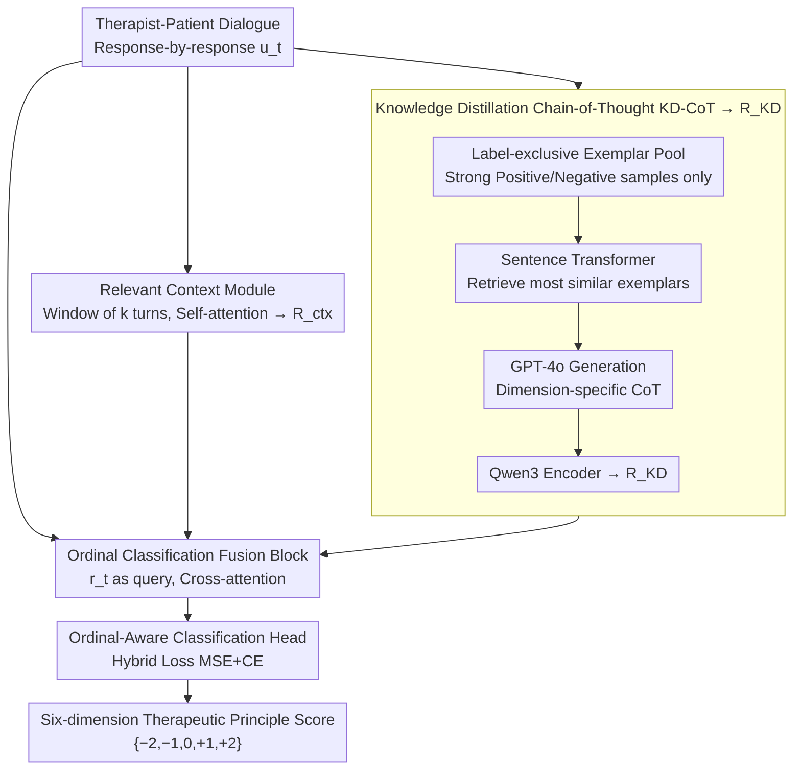

# Measuring What Matters!! Assessing Therapeutic Principles in Mental-Health Conversation

**Conference**: ACL 2026  
**arXiv**: [2604.05795](https://arxiv.org/abs/2604.05795)  
**Code**: [https://github.com/](https://github.com/)  
**Area**: Medical NLP  
**Keywords**: Mental-health conversation assessment, therapeutic principle alignment, ordinal classification, knowledge distillation, Chain-of-Thought

## TL;DR
Ours proposes the CARE framework and the FAITH-M benchmark dataset. Through dialogue context encoding combined with contrastive exemplar retrieval and Knowledge Distillation Chain-of-Thought (KD-CoT), it performs fine-grained ordinal assessment of AI-generated psychotherapy dialogues across six therapeutic principle dimensions. It achieves a weighted F1 of 63.34, a 64.26% improvement over the strongest baseline, Qwen3.

## Background & Motivation

**Background**: The application of Large Language Models (LLMs) in mental health support is increasing. From rule-based chatbots to advanced LLMs like ChatGPT, over 80% of mental health seekers use LLMs rather than clinically validated tools. Prior research indicates that laypeople rate ChatGPT-generated therapeutic responses comparably even to those from trained clinicians.

**Limitations of Prior Work**: Existing assessment methods primarily rely on surface indicators like fluency and empathy, lacking structured evaluation of core therapeutic principles (e.g., non-judgmental acceptance, respect for autonomy, situational appropriateness). Most methods use general metrics or subjective judgment rather than clinically grounded assessment frameworks.

**Key Challenge**: The linguistic fluency of LLMs masks deficiencies in clinical alignment—responses that appear "empathetic" on the surface may violate therapeutic principles (e.g., over-instructing, ignoring patient autonomy), and existing evaluation systems cannot distinguish these differences.

**Goal**: (1) Define fine-grained ordinal assessment tasks for six major therapeutic principles; (2) Construct an expert-annotated benchmark dataset; (3) Propose a structured assessment framework that surpasses prompt engineering.

**Key Insight**: Grounded in psychotherapy theory, the assessment of therapist responses is modeled as a multi-label ordinal classification problem. Each response is independently scored on six therapeutic dimensions ($-2$ to $+2$), utilizing dialogue context and exemplar-driven reasoning to simulate the expert judgment process.

**Core Idea**: Integrate local dialogue context encoding, contrastive exemplar retrieval, and Knowledge Distillation Chain-of-Thought (KD-CoT) to enable models to perform clinical-level ordinal therapeutic assessment.

## Method

### Overall Architecture
The problem CARE addresses is: given a therapist-patient dialogue, evaluate each therapist response $u_t$ across six therapeutic principle dimensions, outputting ordinal labels in $\{-2, -1, 0, +1, +2\}$. Instead of feeding isolated sentences to a classifier, it merges three signals: local dialogue history encoding, distilled expert reasoning logic, and a cross-attention mechanism that integrates these with the response itself for an ordinal-aware classification head. Intuitively, these three components answer: "What is the context?", "How would an experienced therapist reason?", and "What is the final score?"

### Key Designs

**1. Relevant Context Module: Contextualizing responses to distinguish between valid intervention and overstepping**

Therapeutic evaluation inherently depends on context. A statement like "You should go out more" is an appropriate guide when following a disclosure of loneliness, but might be over-instructive if it dismisses a patient's expression of autonomy. This module extracts a window of the preceding $k$ turns $\{p_{t-k}, u_{t-k}, ..., p_t, u_t\}$ for each response $u_t$. Self-attention captures the dependency chain of "patient state evolution and therapist intervention response," outputting the context representation $\mathbf{R}_{\text{ctx}}$. Context size is critical: experiments show $k=2\sim3$ is optimal; $k \geq 4$ introduces noise from irrelevant early dialogue, reducing precision.

**2. Knowledge Distillation Chain-of-Thought (KD-CoT): Distilling expert reasoning to solve neutral label collapse**

Pure prompting with GPT-4o often fails to distinguish fine ordinal differences, tending to collapse negative and neutral samples into the neutral class. KD-CoT sidesteps this via "teacher-generated reasoning, student-encoded distillation." First, label-exclusive exemplar pools are built for each dimension, retaining only strong positive and strong negative samples to avoid contamination from intermediate classes. Second, testing samples are embedded via Sentence Transformer to retrieve the most similar exemplar pairs. GPT-4o generates dimension-specific Chain-of-Thought explanations for these exemplars. Finally, Qwen3 encodes these explanations into knowledge representations $\mathbf{R}_{\text{KD}}$. This allows the smaller model to learn the reasoning trajectory of "why this score is given" rather than just the tag itself.

**3. Ordinal Classification Fusion Block: Distance-aware loss to penalize radical mispredictions**

During fusion, the response embedding $r_t$ acts as the query, while $\mathbf{R}_{\text{ctx}}$ and $\mathbf{R}_{\text{KD}}$ serve as key-values. These signals are integrated via cross-attention before entering the classification head. The loss function is key: pure Cross-Entropy treats labels as unordered categories, penalizing a "$-2$ vs $+2$" error the same as a "$-2$ vs $-1$" error. CARE employs a hybrid loss:

$$\mathcal{L} = \alpha \cdot \text{MSE}(\hat{y}, y) + \beta \cdot \text{CE}(\hat{y}, y)$$

The MSE term penalizes the numerical distance between the prediction and the ground truth (larger errors receive higher penalties), while the CE term ensures classification accuracy. On the validation set, $\alpha = \beta = 0.5$ is optimal.

### Loss & Training
The aforementioned hybrid ordinal loss is used with $\alpha = \beta = 0.5$. To ensure fair comparison, all baselines use the same context window ($k=2$) and loss function.

## Key Experimental Results

### Main Results

| Model Category | Model | Accuracy | Precision | Recall | F1w |
|---------|------|----------|-----------|--------|-----|
| Zero-shot | GPT-4o | 31.09 | 36.19 | 31.09 | 30.49 |
| Encoder | DeBERTa | 33.79 | 35.32 | 33.79 | 34.52 |
| Decoder | Qwen3 | 45.47 | 45.10 | 45.38 | 38.56 |
| Decoder | LLaMA 3.2 | 44.91 | 44.78 | 44.91 | 37.90 |
| **Ours** | **CARE-Qwen3** | **63.30** | **64.05** | **62.65** | **63.34** |
| **Ours** | **CARE-LLaMA 3.2** | **62.07** | **64.11** | **62.07** | **63.07** |
| Gain | ΔBaseline(%) | ↑39.21% | ↑42.03% | ↑38.05% | **↑64.26%** |

### Ablation Study

| Configuration | Acc | F1w | Description |
|------|-----|-----|------|
| CARE-Qwen3 Full | 63.30 | 63.34 | Full model |
| w/o KD-CoT (w/o label-context) | 57.08 | 57.20 | F1 drops 6.14 |
| w/o Exemplar Retrieval (w/o label-exclusive) | 53.81 | 53.08 | F1 drops 10.26 |
| Expert Consistency (NJL) | - | 81.60% | Highest dimension |
| Expert Consistency (RF) | - | 66.70% | Lowest dimension |

### Key Findings
- The KD-CoT module provides the largest contribution; removing it drops F1 by over 10 percentage points, indicating that structured reasoning, rather than backbone model capacity, is the key to performance gains.
- A context window of $k=2\sim3$ is optimal; performance declines at $k \geq 4$, likely due to irrelevant dialogue noise.
- CARE significantly outperforms baselines in cross-dataset generalization tests (PTSD, CheeseBurger), with F1 improvements of 20+ points.
- Errors are primarily concentrated between adjacent ordinal categories (e.g., Mild Positive vs Strong Positive), which is expected in difficult ordinal classification tasks.

## Highlights & Insights
- The **Contrastive Exemplar + Knowledge Distillation** paradigm is highly effective: using a large model (GPT-4o) as a "teacher" to generate reasoning trajectories and a smaller model to encode and distil that knowledge enables the transfer of reasoning capabilities rather than simple label imitation.
- Expanding therapeutic assessment from coarse metrics like "fluency/empathy" to six independent clinical dimensions provides a roadmap for fine-grained quality assessment in other domains (e.g., educational dialogue, customer service).
- The hybrid ordinal loss (MSE+CE) is a versatile technique applicable to any ordinal classification task.

## Limitations & Future Work
- Covers only six therapeutic principles, excluding critical clinical dimensions like cultural adaptation, trauma-informed care, and crisis intervention.
- Assessment is conducted at the single-response level, failing to model long-term therapeutic alliance building across sessions.
- KD-CoT relies on GPT-4o for reasoning trajectories, which entails high deployment costs.
- Subjectivity exists in the annotation of intermediate ordinal labels (Mild Positive/Negative), making misclassification in these intervals difficult to eliminate entirely.

## Related Work & Insights
- **vs General Empathy Detection (Sharma et al. 2021)**: Localized on empathetic expression, whereas ours focuses on comprehensive therapeutic principle alignment, of which empathy is only one dimension.
- **vs ChatGPT Therapeutic Assessment (Hatch et al. 2025)**: They used humans to evaluate ChatGPT responses and found ratings were driven by surface quality; ours replaces subjective judgment with a structured framework.

## Rating
- Novelty: ⭐⭐⭐⭐ Innovative task definition and clever KD-CoT framework design.
- Experimental Thoroughness: ⭐⭐⭐⭐⭐ Comprehensive evaluation involving 15 baselines, cross-dataset generalization, expert assessment, and ablation studies.
- Writing Quality: ⭐⭐⭐⭐ Clear structure, though some experimental details require consulting the appendix.

<!-- RELATED:START -->

## Related Papers

- [\[ACL 2026\] Responsible Evaluation of AI for Mental Health](responsible_evaluation_of_ai_for_mental_health.md)
- [\[ACL 2026\] MHGraphBench: Knowledge Graph-Grounded Benchmarking of Mental Health Knowledge in Large Language Models](mhgraphbench_knowledge_graph-grounded_benchmarking_of_mental_health_knowledge_in.md)
- [\[ACL 2026\] MHSafeEval: Role-Aware Interaction-Level Evaluation of Mental Health Safety in Large Language Models](mhsafeeval_role-aware_interaction-level_evaluation_of_mental_health_safety_in_la.md)
- [\[AAAI 2026\] Voices, Faces, and Feelings: Multi-modal Emotion-Cognition Captioning for Mental Health Understanding](../../AAAI2026/medical_nlp/voices_faces_and_feelings_multi-modal_emotion-cognition_captioning_for_mental_he.md)
- [\[ICLR 2026\] CounselBench: A Large-Scale Expert Evaluation and Adversarial Benchmarking of LLMs in Mental Health QA](../../ICLR2026/medical_nlp/counselbench_llm_mental_health_qa.md)

<!-- RELATED:END -->
