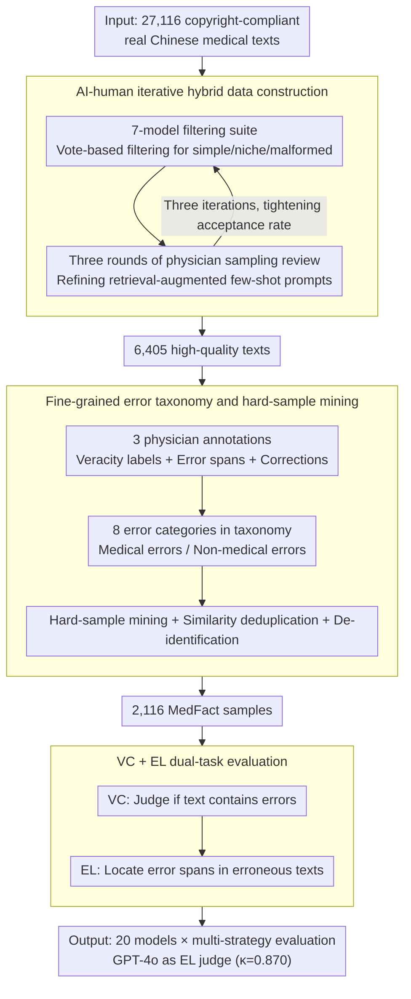

# MedFact: Benchmarking the Fact-Checking Capabilities of Large Language Models on Chinese Medical Texts

**Conference**: ACL2026  
**arXiv**: [2509.12440](https://arxiv.org/abs/2509.12440)  
**Code**: Project Page https://iflytek-medical-southchina.github.io/MedFact/  
**Area**: Medical NLP  
**Keywords**: Chinese medical text, fact-checking, error localization, medical LLM evaluation, over-criticism

## TL;DR
MedFact constructs an expert-annotated fact-checking benchmark covering real-world Chinese medical texts and demonstrates through 20 LLMs that current models can relatively easily judge whether a text "contains errors" but still struggle with precise error localization. RAG is helpful, whereas multi-agent strategies and reasoning-time scaling tend to amplify "over-criticism."

## Background & Motivation
**Background**: Medical large language models have entered application scenarios such as clinical QA, diagnostic assistance, patient assessment, medical text classification, and medical RAG. Real-world systems often integrate internet or internal medical texts into Retrieval-Augmented Generation workflows; therefore, models must not only answer medical exam questions but also judge the reliability of medical content itself.

**Limitations of Prior Work**: Most existing medical evaluations focus on QA, relation extraction, or clinical note error correction. VeriFact uses synthetic clinical texts, and MEDEC is primarily oriented toward clinical note error detection. These settings struggle to cover the diverse text forms encountered in real-world deployments, such as medical encyclopedias, popular science articles, QA communities, and fabricated medical rumors.

**Key Challenge**: Medical fact-checking requires both broad medical knowledge and the ability to locate errors in specific segments. A model might judge "this section has an issue" based on overall tone but misidentify correct sentences as the source of error; in medical scenarios, such "correct conclusion, wrong reason" behavior remains unsafe.

**Goal**: The authors aim to build an uncontaminated, real, diverse, and difficulty-stratified Chinese medical fact-checking dataset to systematically evaluate LLM veracity classification, error localization, RAG benefits, side effects of reasoning strategies, and cross-lingual performance.

**Key Insight**: Instead of scraping data directly from the open web, the paper utilizes non-public medical encyclopedias, medical consultation platforms, QA pages, and forum content from commercial partners to reduce the risk of pre-training contamination. AI filtering, physician annotation, and hard-sample mining are then applied to transform the benchmark into a test set that truly distinguishes model capabilities.

**Core Idea**: Replace synthetic medical error correction tasks with "real medical text + physician-annotated error spans + hard-sample filtering," thereby advancing medical fact-checking evaluation from coarse veracity judgment to fine-grained error localization.

## Method
MedFact is essentially a benchmark construction and evaluation pipeline. It first filters candidate samples suitable for fact-checking from large-scale real Chinese medical texts, then has physicians determine whether the text is correct, identify where errors are, and suggest corrections. Finally, through model evaluation and hard-sample mining, the final test set is obtained. Unlike ordinary QA benchmarks, the key to MedFact is not asking the model a medical question but providing a potentially erroneous medical text to concurrently complete "presence of error" and "location of error" tasks.

### Overall Architecture
The input consists of 27,116 copyright-compliant real Chinese medical texts from sources including internal medical encyclopedias, medical consultation platforms, QA pages, and user forums. The system first uses a filtering suite composed of 7 strong models to filter texts based on dimensions such as "too simple, too niche, or malformed." Subsequently, three rounds of physician feedback continuously improve retrieval-augmented few-shot filtering prompts to compress the candidate pool to 6,405 high-quality texts.

During the annotation phase, 3 licensed medical professionals provide binary veracity labels for each text; if the text is erroneous, they also annotate precise error spans and suggested corrections. The authors then perform hard-sample mining, similarity-based deduplication, and de-identification rewriting, followed by physician review to obtain 2,116 MedFact samples.

The evaluation phase includes two tasks: Veracity Classification (VC) to judge whether text contains factual errors; and Error Localization (EL) to locate error spans within erroneous texts. The authors evaluate 20 models under strategies such as zero-shot, CoT, MedPrompt, RAG, MAD, MDAgents, and budget forcing, using GPT-4o as an automated EL judge; the Cohen's $\kappa$ between GPT-4o and physicians on a random 10% sample is 0.870.

### Key Designs

**1. AI-human iterative hybrid data construction: Filtering samples from 27,116 real texts that are both medically substantive and suitable for fact-checking evaluation at a controlled cost.**

Relying entirely on physicians to filter 27,116 texts is cost-prohibitive, while relying entirely on models risks retaining many low-quality or biased samples. This paper utilizes 7 strong models as a filtering suite to vote on dimensions such as "too simple, too niche, or malformed," and then uses three rounds of physician sampling reviews to feed misclassified samples back into "standard-specific retrieval-augmented few-shot prompts"—i.e., adding retrieved counterexamples for each filtering criterion to make the next round more accurate.

The effect of this iterative feedback is quantifiable: the filtering acceptance rate tightened from 67.69% in the first round to 37.00% and then to 23.62%, while the agreement rate between models and physicians increased to 96.40%, compressing the pool to 6,405 high-quality texts. The benefit is maintaining model scalability while using physician judgment to calibrate direction.

**2. Fine-grained error taxonomy and hard-sample mining: Ensuring the benchmark measures more than just "coarse medical common sense" by covering different error mechanisms and difficulty levels.**

Errors in medical texts are often subtle. Without controlling error types and difficulty, the evaluation could be dominated by exaggerated rumors or simple common sense, failing to measure real deployment risks. The paper categorizes errors into medical and non-medical groups, further subdivided into 8 classes including concepts, terminology, chronology, sources, bias, and general facts to ensure diverse mechanisms.

Crucially, hard-sample mining is applied: the authors remove samples that all models can easily classify correctly and deduplicate using similarity filtering, ultimately converging from 6,405 annotated texts to 2,116 instances that better differentiate model capabilities. This step concentrates the benchmark's discriminative power on samples where models are prone to confident mistakes.

**3. VC + EL dual-task evaluation: Checking whether the model "knows the text is wrong" and "knows where the error is" simultaneously.**

In medical fact-checking, simply flagging a whole paragraph as red is insufficient. If a model judges "this section has an issue" based on tone but misidentifies a correct sentence as the error source, subsequent human review or automated correction will be misled. This "correct conclusion, wrong reason" is still unsafe in clinical practice. Thus, the evaluation is split into two layers: Veracity Classification (VC) treats erroneous texts as the positive class, calculating Precision, Recall, and F1; Error Localization (EL) activates only when text is flagged as erroneous, requiring the model's error span to match the gold error source.

Both tasks use GPT-4o as an automated EL judge, achieving a Cohen’s $\kappa$ of 0.870 with physicians on 10% of samples, proving the evaluation is trustworthy. This hierarchical design allows for the clear identification of key findings like EL being generally weaker than VC and multi-agent strategies amplifying "over-criticism."

### Loss & Training
The paper does not train new models; the core contribution is the benchmark construction and evaluation protocol. Inference settings include zero-shot and CoT prompting, with additional tests for MedPrompt, RAG, MAD, MDAgents, and budget forcing. The RAG knowledge base is derived from the 6,405 expert-annotated source texts; primary metrics are Precision, Recall, and F1 for VC and EL.

## Key Experimental Results

### Main Results
| Model / Setting | VC F1 | EL F1 | Key Information |
|--------|------|------|------|
| Human | 0.7521 | 0.7012 | Average performance of 3 medical professionals |
| XiaoYi zero-shot | 0.7126 | 0.6758 | One of the strongest among medical-specific models |
| XiaoYi CoT | 0.7061 | 0.6858 | Highest EL F1 reported in the paper |
| Doubao-Seed-1.6-thinking zero-shot | 0.7139 | 0.6712 | Strong performance among general models |
| Doubao-Seed-1.6-thinking CoT | 0.7050 | 0.6786 | CoT improves EL but slightly decreases VC |
| DeepSeek-R1 zero-shot | 0.6847 | 0.6051 | High Recall, but localization remains weak |

### Strategy Comparison
| Model / Strategy | VC F1 | EL F1 | Phenomenon |
|------|------|------|------|
| DeepSeek-R1 | 0.6847 | 0.6051 | zero-shot baseline |
| DeepSeek-R1 + RAG top-3 | 0.7369 | 0.6820 | Task-relevant knowledge significantly improves results |
| DeepSeek-R1 + MAD | 0.6829 | 0.6017 | Recall increases but Precision decreases |
| DeepSeek-R1 + MDAgents | 0.6965 | 0.6233 | Slight improvement, but over-criticism remains evident |
| XiaoYi | 0.7126 | 0.6758 | zero-shot baseline |
| XiaoYi + RAG top-3 | 0.7484 | 0.7051 | Individual score exceeds human EL F1, but depends on homologous RAG |
| XiaoYi + MAD | 0.6996 | 0.6831 | Multi-agent setups degrade Precision |
| XiaoYi + MDAgents | 0.7059 | 0.6284 | EL F1 significantly lower than RAG top-3 |

### Key Findings
- The dataset scale is 2,116 entries, with 1,058 correct texts and 1,058 containing a single factual error; among erroneous samples, medical errors account for 89.41%, with conceptual errors being most frequent at 52.65%.
- Model EL scores are consistently weaker than VC, indicating that "judging an error exists" is much easier than "locating the error"; the highest EL F1 of 0.6858 still falls short of the human score of 0.7012.
- RAG benefits are highly dependent on retrieval source relevance. Homologous top-3 RAG can raise XiaoYi's EL F1 to 0.7051, but if authoritative medical data does not closely fit the task, it may actually reduce Recall.
- Multi-agent and reasoning-time scaling produce "over-criticism": DeepSeek-R1 + MAD saw VC Precision drop from 0.5488 to 0.5310 while Recall rose from 0.9101 to 0.9565, indicating it is more inclined to misjudge correct text as erroneous.
- Cross-lingual experiments show that F1 can improve on English-translated versions (e.g., Gemini 2.5 Pro from 0.6223 to 0.6745), but the over-criticism trend of high Recall / low Precision persists.

## Highlights & Insights
- The value of MedFact lies in splitting medical fact-checking into two layers: veracity classification and error localization. While many models appear nearly ready for use on VC, EL results reveal they still lack fine-grained medical knowledge.
- "Over-criticism" is one of the most insightful findings of this paper. Longer reasoning and more agents do not necessarily mean safer results; in fact-checking, extra deliberation may continuously generate far-fetched erroneous hypotheses, ultimately sacrificing Precision.
- The comparison between homologous RAG and authoritative RAG is practical. Medical systems cannot just stuff "authoritative data" into retrieval libraries; they must ensure retrieved content is highly relevant to the claim being checked, otherwise, the model may be misled by mismatched evidence.
- The hard-sample mining in data construction is worth migrating to other high-risk fields. Tasks in law, finance, and drug safety similarly need to pivot from "questions models can all solve" to "questions where models confidently fail."

## Limitations & Future Work
- MedFact focuses on the Chinese language and the medical context of China; conclusions may not translate directly to other languages, medical systems, or clinical norms.
- EL uses GPT-4o as an automated judge, which, despite high consistency with physicians, may still harbor biases or instability; high-risk samples should involve expert review in the future.
- The benchmark reflects medical knowledge at the time of construction; as guidelines and drug evidence update, some factual labels may become obsolete, requiring a dynamic update mechanism.
- Although the dataset is de-identified and restricted for research use, erroneous medical texts still carry a risk of misuse; future releases should continue to be accompanied by license constraints and safety instructions.

## Related Work & Insights
- **vs VeriFact**: VeriFact mainly verifies the factuality of synthetic clinical text relative to structured EHRs, whereas MedFact uses real Chinese medical text, covering more writing styles and scenarios.
- **vs MEDEC**: MEDEC is oriented toward error detection and correction within clinical notes; MedFact emphasizes internet and encyclopedia-style medical content, suitable for evaluating medical RAG and content auditing systems.
- **vs SimpleQA / OpenFactCheck**: General factual benchmarks can measure open-domain factuality but lack medical terminology, treatment boundaries, and error span annotations; MedFact tightens evaluation to medical knowledge-intensive tasks.
- **Insights**: For high-risk RAG systems, evaluation should not only look at final answer accuracy but also incorporate diagnostic metrics such as "evidence relevance," "over-questioning of correct content," and "precision of error localization."

## Rating
- Novelty: ⭐⭐⭐⭐☆ The combination of real Chinese medical fact-checking and error localization is solid, and the core problem is important, though it remains within the realm of benchmark construction and system evaluation.
- Experimental Thoroughness: ⭐⭐⭐⭐⭐ Covers 20 models, multiple prompting/RAG/multi-agent strategies, as well as cross-lingual and contamination analyses.
- Writing Quality: ⭐⭐⭐⭐☆ Data pipelines and error analyses are clear, though some large tables are information-dense and require careful reference.
- Value: ⭐⭐⭐⭐⭐ Directly valuable for medical LLMs, medical RAG, and fact-checking systems, particularly in warning that "better reasoning" does not simply equate to "more reliable."

<!-- RELATED:START -->

## Related Papers

- [\[ACL 2026\] MHGraphBench: Knowledge Graph-Grounded Benchmarking of Mental Health Knowledge in Large Language Models](mhgraphbench_knowledge_graph-grounded_benchmarking_of_mental_health_knowledge_in.md)
- [\[ACL 2026\] Beyond the Leaderboard: Rethinking Medical Benchmarks for Large Language Models](beyond_the_leaderboard_rethinking_medical_benchmarks_for_large_language_models.md)
- [\[ACL 2026\] Text-Attributed Knowledge Graph Enrichment with Large Language Models for Medical Concept Representation](text-attributed_knowledge_graph_enrichment_with_large_language_models_for_medica.md)
- [\[ACL 2026\] RePrompT: Recurrent Prompt Tuning for Integrating Structured EHR Encoders with Large Language Models](reprompt_recurrent_prompt_tuning_for_integrating_structured_ehr_encoders_with_la.md)
- [\[ACL 2026\] MHSafeEval: Role-Aware Interaction-Level Evaluation of Mental Health Safety in Large Language Models](mhsafeeval_role-aware_interaction-level_evaluation_of_mental_health_safety_in_la.md)

<!-- RELATED:END -->
