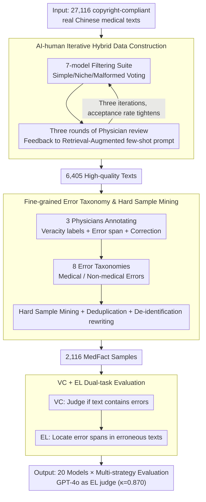

# MedFact: Benchmarking the Fact-Checking Capabilities of Large Language Models on Chinese Medical Texts

**Conference**: ACL2026  
**arXiv**: [2509.12440](https://arxiv.org/abs/2509.12440)  
**Code**: Project Page https://iflytek-medical-southchina.github.io/MedFact/  
**Area**: Medical NLP  
**Keywords**: Chinese Medical Text, Fact-Checking, Error Localization, Medical LLM Evaluation, Over-criticism

## TL;DR
MedFact establishes an expert-annotated fact-checking benchmark covering real-world Chinese medical texts. Testing 20 LLMs proves that while current models can easily judge "whether an error exists," they struggle to precisely locate errors. RAG is beneficial, whereas multi-agent systems and reasoning-time scaling tend to amplify "over-criticism."

## Background & Motivation
**Background**: Medical LLMs have entered application scenarios such as clinical QA, auxiliary diagnosis, patient assessment, medical text classification, and medical RAG. Real-world systems often integrate internet or internal medical texts into Retrieval-Augmented Generation workflows; thus, models must not only answer medical exam questions but also judge the reliability of medical content itself.

**Limitations of Prior Work**: Existing medical evaluations mostly focus on QA, relation extraction, or clinical note error correction. VeriFact uses synthetic clinical texts, and MEDEC mainly targets error detection in clinical notes. These settings rarely cover the diverse text forms encountered in real deployments, such as medical encyclopedias, popular science articles, QA communities, and forged medical rumors.

**Key Challenge**: Medical fact-checking requires both broad medical knowledge and the ability to locate errors in specific segments. A model might judge "this section has issues" based on overall tone but misidentify a correct sentence as the source of error. In medical scenarios, this "correct conclusion, wrong reason" behavior remains unsafe.

**Goal**: The authors aim to construct an unpolluted, realistic, diverse, and difficulty-stratified Chinese medical fact-checking dataset. This dataset is used to systematically evaluate LLM veracity classification, error localization, RAG benefits, side effects of reasoning strategies, and cross-lingual performance.

**Key Insight**: Instead of scraping data directly from the open web, the paper utilizes non-public medical encyclopedias, medical consultation platforms, QA pages, and forum content from commercial partners to reduce the risk of pre-training contamination. AI filtering, physician annotation, and hard sample mining are then applied to create a benchmark that truly distinguishes model capabilities.

**Core Idea**: Replace synthetic medical correction problems with "real medical text + physician-annotated error spans + hard sample filtering," advancing medical fact-checking evaluation from coarse-grained veracity judgment to fine-grained error localization.

## Method
MedFact is essentially a benchmark construction and evaluation pipeline. It first filters candidate samples suitable for fact-checking from large-scale real Chinese medical texts. Physicians then determine if the text is correct, identify the error location, and provide corrections. Finally, the test set is finalized through model evaluation and hard sample mining. Unlike standard QA benchmarks, the key is not asking the model a medical question, but providing potentially erroneous medical text and requiring it to complete both "presence of error" and "location of error" tasks.

### Overall Architecture
The input consists of 27,116 copyright-compliant real Chinese medical text entries from internal encyclopedias, consultation platforms, and forums. The system uses a filtering suite of 7 strong models to vote on dimensions such as "too simple, too niche, or malformed." Subsequently, three rounds of physician feedback improve a retrieval-augmented few-shot filtering prompt, compressing the candidates to 6,405 high-quality texts.

During annotation, 3 licensed medical professionals provide binary veracity labels for each text; if erroneous, they annotate precise error spans and suggested corrections. The authors then perform hard sample mining, deduplication of similar samples, and de-identification rewriting. Finally, physicians review the results to obtain 2,116 MedFact samples.

The evaluation phase includes two tasks: Veracity Classification (VC) to judge if the text contains factual errors, and Error Localization (EL) to locate error spans in erroneous texts. The authors evaluate 20 models under strategies such as zero-shot, CoT, MedPrompt, RAG, MAD, MDAgents, and budget forcing, using GPT-4o as an automatic judge for EL. The Cohen's $\kappa$ between GPT-4o and physicians on a random 10% sample reached 0.870.

### Key Designs

**1. AI-human Iterative Hybrid Data Construction: Extracting medical-rich, fact-check-suitable samples from 27,000 real texts while controlling costs.**

Relying solely on physicians to screen 27,116 texts is cost-prohibitive, while relying purely on models retains low-quality or biased samples. This paper uses 7 strong models as a filtering suite to vote on dimensions like "too simple, too niche, malformed." Three rounds of physician sampling review then feed misclassified samples back into a "standard-specific retrieval-augmented few-shot prompt"—specifically adding retrieved counter-examples for each criterion to improve the next round's accuracy.

The feedback effect is quantifiable: the acceptance rate tightened from 67.69% to 23.62%, while model-physician agreement rose to 96.40%. This maintains scalability while using expert judgment to calibrate the direction.

**2. Fine-grained Error Taxonomy & Hard Sample Mining: Ensuring the benchmark covers diverse error mechanisms and difficulty levels rather than just "coarse medical common sense."**

Errors in medical texts are often subtle. Without controlling for error type and difficulty, evaluations might be dominated by exaggerated rumors or simple common sense. This paper categorizes errors into Medical and Non-medical types, further divided into 8 sub-categories (Concepts, Terminology, Temporal, Source, Bias, General Fact, etc.) to ensure diversity.

Hard sample mining is critical: all samples that all models could easily classify correctly were removed, followed by similarity-based deduplication. This converged 6,405 annotated texts into 2,116 instances that better differentiate model capabilities, focusing on samples where models are prone to confident mistakes.

**3. VC + EL Dual-task Evaluation: Simultaneously checking if the model "knows there is an error" and "knows where the error is."**

In medical fact-checking, simply flagging a paragraph is insufficient. If a model identifies a segment as problematic based on tone but points to a correct sentence as the error source, human review or automatic correction will be misled. This "correct conclusion, wrong reason" is clinically unsafe. Therefore, the task is split: Veracity Classification (VC) treats error-containing text as the positive class (calculating Precision, Recall, F1); Error Localization (EL) is activated only if the text is identified as erroneous, requiring the model to match the gold error source span.

Using GPT-4o as the EL automatic judge showed a Cohen's $\kappa$ of 0.870 with physicians, proving the evaluation's reliability. This layered design allows for the discovery that EL is generally weaker than VC and that multi-agent strategies can amplify "over-criticism."

### Loss & Training
This paper does not train new models; the core is the benchmark construction and evaluation protocol. Inference settings include zero-shot and CoT prompting, with additional tests for MedPrompt, RAG, MAD, MDAgents, and budget forcing. The RAG knowledge base consists of the 6,405 expert-annotated source texts. Primary metrics are Precision, Recall, and F1 for both VC and EL.

## Key Experimental Results

### Main Results

| Model / Setting | VC F1 | EL F1 | Key Information |
|--------|------|------|------|
| Human | 0.7521 | 0.7012 | Average performance of 3 medical professionals |
| XiaoYi zero-shot | 0.7126 | 0.6758 | One of the strongest medical-specific models |
| XiaoYi CoT | 0.7061 | 0.6858 | Highest EL F1 reported in the paper |
| Doubao-Seed-1.6-thinking zero-shot | 0.7139 | 0.6712 | Strong performance among general models |
| Doubao-Seed-1.6-thinking CoT | 0.7050 | 0.6786 | CoT improves EL but slightly lowers VC |
| DeepSeek-R1 zero-shot | 0.6847 | 0.6051 | High Recall, but localization remains weak |

### Strategy Comparison

| Model / Strategy | VC F1 | EL F1 | Phenomenon |
|------|------|------|------|
| DeepSeek-R1 | 0.6847 | 0.6051 | zero-shot baseline |
| DeepSeek-R1 + RAG top-3 | 0.7369 | 0.6820 | Significant gain from task-related knowledge |
| DeepSeek-R1 + MAD | 0.6829 | 0.6017 | Recall increased but Precision decreased |
| DeepSeek-R1 + MDAgents | 0.6965 | 0.6233 | Slight improvement, but over-criticism is evident |
| XiaoYi | 0.7126 | 0.6758 | zero-shot baseline |
| XiaoYi + RAG top-3 | 0.7484 | 0.7051 | Exceeds human EL F1, but relies on homologous RAG |
| XiaoYi + MAD | 0.6996 | 0.6831 | Multi-agent strategy worsens Precision |
| XiaoYi + MDAgents | 0.7059 | 0.6284 | EL F1 significantly lower than RAG top-3 |

### Key Findings
- The dataset size is 2,116 entries: 1,058 correct and 1,058 with a single factual error. Medical errors account for 89.41% of error samples, with conceptual errors being the most frequent (52.65%).
- EL is consistently weaker than VC for all models, indicating that "judging an error exists" is much easier than "locating the error." The highest EL F1 (0.6858) still lags behind the human score (0.7012).
- RAG benefits are highly dependent on retrieval source relevance. Homologous top-3 RAG improved XiaoYi's EL F1 to 0.7051, but authoritative medical data that does not fit the specific task task might actually decrease Recall.
- Multi-agent systems and reasoning-time scaling lead to "over-criticism": DeepSeek-R1 + MAD saw VC Precision drop from 0.5488 to 0.5310, while Recall rose from 0.9101 to 0.9565, indicating a tendency to flag correct text as erroneous.
- Cross-lingual experiments show F1 improves on English translated versions (e.g., Gemini 2.5 Pro from 0.6223 to 0.6745), but the high Recall / low Precision trend of over-criticism persists.

## Highlights & Insights
- MedFact's value lies in decoupling medical fact-checking into veracity classification and error localization. Many models appear usable on VC, but EL results reveal they still lack fine-grained medical knowledge.
- "Over-criticism" is one of the most insightful findings. Longer reasoning and more agents do not necessarily equal greater safety; in fact-checking, excessive deliberation may generate far-fetched error hypotheses, sacrificing Precision.
- The comparison between homologous and authoritative RAG is practical. Medical systems cannot just dump "authoritative data" into a vector store; they must ensure retrieved content is highly relevant to the claim, or the model may be misled by mismatched evidence.
- The hard sample mining approach in data construction is transferable to other high-stakes domains like Law, Finance, and Drug Safety, shifting focus from "what models know" to "where models are confidently wrong."

## Limitations & Future Work
- MedFact focuses on Chinese and the Chinese medical context; conclusions may not generalize directly to other languages, medical systems, or clinical guidelines.
- EL uses GPT-4o as an automatic judge. While agreement with physicians is high, biases or instabilities may exist; high-risk samples should involve expert review in the future.
- The benchmark reflects medical knowledge at the time of construction. As guidelines and drug evidence evolve, some factual labels may become outdated, requiring a dynamic update mechanism.
- Although the dataset is de-identified and restricted for research, erroneous medical text still carries misuse risks; future releases must maintain licensing constraints and safety documentation.

## Related Work & Insights
- **vs VeriFact**: VeriFact verifies synthetic clinical text against structured EHRs; MedFact uses real Chinese medical texts covering more writing styles and scenarios.
- **vs MEDEC**: MEDEC focuses on error detection and correction in clinical notes; MedFact emphasizes internet and encyclopedia-style content, suitable for evaluating medical RAG and content moderation.
- **vs SimpleQA / OpenFactCheck**: General benchmarks test open-domain factuality but lack medical terminology, treatment boundaries, and error span annotations; MedFact tightens evaluation to knowledge-intensive medical tasks.
- **Insights**: For high-risk RAG systems, evaluation should not just look at final answer accuracy but also include diagnostic metrics such as "evidence relevance," "over-questioning of correct content," and "precision of error localization."

## Rating
- Novelty: ⭐⭐⭐⭐☆ Solid combination of Chinese medical fact-checking and error localization; addresses a critical problem, though primarily a benchmark and evaluation study.
- Experimental Thoroughness: ⭐⭐⭐⭐⭐ Covers 20 models, multiple prompting/RAG/multi-agent strategies, cross-lingual impacts, and contamination analysis.
- Writing Quality: ⭐⭐⭐⭐☆ Data process and error analysis are clear; some information-dense tables require careful reading.
- Value: ⭐⭐⭐⭐⭐ Directly valuable for medical LLMs, RAG, and fact-checking systems, specifically warning that "better reasoning" does not simply equal "more reliable."

<!-- RELATED:START -->

## Related Papers

- [\[ACL 2026\] MHGraphBench: Knowledge Graph-Grounded Benchmarking of Mental Health Knowledge in Large Language Models](mhgraphbench_knowledge_graph-grounded_benchmarking_of_mental_health_knowledge_in.md)
- [\[ACL 2026\] Beyond the Leaderboard: Rethinking Medical Benchmarks for Large Language Models](beyond_the_leaderboard_rethinking_medical_benchmarks_for_large_language_models.md)
- [\[ACL 2026\] Text-Attributed Knowledge Graph Enrichment with Large Language Models for Medical Concept Representation](text-attributed_knowledge_graph_enrichment_with_large_language_models_for_medica.md)
- [\[ACL 2026\] RePrompT: Recurrent Prompt Tuning for Integrating Structured EHR Encoders with Large Language Models](reprompt_recurrent_prompt_tuning_for_integrating_structured_ehr_encoders_with_la.md)
- [\[ACL 2026\] MHSafeEval: Role-Aware Interaction-Level Evaluation of Mental Health Safety in Large Language Models](mhsafeeval_role-aware_interaction-level_evaluation_of_mental_health_safety_in_la.md)

<!-- RELATED:END -->
