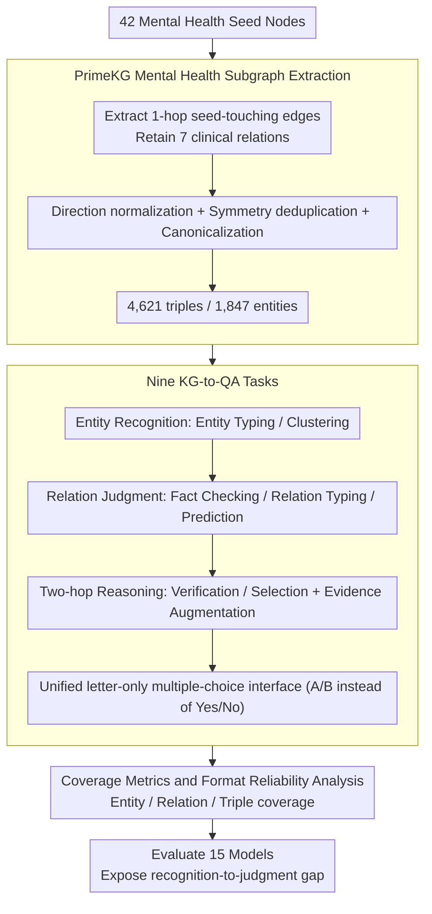

# MHGraphBench: Knowledge Graph-Grounded Benchmarking of Mental Health Knowledge in Large Language Models

**Conference**: ACL2026  
**arXiv**: [2605.15589](https://arxiv.org/abs/2605.15589)  
**Code**: None (open-source repository not provided in cache)  
**Area**: Medical NLP  
**Keywords**: Mental Health, Knowledge Graph, PrimeKG, Relation Judgment, Two-hop Reasoning

## TL;DR
MHGraphBench automatically constructs 9 categories of multiple-choice tasks from the mental health subgraph of PrimeKG. It finds that LLMs achieve near-perfect scores in entity recognition but remain significantly deficient in drug-disease relationship judgment, contraindication boundaries, and two-hop KG reasoning.

## Background & Motivation
**Background**: LLMs are being deployed for medical and mental health tasks, including clinical Q&A, counseling assistance, diagnostic suggestions, and knowledge retrieval. Mental health scenarios rely heavily on heterogeneous biomedical knowledge, such as disease associations, drug indications/contraindications, phenotypes, exposure factors, and gene-protein relationships.

**Limitations of Prior Work**: Many medical benchmarks provide broad average accuracies, making it difficult to discern whether a model has truly mastered structured knowledge related to mental health. Evaluation in mental health also frequently focuses on diagnosis, counseling quality, or trustworthiness rather than verifiable knowledge graph relationship boundaries.

**Key Challenge**: A model might recognize that "Anxiety is a disease" or "Drug X is a medication," but this does not imply it can determine whether a drug for a specific mental disorder is an indication, contraindication, off-label use, or simply not present in the graph. This discrepancy between recognition and structured judgment is critical in medical scenarios.

**Goal**: The authors aim to construct a KG-grounded benchmark using a verifiable mental health subgraph from PrimeKG to evaluate LLMs' entity recognition, relationship judgment, two-hop reasoning, evidence utilization, and graph coverage.

**Key Insight**: Instead of directly evaluating clinical safety, the paper restricts the problem to "whether the model is consistent with a curated mental health slice of PrimeKG." This boundary makes the benchmark reproducible and interpretable, while avoiding the overinterpretation of KG results as actual clinical advice.

**Core Idea**: Starting from 42 mental health seed nodes, a mental health subgraph is extracted. KG triples are then automatically converted into multiple-choice QA tasks using controlled negative sampling and coverage metrics to measure weaknesses in structured mental health knowledge.

## Method
The MHGraphBench workflow consists of three steps: defining the mental health domain boundary, extracting the subgraph from PrimeKG, and generating multiple-choice questions from the subgraph. A key feature is that all answers are supported by KG triples, and negative examples are generated through type matching and "not in subgraph" constraints, allowing every question to be traced back to the graph structure.

### Overall Architecture
The authors manually curated 44 high-precision candidate mental health seeds, retaining 42 final seeds after removing two unsuitable nodes. Based on these seeds, 1-hop seed-touching edges were extracted from PrimeKG, retaining only seven categories of clinically relevant relations: disease_protein, contraindication, indication, off-label use, disease_disease, disease_phenotype_positive, and exposure_disease. Following direction normalization, deduplication of symmetric relations, and canonicalization, the final graph contains 4,621 unique triples, 1,847 entities, and 7 relation types.

In the QA generation phase, the system converts graph facts into nine task families: Entity Typing, Entity Clustering, Fact Checking, Relation Typing, Relation Prediction, Two-hop Verification, Two-hop Selection, and two evidence-augmented two-hop tasks. All tasks utilize a letter-only multiple-choice interface, and binary classification tasks use A/B instead of Yes/No to reduce lexical bias.

### Key Designs

**1. PrimeKG Mental Health Subgraph Extraction: Enclosing open mental health knowledge within a reproducible and traceable boundary**

Mental health knowledge is too broad for open-ended questions to be verified accurately; structured gold labels are necessary. Starting from 42 high-precision mental health seeds, this paper extracts 1-hop seed-touching edges from PrimeKG, retaining only 7 clinical relation types and fixing relation directions into schemas such as disease→gene/protein and drug→disease. Symmetric relations like disease_disease are deduplicated lexicographically and canonicalized, resulting in 4,621 unique triples. Every question's correct answer can be traced back to a specific KG edge, ensuring the benchmark is reproducible and interpretable.

**2. Nine KG-to-QA Tasks: Decomposing accuracy into entity recognition, relation judgment, and short-chain reasoning to locate bottlenecks**

A single accuracy score can mask performance differences where a model "recognizes entities but fails to judge relations." This paper automatically converts graph facts into nine task families: Entity Typing/Clustering (entity type/clustering), Fact Checking (triple verification), Relation Typing (relation schema), Relation Prediction (classification among indication/contraindication/off-label use/none), and Two-hop Verification/Selection (combinatorial reasoning via Drug A→Disease B→Disease C), plus two evidence-augmented two-hop tasks. This stratification allows for the clean measurement of the "recognition-to-judgment gap," where entity recognition is near perfect but relation judgment and two-hop reasoning collapse.

**3. Coverage Metrics and Format Reliability Analysis: Complementing average accuracy with graph-level knowledge coverage and treating output format as a tested capability**

Average scores on sampled questions have two blind spots: they only reflect sampled items rather than graph mastery, and low scores may stem from formatting failures rather than knowledge deficits. The paper defines entity, relation, and triple coverage—where triple scores are averaged from head, relation, and tail correctness—to re-measure model strength from a structural perspective. Simultaneously, "format reliability" (the ability to stably output a single parsable option letter) is recorded separately, revealing that accuracy and coverage rankings are inconsistent and highlighting non-compliance as a genuine deployment risk.

### Loss & Training
The paper does not train models but constructs a benchmark to evaluate 15 models. API model temperature is set to 0 with a maximum completion length of 120, using a strict parser for option extraction; local Hugging Face models use forced-choice scoring via maximum log-prob of option letters. Benchmark generation uses a fixed random seed of 42.

## Key Experimental Results

### Main Results

| Model | AvgE | RP | AvgS | AvgS+E | AvgAll* | Key Information |
|------|------|------|------|------|------|------|
| GPT-4.1 | 94.73 | 54.96 | 60.79 | 66.46 | 70.28 | Strongest overall; best two-hop performance with evidence |
| GPT-5.2-chat | 94.07 | 58.63 | 57.88 | 64.33 | 69.32 | Highest RP score |
| GPT-4o | 94.62 | 53.55 | 58.16 | 65.12 | 69.10 | Highest R1 at 62.08 |
| GPT-5-mini | 95.12 | 57.28 | 55.04 | 62.55 | 68.38 | Highest triple coverage |
| Qwen2.5-32B | 65.53 | 38.43 | 54.75 | 55.66 | 56.09 | Strongest open-source model, but follows GPT by a wide margin |

### Ablation Study

| Graph Coverage Metrics | GPT-5-mini | GPT-4o | GPT-4.1 | GPT-5.2 | Qwen2.5-32B |
|------|------|------|------|------|------|
| CovAvg(E) | 77.81 | 77.36 | 77.91 | 63.92 | 61.47 |
| CovDeg(R) | 63.30 | 61.18 | 61.24 | 44.56 | 55.09 |
| Cov(T) | 65.27 | 64.77 | 63.57 | 54.97 | 52.31 |
| vs AvgAll* Ranking | Highest Coverage | 2nd Coverage | 1st Accuracy | High Acc, lower coverage | 1st OS Acc, coverage lags |

### Key Findings
- Top-tier models are very strong in ET/EC: GPT series scores in ET are mostly 97%-98%, with AvgE exceeding 94%, but RP peaks at only 58.63%.
- The recognition-to-judgment gap is stable. Knowing an entity type and relation schema does not mean the model can reliably distinguish between indication, contraindication, off-label use, and none.
- Two-hop reasoning remains difficult. GPT-4.1's AvgS is only 60.79, far below its entity recognition level; evidence augmentation improves it to 66.46, but not all models benefit.
- Evidence augmentation is not a panacea. Qwen2.5-32B's R1 improved from 50.50 to 61.25, but R2 dropped from 59.00 to 50.08, suggesting short KG snippets may aid verification but interfere with selection.
- Contraindication relations are among the most difficult in fine-grained analysis, which is highly relevant to actual medical risks.

## Highlights & Insights
- The strongest aspect of this paper is its sense of boundary: it does not claim to test "real clinical safety" but rather the model's consistency with a curated KG slice, making conclusions more interpretable.
- The inconsistency between average accuracy and graph coverage rankings is insightful. A model may perform well on sampled questions but have low graph-level coverage; benchmarks should look beyond total scores.
- Format reliability in constrained multiple-choice tasks is treated as a finding rather than noise. In medical evaluation, being unable to stably output a parsable answer is itself a deployment risk.
- KG-grounded negative sampling is well-suited for structured medical evaluation, though "absence in the subgraph" is not strictly equivalent to being false in the real world—a point the authors emphasize to avoid misinterpretation.

## Limitations & Future Work
- The benchmark inherits the coverage limitations of PrimeKG and the subgraph extraction strategy; it does not represent complete psychiatric knowledge, long-term patient context, or individualized treatment decisions.
- All labels are valid relative to the extracted KG subgraph; as medical guidelines update, some edges may become obsolete or incomplete.
- The authors did not conduct additional expert verification on the sampled questions, negatives, or evidence snippets, relying instead on KG quality and task generation rules.
- Multiple-choice formats conflate knowledge capability with format compliance; for some models, low scores may stem from parsing failures or option bias.
- Future work could combine KG-grounded evaluation with case-based evaluation closer to clinical workflows while retaining verifiable evidence chains.

## Related Work & Insights
- **vs HealthBench / MedQA**: These benchmarks focus more on clinical Q&A or health dialogue quality, whereas MHGraphBench focuses on structural judgment of mental health KGs.
- **vs Mental Health Counseling/Diagnosis Benchmarks**: Related works measure diagnosis, counseling, or trustworthiness; this work measures verifiable biomedical relation boundaries.
- **vs DRKG / PrimeKG Application Research**: Previous KGs were largely used for downstream discovery and reasoning; this work converts the PrimeKG subgraph into an LLM benchmark with coverage analysis.
- **Insight**: Medical LLM evaluation should separate dimensions like recognition, relation judgment, short-chain reasoning, evidence integration, and format reliability, as average scores often mask safety-critical weaknesses.

## Rating
- Novelty: ⭐⭐⭐⭐☆ KG-to-QA is not entirely new, but the combination of the Mental Health PrimeKG subgraph, nine-task design, and coverage metrics is solid.
- Experimental Thoroughness: ⭐⭐⭐⭐☆ The evaluation of 15 models across task groups, evidence augmentation, and coverage analysis is comprehensive, although it lacks expert review and additional KG sources.
- Writing Quality: ⭐⭐⭐⭐☆ Boundaries are clearly stated and metrics are rigorously defined; tables are dense, requiring high reading effort.
- Value: ⭐⭐⭐⭐☆ Highly valuable for the structured evaluation of mental health LLMs, especially for locating risks in drug relations and two-hop reasoning.

<!-- RELATED:START -->

## Related Papers

- [\[ACL 2026\] Text-Attributed Knowledge Graph Enrichment with Large Language Models for Medical Concept Representation](text-attributed_knowledge_graph_enrichment_with_large_language_models_for_medica.md)
- [\[ICLR 2026\] CounselBench: A Large-Scale Expert Evaluation and Adversarial Benchmarking of Large Language Models in Mental Health Question Answering](../../ICLR2026/medical_nlp/counselbench_a_large-scale_expert_evaluation_and_adversarial_benchmarking_of_lar.md)
- [\[ACL 2026\] MHSafeEval: Role-Aware Interaction-Level Evaluation of Mental Health Safety in Large Language Models](mhsafeeval_role-aware_interaction-level_evaluation_of_mental_health_safety_in_la.md)
- [\[ACL 2026\] MedFact: Benchmarking the Fact-Checking Capabilities of Large Language Models on Chinese Medical Texts](medfact_benchmarking_the_fact-checking_capabilities_of_large_language_models_on_.md)
- [\[NeurIPS 2025\] Mind the Gap: Aligning Knowledge Bases with User Needs to Enhance Mental Health Retrieval](../../NeurIPS2025/medical_nlp/mind_the_gap_aligning_knowledge_bases_with_user_needs_to_enhance_mental_health_r.md)

<!-- RELATED:END -->
