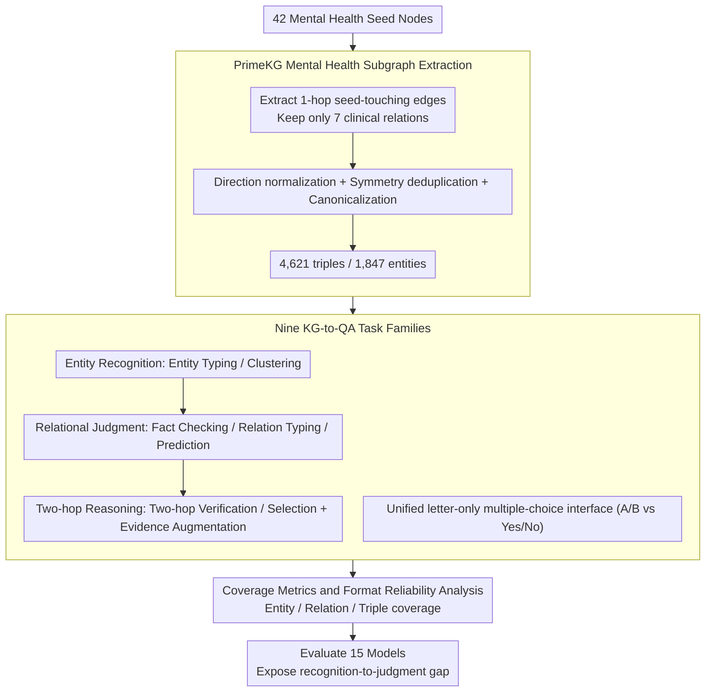

# MHGraphBench: Knowledge Graph-Grounded Benchmarking of Mental Health Knowledge in Large Language Models

**Conference**: ACL2026  
**arXiv**: [2605.15589](https://arxiv.org/abs/2605.15589)  
**Code**: None (open-source repository not provided in the cache)  
**Area**: Medical NLP  
**Keywords**: Mental Health, Knowledge Graph, PrimeKG, Relational Judgment, Two-hop Reasoning  

## TL;DR
MHGraphBench automatically constructs 9 types of multiple-choice tasks from the mental health subgraph of PrimeKG. It finds that LLMs achieve near-perfect scores in entity recognition but remain significantly deficient in drug-disease relational judgment, contraindication boundaries, and two-hop KG reasoning.

## Background & Motivation
**Background**: LLMs are being deployed for medical and mental health-related tasks, including clinical Q&A, counseling assistance, diagnostic suggestions, and knowledge retrieval. Mental health scenarios particularly rely on heterogeneous biomedical knowledge, such as disease associations, drug indications/contraindications, phenotypes, exposure factors, and gene-protein relationships.

**Limitations of Prior Work**: Many medical benchmarks provide broad average accuracies, making it difficult to discern whether a model truly masters structured knowledge related to mental health. Mental health evaluations also frequently focus on diagnosis, counseling quality, or trustworthiness rather than verifiable knowledge graph relational boundaries.

**Key Challenge**: A model might recognize that "Anxiety is a disease" or "Drug X is a medication," but this does not imply it can judge whether that drug is an indication, contraindication, off-label use, or entirely absent from the graph for a specific psychiatric disorder. This gap between recognition and structured judgment is critical in medical scenarios.

**Goal**: The authors aim to construct a KG-grounded benchmark using a verifiable mental health subgraph from PrimeKG to evaluate LLMs on entity typing, relational judgment, two-hop reasoning, evidence utilization, and graph coverage.

**Key Insight**: Instead of directly evaluating clinical safety, the paper restricts the problem to "whether the model is consistent with a curated mental health slice of PrimeKG." This boundary makes the benchmark reproducible and interpretable while avoiding over-interpretation of KG results as actual clinical advice.

**Core Idea**: Starting from 42 psychiatric disease seed nodes, a mental health subgraph is extracted. KG triples are then automatically converted into multiple-choice QA tasks using controlled negative sampling and coverage metrics to measure weaknesses in structured mental health knowledge.

## Method
The workflow of MHGraphBench is divided into three steps: defining the mental health domain boundary, extracting the subgraph from PrimeKG, and generating multiple-choice questions from the subgraph. Its key characteristic is that all answers are supported by KG triples, and negative instances are generated via type matching and "not in subgraph" constraints, allowing every question to be traced back to the graph structure.

### Overall Architecture
The authors manually curated 44 high-precision psychiatric disease seed candidates, retaining 42 final seeds after removing 2 unsuitable nodes. Based on these seeds, 1-hop seed-touching edges were extracted from PrimeKG, retaining only 7 clinical relation types: disease_protein, contraindication, indication, off-label use, disease_disease, disease_phenotype_positive, and exposure_disease. After direction normalization, symmetry deduplication, and canonicalization, a final set of 4,621 unique triples, 1,847 entities, and 7 relation types was obtained.

In the QA generation phase, the system converts graph facts into 9 task families: Entity Typing, Entity Clustering, Fact Checking, Relation Typing, Relation Prediction, Two-hop Verification, Two-hop Selection, and two evidence-augmented two-hop tasks. All tasks utilize a letter-only multiple-choice interface, with binary tasks using A/B instead of Yes/No to reduce lexical bias.

### Key Designs

**1. PrimeKG Mental Health Subgraph Extraction: Restricting open mental health knowledge to a reproducible and traceable boundary**

Mental health knowledge is overly broad; asking open-ended questions makes it impossible to verify accuracy. Structured gold labels are essential. This work extracts 1-hop seed-touching edges from PrimeKG starting from 42 high-precision seeds, retaining only 7 clinically relevant relations (disease_protein, contraindication, indication, off-label use, disease_disease, disease_phenotype_positive, exposure_disease). Relation directions are fixed to schemas such as disease $\rightarrow$ gene/protein, drug $\rightarrow$ disease, and disease $\rightarrow$ disease. Following normalization, symmetric relations (e.g., disease_disease) undergo lexicographical deduplication and canonicalization, resulting in 4,621 unique triples and 1,847 entities. Every correct answer can be traced to a specific KG edge, ensuring reproducibility and interpretability without relying on subjective scoring.

**2. Nine KG-to-QA Task Families: Decomposing broad accuracy into entity recognition, relational judgment, and short-chain reasoning**

A single aggregate accuracy often masks capability variances—a model might recognize entities but fail to judge relationships. This paper automatically converts graph facts into 9 task families: Entity Typing/Clustering (entity types and clusters), Fact Checking (triple support), Relation Typing (schema), Relation Prediction (classification among indication, contraindication, off-label use, or none), and Two-hop Verification/Selection (compositional reasoning via Drug A $\rightarrow$ Disease B $\rightarrow$ Disease C structures), plus two evidence-augmented two-hop tasks. All tasks use a letter-only multiple-choice interface to mitigate lexical bias. This hierarchical approach enables the identification of the "recognition-to-judgment gap," where entity recognition scores are near-perfect while relational judgment and two-hop reasoning collapse.

**3. Coverage Metrics and Format Reliability Analysis: Measuring graph-level knowledge coverage beyond average accuracy**

Average scores on sampled questions have two blind spots: they only reflect sampled items rather than the entire graph, and low scores may stem from formatting failures rather than knowledge deficits. The authors define three coverage metrics—entity, relation, and triple—where the score of each triple is the average of head/relation/tail correctness, re-evaluating model strength from a structural perspective. Simultaneously, the ability to stably output a single parsable option letter is recorded as "format reliability." This step reveals that accuracy rankings do not always align with coverage rankings and elevates "format non-compliance" from ignored noise to a real-world deployment risk signal.

### Loss & Training
The authors do not train models but build the benchmark to evaluate 15 models. API model temperatures are set to 0 with a maximum completion length of 120, using a strict parser for option extraction. Local Hugging Face models employ forced-choice scoring by selecting the answer with the maximum log-probability among option letters. Benchmark generation uses a fixed random seed of 42.

## Key Experimental Results

### Main Results

| Model | AvgE | RP | AvgS | AvgS+E | AvgAll* | Key Insight |
|------|------|------|------|------|------|------|
| GPT-4.1 | 94.73 | 54.96 | 60.79 | 66.46 | 70.28 | Overall strongest; best two-hop performance after evidence augmentation |
| GPT-5.2-chat | 94.07 | 58.63 | 57.88 | 64.33 | 69.32 | Highest single-category RP score |
| GPT-4o | 94.62 | 53.55 | 58.16 | 65.12 | 69.10 | Highest R1 score at 62.08 |
| GPT-5-mini | 95.12 | 57.28 | 55.04 | 62.55 | 68.38 | Highest triple coverage |
| Qwen2.5-32B | 65.53 | 38.43 | 54.75 | 55.66 | 56.09 | Strongest open-source model, but significant gap remains vs. GPT |

### Ablation Study

| Graph Coverage Metric | GPT-5-mini | GPT-4o | GPT-4.1 | GPT-5.2 | Qwen2.5-32B |
|------|------|------|------|------|------|
| CovAvg(E) | 77.81 | 77.36 | 77.91 | 63.92 | 61.47 |
| CovDeg(R) | 63.30 | 61.18 | 61.24 | 44.56 | 55.09 |
| Cov(T) | 65.27 | 64.77 | 63.57 | 54.97 | 52.31 |
| Correlation with AvgAll* | Highest Cov | 2nd Cov | 1st Acc | High Acc, lower Cov | 1st Open Acc, mid Cov |

### Key Findings
- Top-tier models are strong in Entity Typing (ET) and Entity Clustering (EC): GPT series scores for ET are mostly above 97%–98% with AvgE exceeding 94%, yet Relation Prediction (RP) peaks at only 58.63%.
- The recognition-to-judgment gap is consistent. Knowing an entity's type or a relation's schema does not guarantee reliable differentiation between indication, contraindication, off-label use, and none.
- Two-hop reasoning remains difficult. GPT-4.1 scores only 60.79 in AvgS, far below its entity recognition level; evidence augmentation improves this to 66.46, but not all models benefit.
- Evidence augmentation is not a panacea. Qwen2.5-32B's R1 improved from 50.50 to 61.25, but its R2 dropped from 59.00 to 50.08, suggesting that short KG snippets may help verification but interfere with selection.
- Contraindication relations are among the most difficult to distinguish in fine-grained analysis, which is highly relevant to clinical risk.

## Highlights & Insights
- The strongest aspect of this paper is its sense of boundary: it does not claim to test "real-world clinical safety" but rather consistency with a curated KG slice, making the findings more interpretable.
- The discrepancy between average accuracy and graph coverage rankings is insightful. A model performing well on sampled questions might have lower graph-level coverage; benchmarks must look beyond total scores.
- Format reliability in constrained multiple-choice is treated as a finding rather than noise. In medical evaluation, instability in generating parsable answers is itself a deployment risk.
- KG-grounded negative sampling is well-suited for structured medical evaluation, but the authors emphasize that "absent from the subgraph" does not equate to "false in the real world," preventing common misinterpretations.

## Limitations & Future Work
- The benchmark inherits coverage limitations from PrimeKG and the subgraph extraction strategy, thus not representing complete psychiatric knowledge, longitudinal patient context, or individualized treatment decisions.
- All labels are relative to the extracted KG subgraph; some edges may be outdated or incomplete as medical guidelines evolve.
- The authors did not conduct additional expert verification for sampled questions, negative instances, or evidence snippets, leaving results dependent on KG quality and task generation rules.
- Multiple-choice formats conflate knowledge capability with instruction-following. For some models, low scores may stem from parsing failures or option bias.
- Future work could integrate KG-grounded evaluation with case-based evaluation that mimics real clinical workflows while retaining verifiable evidence chains.

## Related Work & Insights
- **vs. HealthBench / MedQA**: These benchmarks focus on clinical Q&A or health dialogue quality; MHGraphBench focuses on structural judgment of mental health KGs.
- **vs. Counseling/Diagnosis Benchmarks**: Related works measure diagnosis, counseling, or trustworthiness; this work measures verifiable biomedical relational boundaries.
- **vs. DRKG / PrimeKG Application Research**: Prior researchers used KGs for downstream discovery; this work converts the PrimeKG subgraph into an LLM benchmark and adds coverage analysis.
- **Insight**: Medical LLM evaluation should separate dimensions like recognition, relational judgment, short-chain reasoning, evidence integration, and format reliability, as average scores can hide safety-critical weaknesses.

## Rating
- Novelty: ⭐⭐⭐⭐☆ KG-to-QA is not a new direction, but the combination of the mental health PrimeKG subgraph, nine-task design, and coverage metrics is solid.
- Experimental Thoroughness: ⭐⭐⭐⭐☆ Comprehensive evaluation of 15 models across task groups and evidence augmentation, though lacks expert cross-checking and additional KG sources.
- Writing Quality: ⭐⭐⭐⭐☆ Clear boundaries and rigorous definitions; tables are somewhat dense, requiring high reading effort.
- Value: ⭐⭐⭐⭐☆ Highly valuable for structured evaluation of mental health LLMs, especially for locating risks in drug relations and two-hop reasoning.

<!-- RELATED:START -->

## Related Papers

- [\[ACL 2026\] Text-Attributed Knowledge Graph Enrichment with Large Language Models for Medical Concept Representation](text-attributed_knowledge_graph_enrichment_with_large_language_models_for_medica.md)
- [\[ACL 2026\] MHSafeEval: Role-Aware Interaction-Level Evaluation of Mental Health Safety in Large Language Models](mhsafeeval_role-aware_interaction-level_evaluation_of_mental_health_safety_in_la.md)
- [\[ACL 2026\] MedFact: Benchmarking the Fact-Checking Capabilities of Large Language Models on Chinese Medical Texts](medfact_benchmarking_the_fact-checking_capabilities_of_large_language_models_on_.md)
- [\[ICLR 2026\] CounselBench: A Large-Scale Expert Evaluation and Adversarial Benchmarking of LLMs in Mental Health QA](../../ICLR2026/medical_nlp/counselbench_llm_mental_health_qa.md)
- [\[ACL 2026\] Responsible Evaluation of AI for Mental Health](responsible_evaluation_of_ai_for_mental_health.md)

<!-- RELATED:END -->
