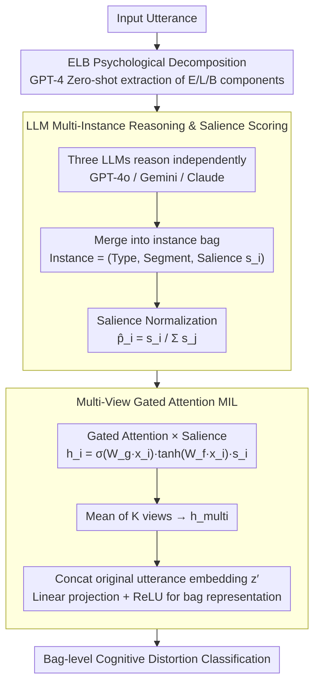

# Multi-View Attention Multiple-Instance Learning Enhanced by LLM Reasoning for Cognitive Distortion Detection

**Conference**: ACL 2026  
**arXiv**: [2509.17292](https://arxiv.org/abs/2509.17292)  
**Code**: [GitHub](https://github.com/cocoboldongle/MVACD)  
**Area**: Medical NLP  
**Keywords**: Cognitive Distortion Detection, Multiple-Instance Learning, LLM Reasoning, Psychological Decomposition, Gated Attention

## TL;DR

Ours proposes decomposing utterances into Emotion-Logic-Behavior (ELB) components and reasoning multiple cognitive distortion instances using LLMs, followed by a multi-view gated attention MIL framework for bag-level classification. It outperforms direct LLM reasoning baselines on both Korean (KoACD) and English (Therapist QA) datasets.

## Background & Motivation

**Background**: Cognitive distortions (e.g., all-or-nothing thinking, overgeneralization, personalization) are closely related to mental health disorders such as anxiety and depression. Automatic detection of these distortions is a critical task in mental health NLP. Recently, LLMs have been applied to this task; for example, the DoT framework uses structured prompting to improve interpretability.

**Limitations of Prior Work**: (1) Most methods treat utterances as a single unstructured input and return holistic predictions, ignoring that different distortions may originate from different psychological dimensions (Emotion/Logic/Behavior); (2) Multiple cognitive distortions often co-occur in a single utterance, but semantic similarity between types leads to low inter-annotator agreement; (3) The accuracy of direct LLM reasoning is insufficient—GPT-4o achieves an F1 of only 0.325 on KoACD.

**Key Challenge**: Cognitive distortion detection requires addressing two problems simultaneously: precisely locating distortion expressions within different psychological dimensions of an utterance and aggregating multiple potentially co-existing distortion instances to make a final judgment. Existing methods either perform only holistic classification or only LLM reasoning, both of which are inadequate.

**Goal**: (1) Decompose utterances into psychologically grounded components (ELB) to provide richer reasoning context; (2) Model each distortion instance reasoned by LLMs as an instance in MIL to achieve expression-level fine-grained classification.

**Key Insight**: Combining the Cognitive Triangle theory of Cognitive Behavioral Therapy (CBT) to decompose utterances into Emotion-Logic-Behavior. Leveraging LLM reasoning capabilities to generate multiple distortion candidate instances (including type, text segment, and salience score), then using an MIL framework for supervised bag-level classification.

**Core Idea**: Modeling cognitive distortion detection as a Multiple-Instance Learning problem, where the utterance is the bag and each reasoned distortion expression is an instance. A multi-view gated attention mechanism aggregates instance-level features for the final prediction.

## Method

### Overall Architecture

The core question in cognitive distortion detection is whether a distortion exists and which type it is (e.g., all-or-nothing thinking). The difficulty lies in the fact that one utterance often contains multiple distortions originating from different psychological dimensions. Instead of classifying the utterance as an unstructured text block, ours first decomposes it into Emotion-Logic-Behavior (ELB) components using an LLM. Multiple LLMs then reason out several "distortion instances" (each with a type, text segment, and salience score). These instances are treated as a bag, and a multi-view gated attention MIL framework aggregates them into a bag-level judgment. The utterance is the bag, and each reasoned distortion expression is an instance—this is the core perspective of reframing detection as MIL.

### Key Designs

**1. ELB Psychological Decomposition: Distortions originate from different dimensions; decomposing them first helps LLMs locate them.**

When treating an utterance as a single input, it is difficult for a model to determine where a distortion arises—"I can't do anything right" is primarily overgeneralization at the logic level, while "It must be my fault" involves personalization across emotion and behavior. Referencing CBT's Cognitive Triangle (Beck, 1979), this work renames "Thought" to "Logic" to emphasize reasoning. GPT-4 is used with zero-shot prompting to generate Emotion, Logic, and Behavior components for each utterance, which are then used alongside the original text as input for downstream LLM reasoning. This decomposition allows LLMs to anchor the source of distortions more precisely. Experiments show ELB reduces the label missing rate from 10.89% to 8.93%.

**2. LLM Multi-Instance Reasoning and Salience Scoring: A single LLM may miss certain types; using an ensemble + salience ensures comprehensive candidates with confidence levels.**

Three LLMs (GPT-4o, Gemini 2.0 Flash, Claude 3.7 Sonnet) independently process the ELB-enhanced utterances. Each outputs multiple instances $x_i = (\text{type}_i, \text{text}_i, s_i)$, where the salience score $s_i$ is provided by the LLM to indicate the relative importance of the instance. Instances from all LLMs are merged into one bag, and scores are normalized as $\hat{p}_i = s_i / \sum_j s_j$. The multi-model ensemble improves coverage of distortion types (avoiding single-model blind spots), while normalized salience scores explicitly inject LLM "confidence" into the downstream MIL classifier for informed aggregation.

**3. Multi-View Gated Attention MIL: Single-view attention may focus on limited instances; multi-view integration with global utterance context recovers missing information.**

Each instance embedding is first processed via gated attention to calculate weights:

$$h_i = \sigma(W_g \cdot x_i) \cdot \tanh(W_f \cdot x_i) \cdot s_i$$

The gated structure (sigmoid gate × tanh feature) allows the model to selectively amplify relevant instances, combined with salience $s_i$ to layer in LLM confidence. $K$ independent views calculate separate attention sets, which are averaged into $h_\text{multi}$ to prevent focusing on a small subset of instances. Finally, this is concatenated with the transformed original utterance embedding $z'$ and passed through a linear projection and ReLU to obtain the bag representation. Merging the original utterance compensates for global context potentially lost during instance-level reasoning.

### Loss & Training

Standard multi-class cross-entropy loss is used. The learning rate decays linearly from 0.0005 to 0.00001, with early stopping if validation loss does not improve for 10 epochs. Instances are encoded using all-MiniLM-L12-v2 into 384-dimensional vectors. All experiments were repeated 10 times, reporting mean ± standard deviation.

## Key Experimental Results

### Main Results

| Method | KoACD Val F1 | KoACD Test F1 | Therapist QA Val F1 | Therapist QA Test F1 |
|------|-------------|-------------|-------------------|-------------------|
| Baseline (No ELB/Salience) | 0.504 | 0.473 | 0.410 | 0.340 |
| ELB only | 0.519 | 0.483 | 0.438 | 0.378 |
| Salience only | 0.518 | 0.486 | 0.428 | 0.360 |
| **ELB + Salience** | **0.529** | **0.505** | **0.460** | **0.394** |
| GPT-4o (Direct) | - | 0.325 | - | 0.332 |
| DoT (GPT-4) | - | 0.346 | - | - |

### Ablation Study

| Analysis Dimension | Result |
|----------|------|
| ELB Effect | Reduced missing rate from 10.89% to 8.93%, improving label coverage |
| Per-category F1 | "Should statements" highest (0.852), "Emotional reasoning" lowest (0.297) |
| LLM Baseline | Direct reasoning F1 for all three LLMs was lower than the MIL framework |

### Key Findings

- The combination of ELB decomposition and salience scores yields the best performance; both contribute independently, but ELB has a larger impact.
- Distortion types with high semantic ambiguity (e.g., emotional reasoning, overgeneralization) show lower F1 scores consistently across datasets.
- This framework (0.505/0.394) significantly outperforms direct GPT-4o reasoning (0.325/0.332) and DoT (0.346).
- "Should statements" achieved an F1 of 0.852 on Korean data but only 0.460 on English, indicating significant linguistic style differences.

## Highlights & Insights

- Integrating the CBT Cognitive Triangle into the NLP pipeline represents an elegant fusion of psychological theory and technical methods—ELB decomposition aligns the reasoning process with clinical practice.
- The introduction of the MIL framework allows the model to track prediction sources at the instance level, providing attribution-based interpretability.
- Multi-LLM ensemble reasoning avoids single-model blind spots and improves the coverage of distortion types.

## Limitations & Future Work

- ELB components were not independently validated by psychological experts; extraction errors might propagate downstream.
- Large discrepancies in instance counts across distortion types (e.g., "Jumping to conclusions" at 19.5% vs. "Discounting the positive" at 2.9%) may bias attention towards frequent types.
- Reliance on commercial LLMs (GPT-4, Claude) limits portability and privacy protection.
- Natural language explanations are not provided—interpretability is limited to the attribution level.

## Related Work & Insights

- **vs. DoT (Chen et al.)**: DoT uses structured prompting to improve LLM interpretability but remains a single-input single-output approach; ours decomposes reasoning into multiple instances aggregated via MIL.
- **vs. Traditional MIL-NLP**: Previous MIL applications in NLP defined instances at the sentence or paragraph level; ours is the first to treat LLM-reasoned expressions as instances.
- **vs. Zero-shot LLM Detection**: Direct LLM reasoning F1 is significantly lower than the supervised MIL framework, indicating that pure LLM reasoning still lags in fine-grained classification tasks.

## Rating

- Novelty: ⭐⭐⭐⭐ The combined framework of psychological theory, LLMs, and MIL is novel, though individual components are established technologies.
- Experimental Thoroughness: ⭐⭐⭐⭐ Bilingual evaluation and ablation analysis are comprehensive, though the data scale is relatively small.
- Writing Quality: ⭐⭐⭐⭐ Framework descriptions are clear, though some details are relegated to the appendix.
- Value: ⭐⭐⭐⭐ Provides a more refined detection paradigm for mental health NLP.

<!-- RELATED:START -->

## Related Papers

- [\[ACL 2026\] Eliciting Medical Reasoning with Knowledge-enhanced Data Synthesis: A Semi-Supervised Reinforcement Learning Approach](eliciting_medical_reasoning_with_knowledge-enhanced_data_synthesis_a_semi-superv.md)
- [\[ACL 2026\] BioHiCL: Hierarchical Multi-Label Contrastive Learning for Biomedical Retrieval with MeSH Labels](biohicl_hierarchical_multi-label_contrastive_learning_for_biomedical_retrieval_w.md)
- [\[ACL 2026\] From Answers to Arguments: Toward Trustworthy Clinical Diagnostic Reasoning with Toulmin-Guided Curriculum Goal-Conditioned Learning](from_answers_to_arguments_toward_trustworthy_clinical_diagnostic_reasoning_with_.md)
- [\[ACL 2026\] MultiDx: A Multi-Source Knowledge Integration Framework towards Diagnostic Reasoning](multidx_a_multi-source_knowledge_integration_framework_towards_diagnostic_reason.md)
- [\[ACL 2026\] CURE-Med: Curriculum-Informed Reinforcement Learning for Multilingual Medical Reasoning](cure-med_curriculum-informed_reinforcement_learning_for_multilingual_medical_rea.md)

<!-- RELATED:END -->
