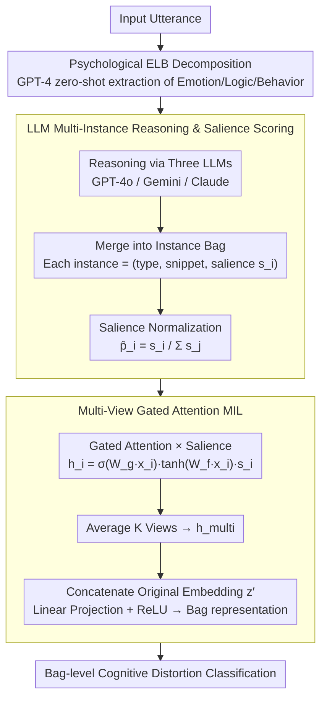

# Multi-View Attention Multiple-Instance Learning Enhanced by LLM Reasoning for Cognitive Distortion Detection

**Conference**: ACL 2026  
**arXiv**: [2509.17292](https://arxiv.org/abs/2509.17292)  
**Code**: [GitHub](https://github.com/cocoboldongle/MVACD)  
**Area**: Medical NLP  
**Keywords**: Cognitive Distortion Detection, Multiple-Instance Learning, LLM Reasoning, Psychological Decomposition, Gated Attention

## TL;DR

This paper proposes decomposing utterances into Emotion-Logic-Behavior (ELB) components and utilizing LLMs to reason about multiple cognitive distortion instances. These instances are then aggregated using a multi-view gated attention MIL framework for bag-level classification. The method outperforms direct LLM reasoning baselines on both Korean (KoACD) and English (Therapist QA) datasets.

## Background & Motivation

**Background**: Cognitive distortions (e.g., all-or-nothing thinking, overgeneralization, personalization) are closely linked to mental health disorders such as anxiety and depression. Automated detection of these distortions is a critical task in mental health NLP. Recently, LLMs have been applied to this task, such as the DoT framework which uses structured prompting to enhance interpretability.

**Limitations of Prior Work**: (1) Most methods treat utterances as single, unstructured inputs and return a holistic prediction, ignoring that different cognitive distortions may stem from different psychological dimensions (Emotion/Logic/Behavior); (2) Multiple cognitive distortions often co-occur within a single utterance, but semantic similarities between different types lead to low inter-annotator agreement; (3) The accuracy of direct LLM reasoning is insufficient—GPT-4o achieves an F1 of only 0.325 on KoACD.

**Key Challenge**: Cognitive distortion detection requires addressing two problems simultaneously: precisely locating distorted expressions within different psychological dimensions of an utterance, and aggregating multiple co-existing distortion instances to make a final judgment. Existing methods either perform holistic classification or pure LLM reasoning, both of which are inadequate.

**Goal**: (1) Structurally decompose utterances into psychologically grounded components (ELB) to provide richer context for reasoning; (2) Model each distortion instance reasoned by the LLM as an instance within an MIL framework to achieve fine-grained, expression-level classification.

**Key Insight**: Combining the Cognitive Triangle theory from Cognitive Behavioral Therapy (CBT), utterances are decomposed into Emotion-Logic-Behavior. LLMs then generate multiple distortion candidate instances (including type, text segment, and salience score), followed by a supervised bag-level classification using an MIL framework.

**Core Idea**: Cognitive distortion detection is modeled as a Multiple-Instance Learning problem—the utterance is the bag, and each distortion expression reasoned by the LLM is an instance. Multi-view gated attention is used to aggregate instance-level features for the final prediction.

## Method

### Overall Architecture

Cognitive distortion detection aims to identify whether an utterance contains distortions and of what type. The difficulty lies in the fact that one sentence often hides several distortions originating from different psychological dimensions. Instead of classifying unstructured text, this work first decomposes the utterance into Emotion-Logic-Behavior (ELB) components for LLM input. Multiple LLMs then reason out several "distortion instances" (each with a type, snippet, and salience score). These instances form a bag, which is aggregated into a bag-level judgment using a Multi-View Gated Attention MIL framework. One utterance is a bag, and each reasoned distortion expression is an instance—this is the core perspective of reformulating detection as MIL.

### Key Designs

**1. ELB Psychological Decomposition: Different distortions originate from different psychological dimensions; decomposing by dimension helps LLMs locate them.**

When treating an utterance as a single input, models struggle to identify the exact source of a distortion. For example, "I can't do anything right" is primarily a logic-level overgeneralization, while "It must be my fault" involves personalization across emotion and behavior. Borrowing from CBT's Cognitive Triangle (Beck, 1979), this work uses GPT-4 to generate Emotion, Logic, and Behavior components zero-shot for each utterance, serving as input for downstream LLM reasoning alongside the original text. This allows LLMs to anchor distortion sources more precisely. Experiments show ELB reduces the label missing rate from 10.89% to 8.93%.

**2. LLM Multi-Instance Reasoning & Salience Scoring: Individual LLMs may miss certain distortion types; ensemble LLMs + salience ensure comprehensive candidates and weight confidence.**

Three LLMs (GPT-4o, Gemini 2.0 Flash, Claude 3.7 Sonnet) independently process the ELB-enhanced utterances. Each outputs multiple instances $x_i = (\text{type}_i, \text{text}_i, s_i)$, where the salience score $s_i$ is provided by the LLM to indicate the relative importance of the instance. Instances from all LLMs are merged into a bag, and scores are normalized as $\hat{p}_i = s_i / \sum_j s_j$. The ensemble approach improves coverage of distortion types, while normalized salience scores explicitly inject LLM "confidence" into the downstream MIL classifier.

**3. Multi-View Gated Attention MIL: Single-view attention might fixate on specific instances; multi-view integration with global context compensates for omissions.**

Each instance embedding is weighted using gated attention:

$$h_i = \sigma(W_g \cdot x_i) \cdot \tanh(W_f \cdot x_i) \cdot s_i$$

The gated structure (sigmoid gate × tanh features) allows the model to selectively amplify relevant instances, with salience $s_i$ layering in LLM confidence. $K$ independent views calculate separate attention weights, which are averaged as $h_\text{multi}$ to avoid narrow focus. Finally, this is concatenated with the transformed original utterance embedding $z'$ and passed through linear projection and ReLU to obtain the bag representation. Re-integrating the original utterance compensates for global context potentially lost during instance-level reasoning.

### Loss & Training

Standard multi-class cross-entropy loss is employed. The learning rate is linearly decayed from 0.0005 to 0.00001, with early stopping if the validation loss does not improve for 10 epochs. Instances are encoded into 384-dimensional vectors using all-MiniLM-L12-v2. All experiments are averaged over 10 runs with mean ± standard deviation reported.

## Key Experimental Results

### Main Results

| Method | KoACD Val F1 | KoACD Test F1 | Therapist QA Val F1 | Therapist QA Test F1 |
|------|-------------|-------------|-------------------|-------------------|
| Baseline (w/o ELB, w/o Salience) | 0.504 | 0.473 | 0.410 | 0.340 |
| ELB only | 0.519 | 0.483 | 0.438 | 0.378 |
| Salience only | 0.518 | 0.486 | 0.428 | 0.360 |
| **ELB + Salience (Ours)** | **0.529** | **0.505** | **0.460** | **0.394** |
| GPT-4o (Direct Reasoning) | - | 0.325 | - | 0.332 |
| DoT (GPT-4) | - | 0.346 | - | - |

### Ablation Study

| Analysis Dimension | Result |
|----------|------|
| ELB Gain | Reduces label missing rate from 10.89% to 8.93%, improving coverage |
| Per-category F1 | "Should statements" highest (0.852), "Emotional Reasoning" lowest (0.297) |
| LLM Baselines | Direct reasoning F1 of all three LLMs is lower than the MIL framework |

### Key Findings

- The combination of ELB decomposition and salience scores yields the best results; both contribute independently, but ELB contributes more.
- Distortion types with high semantic ambiguity (e.g., Emotional Reasoning, Overgeneralization) consistently show lower F1 scores across datasets.
- This framework (0.505/0.394) significantly outperforms direct GPT-4o reasoning (0.325/0.332) and DoT (0.346).
- "Should statements" achieve an F1 of 0.852 on Korean data but only 0.460 on English data, indicating significant linguistic style differences.

## Highlights & Insights

- Integrating the CBT cognitive triangle into an NLP pipeline represents an elegant fusion of psychological theory and technical methodology—ELB decomposition aligns the model's reasoning process with clinical practice.
- The introduction of the MIL framework allows the model to track prediction sources at the instance level, providing attribution-based interpretability.
- Multi-LLM ensemble reasoning avoids the blind spots of individual models and improves the coverage of distortion types.

## Limitations & Future Work

- ELB components are not independently validated by psychological experts; extraction errors may propagate downstream.
- Large disparities in instance counts across distortion types (e.g., "Jumping to conclusions" at 19.5% vs. "Discounting the positive" at 2.9%) may bias attention toward high-frequency types.
- Dependence on commercial LLMs (GPT-4, Claude) limits portability and privacy protection.
- Natural language explanations are not provided—interpretability is limited to the attribution level.

## Related Work & Insights

- **vs DoT (Chen et al.)**: DoT uses structured prompts to improve LLM interpretability but remains a single-input single-output system; this work decomposes reasoning into multiple instances and aggregates them via MIL.
- **vs Traditional MIL-NLP**: Previous MIL applications in NLP defined instances at the sentence or paragraph level; this work is the first to define LLM-reasoned expressions as instances.
- **vs Zero-shot LLM Detection**: Direct LLM reasoning F1 is far lower than the supervised MIL framework, indicating a gap in pure LLM reasoning for fine-grained classification tasks.

## Rating

- Novelty: ⭐⭐⭐⭐ The combination of psychological theory + LLM + MIL is novel, though individual components utilize existing techniques.
- Experimental Thoroughness: ⭐⭐⭐⭐ Bilingual evaluation and thorough ablation analysis are provided, though the data scale is relatively small.
- Writing Quality: ⭐⭐⭐⭐ The framework is clearly described, though some details reside in the appendix.
- Value: ⭐⭐⭐⭐ Provides a more granular detection paradigm for mental health NLP.

<!-- RELATED:START -->

## Related Papers

- [\[ACL 2026\] Eliciting Medical Reasoning with Knowledge-enhanced Data Synthesis: A Semi-Supervised Reinforcement Learning Approach](eliciting_medical_reasoning_with_knowledge-enhanced_data_synthesis_a_semi-superv.md)
- [\[ACL 2026\] BioHiCL: Hierarchical Multi-Label Contrastive Learning for Biomedical Retrieval with MeSH Labels](biohicl_hierarchical_multi-label_contrastive_learning_for_biomedical_retrieval_w.md)
- [\[ACL 2026\] From Answers to Arguments: Toward Trustworthy Clinical Diagnostic Reasoning with Toulmin-Guided Curriculum Goal-Conditioned Learning](from_answers_to_arguments_toward_trustworthy_clinical_diagnostic_reasoning_with_.md)
- [\[ACL 2026\] MultiDx: A Multi-Source Knowledge Integration Framework towards Diagnostic Reasoning](multidx_a_multi-source_knowledge_integration_framework_towards_diagnostic_reason.md)
- [\[ACL 2026\] CURE-Med: Curriculum-Informed Reinforcement Learning for Multilingual Medical Reasoning](cure-med_curriculum-informed_reinforcement_learning_for_multilingual_medical_rea.md)

<!-- RELATED:END -->
