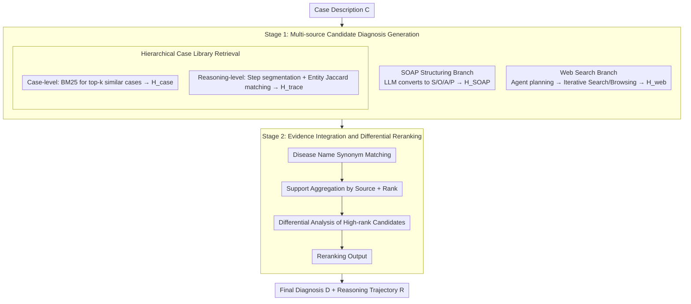

# MultiDx: A Multi-Source Knowledge Integration Framework towards Diagnostic Reasoning

**Conference**: ACL 2026 Findings  
**arXiv**: [2604.24186](https://arxiv.org/abs/2604.24186)  
**Code**: https://github.com/Applied-Machine-Learning-Lab/ACL2026-MultiDx  
**Area**: Medical NLP  
**Keywords**: Multi-source knowledge integration, differential diagnosis, medical reasoning, RAG, Agent

## TL;DR
MultiDx integrates web retrieval, SOAP structured cases, similar case libraries, and fine-grained reasoning trace retrieval into a two-stage diagnostic reasoning framework. By first generating candidate diseases from multi-path evidence and then performing disease matching, voting, and differential diagnosis reranking, it simultaneously improves diagnostic accuracy and reasoning recall on both MedCaseReasoning and DiReCT benchmarks.

## Background & Motivation
**Background**: Medical diagnostic reasoning is not merely providing a disease name but forming a verifiable clinical reasoning chain based on chief complaints, signs, tests, imaging, and disease progression. Recently, large language models (LLMs) have been applied to MedQA, PubMedQA, and case-based Q&A, with emerging multi-agent or retrieval-augmented frameworks such as MedAgents, MDAgents, ConfAgents, and OpenAI-DR.

**Limitations of Prior Work**: Relying solely on the internal knowledge of LLMs leads to deficiencies in rare diseases, latest medical knowledge, or complex multi-system cases. Conversely, relying on static knowledge bases results in limited coverage and slow updates. Furthermore, many methods focus only on the correctness of the final answer, ignoring whether the diagnostic process adheres to clinical norms, making results difficult for physicians to verify.

**Key Challenge**: Diagnostic reasoning requires two simultaneous capabilities: comprehensive and dynamic medical knowledge, and the ability to organize scattered evidence into a standard differential diagnosis process. Existing methods typically emphasize either "finding more knowledge" or "making the model think more," but lack an explicit integration layer that transforms multi-source candidate diagnoses into clinical-style differential analysis.

**Goal**: The authors aim to enable the model to first list suspicious diseases like a physician, then compare supporting evidence and counter-evidence around these candidates to output a final diagnosis with a reasoning trajectory. This goal is decomposed into three sub-problems: converting free-text cases into stable clinical structures, retrieving truly useful evidence from external knowledge for the current case, and unifying multi-path candidates into an interpretable differential diagnosis conclusion.

**Key Insight**: The paper observes that clinical diagnosis is naturally multi-perspective: the same case can yield different clues from case structures, similar cases, similar reasoning steps, and the latest medical web materials. While a single path might be biased, consensus and conflicts between multiple paths serve as important signals for differential diagnosis.

**Core Idea**: Replace single-turn Q&A diagnosis with a "multi-source candidate diagnosis generation + explicit differential diagnosis integration" approach. This allows the LLM to first collect disease lists from different perspectives and then perform synonymous disease matching, evidence aggregation, and clinical reranking within a unified candidate space.

## Method
MultiDx is a training-free two-stage framework that focuses on organizing the diagnostic reasoning workflow rather than fine-tuning a specific medical model. The input is a case description $C$, and the output is the final diagnosis $D$ and reasoning path $R$. The first stage generates candidate disease lists from four knowledge sources, and the second stage integrates these candidates and evidence into final rankings and explanations.

### Overall Architecture
The first stage (Multi-source Knowledge-guided Diagnosis Generation) involves parallel calls to four types of information sources for the same case: web search ($H_{web}$), SOAP structured cases ($H_{SOAP}$), similar case retrieval ($H_{case}$), and similar reasoning trace retrieval ($H_{trace}$). Each path outputs a list of suspected diseases with evidence descriptions. The second stage (Evidence Integration and Differential Diagnosis) takes the original case and the four-path candidates, first unifying synonymous diseases (e.g., "myocardial infarction" and "heart attack") into standard names, then statistically aggregating the support each disease receives from different sources and its ranking. Finally, it compares clinical evidence among high-confidence candidates to output the final diagnosis and reasoning trajectory.

This workflow has a clear clinical correspondence: the first stage is equivalent to a physician listing a "provisional diagnosis list," and the second stage is equivalent to performing a "differential diagnosis." Thus, MultiDx does not simply vote on answers from multiple agents but incorporates the evidence behind the candidate diseases into the reranking process.

### Key Designs

**1. Multi-source Candidate Diagnosis Generation: Addressing blind spots of single sources by expanding candidates via four complementary perspectives**

Diagnosis is highly sensitive to knowledge coverage. MultiDx initiates four parallel paths: the SOAP branch uses an LLM to convert free-text cases into Subjective/Objective/Assessment/Plan (explicitly marking missing sections as empty) to generate $H_{SOAP}$, addressing input clutter; the case library branch uses BM25 to retrieve top-k similar cases from the MedCaseReasoning training set to generate $H_{case}$, providing few-shot clinical paradigms; the reasoning trace branch splits historical reasoning chains into steps, extracts biomedical entities via SciSpacy, and finds reasoning traces most relevant to current entities via Jaccard similarity $|E_C \cap E_{i,j}| / |E_C \cup E_{i,j}|$ to generate $H_{trace}$, performing fine-grained evidence alignment; the web branch allows an agent to plan queries and search steps to generate $H_{web}$, supplementing dynamic knowledge and rare disease information.

**2. Hierarchical Case Library Retrieval: Balancing contextual loss and irrelevant history through dual-layer retrieval**

The case library is represented as $\mathcal{G}=\{(C_i,R_i,D_i)\}_{i=1}^{N}$. Retrieval is performed at two levels: the first layer uses the entire case as a unit with BM25 to find similar cases, preserving the "complete case pattern"; the second layer uses reasoning sentences as units, extracting medical entities for each step and matching them with the input case to retrieve "local evidence logic." Results from both layers enter different prompts to form case-level and reasoning-level candidates. This ensures the model is neither misled by irrelevant details in a full history nor lacks complete clinical context.

**3. Evidence Integration and Differential Diagnosis Reranking: Moving beyond simple voting to explicit differential analysis**

Simple voting based on the number of mentions fails to handle medical synonyms, evidence conflicts, or cases where a disease with fewer mentions has stronger supporting evidence. MultiDx requires the LLM to perform four steps: disease name matching → support aggregation by source and rank → differential analysis of high-ranked diseases → final reranking with brief rationales. Formally, the model generates $(R, D)$ based on $C, H_{web}, H_{SOAP}, H_{case}, H_{trace}$, where $R$ is the clinical explanation and $D$ is the final disease list. Explicitly comparing the fit of candidate diseases against symptoms and tests is closer to real clinical decision-making; experiments show differential diagnosis improves H@1/H@5/H@10 from 0.403/0.552/0.604 to 0.420/0.577/0.617 compared to simple voting.

### Loss & Training
MultiDx introduces no new trainable parameters, relying primarily on prompts, retrieval, and tool-calling workflows. DeepSeek-R1 official API is used as the main backbone. All agentic baselines use the same backbone for fair comparison. Hierarchical retrieval defaults to the top 10 similar cases and top 10 reasoning paths, using SciSpacy 0.5.5 for entity extraction. The training set is used only to construct the case database: 13,092 cases from MedCaseReasoning serve as the retrieval library. Evaluation is conducted on 300 random MedCaseReasoning test samples and 50 DiReCT samples due to computational constraints. Web search excludes sources like PubMed and Hugging Face to mitigate data leakage.

## Key Experimental Results

### Main Results
The framework was evaluated on MedCaseReasoning (using Reasoning Recall and H@k) and DiReCT. Results followed by * represent averages across three random runs with $p<0.05$ under t-test.

| Dataset | Method | Reasoning Recall | H@1 Acc. | H@5 Acc. | H@10 Acc. | Key Conclusion |
|--------|------|------------------|----------|----------|-----------|----------|
| MedCaseReasoning | DeepSeek-R1 | 0.648 | 0.360 | 0.419 | 0.442 | Strong backbone, but lacks candidate recall |
| MedCaseReasoning | MedAgents | 0.641 | 0.344 | 0.458 | 0.471 | Multi-expert discussion brings some gain |
| MedCaseReasoning | OpenAI-DR | 0.557 | 0.416 | 0.553 | 0.602 | Strong agentic baseline; high accuracy but low recall |
| MedCaseReasoning | MultiDx | **0.662** | **0.420** | **0.577** | **0.617** | Best across all metrics; H@5/H@10 advantage most significant |
| DiReCT | DeepSeek-R1 | 0.473 | 0.293 | 0.413 | 0.473 | Performance drops on clinical notes |
| DiReCT | Self-refinement | 0.662 | 0.300 | 0.466 | 0.586 | High reasoning recall; H@10 close to MultiDx |
| DiReCT | OpenAI-DR | 0.586 | 0.297 | 0.452 | 0.479 | Generally underperforms Self-refinement |
| DiReCT | MultiDx | **0.665** | **0.333** | **0.503** | **0.587** | Maintains best or tied-best performance on DiReCT |

The primary gain of MultiDx is significantly expanding the probability that the correct diagnosis enters the candidate list. On MedCaseReasoning, compared to DeepSeek-R1, H@5 increases from 0.419 to 0.577 and H@10 from 0.442 to 0.617.

### Ablation Study
Ablation experiments used DeepSeek-R1 as the base model, adding one knowledge enhancement at a time.

| Configuration | H@1 | H@5 | H@10 | Reasoning Recall | Observation |
|------|-----|-----|------|------------------|------|
| DeepSeek-R1 | 0.360 | 0.419 | 0.442 | 0.648 | Baseline without enhancements |
| w/ SOAP | 0.379 | 0.467 | 0.502 | 0.638 | Structured input improves accuracy, recall slightly drops |
| w/ web search | 0.416 | 0.553 | 0.602 | 0.460 | Strongest accuracy gain; poor reasoning recall |
| w/ related case | 0.393 | 0.489 | 0.523 | 0.634 | Better for seen diseases |
| w/ related trace| 0.386 | 0.520 | 0.576 | 0.573 | Reasoning traces improve candidate recall better than full cases |
| MultiDx | **0.420** | **0.577** | **0.617** | **0.662** | Fusion improves both accuracy and recall |

### Key Findings
- **Multi-source fusion is more stable**: Web search is the strongest single accuracy booster, but full MultiDx is required to achieve both high H@k and highest Reasoning Recall.
- **Differential diagnosis is not a decorative module**: Simple voting yields 0.403/0.552/0.604 (H@1/H@5/H@10), while differential diagnosis yields 0.420/0.577/0.617.
- **Unseen diseases still benefit**: For diseases not in the case library, MultiDx’s H@1/H@5 reached 0.338/0.448, higher than DeepSeek-R1's 0.300/0.366, proving it does not rely solely on memorizing the training set.
- **Efficiency and Cost**: MultiDx has an end-to-end latency of ~8.46 mins and ~20,000 tokens, comparable to Self-refinement and OpenAI-DR. Parallel execution can reduce wait times to ~2 mins if web search is disabled.

## Highlights & Insights
- **Decomposing diagnosis into "candidate generation" and "differentiation" is natural**: Treating disease labels as intermediate objects instead of endpoints allows the model to compare plausible diseases rather than committing prematurely.
- **SOAP's value lies in noise reduction**: Structuring information improves accuracy, suggesting that info organization is a performance bottleneck in medical reasoning.
- **Trace retrieval aligns with the diagnostic process**: Diagnosis is often triggered by specific signs; retrieving local clinical logic via reasoning steps is more precise than retrieving entire similar cases.
- **Differential diagnosis over simple voting**: Source count does not equate to evidence strength. A candidate supported by one source with high alignment may be more credible than three vaguely relevant ones.

## Limitations & Future Work
- **External knowledge quality affects results**: Noise in web search or retrieved cases can contaminate the candidate list. Medical web information requires stricter filtering for authority and timeliness.
- **Decoupled two-stage design**: Candidate omission in Stage 1 cannot be corrected in Stage 2. Future work could explore joint planning for iterative retrieval based on differentiation conflicts.
- **Sample scale**: The evaluation used relatively small subsets (300 and 50 samples). Large-scale, multi-center validation is required before real-world deployment.
- **Safety and responsibility boundaries**: The paper does not systematically analyze hallucinations, over-diagnosis risks, or human-in-the-loop review mechanisms.

## Related Work & Insights
- **vs MedAgents / MDAgents**: Unlike "multi-expert discussion," MultiDx explicitly introduces four specific knowledge sources and performs synonym matching.
- **vs OpenAI-DR**: While OpenAI-DR represents generalist deep research agents, MultiDx embeds this logic into a specialized clinical workflow using SOAP and differential analysis. This suggests that vertical domains benefit from organizing tool-calling into professionally structured pipelines.

## Rating
- Novelty: ⭐⭐⭐⭐☆
- Experimental Thoroughness: ⭐⭐⭐⭐☆
- Writing Quality: ⭐⭐⭐⭐☆
- Value: ⭐⭐⭐⭐⭐

<!-- RELATED:START -->

## Related Papers

- [\[ACL 2026\] SEMA-RAG: A Self-Evolving Multi-Agent Retrieval-Augmented Generation Framework for Medical Reasoning](sema-rag_a_self-evolving_multi-agent_retrieval-augmented_generation_framework_fo.md)
- [\[ACL 2026\] Dr. Assistant: Enhancing Clinical Diagnostic Inquiry via Structured Diagnostic Reasoning Data and Reinforcement Learning](dr_assistant_enhancing_clinical_diagnostic_inquiry_via_structured_diagnostic_rea.md)
- [\[ACL 2026\] Eliciting Medical Reasoning with Knowledge-enhanced Data Synthesis: A Semi-Supervised Reinforcement Learning Approach](eliciting_medical_reasoning_with_knowledge-enhanced_data_synthesis_a_semi-superv.md)
- [\[ICLR 2026\] KnowGuard: Knowledge-Driven Abstention for Multi-Round Clinical Reasoning](../../ICLR2026/medical_nlp/knowguard_knowledge-driven_abstention_for_multi-round_clinical_reasoning.md)
- [\[ACL 2026\] Beyond the Individual: Virtualizing Multi-Disciplinary Reasoning for Clinical Intake via Collaborative Agents](beyond_the_individual_virtualizing_multi-disciplinary_reasoning_for_clinical_int.md)

<!-- RELATED:END -->
## Related Papers

- [\[ACL 2026\] SEMA-RAG: A Self-Evolving Multi-Agent Retrieval-Augmented Generation Framework for Medical Reasoning](sema-rag_a_self-evolving_multi-agent_retrieval-augmented_generation_framework_fo.md)
- [\[ACL 2026\] Dr. Assistant: Enhancing Clinical Diagnostic Inquiry via Structured Diagnostic Reasoning Data and Reinforcement Learning](dr_assistant_enhancing_clinical_diagnostic_inquiry_via_structured_diagnostic_rea.md)
- [\[ACL 2026\] Beyond the Individual: Virtualizing Multi-Disciplinary Reasoning for Clinical Intake via Collaborative Agents](beyond_the_individual_virtualizing_multi-disciplinary_reasoning_for_clinical_int.md)
- [\[ACL 2026\] Eliciting Medical Reasoning with Knowledge-enhanced Data Synthesis: A Semi-Supervised Reinforcement Learning Approach](eliciting_medical_reasoning_with_knowledge-enhanced_data_synthesis_a_semi-superv.md)
- [\[ACL 2026\] From Answers to Arguments: Toward Trustworthy Clinical Diagnostic Reasoning with Toulmin-Guided Curriculum Goal-Conditioned Learning](from_answers_to_arguments_toward_trustworthy_clinical_diagnostic_reasoning_with_.md)

<!-- RELATED:END -->
