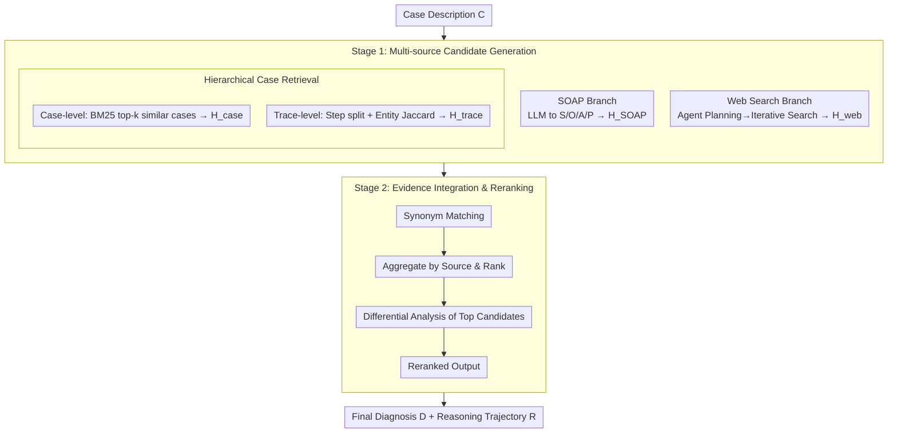

# MultiDx: A Multi-Source Knowledge Integration Framework towards Diagnostic Reasoning

**Conference**: ACL 2026 Findings  
**arXiv**: [2604.24186](https://arxiv.org/abs/2604.24186)  
**Code**: https://github.com/Applied-Machine-Learning-Lab/ACL2026-MultiDx  
**Area**: Medical NLP  
**Keywords**: Multi-source Knowledge Integration, Differential Diagnosis, Medical Reasoning, RAG, Agent  

## TL;DR
MultiDx integrates web retrieval, SOAP-structured cases, similar case libraries, and fine-grained reasoning trace retrieval into a two-stage diagnostic reasoning framework. It first generates candidate diseases from multiple evidence paths and then performs final ranking and reasoning trajectory output through disease matching, voting, and differential diagnosis reranking, improving both diagnostic hit rates and reasoning recall on MedCaseReasoning and DiReCT.

## Background & Motivation
**Background**: Medical diagnostic reasoning involves more than just providing a disease name; it requires forming a verifiable clinical reasoning chain based on chief complaints, physical signs, tests, imaging, and disease progression. Recently, Large Language Models (LLMs) have been applied to MedQA, PubMedQA, and case-based Q&A, with multi-agent or retrieval-augmented frameworks like MedAgents, MDAgents, ConfAgents, and OpenAI-DR emerging.

**Limitations of Prior Work**: Relying solely on the internal knowledge of LLMs often leads to knowledge deficiency in rare diseases, the latest clinical guidelines, or complex multi-system cases. Static knowledge bases are limited by coverage and update speed. Furthermore, many methods focus only on the final answer, ignoring whether the diagnostic process aligns with clinical practice, making results difficult for physicians to verify.

**Key Challenge**: Diagnostic reasoning requires two simultaneous capabilities: comprehensive and dynamic medical knowledge, and the ability to organize scattered evidence into a standard differential diagnosis process. Existing methods usually emphasize either "finding more knowledge" or "making the model think more," but lack an explicit integration layer to transform multi-source candidate diagnoses into clinical-style comparative analysis.

**Goal**: The authors aim to enable the model to list suspicious diseases like a physician, compare supporting and contradicting evidence for these candidates, and output a final diagnosis with a reasoning trajectory. This goal is decomposed into three sub-problems: converting free-text cases into stable clinical structures, retrieving truly useful evidence from external knowledge for the current case, and unifying multi-path candidate results into an interpretable differential diagnosis conclusion.

**Key Insight**: The paper observes that clinical diagnosis is inherently multi-perspective. The same case can provide different clues through medical record structure, similar cases, similar reasoning steps, and the latest medical web data. While a single path might be biased, consensus and conflict between multiple paths serve as important signals for differential diagnosis.

**Core Idea**: Replace single-turn Q&A-style diagnosis with "multi-source candidate diagnosis generation + explicit differential diagnosis integration." The LLM first collects disease lists from different perspectives and then performs synonymous disease matching, evidence aggregation, and clinical reranking within a unified candidate space.

## Method
MultiDx is a training-free two-stage framework focused on organizing diagnostic reasoning workflows rather than fine-tuning a specific medical model. The input is a case description $C$, and the outputs are the final diagnosis $D$ and reasoning path $R$. Stage one generates candidate disease lists from four knowledge sources; stage two integrates these candidates and evidence into a final ranking and explanation.

### Overall Architecture
In the first stage (Multi-source Knowledge-guided Diagnosis Generation), four types of information sources are invoked in parallel for the same case: web search ($H_{web}$), SOAP-structured cases ($H_{SOAP}$), similar case retrieval ($H_{case}$), and similar reasoning trace retrieval ($H_{trace}$). Each path outputs a list of suspected diseases with evidence. In the second stage (Evidence Integration and Differential Diagnosis), the LLM receives the original case and the four paths' candidates, unifies synonymous disease names (e.g., "myocardial infarction / heart attack"), calculates support statistics based on sources and rankings, and finally compares clinical evidence among high-confidence candidates to output the final diagnosis and reasoning trajectory.

This workflow has a clear clinical correspondence: Stage 1 is equivalent to a doctor listing "suspected diagnoses," and Stage 2 is equivalent to performing "differential diagnosis." MultiDx is not just a simple vote on agent answers; it incorporates the evidence behind candidate diseases into the reranking process.

### Key Designs

**1. Multi-source Candidate Generation: Complementary perspectives to overcome individual knowledge blind spots**

Diagnosis is highly sensitive to knowledge coverage. MultiDx uses four parallel paths: the SOAP branch uses an LLM to transform free-text cases into Subjective/Objective/Assessment/Plan (with missing fields explicitly marked empty) to resolve input clutter. The case library branch uses BM25 to retrieve top-k similar cases from the training set as few-shot clinical examples ($H_{case}$). The reasoning trace branch splits historical reasoning chains into steps, extracts biomedical entities via SciSpacy, and finds the most relevant traces based on Jaccard similarity $|E_C \cap E_{i,j}| / |E_C \cup E_{i,j}|$ for fine-grained alignment ($H_{trace}$). The web branch employs an agent to iteratively search and update internal memory for dynamic and rare disease information ($H_{web}$).

**2. Hierarchical Case Retrieval: Balancing full-case context and fine-grained evidence**

The case library is represented as $\mathcal{G}=\{(C_i,R_i,D_i)\}_{i=1}^{N}$. Retrieval occurs at two levels: the case level retrieves whole cases via BM25 to preserve "complete case patterns," while the reasoning level retrieves specific steps matched by medical entity similarity to extract "local evidentiary logic." This prevents the model from being misled by irrelevant details in full histories while retaining clinical context, benefiting both recall and interpretability.

**3. Evidence Integration and Differential Diagnosis Reranking: Explicit reasoning over simple voting**

Simple voting fails to account for medical synonyms, evidence conflicts, or cases where a disease appears less frequently but has stronger supporting evidence. MultiDx requires the LLM to perform four steps: disease name matching → aggregate support by source and rank → comparative analysis of top candidates → output final reranked list and justification. Formally, the model generates $(R, D)$ given $C, H_{web}, H_{SOAP}, H_{case}, H_{trace}$. Comparing the fit of candidate diseases against symptoms and tests is closer to real clinical decision-making; experiments show differential diagnosis improves H@1/H@5/H@10 from 0.403/0.552/0.604 to 0.420/0.577/0.617 compared to simple voting.

### Loss & Training
MultiDx introduces no new trainable parameters, relying on prompting, retrieval, and tool-call workflows. The experiments utilize the DeepSeek-R1 API as the backbone. The 13,092 training cases from MedCaseReasoning serve as the retrieval database. For evaluation, 300 samples from MedCaseReasoning and 50 from DiReCT are used due to computational constraints. Web search excludes sources like PubMed and Hugging Face to mitigate data leakage.

## Key Experimental Results

### Main Results
The framework is evaluated on MedCaseReasoning and DiReCT using Reasoning Recall and Hit@k (H@1/H@5/H@10). Results marked with * are averages over three runs ($p<0.05$).

| Dataset | Method | Reasoning Recall | H@1 Acc. | H@5 Acc. | H@10 Acc. | Key Conclusion |
|--------|------|------------------|----------|----------|-----------|----------|
| MedCaseReasoning | DeepSeek-R1 | 0.648 | 0.360 | 0.419 | 0.442 | Strong backbone, but lacks candidate recall |
| MedCaseReasoning | MedAgents | 0.641 | 0.344 | 0.458 | 0.471 | Multi-expert discussion provides gains |
| MedCaseReasoning | OpenAI-DR | 0.557 | 0.416 | 0.553 | 0.602 | Strong agentic baseline, high accuracy, low recall |
| MedCaseReasoning | MultiDx | **0.662** | **0.420** | **0.577** | **0.617** | Best across all metrics |
| DiReCT | DeepSeek-R1 | 0.473 | 0.293 | 0.413 | 0.473 | Performance drops on clinical notes |
| DiReCT | Self-refinement | 0.662 | 0.300 | 0.466 | 0.586 | High reasoning recall |
| DiReCT | OpenAI-DR | 0.586 | 0.297 | 0.452 | 0.479 | Underperforms Self-refinement |
| DiReCT | MultiDx | **0.665** | **0.333** | **0.503** | **0.587** | Best or tied for best on small samples |

MultiDx significantly expands the probability that the correct diagnosis is included in the candidate list. On MedCaseReasoning, H@5 improves from 0.419 (DeepSeek-R1) to 0.577.

### Ablation Study
Baseline (DeepSeek-R1) vs. individual knowledge enhancements.

| Configuration | H@1 | H@5 | H@10 | Reasoning Recall | Note |
|------|-----|-----|------|------------------|------|
| DeepSeek-R1 | 0.360 | 0.419 | 0.442 | 0.648 | No external enhancement |
| w/ SOAP | 0.379 | 0.467 | 0.502 | 0.638 | Improved accuracy, slightly lower recall |
| w/ web search | 0.416 | 0.553 | 0.602 | 0.460 | Strongest single module for accuracy |
| w/ related case | 0.393 | 0.489 | 0.523 | 0.634 | Better for seen diseases |
| w/ related trace | 0.386 | 0.520 | 0.576 | 0.573 | Fine-grained trace recall |
| MultiDx | **0.420** | **0.577** | **0.617** | **0.662** | Best accuracy and recall |

### Key Findings
- **Multi-source fusion is more stable**: Web search is the strongest single accuracy booster, but the full MultiDx is required to maximize both Hit@k and Reasoning Recall.
- **Differential diagnosis is essential**: Explicit clinical comparison beats simple voting (H@1 0.420 vs 0.403).
- **Hierarchical retrieval involves a trade-off**: Increasing $k$ for case retrieval improves H@1 but can introduce noise impacting H@5/H@10.
- **Unseen diseases benefit**: MultiDx improves H@1 on diseases not present in the case library (0.338 vs 0.300), proving generalization via web knowledge.
- **Cost**: Average end-to-end latency is 8.46 minutes with $\sim$20,000 tokens per case, comparable to other agentic baselines.

## Highlights & Insights
- **Natural workflow**: Decoupling "Candidate Generation" and "Differential Diagnosis" allows the model to compare plausible options rather than rushing to a single answer.
- **SOAP's value in noise reduction**: Organizing information structure is as important as the information itself for diagnostic accuracy.
- **Trace retrieval captures local logic**: Since diagnosis often triggers on specific signs, retrieving localized "reasoning steps" is often more effective than retrieving entire similar cases.
- **Controlled degradation**: Users could disable high-latency modules (like web search) for faster performance in certain scenarios while retaining the core logic.

## Limitations & Future Work
- **Dependence on source quality**: Noisy web results or cases can contaminate the candidate list.
- **One-way flow**: The current decoupled stages prevent Stage 2 from requesting additional specific searches from Stage 1. 
- **Sample scale**: Evaluations were restricted to small subsets of datasets due to API costs.
- **Safety**: Hallucination risks and human-in-the-loop mechanisms require further study for clinical deployment.

## Related Work & Insights
Compared to **MedAgents** or **OpenAI-DR**, MultiDx emphasizes explicit clinical structures (SOAP) and heterogeneous knowledge sources rather than just multi-agent debate. It suggests that medical RAG should distinguish between case-level, trace-level, and real-time evidence. This approach is transferable to other professional domains like legal or financial auditing where conflicting evidence must be reconciled.

## Rating
- **Novelty**: ⭐⭐⭐⭐☆ Solid combination of clinical workflows with multi-source RAG.
- **Experimental Thoroughness**: ⭐⭐⭐⭐☆ Comprehensive ablation and cross-backbone tests, though sample sizes are limited.
- **Writing Quality**: ⭐⭐⭐⭐☆ Clear methodology and dense information.
- **Value**: ⭐⭐⭐⭐⭐ High utility for practical medical LLM applications.

<!-- RELATED:START -->

## Related Papers

- [\[ACL 2026\] SEMA-RAG: A Self-Evolving Multi-Agent Retrieval-Augmented Generation Framework for Medical Reasoning](sema-rag_a_self-evolving_multi-agent_retrieval-augmented_generation_framework_fo.md)
- [\[ACL 2026\] Dr. Assistant: Enhancing Clinical Diagnostic Inquiry via Structured Diagnostic Reasoning Data and Reinforcement Learning](dr_assistant_enhancing_clinical_diagnostic_inquiry_via_structured_diagnostic_rea.md)
- [\[ACL 2026\] Beyond the Individual: Virtualizing Multi-Disciplinary Reasoning for Clinical Intake via Collaborative Agents](beyond_the_individual_virtualizing_multi-disciplinary_reasoning_for_clinical_int.md)
- [\[ACL 2026\] Eliciting Medical Reasoning with Knowledge-enhanced Data Synthesis: A Semi-Supervised Reinforcement Learning Approach](eliciting_medical_reasoning_with_knowledge-enhanced_data_synthesis_a_semi-superv.md)
- [\[ACL 2026\] From Answers to Arguments: Toward Trustworthy Clinical Diagnostic Reasoning with Toulmin-Guided Curriculum Goal-Conditioned Learning](from_answers_to_arguments_toward_trustworthy_clinical_diagnostic_reasoning_with_.md)

<!-- RELATED:END -->
