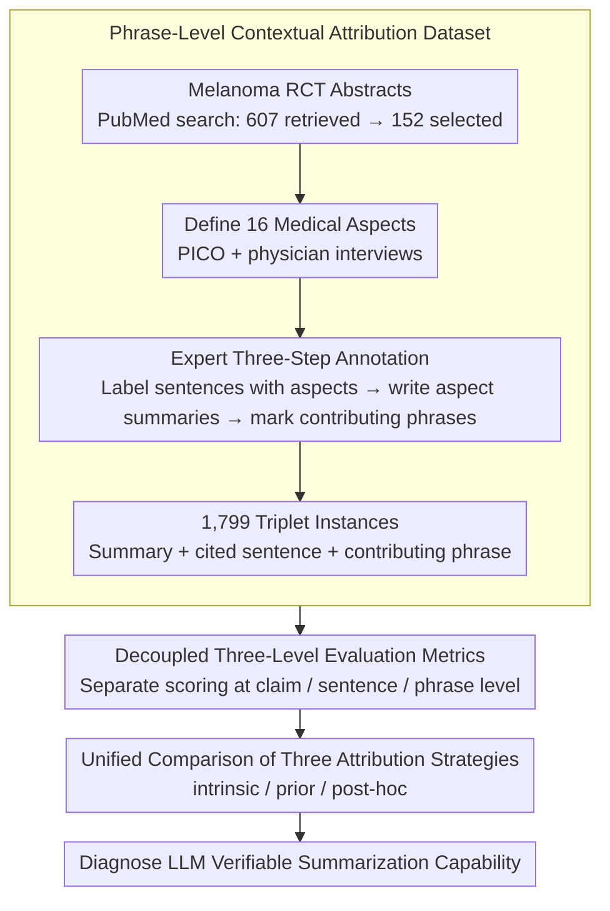

# PCoA: A New Benchmark for Medical Aspect-Based Summarization With Phrase-Level Context Attribution

**Conference**: ACL2026  
**arXiv**: [2601.03418](https://arxiv.org/abs/2601.03418)  
**Code**: https://github.com/chubohao/PCoA  
**Area**: Medical NLP / Medical Summarization / Attributable Generation  
**Keywords**: Medical Aspect-Based Summarization, Phrase-Level Attribution, RCT Summarization, Verifiable Summarization, LLM Evaluation

## TL;DR
PCoA constructs a medical aspect-based summarization benchmark for Randomized Controlled Trial (RCT) abstracts, aligning each aspect summary with both supporting sentences and contributory phrases, and utilizes a three-tier metric system (claim, citation, and phrase) to evaluate LLM capabilities in verifiable medical summarization.

## Background & Motivation
**Background**: Medical evidence synthesis usually requires reading numerous Randomized Controlled Trial (RCT) abstracts and extracting key information according to clinical aspects such as Participants, Intervention, Comparator, and Outcomes. 
Traditional summarization tasks mostly generate a generic summary, whereas medical readers are often only concerned with specific aspects, such as treatment regimens, primary endpoints, follow-up duration, or adverse events. 
Therefore, aspect-based summarization is more suitable for clinical evidence comparison and systematic review organization than generic summarization.

**Limitations of Prior Work**: LLMs have become capable of generating relatively fluent medical summaries, but in high-stakes medical scenarios, fluency does not equate to trustworthiness. 
If a sentence in a summary does not clearly point to evidence in the source text, readers must still return to the long text to re-retrieve evidence. 
Existing context attribution methods often provide only document-level, paragraph-level, or sentence-level citations, resulting in an attribution granularity that is too coarse, making it particularly difficult to determine whether specific values, drug names, dosages, and endpoints in the summary truly originate from the source.

**Key Challenge**: Medical summarization needs to satisfy the dual objectives of "information compression" and "auditable evidence" simultaneously. 
Stronger compression often leads to the loss of sources, while coarser citations make it difficult for readers to quickly locate specific facts within the summary. 
This paper argues that a truly usable medical aspect-based summary should not only answer "what was written" but also "which sentence and which phrases each piece of key information comes from."

**Goal**: The authors decompose the task into three interlinked outputs: given an RCT abstract and a medical aspect, the system needs to generate an aspect-summary, provide the supporting source sentences, and mark the phrases within those sentences that actually contribute to the summary content. 
Consequently, the evaluation target is no longer just the summary text itself, but the joint capability of summary quality, sentence-level citation quality, and phrase-level evidence alignment.

**Key Insight**: The paper selects melanoma-related RCT abstracts as the annotation source because RCTs are the core form of evidence in evidence-based medicine, with relatively stable structures and public availability. 
The authors further define 16 medical aspects based on the PICO framework and physician interviews, ensuring the benchmark covers classic PICO information as well as common but often overlooked aspects in clinical research reporting such as funding, registration, and blinding.

**Core Idea**: Use a tripartite annotation of "aspect summary + supporting sentences + contributory phrases" to replace coarse-grained evaluations that only look at the generated summary, thereby advancing the verifiability of medical summarization to the phrase level.

## Method
PCoA is essentially not a new model, but a combination of a new task, a new dataset, and a new evaluation framework. 
It defines the medical aspect-based summarization task as a generation problem with an evidence chain: the model cannot simply output a polished summary; it must also inform the reader which source sentences support the summary and which phrases in those sentences directly contributed to the summary content. 
This design is well-suited for medical NLP, as medical facts are often composed of specific entities, values, dosages, times, and endpoints, and phrase-level evidence is closer to the verification needs of clinical readers than paragraph-level citations.

### Overall Architecture
The entire work can be divided into four phases.

Phase 1 is data source screening. 
The authors retrieved melanoma-related RCT abstracts from PubMed, initially screening 607 papers and finally retaining 152. 
Screening criteria included publication within the last ten years, English language, RCT type, focus on melanoma, and publication in JCR Q1 or Q2 journals. 
The paper uses abstracts rather than full texts because abstracts are publicly available and typically already contain information on the main clinical aspects.

Phase 2 is the definition of the medical aspect system. 
The authors defined 16 aspects based on physician interviews and the PICO framework: Objective, Participants, Intervention, Comparator, Outcomes, Findings, Medicines, Treatment Duration, Primary Endpoints, Secondary Endpoints, Follow-Up Duration, Adverse Events, Randomization, Blinding, Funding, and Registration. 
Each aspect has minimum reporting requirements; for example, Intervention must include the dosing regimen, Outcomes must include endpoints and values, and Registration must include the registration number. 
This step informs annotators about "what information counts as complete" and provides consistent semantic boundaries for subsequent evaluation.

Phase 3 is expert annotation. 
Two medical students completed a three-step annotation in a custom online system. 
They first assigned one or more relevant medical aspects to each source sentence, or allowed a sentence to belong to no aspect. 
Then, annotators wrote aspect summaries based on the sentences corresponding to each aspect. 
Finally, they labeled contributory phrases from the selected sentences, requiring these phrases to enter the summary in their original or variant forms. 
The final dataset consists of 1,799 aspect-level instances, each containing a summary, cited sentences, and contributory phrases.

Phase 4 is model evaluation. 
Given a document $d=[c_1,c_2,\cdots,c_n]$ and a target aspect $a$, the system outputs a generated summary $sum'$, a set of cited sentences $\mathcal{C}'$, and a set of contributory phrases $\mathcal{P}'$. 
The evaluation framework separately measures whether the summary covers key facts, whether the cited sentences truly support the summary, and whether the phrases originate from the cited sentences and correspond to the summary content. 
The authors used Mistral-Large-2411 for claim decomposition, TRUE for entailment judgment, and NLTK for phrase tokenization.

### Key Designs

**1. Phrase-level context attribution dataset: Tying summary, supporting sentences, and contributory phrases into a verifiable evidence chain**

Errors in medical summaries often occur not at the paragraph level but at the level of specific phrases—incorrect drug dosages, reversed follow-up months, misidentified endpoint names, or mismatched registration numbers. With only document-level or paragraph-level citations, readers cannot efficiently locate these facts. PCoA therefore does not stop at asking the model to write an aspect summary; it explicitly attaches two layers of evidence to each summary: first, sentence-level aspect annotation is performed on each RCT abstract (one sentence can belong to multiple aspects or none); then, an aspect summary is written based on the corresponding sentences; finally, contributory phrases that truly enter the summary are circled from these sentences, requiring them to appear in the summary in their original or variant forms.

Each instance obtained this way is a triple of summary, cited sentences, and contributory phrases, totaling 1,799 aspect-level instances. The evidence structure is an order of magnitude finer than ordinary summarization datasets, with the verification granularity directly reaching the specific numbers and entities that clinical readers actually focus on.

**2. Decoupled three-tier evaluation metrics: Separating scores for "summary errors," "citation errors," and "phrase misalignment"**

It is entirely possible for a model to write a comprehensive summary but cite the wrong sentences, or cite the correct sentences but fail to extract key phrases. If evaluation uses a single ROUGE or overall score, these qualitatively different failures will mask each other. PCoA splits the evaluation into three layers, each scored independently. The summary layer uses claim recall and claim precision: both the reference summary and generated summary are decomposed into atomic subclaims, and NLI is used to judge mutual entailment; the sentence layer uses sentence recall/precision, requiring a cited sentence to both fall within the reference citation set and support at least one claim of the generated summary; the phrase layer uses phrase recall/precision, requiring contributory phrases to fall within the valid intersection of "reference phrases ∩ generated phrases ∩ cited sentences ∩ generated summary."

The value of the three-tier decoupling lies in its diagnostic power: a total score of 0.6 could be due to a poor summary or poor phrase alignment, and the consequences of these two failures in high-stakes medical scenarios are completely different. Decoupled metrics can directly attribute responsibility to specific steps.

**3. Unified comparison of three attribution strategies: Answering "when evidence should be bound: before, during, or after generation"**

PCoA does not just aim to create a leaderboard; it seeks to answer an engineering question in attributable generation—the timing of binding evidence with the summary. It uses the same data and metric set to compare three context attribution routes horizontally: intrinsic allows the model to output the summary, cited sentences, and phrases all at once; prior first retrieves relevant sentences and contributory phrases, then writes the summary based only on this evidence; post-hoc first writes the summary, then goes back to supplement it with cited sentences and phrases.

These three strategies represent three engineering approaches to cage hallucinations. In experiments, prior is significantly more stable at the citation and phrase levels (by constraining the generation space to verifiable evidence first), while post-hoc is the weakest (as over-inference in the first step contaminates subsequent evidence retrieval). This comparison upgrades the benchmark conclusion from "who has the high score" to "how to build attributable summarization."

### Loss & Training
Ours does not train a specialized model; the experimental focus is on zero-shot benchmarking. 
All LLMs use a shared prompt template to directly output summary, sentences, and key phrases under the intrinsic setting based on the RCT abstract and target aspect. 
The prior setting is split into two steps: first prompt the model to identify aspect-relevant sentences and extract contributory phrases, then prompt the model to write the summary based only on that evidence. 
The post-hoc setting is also split into two steps: first write the aspect summary, then verify the source sentences and phrases based on the summary. 
The temperature for LLM calls is set to 0.7. The authors evaluated LLaMA3.1-70B-Instruct, Mistral-Large-2411, DeepSeek-V3-0324, and GPT-4o via commercial APIs, with total evaluation costs of approximately $23.6.

## Key Experimental Results

### Main Results
The main experiment first compares four LLMs under the intrinsic context attribution setting. 
Metrics are divided into three groups: C-R/C-P/C-F1 measure summary claim quality, S-R/S-P/S-F1 measure cited sentence quality, and P-R/P-P/P-F1 measure contributory phrase quality.

| Model | C-F1 | S-F1 | P-F1 | Key Observations |
|------|------|------|------|----------|
| LLaMA3.1-70B | 0.605 | 0.650 | 0.538 | Higher recall but lower precision |
| DeepSeek-V3 | 0.659 | 0.672 | 0.539 | Best at summary layer, tied for best at citation layer |
| Mistral-Large | 0.651 | 0.655 | 0.574 | Best at phrase layer, stronger C-P and P-P |
| GPT-4o | 0.621 | 0.672 | 0.539 | Tied for best at citation layer, stable format following |

As seen from the table, no single model leads comprehensively across all three layers. 
DeepSeek-V3's claim recall reaches 0.757, indicating it is better at covering facts in the reference summary. 
Mistral-Large's phrase precision is 0.522 and P-F1 is 0.574, making it the best-performing model at the phrase layer. 
Generally, the recall of the four models is higher than their precision, suggesting they tend to over-write, over-cite, and over-extract, leading to redundant or partially incorrect content.

The authors also checked format compliance. 
DeepSeek-V3 and GPT-4o achieved 100% template compliance. 
LLaMA3.1 had 33 format deviations out of 1,799 outputs, requiring manual correction. 
Mistral-Large had only 1,609 outputs complying with the template, with another 99 invalid responses excluded. 
This indicates that in structured medical summarization tasks, format stability is itself part of deployability.

### Ablation Study
The paper lacks a traditional module ablation and instead uses the comparison of the three context attribution strategies as the core comparative experiment. 
This comparison essentially answers whether evidence is more reliable when filtered before summarization, generated alongside summarization, or supplemented after summarization.

| Attribution Strategy | C-F1 | S-F1 | P-F1 | Description |
|----------|------|------|------|------|
| Intrinsic | 0.630 | 0.670 | 0.540 | Simultaneous generation of summary, sentences, and phrases |
| Prior | 0.660 | 0.700 | 0.610 | Retrieve sentences/phrases first, then summarize based on evidence |
| Post-hoc | 0.620 | 0.580 | 0.480 | Generate summary first, then verify evidence |

The prior strategy shows the most obvious advantage in the citation and phrase layers, with S-F1 reaching 0.700 and P-F1 reaching 0.610. 
The intrinsic strategy's S-F1 is 0.670 and P-F1 is 0.540, showing that citing while writing is feasible but still prone to including sentences that do not support the summary. 
The post-hoc strategy performs the weakest, particularly with S-F1 at 0.580 and P-F1 at 0.480. 
The reason is intuitive: if the first step's summary already includes irrelevant or over-inferred information, the second step of seeking evidence will be misled by these extraneous claims.

### Key Findings
- **High data quality**: Manual evaluation checked summary, citation, and phrase from completeness and conciseness dimensions, with average scores across 16 aspects exceeding 4.6; annotation consistency was also strong, with a within-one rate of 97.4%, exact match rate of 92.1%, and MAE of 0.109.
- **Complex context significantly degrades performance**: As the number of subclaims, cited sentences, or contributory phrases in the reference summary increases, DeepSeek-V3's related metrics overall decrease, indicating that current LLMs remain unstable for medical summaries with multiple facts and evidence.
- **Difficulty varies greatly across different medical aspects**: Intervention and Outcomes are overall more difficult due to high information density; Blinding, Funding, and Registration are often expressed briefly and clearly, making them easier for models to extract correctly.
- **Findings is a notable difficulty**: In DeepSeek-V3's aspect breakdown results, Findings had a C-F1 of 0.382, S-F1 of 0.205, and P-F1 of 0.092, showing that synthesized conclusions are harder to attribute accurately than structured fields.
- **Evidence-first summarization is more stable**: In the case study, the prior strategy first locked sentences [2] and [4] along with dosage phrases, then generated the intervention summary, achieving 1.0 for C-F1, S-F1, and P-F1; the post-hoc strategy included irrelevant info like safety and tolerability, causing the evidence chain to become "dirty."

## Highlights & Insights
- **Pushing "verifiable summarization" to the phrase level**: Many attribution benchmarks only care if a citation is relevant, but PCoA requires key phrases in the citation to match the summary content, which is closer to how physicians verify specific facts.
- **Evaluation framework is more diagnostic than single generation metrics**: The three-tier metrics of claim, sentence, and phrase can distinguish between "summary errors," "citation errors," and "phrase misalignment," which carry different risks in medical applications.
- **Insights from prior attribution are engineer-friendly**: Filtering evidence before generating the summary constrains the LLM's free generation space to a verifiable context, making it easier to control hallucinations than supplementing citations after the fact.
- **16 aspects make the task closer to real clinical reading**: Including Funding, Registration, and Blinding alongside PICO ensures the benchmark doesn't just extract treatments and outcomes, but covers information needed to evaluate RCT credibility.
- **Explicit reporting of format compliance is practical**: A common pain point in structured output tasks is models failing to follow templates; by reporting error responses and handling them manually, the authors make experimental details more transparent for reproducibility.

## Limitations & Future Work
- **Relatively narrow data scope**: PCoA only covers melanoma-related RCT abstracts; while suitable for controlling annotation scope, whether these conclusions generalize to other diseases, observational studies, or full-text clinical papers remains to be verified.
- **Summarization from abstracts rather than full text limits evidence density**: RCT abstracts are accessible and structured, but many details exist only in the full methods and results sections; future work could extend to full-text evidence attribution.
- **Evaluation depends on automatic decomposition and NLI models**: Claim decomposition uses Mistral-Large-2411 and entailment uses TRUE; errors in these evaluators propagate to the final metrics.
- **Phrase metrics lean towards lexical matching**: Phrase recall and precision are similar to ROUGE-1, focusing on token overlap and not fully handling paraphrasing, word order changes, or semantically equivalent expressions.
- **Annotation scale is not large**: 152 papers and 1,799 instances are sufficient for fine-grained evaluation, but training robust models requires larger, multi-disease, and multi-lingual datasets.
- **Future Directions**: Prior attribution could be developed into a retrieval-augmented generation pipeline, first using a specialized evidence extraction model to lock aspect-specific evidence, then using a medical LLM for constrained summary generation, while introducing semantic-level phrase matching as a supplementary evaluation.

## Related Work & Insights
- **vs PICO extraction**: Traditional PICO extraction focuses on identifying fields like Participants, Intervention, Comparator, and Outcome; PCoA further requires generating natural language summaries and providing sentence and phrase evidence, making it closer to the final information format consumed by clinical readers.
- **vs FactPICO**: FactPICO focuses on the factuality of RCT abstracts; PCoA differs by refining fact verification down to citations and contributory phrases, ensuring evaluation doesn't just judge if a summary is factual but also if the evidence chain is traceable.
- **vs DocLens**: DocLens evaluates summary coverage and accuracy using claim-level recall and precision; PCoA adopts this idea but extends it to medical aspect-based summarization and adds sentence-level and phrase-level attribution metrics.
- **vs intrinsic self-citation**: Self-citation generation allows models to provide evidence while generating, but PCoA's experiments show this can still lead to invalid citations; the prior route of filtering evidence before generation is more suitable for high-stakes medical scenarios.
- **Inspiration**: To build a clinical summarization system, the pipeline should not just optimize final summary scores but should decompose "evidence selection, phrase extraction, summary generation, and evidence verification" into observable modules, allowing errors to be pinpointed and corrected.

## Rating
- Novelty: ⭐⭐⭐⭐☆ Proposes a medical aspect-based summarization benchmark with phrase-level context attribution, with a task definition finer than generic summarization and generic citations.
- Experimental Thoroughness: ⭐⭐⭐⭐☆ Data quality, model comparison, aspect breakdown, and attribution strategy comparisons are complete, though disease scope and model training experiments remain limited.
- Writing Quality: ⭐⭐⭐⭐☆ Clear structure, complete definitions of methods and metrics, and direct experimental conclusions; some tables converted from PDF/HTML are slightly difficult to read.
- Value: ⭐⭐⭐⭐⭐ Highly valuable for medical verifiable summarization, RAG summarization evaluation, and citation-aware generation, especially as a diagnostic benchmark for summarization systems in high-risk domains.

<!-- RELATED:START -->

## Related Papers

- [\[ACL 2025\] CSTRL: Context-Driven Sequential Transfer Learning for Abstractive Radiology Report Summarization](../../ACL2025/medical_nlp/cstrl_context-driven_sequential_transfer_learning_for_abstractive_radiology_repo.md)
- [\[ACL 2026\] RA-RRG: Multimodal Retrieval-Augmented Radiology Report Generation with Key Phrase Extraction](ra-rrg_multimodal_retrieval-augmented_radiology_report_generation_with_key_phras.md)
- [\[ICLR 2026\] MedAraBench: Large-scale Arabic Medical Question Answering Dataset and Benchmark](../../ICLR2026/medical_nlp/medarabench_large-scale_arabic_medical_question_answering_dataset_and_benchmark.md)
- [\[ACL 2026\] MHSafeEval: Role-Aware Interaction-Level Evaluation of Mental Health Safety in Large Language Models](mhsafeeval_role-aware_interaction-level_evaluation_of_mental_health_safety_in_la.md)
- [\[ACL 2026\] CT-Flow: Orchestrating CT Interpretation Workflow with Model Context Protocol Servers](ct-flow_orchestrating_ct_interpretation_workflow_with_model_context_protocol_ser.md)

<!-- RELATED:END -->
