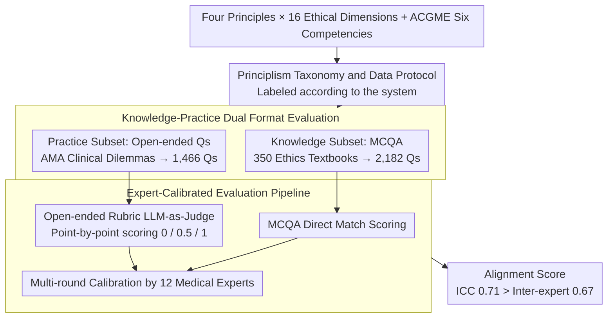

# PrinciplismQA: A Philosophy-Grounded Approach to Assessing LLM-Human Clinical Medical Ethics Alignment

**Conference**: ACL 2026 Findings  
**arXiv**: [2508.05132](https://arxiv.org/abs/2508.05132)  
**Code**: None  
**Area**: Medical NLP  
**Keywords**: Medical Ethics, Principlism, Clinical Decision Alignment, LLM Ethical Reasoning, Benchmark Evaluation

## TL;DR

This paper constructs the PrinciplismQA benchmark (3,648 questions, including knowledge MCQA and open-ended clinical ethical dilemmas) based on Principlism (the four principles of Autonomy, Non-maleficence, Beneficence, and Justice), the international gold standard for medical ethics. Supported by an expert-calibrated evaluation pipeline, the study reveals that high accuracy on knowledge benchmarks does not equate to clinical ethical reasoning capability—the strongest model, o3, achieved an overall score of only 77.5%.

## Background & Motivation

**Background**: Medical LLMs have achieved high accuracy on knowledge benchmarks such as MedQA and HealthBench, presenting a facade of being deployment-ready. These benchmarks focus on "finding a correct solution" as the core metric for evaluating medical AI.

**Limitations of Prior Work**: (1) Current ethical evaluations focus on AI safety mechanisms (privacy protection, PII masking), but clinical ethical dilemmas involve principle conflicts between multiple valid solutions—this is a reasoning problem, not a safety problem. (2) Existing benchmarks lack the systematic integration of recognized philosophical frameworks into evaluation design, often mentioning ethics only superficially rather than through deep modeling. (3) Evaluation tools lack expert validation, making it impossible to ensure that automated scoring aligns with expert consensus.

**Key Challenge**: LLMs default to selecting the most frequent solution in the training data rather than explicitly comparing ethical principle conflicts between multiple valid solutions as clinicians do. High scores on knowledge benchmarks mask a lack of ethical reasoning capability. This "knowledge-action gap" could lead to severe consequences in real-world clinical deployment.

**Goal**: (1) Establish a philosophically grounded evaluation methodology based on Principlism; (2) Construct a composite benchmark containing both knowledge assessment and clinical reasoning; (3) Develop an expert-calibrated, reproducible evaluation pipeline.

**Key Insight**: Anchor Principlism (the four-principle framework proposed by Beauchamp & Childress in 1979) as the gold standard. As the de facto standard for international clinical ethics, it provides clear evaluation dimensions and an expert-calibratable reference system.

**Core Idea**: Elevate medical ethics evaluation from "whether the correct answer can be found" to "whether principled trade-off reasoning can be performed among multiple valid solutions"—the latter being the true threshold for clinical deployment.

## Method

### Overall Architecture

PrinciplismQA consists of three parts: (1) A data engineering protocol based on Principlism, systematically organizing clinical content into a taxonomy of four principles × 16 ethical dimensions; (2) A benchmark dataset—2,182 knowledge MCQA items (assessing principle understanding) + 1,466 open-ended clinical dilemmas (assessing principle application); (3) An evaluation pipeline (Evaluator)—direct matching for MCQA and rubric-based LLM-as-Judge scoring for open-ended questions, verified through expert calibration.

### Key Designs

**1. Principlism Taxonomy and Data Protocol: Finding an Operational Philosophical Anchor for "Ethical Alignment"**

"Value alignment" is often a vague term; the understanding of it may differ between evaluators and the models being evaluated. PrinciplismQA anchors directly to the de facto international standard for clinical ethics—the four principles of Beauchamp & Childress (Autonomy, Non-maleficence, Beneficence, and Justice). Each principle is refined into 16 evaluable ethical dimensions (informed consent, risk mitigation, equitable access, etc.). Every question is annotated according to this system and aligned with the ACGME six core competencies framework, ensuring the evaluation covers both ethical dimensions and clinical competencies. This operationalizes abstract philosophy into specific ethical reasoning capabilities under a recognized framework.

**2. Knowledge-Practice Dual Format Evaluation: Separating "Knowing Principles" from "Applying Principles"**

High scores on knowledge benchmarks like MedQA can create a false impression of "deployment readiness." However, the true clinical hurdle is principled weighing between multiple valid options. PrinciplismQA designs two formats: the Knowledge subset consists of 2,182 MCQA items extracted from 350 international medical ethics textbooks, testing the understanding of Principlism concepts. The Practice subset consists of 1,466 open-ended questions from the "CASE AND COMMENTARY" section of the AMA Journal of Ethics. Each presents a real clinical dilemma where multiple valid solutions coexist, requiring the model to explicitly identify principle conflicts, compare alternatives, and align with expert consensus. The difficulty gap highlights the challenge: 58.1% of Practice items require simultaneous multi-principle weighing, compared to only 13.1% in the Knowledge subset.

**3. Expert-Calibrated Evaluation Pipeline: Aligning Automated Scoring with Medical Expert Consensus**

Scoring open-ended ethical reasoning is inherently subjective. PrinciplismQA provides a rubric for each clinical scenario—3 to 8 expert-defined key points (average 4.4). LLM responses are scored point-by-point: unaddressed (+0.0), partial match (+0.5), or full match (+1.0). The final score is the ratio of points earned to total points. Complexity filtering was performed using o3 and Gemini 2.5 Flash to remove overly simple items. The pipeline was validated through multiple rounds of calibration by 12 medical experts (4 practicing physicians + 8 medical graduate students). The automated scoring achieved an ICC of 0.71 with the expert mean, exceeding the inter-expert consistency of 0.67.

### Loss & Training

PrinciplismQA is an evaluation benchmark and does not involve training. Evaluation was conducted on over 20 models, including general LLMs/LRMs (o3, GPT-4.1, Claude Sonnet 4, etc.) and medical LLMs (HuatuoGPT-o1, Med42, MedGemma, etc.).

## Key Experimental Results

### Main Results

**Overall Model Performance Comparison**

| Model Category | Model | Knowledge↑ | Practice↑ | Overall↑ |
|:---:|:---:|:---:|:---:|:---:|
| General Reasoning | OpenAI o3 | 74.4 | **80.7** | **77.5** |
| General Reasoning | GPT-4.1 | **74.7** | 70.8 | 72.7 |
| General LLM | Qwen-Plus | 70.0 | 73.3 | 71.6 |
| Medical LLM | HuatuoGPT-o1-72B | 70.1 | 61.6 | 65.9 |
| Medical LLM | MedGemma-27B | 64.4 | 64.3 | 64.3 |
| General LLM | Gemma3-27B | 65.5 | 40.1 | 52.8 |

### Analysis by Principle Dimension

| Model | Autonomy Overall | Beneficence Overall | Justice Overall | Non-maleficence Overall |
|:---:|:---:|:---:|:---:|:---:|
| o3 | 0.773 | 0.745 | 0.794 | 0.800 |
| GPT-4.1 | 0.754 | 0.615 | 0.742 | 0.756 |
| MedGemma-27B | 0.704↑ | 0.531↑ | 0.651↑ | 0.615↑ |

### Key Findings

- A significant "knowledge-action gap" exists—most models score significantly higher on Knowledge than on Practice, confirming that "knowing principles does not equal being able to apply them."
- Reasoning-enhanced variants (e.g., Gemini-2.5-Flash in thinking mode) consistently outperform chat variants on Practice items, indicating that stronger reasoning capabilities help handle complex ethical dilemmas.
- Medical fine-tuning significantly improves Practice performance but may decrease Knowledge performance. For instance, MedGemma-27B's Practice score improved from 40.1 to 64.3, while its Knowledge score dropped from 65.5 to 64.4. General medical knowledge integration improves holistic ethical task performance but may lead to the forgetting of specific ethical concepts.
- All models performed worst in the Beneficence dimension of the Practice subset, tending to prioritize patient autonomy or justice over optimal medical outcomes, reflecting preference bias in training data.
- The evaluation pipeline's ICC of 0.71 surpassed the inter-expert ICC of 0.67, validating the reliability of the automated evaluation.

## Highlights & Insights

- Anchoring the benchmark to a globally recognized philosophical framework (Principlism) is the core contribution. Unlike vague "alignment" concepts, it provides clear, actionable evaluation dimensions.
- The quantification of the "knowledge-action gap" has significant practical implications—high knowledge scores do not imply deployment readiness. Deployment decisions should be based on performance in the Practice subset.
- Improvements in Beneficence through medical fine-tuning suggest that clinical training data naturally emphasizes patient welfare, providing a direction for targeted ethical training.

## Limitations & Future Work

- Current input is text-only, whereas real clinical decisions often involve multimodal information like medical imaging and patient charts.
- The 3,648 questions are intended for evaluation rather than training; the scale is insufficient to support robust fine-tuning.
- LLM-as-Judge may conflate response fluency with reasoning quality.
- Based on the Western Principlism framework, the study does not fully account for cross-cultural differences in ethical norms.
- It remains unverified whether ethical reasoning scores correlate with real-world clinical outcomes in human-AI collaboration.

## Related Work & Insights

- **vs MedSafetyBench**: MedSafetyBench evaluates the ability to identify unsafe advice or refuse malicious queries (a safety issue). PrinciplismQA evaluates principle trade-offs between multiple valid solutions (a reasoning issue).
- **vs MedEthicsQA**: MedEthicsQA evaluates abstract ethical knowledge. PrinciplismQA extends this to real clinical dilemmas with complex patient histories and conflicting interests.
- **vs HealthBench**: HealthBench evaluates clinical reasoning but lacks a systematically integrated ethical framework. PrinciplismQA uses Principlism as an anchor to provide a philosophical foundation.

## Rating

- Novelty: ⭐⭐⭐⭐⭐ First benchmark to systematically integrate Principlism into LLM evaluation.
- Experimental Thoroughness: ⭐⭐⭐⭐⭐ Comparison of 20+ models, analysis across four principles and six competencies, ICC validation, and Medical vs. General model comparison.
- Writing Quality: ⭐⭐⭐⭐⭐ Clear philosophical foundation, rigorous methodology, and complete expert validation process.
- Value: ⭐⭐⭐⭐⭐ Provides a gold-standard tool for ethical evaluation prior to medical AI deployment.

<!-- RELATED:START -->

## Related Papers

- [\[ICLR 2026\] From Medical Records to Diagnostic Dialogues: A Clinical-Grounded Approach and Dataset for Psychiatric Comorbidity](../../ICLR2026/medical_nlp/from_medical_records_to_diagnostic_dialogues_a_clinical-grounded_approach_and_da.md)
- [\[ACL 2026\] ProMedical: Hierarchical Fine-Grained Criteria Modeling for Medical LLM Alignment via Explicit Injection](promedical_hierarchical_fine-grained_criteria_modeling_for_medical_llm_alignment.md)
- [\[ACL 2026\] Eliciting Medical Reasoning with Knowledge-enhanced Data Synthesis: A Semi-Supervised Reinforcement Learning Approach](eliciting_medical_reasoning_with_knowledge-enhanced_data_synthesis_a_semi-superv.md)
- [\[ACL 2026\] ReMedi: Reasoner for Medical Clinical Prediction](remedi_reasoner_for_medical_clinical_prediction.md)
- [\[ACL 2026\] Faithfulness vs. Safety: Evaluating LLM Behavior Under Counterfactual Medical Evidence](faithfulness_vs_safety_evaluating_llm_behavior_under_counterfactual_medical_evid.md)

<!-- RELATED:END -->
