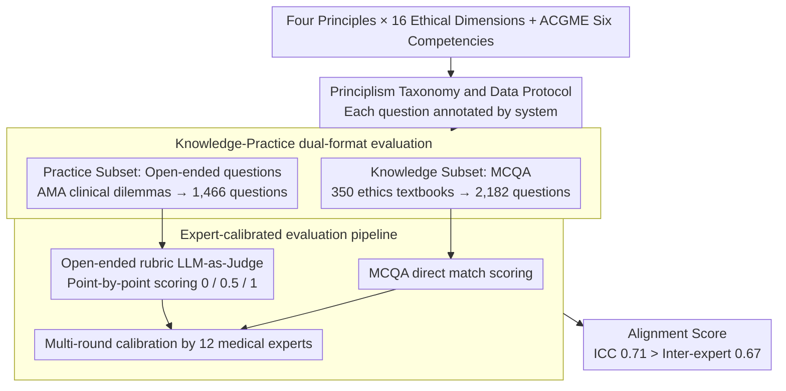

# PrinciplismQA: A Philosophy-Grounded Approach to Assessing LLM-Human Clinical Medical Ethics Alignment

**Conference**: ACL 2026 Findings  
**arXiv**: [2508.05132](https://arxiv.org/abs/2508.05132)  
**Code**: None  
**Area**: Medical NLP  
**Keywords**: Medical Ethics, Principlism, Clinical Decision Alignment, LLM Ethical Reasoning, Benchmark Evaluation

## TL;DR

This paper constructs the PrinciplismQA benchmark (3,648 questions, comprising knowledge MCQA and open-ended clinical ethical dilemmas) based on the international gold standard of medical ethics—Principlism (four principles: autonomy, non-maleficence, beneficence, and justice). With an expert-calibrated evaluation pipeline, the study finds that high accuracy on knowledge benchmarks does not equate to clinical ethical reasoning capability—the strongest model, o3, achieved an overall score of only 77.5%.

## Background & Motivation

**Background**: Medical LLMs have achieved high accuracy on knowledge benchmarks like MedQA and HealthBench, creating an appearance of deployment readiness. These benchmarks focus on "finding a single correct solution" as the core metric for medical AI.

**Limitations of Prior Work**: (1) Current ethical evaluations focus on AI safety mechanisms (privacy protection, PII masking), but clinical ethical dilemmas involve conflicts between multiple valid solutions—this is a reasoning problem rather than a safety issue; (2) existing benchmarks lack systematic integration of recognized philosophical frameworks into evaluation design, often mentioning ethics only superficially; (3) evaluation tools lack expert validation, failing to ensure that automated scoring aligns with expert consensus.

**Key Challenge**: LLMs default to selecting the most frequent solution in training data rather than explicitly comparing ethical principle conflicts between multiple valid solutions as clinicians do—high scores on knowledge benchmarks mask a lack of ethical reasoning capability. This "knowledge-action gap" could lead to severe consequences in real-world clinical deployment.

**Goal**: (1) Establish a philosophy-grounded evaluation methodology based on Principlism; (2) construct a composite benchmark including knowledge assessment and clinical reasoning; (3) develop a reproducible, expert-calibrated evaluation pipeline.

**Key Insight**: Anchor Principlism (the four-principle framework proposed by Beauchamp & Childress in 1979) as the gold standard—this is the de facto international standard for clinical ethics, providing explicit evaluation dimensions and an expert-calibrated reference frame.

**Core Idea**: Elevate medical ethics evaluation from "finding the correct answer" to "principled trade-off reasoning among multiple valid options"—the latter being the true threshold for clinical deployment.

## Method

### Overall Architecture

PrinciplismQA consists of three components: (1) A Principlism-based data engineering protocol—systematically organizing clinical content into a taxonomy of four principles × 16 ethical dimensions; (2) The benchmark dataset—2,182 knowledge MCQAs (assessing principle understanding) + 1,466 open-ended clinical dilemmas (assessing principle application); (3) Evaluation pipeline (Evaluator)—direct matching for MCQA + rubric-based LLM-as-Judge scoring for open-ended questions, verified via expert calibration.

### Key Designs

**1. Principlism Taxonomy and Data Protocol: Finding an Operational Philosophical Anchor for "Ethical Alignment"**

"Value alignment" is often a vague term where the evaluator and the model may have different understandings. PrinciplismQA anchors directly to the international de facto standard of clinical ethics—Beauchamp & Childress’s four principles (Autonomy, Non-maleficence, Beneficence, Justice), breaking each principle down into 16 evaluable ethical dimensions (informed consent, risk mitigation, equitable access, etc.). Every question is annotated according to this system; meanwhile, rubric items are aligned with the ACGME six core competencies framework, allowing evaluation to cover both ethical dimensions and clinical competencies.

The significance of this step is operationalizing abstract philosophy: the evaluation no longer measures an ill-defined "sense of alignment" but specific ethical reasoning capabilities within a recognized framework, which experts can also use for calibration.

**2. Knowledge-Practice Dual-Format Evaluation: Separating "Knowing Principles" from "Applying Principles"**

High scores on knowledge benchmarks like MedQA can give a false impression of "deployability," but the true clinical threshold is making principle-based trade-offs among multiple valid options. PrinciplismQA therefore designs two formats: The Knowledge subset consists of 2,182 MCQAs extracted from 350 international medical ethics textbooks, testing understanding of principlism concepts; the Practice subset consists of 1,466 open-ended questions from the "CASE AND COMMENTARY" section of the AMA Journal of Ethics, where each question presents a real clinical dilemma (multiple valid options coexist) requiring the model to explicitly identify principle conflicts, compare alternatives, and align with expert consensus.

The difficulty structure of the two formats is telling: 58.1% of questions in Practice require simultaneous trade-offs between multiple principles, compared to only 13.1% in Knowledge. MCQA serves as an entry-level comprehension test, while open-ended questions are the core application test, with the score gap quantifying the "knowledge-action gap."

**3. Expert-Calibrated Evaluation Pipeline: Aligning Automated Scores with Medical Expert Consensus**

Scoring open-ended ethical reasoning is inherently subjective; if the LLM-as-Judge is given free rein, it is difficult to ensure its reasoning aligns with clinical experts. PrinciplismQA provides a rubric for each clinical scenario—3 to 8 expert-defined key points (average 4.4). LLM responses are scored point-by-point as Not Addressed (+0.0), Partial Match (+0.5), or Full Match (+1.0), with the final score = points / total points. A difficulty pre-filter used o3 and Gemini 2.5 Flash to remove overly simple questions. The entire pipeline was validated through multi-round calibration by 12 medical experts (4 practicing physicians + 8 medical graduates).

The calibration results proved the reliability of the pipeline: the ICC between the automated scores and the expert mean reached 0.71, higher than the inter-expert agreement of 0.67—indicating that this automated evaluation is more consistent than the experts among themselves.

### Loss & Training

PrinciplismQA is an evaluation benchmark and does not involve training. 20+ models were evaluated, including general LLMs/LRMs (o3, GPT-4.1, Claude Sonnet 4, etc.) and medical LLMs (HuatuoGPT-o1, Med42, MedGemma, etc.).

## Key Experimental Results

### Main Results

**Overall Model Performance Comparison**

| Model Category | Model | Knowledge↑ | Practice↑ | Overall↑ |
|---------|------|-----------|----------|---------|
| General Reasoning | OpenAI o3 | 74.4 | **80.7** | **77.5** |
| General Reasoning | GPT-4.1 | **74.7** | 70.8 | 72.7 |
| General LLM | Qwen-Plus | 70.0 | 73.3 | 71.6 |
| Medical LLM | HuatuoGPT-o1-72B | 70.1 | 61.6 | 65.9 |
| Medical LLM | MedGemma-27B | 64.4 | 64.3 | 64.3 |
| General LLM | Gemma3-27B | 65.5 | 40.1 | 52.8 |

### Principle Dimension Analysis

| Model | Autonomy Overall | Beneficence Overall | Justice Overall | Non-maleficence Overall |
|------|-----------------|--------------------|-----------------|-----------------------|
| o3 | 0.773 | 0.745 | 0.794 | 0.800 |
| GPT-4.1 | 0.754 | 0.615 | 0.742 | 0.756 |
| MedGemma-27B | 0.704↑ | 0.531↑ | 0.651↑ | 0.615↑ |

### Key Findings

- A significant knowledge-action gap exists—for most models, Knowledge scores are significantly higher than Practice, verifying that "knowing principles does not equate to applying principles."
- Reasoning-enhanced variants (e.g., Gemini 2.5 Flash thinking mode) consistently outperform chat variants on Practice—indicating that stronger reasoning capabilities help handle complex ethical dilemmas.
- Medical fine-tuning significantly improves Practice but may decrease Knowledge—e.g., MedGemma-27B's Practice score increased from 40.1 to 64.3, while Knowledge decreased from 65.5 to 64.4. General medical knowledge integration improves performance on comprehensive ethical tasks but may lead to forgetting of specific ethical knowledge.
- All models performed worst on the Practice subset for the Beneficence dimension—tending to prioritize patient autonomy or justice over optimal medical outcomes, reflecting preference bias in training data.
- The evaluation pipeline ICC of 0.71 exceeded the inter-expert ICC of 0.67—verifying the reliability of automated evaluation.

## Highlights & Insights

- Anchoring the evaluation to a globally recognized philosophical framework (Principlism) is a core contribution—providing explicit, operational evaluation dimensions unlike vague "alignment" concepts.
- The quantification of the "knowledge-action gap" has significant practical implications—high knowledge scores do not equal deployment readiness; deployment decisions should be based on Practice subset performance.
- Improvements in Beneficence through medical fine-tuning suggest that clinical training data naturally emphasizes patient welfare—providing a direction for targeted ethical training.

## Limitations & Future Work

- Currently restricted to text input; real clinical decisions often involve multimodal information such as medical imaging and patient charts.
- The 3,648 questions are for evaluation rather than training—the scale is insufficient to support fine-tuning.
- LLM-as-Judge may conflate response fluency with reasoning quality.
- Based on the Western Principlism framework, it does not fully account for cross-cultural differences in ethical norms.
- The correlation between ethical reasoning scores and real-world human-AI collaborative clinical outcomes has not been verified.

## Related Work & Insights

- **vs. MedSafetyBench**: MedSafetyBench evaluates the ability to identify unsafe advice or reject malicious queries—a safety issue; PrinciplismQA evaluates principle trade-offs among multiple valid options—a reasoning issue.
- **vs. MedEthicsQA**: MedEthicsQA evaluates abstract ethical knowledge, while PrinciplismQA extends to real clinical dilemmas with complex patient histories and conflicts of interest.
- **vs. HealthBench**: HealthBench evaluates clinical reasoning but lacks a systematically integrated ethical framework; PrinciplismQA provides a philosophical foundation anchored in Principlism.

## Rating

- Novelty: ⭐⭐⭐⭐⭐ First benchmark to systematically integrate Principlism into LLM evaluation.
- Experimental Thoroughness: ⭐⭐⭐⭐⭐ 20+ models + four-principle analysis + six-competency analysis + ICC verification + medical vs. general comparison.
- Writing Quality: ⭐⭐⭐⭐⭐ Clear philosophical foundation, rigorous methodology, and complete expert validation process.
- Value: ⭐⭐⭐⭐⭐ Provides a gold-standard tool for ethical evaluation prior to medical AI deployment.

<!-- RELATED:START -->

## Related Papers

- [\[ACL 2026\] ProMedical: Hierarchical Fine-Grained Criteria Modeling for Medical LLM Alignment via Explicit Injection](promedical_hierarchical_fine-grained_criteria_modeling_for_medical_llm_alignment.md)
- [\[ACL 2026\] Eliciting Medical Reasoning with Knowledge-enhanced Data Synthesis: A Semi-Supervised Reinforcement Learning Approach](eliciting_medical_reasoning_with_knowledge-enhanced_data_synthesis_a_semi-superv.md)
- [\[ACL 2026\] ReMedi: Reasoner for Medical Clinical Prediction](remedi_reasoner_for_medical_clinical_prediction.md)
- [\[ACL 2025\] A Modular Approach for Clinical SLMs Driven by Synthetic Data with Pre-Instruction Tuning, Model Merging, and Clinical-Tasks Alignment](../../ACL2025/medical_nlp/a_modular_approach_for_clinical_slms_driven_by_synthetic_data_with_pre-instructi.md)
- [\[ACL 2026\] Faithfulness vs. Safety: Evaluating LLM Behavior Under Counterfactual Medical Evidence](faithfulness_vs_safety_evaluating_llm_behavior_under_counterfactual_medical_evid.md)

<!-- RELATED:END -->
