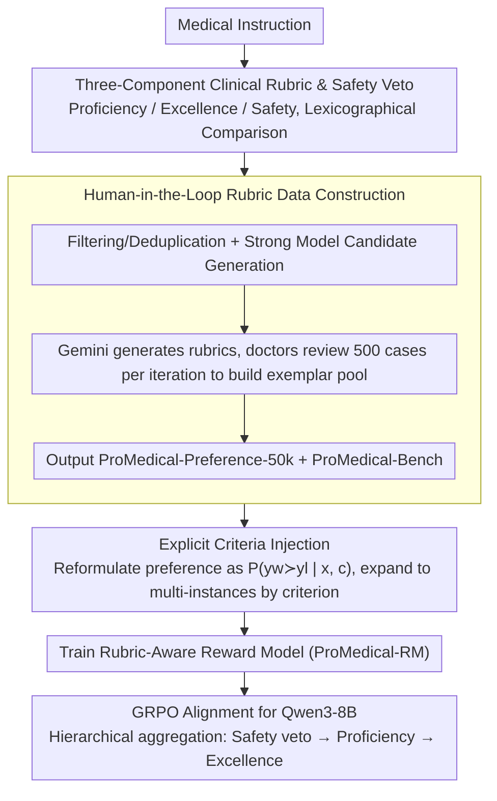

# ProMedical: Hierarchical Fine-Grained Criteria Modeling for Medical LLM Alignment via Explicit Injection

**Conference**: ACL 2026  
**arXiv**: [2604.08326](https://arxiv.org/abs/2604.08326)  
**Code**: The paper claims to release data, reward models, and benchmarks; no specific URL is provided in the cache.  
**Area**: Medical NLP  
**Keywords**: Medical LLM Alignment, Fine-Grained Rubrics, Safety Veto, Reward Model, GRPO

## TL;DR
ProMedical utilizes hierarchical, fine-grained clinical rubrics co-constructed with medical doctors to guide preference datasets, reward modeling, and benchmarks. Through explicit criteria injection, a multi-dimensional reward model is trained, achieving an improvement of 22.3% in overall accuracy and 21.7% in safety compliance for Qwen3-8B in medical alignment.

## Background & Motivation

**Background**: Medical LLMs are capable of answering questions about symptoms, diagnosis, treatment, and health management. Closed-source models have approached clinical expert levels on several medical benchmarks. However, evaluation criteria in medical scenarios are becoming more fine-grained: they must not only output factually correct answers but also avoid hallucinations, identify risks, adhere to clinical boundaries, and exhibit empathy and clear clinical reasoning.

**Limitations of Prior Work**: Mainstream alignment data still relies on coarse-grained preference pairs or holistic scores. Models only know which response is better without understanding whether the preference is driven by safety, factuality, completeness, tone, or clinical workflow. For high-risk medical errors, such binary signals can easily lead models to mistake "fluent and helpful" for "safe and professional".

**Key Challenge**: The evaluation side demands fine-grained clinical criteria, whereas the training side provides coarse-grained preference signals. This misalignment between training objectives and actual clinical evaluation makes it hard for models to internalize complex medical protocols.

**Goal**: To build a unified framework where instruction-specific clinical rubrics are integrated not just as post-hoc evaluation tools, but directly into preference construction, reward modeling, and RL alignment processes.

**Key Insight**: The quality of medical responses can be categorized into three orthogonal dimensions: Proficiency, Excellence, and Safety, with Safety designed as a strict veto constraint to prevent high utility from offsetting safety violations.

**Core Idea**: Explicitly inject fine-grained criteria of each medical instruction into the reward model, enabling it to assess preferences conditioned on specific rubrics, rather than outputting a black-box scalar conflating all aspects.

## Method

### Overall Architecture
ProMedical consists of three layers: the first is ProMedical-Rubrics, which maps each medical instruction to clinical criteria; the second is ProMedical-Preference-50k and ProMedical-Bench, used for training and evaluation respectively; the third is Explicit Criteria Injection, which trains a Rubric-Aware Reward Model and then guides Qwen3-8B during GRPO alignment. Its core contribution is not proposing a new medical QA model, but reshaping the supervisory signal of medical alignment.

### Key Designs

**1. Three-component clinical rubric and safety veto: Decomposing "which answer is better" into three interpretable and constraint-enforced dimensions**

The fundamental problem of coarse-grained preferences is that the model only knows a response is overall better without knowing whether it is due to safety, factuality, completeness, or tone, easily misinterpreting "fluent and helpful" as "safe and professional". ProMedical divides medical response quality into three orthogonal components: Proficiency $S_1$ measures fundamental clinical accuracy and completeness; Excellence $S_2$ rewards attributes that exceed the baseline, such as empathy and logical clarity; Safety $S_3$ detects severe hallucinations, harmful advice, or out-of-boundary actions. Crucially, the final preference is not a simple sum of the three, but a lexicographical comparison—checking safety violations first, followed by proficiency, and finally excellence. Thus, a "very helpful but severely unsafe" response can never win against a safer alternative, establishing safety as a hard veto constraint rather than a soft penalty that can be offset by other dimensions.

**2. Human-in-the-Loop rubric data construction: Finding a balance between scalable generation and professional medical verification**

Constructing rubrics fully manually is too costly, whereas fully automated generation is prone to medical hallucinations. To strike a balance, ProMedical-Preference-50k first undergoes data source filtering, semantic deduplication, difficulty filtering, and expert-guided classification, followed by candidate response generation using multiple strong LLMs. The rubrics themselves are generated by Gemini-3-Pro-thinking, combined with static expert system instructions and dynamic few-shot exemplars, while doctors review 500 cases per round and feed corrected gold standards back into the exemplar pool. This iterative HITL loop ensures gradual convergence of generation quality—the exemplar pool increasingly aligns with clinical consensus, and newly generated rubrics become highly reliable, achieving a strict expert evaluation pass rate of 96.40%.

**3. Explicit Criteria Injection for the reward model: Enabling the reward model to compare two responses *under a specific criterion***

The flaw of scalar rewards is that safety, professionalism, and expression quality are collapsed into a single number, resulting in a black-box supervisory signal. ProMedical reformulates the traditional preference probability $P(y_w \succ y_l \mid x)$ into a criterion-conditioned form $P(y_w \succ y_l \mid x, c)$, where $c$ represents a specific rubric criterion. A preference pair is expanded into multiple criterion-conditioned training instances, each independently labeled with "which response is better under this dimension." Consequently, supervisory signals are explicitly disentangled—safety is treated as safety, proficiency as proficiency, and excellence as excellence—and are later aggregated hierarchically (safety veto $\rightarrow$ proficiency $\rightarrow$ excellence). This preserves fine-grained judgment while enforcing lexicographical constraints in training.

### Loss & Training
The reward model is trained using a Bradley-Terry pairwise loss. The input contains the instruction, candidate responses, and a specific criterion, optimizing the criterion-conditioned reward margin. During the policy alignment phase, ProMedical-RM acts as a proxy oracle, computing hierarchical rewards for sampled outputs during GRPO of Qwen3-8B. The penalty coefficient for safety violations is set sufficiently high to override any positive utility, ensuring that safety issues cannot be offset by high scores in other dimensions.

## Key Experimental Results

### Main Results
ProMedical-Bench contains 795 held-out samples, expanded into 5,505 criterion-level pairs: 3,625 for Proficiency, 1,650 for Excellence, and 230 for Safety. The weighted Cohen's Kappa for double-blind physician adjudication is 0.88.

| Model | Pointwise Proficiency | Pointwise Safety | Pairwise Safety | Overall Accuracy |
|---|---|---|---|---|
| GPT-5 | 91.50 | 76.45 | 77.39 | 76.42 |
| Gemini-3-Pro | 89.80 | 64.10 | 65.65 | 64.80 |
| DeepSeek-R1 | 89.50 | 78.80 | 80.00 | 78.55 |
| Qwen3-8B | 50.15 | 62.79 | 65.64 | 64.30 |
| PairRM-LLaMA3-8B | 76.50 | 58.80 | 60.43 | 58.95 |
| medical_o1_verifier_3B | 75.20 | 51.90 | 53.04 | 51.10 |
| ProMedical-RM-8B (Llama) | 90.15 | 87.20 | 86.10 | 85.40 |
| ProMedical-RM-8B (Qwen3) | 90.85 | 88.50 | 87.39 | 86.55 |

### Ablation Study

| Model | Safety Precision | Safety Recall | Safety F1 | Description |
|---|---|---|---|---|
| GPT-5 | 79.24 | 73.85 | 76.45 | Strong closed-source models still miss some safety vetoes |
| DeepSeek-R1 | 81.50 | 76.28 | 78.80 | Strong open-source reasoning model, but lower than ProMedical-RM |
| PairRM-LLaMA3-8B | 62.45 | 59.80 | 61.10 | Easily confuses safety with text fluency |
| medical_o1_verifier_3B | 55.30 | 50.80 | 52.95 | Recall is clearly insufficient |
| ProMedical-RM (Llama) | 89.40 | 85.10 | 87.20 | Fine-grained supervision bringing stable improvements |
| ProMedical-RM (Qwen3) | 91.50 | 86.80 | 89.09 | Best Safety Veto detection |

### External Generalization & Policy Alignment

| Method | Q | Q+Criteria | Q+Sub | Conclusion |
|---|---|---|---|---|
| Ultra-Medical | 80.53 | - | - | Standard preference optimization baseline |
| RaR | 79.03 | 80.10 | 81.32 | Rubric-related baseline |
| InfiMed-ORBIT | 80.85 | 81.07 | 81.63 | Fine-grained preference baseline |
| ProMedical | 81.94 | 82.32 | 83.60 | Mutually higher across three granularities |
| ProMedical-RAG | 81.60 | 83.20 | 84.28 | Q+Sub is optimal after external medical knowledge enhancement |

### Key Findings
- ProMedical-RM-8B (Qwen3) achieves an Overall Accuracy of 86.55%, surpassing GPT-5's 76.42% and DeepSeek-R1's 78.55%, suggesting that specialized, rubric-aware reward models can outperform strong general-purpose models on fine-grained clinical criteria.
- The Llama backbone version also reaches 85.40%, only 1.2% lower than the Qwen3 version, proving that the gains mainly stem from explicit criteria injection rather than the performance of a specific backbone itself.
- Meditron-70B only achieves an Overall Accuracy of 53.40%, showing that parameter scale and medical pre-training do not automatically guarantee compliance with safety constraints.
- Safety Veto F1 improves from 76.45% (GPT-5) to 89.09% (ProMedical-RM (Qwen3)), with enhancements concentrated on identifying high-risk medical boundaries.

## Highlights & Insights
- The most critical contribution of this paper is shifting clinical rubrics from post-hoc evaluation to the training phase. Medical alignment is not just about "more preference data" but giving preference labels explicit clinical justifications.
- Treating Safety as a veto rather than a soft penalty is crucial. Many general-purpose alignment methods allow dimensions to offset each other, but in medical scenarios, a single severe hallucination is enough to invalidate the entire response.
- ProMedical-Bench's double-blind doctor adjudication and 0.88 Kappa score enhance the benchmark's credibility and make the reward model's improvements more convincing.
- The idea of a criteria-conditioned reward model can be transferred to other high-risk domains such as law, finance, and education: decomposing standards into explicit criteria first, and then training the model to evaluate accordingly.

## Limitations & Future Work
- The framework relies on expert consensus. For medical issues with high controversy, inconsistent guidelines, or significant regional differences, defining the rubrics themselves can be difficult.
- Currently, only textual modalities are supported, which cannot cover modalities commonly found in real clinical workflows like images, lab test indexes, vital signs, and structured electronic health records.
- The HITL pipeline remains costly. Although more scalable than fully manual annotation, it may still require recalibration for each new specialty or regional standard.
- The paper uses a reward model to guide generation, but the final outputs may still produce medical hallucinations; actual deployment must involve human doctor oversight.
- The benchmark and data construction process rely on strong models to generate initial candidates and rubrics, necessitating constant monitoring of generative model bias on data distribution.

## Related Work & Insights
- **vs UltraMedical**: UltraMedical provides large-scale medical preference data. ProMedical goes further by injecting fine-grained rubrics into each instruction, differentiating between safety, proficiency, and excellence.
- **vs HealthBench**: HealthBench emphasizes doctor-written evaluation rubrics, whereas this work applies similar concepts to reward model training and GRPO alignment.
- **vs General Reward Models**: Models like PairRM can capture general preferences but fail to reliably handle medical safety vetoes; the strength of ProMedical-RM comes from criterion-conditioned supervision.

## Rating
- Novelty: ⭐⭐⭐⭐ Explicitly injecting instruction-specific rubrics into the reward model is a solid alignment design for high-risk domains.
- Experimental Thoroughness: ⭐⭐⭐⭐⭐ Comprehensive coverage across datasets, benchmarks, reward models, safety metrics, and external generalization.
- Writing Quality: ⭐⭐⭐⭐ Clear methodological flow with information-dense tables, though some formulas are slightly complex in layout.
- Value: ⭐⭐⭐⭐⭐ Directly valuable to medical LLM alignment and interpretable reward modeling.

<!-- RELATED:START -->

## Related Papers

- [\[ACL 2026\] Region-Grounded Report Generation for 3D Medical Imaging: A Fine-Grained Dataset and Graph-Enhanced Framework](region-grounded_report_generation_for_3d_medical_imaging_a_fine-grained_dataset_.md)
- [\[ACL 2026\] CT-FineBench: A Diagnostic Fidelity Benchmark for Fine-Grained Evaluation of CT Report Generation](ct-finebench_a_diagnostic_fidelity_benchmark_for_fine-grained_evaluation_of_ct_r.md)
- [\[ACL 2026\] PrinciplismQA: A Philosophy-Grounded Approach to Assessing LLM-Human Clinical Medical Ethics Alignment](principlismqa_a_philosophy-grounded_approach_to_assessing_llm-human_clinical_med.md)
- [\[ACL 2026\] Beyond Prompt: Fine-grained Simulation of Cognitively Impaired Standardized Patients via Stochastic Steering](beyond_prompt_fine-grained_simulation_of_cognitively_impaired_standardized_patie.md)
- [\[AAAI 2026\] GEM: Generative Entropy-Guided Preference Modeling for Few-shot Alignment of LLMs](../../AAAI2026/medical_nlp/gem_generative_entropy-guided_preference_modeling_for_few-shot_alignment_of_llms.md)

<!-- RELATED:END -->
