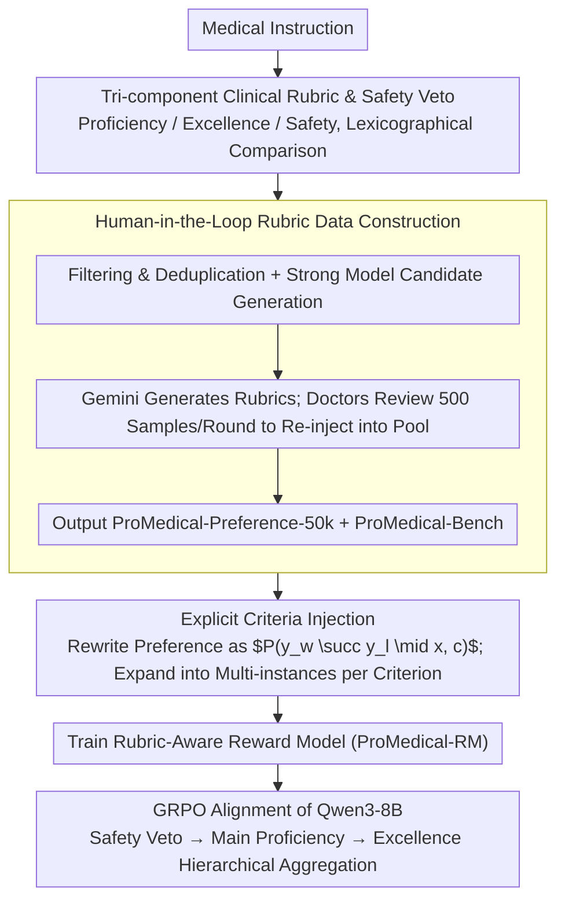

# ProMedical: Hierarchical Fine-Grained Criteria Modeling for Medical LLM Alignment via Explicit Injection

**Conference**: ACL 2026  
**arXiv**: [2604.08326](https://arxiv.org/abs/2604.08326)  
**Code**: The paper claims to release data, reward models, and benchmarks; no specific URL provided in cache.  
**Area**: Medical NLP  
**Keywords**: Medical LLM alignment, fine-grained rubric, safety veto, reward model, GRPO  

## TL;DR
ProMedical utilizes hierarchical fine-grained clinical rubrics constructed with physician involvement across preference data, reward models, and benchmarks. Through explicit criteria injection for training multi-dimensional reward models, Qwen3-8B achieves a 22.3% gain in overall accuracy and a 21.7% gain in safety compliance during medical alignment.

## Background & Motivation

**Background**: Medical LLMs are now capable of answering questions regarding symptoms, diagnosis, treatment, and health management. Closed-source models have approached clinical expert levels on several medical benchmarks. However, evaluation standards in medical scenarios are becoming more granular: models must not only be factually correct but also avoid hallucinations, identify risks, follow clinical boundaries, and exhibit empathy and clear reasoning.

**Limitations of Prior Work**: Post-mainstream alignment data still relies on coarse-grained preference pairs or overall scores. Models only learn which answer is "better" without knowing if the superiority stems from safety, factuality, completeness, tone, or clinical procedures. For high-risk medical errors, such binary signals can easily lead models to mistake "fluent and helpful" for "safe and professional."

**Key Challenge**: There is a mismatch between the fine-grained clinical standards required at the evaluation end and the coarse-grained preference signals provided at the training end. Inconsistency between training objectives and actual clinical evaluation makes it difficult for models to internalize complex medical protocols.

**Goal**: To build a unified framework where instruction-specific clinical rubrics are not merely post-hoc evaluation tools but are integrated into preference construction, reward modeling, and the RL alignment process.

**Key Insight**: The authors categorize medical response quality into three orthogonal dimensions—Proficiency, Excellence, and Safety—and design Safety as a strict veto constraint to prevent models from offsetting safety violations with high-utility responses.

**Core Idea**: Explicitly inject fine-grained criteria for each medical instruction into the reward model, enabling the reward model to judge preferences "under specific rubric conditions" rather than outputting a black-box scalar that aggregates all factors.

## Method

### Overall Architecture
ProMedical consists of three layers: the first is ProMedical-Rubrics, which maps each medical instruction to clinical criteria; the second is ProMedical-Preference-50k and ProMedical-Bench, used for training and evaluation respectively; the third is Explicit Criteria Injection, which trains a Rubric-Aware Reward Model used to guide Qwen3-8B via GRPO alignment. The core contribution is not a new medical QA model, but the reshaping of supervision signals for medical alignment.

### Key Designs

**1. Tri-component clinical rubric with safety veto: Decomposing "which answer is better" into three interpretable and constrained dimensions**

The fundamental problem with coarse-grained preferences is that models only know a response is overall superior without understanding if it is due to safety, facts, completeness, or tone. ProMedical decomposes medical response quality into three orthogonal components: Proficiency $S_1$ measures basic clinical accuracy and completeness; Excellence $S_2$ rewards attributes like empathy and logical clarity that exceed the passing line; Safety $S_3$ detects serious hallucinations, harmful advice, or out-of-bounds behavior. Crucially, final preferences are compared lexicographically: safety violations are checked first, followed by proficiency, and finally excellence. Thus, a "highly helpful but unsafe" response can never win against a safer one, establishing safety as a hard constraint.

**2. Human-in-the-Loop rubric data construction: Balancing scalable generation with professional physician validation**

Manual rubric creation is too costly, while fully automated generation is prone to medical hallucinations. ProMedical-Preference-50k undergoes data source filtering, semantic deduplication, difficulty screening, and expert-guided classification, followed by candidate generation from multiple strong models. Rubrics are generated by Gemini-3-Pro-thinking using static expert system instructions and dynamic few-shot examples, while physicians review 500 samples per round and re-inject modified gold standards into the example pool. This iterative HITL loop ensures generation quality converges, reaching a 96.40% strict expert evaluation pass rate.

**3. Reward model with Explicit Criteria Injection: Enabling the reward model to compare responses "under specific criteria"**

Scalar rewards often aggregate safety, professionalism, and expression quality into a single number, creating a black-box supervision signal. ProMedical rewrites the traditional reward model learning $P(y_w \succ y_l \mid x)$ into a criterion-conditioned form $P(y_w \succ y_l \mid x, c)$, where $c$ is a specific rubric criterion. A pair of responses is expanded into multiple criterion-conditioned training instances, each labeled independently. This explicitly separates supervision signals—safety, proficiency, and excellence—which are later aggregated hierarchically (Safety Veto → Proficiency → Excellence) during training.

### Loss & Training
The reward model employs a Bradley-Terry style pairwise loss, where the input includes the instruction, candidate responses, and a specific criterion to optimize the criterion-conditioned reward margin. During the policy alignment stage, ProMedical-RM serves as a proxy oracle to calculate hierarchical rewards for GRPO sampled outputs from Qwen3-8B. The penalty coefficient for safety violations is set high enough to outweigh any positive utility, ensuring safety issues are not offset by high scores in other dimensions.

## Key Experimental Results

### Main Results
ProMedical-Bench contains 795 held-out samples expanded into 5,505 criterion-level pairs: 3,625 for Proficiency, 1,650 for Excellence, and 230 for Safety. Double-blind physician adjudication yielded a weighted Cohen's Kappa of 0.88.

| Model | Pointwise Proficiency | Pointwise Safety | Pairwise Safety | Overall Accuracy |
|------|-----------------------|------------------|-----------------|------------------|
| GPT-5 | 91.50 | 76.45 | 77.39 | 76.42 |
| Gemini-3-Pro | 89.80 | 64.10 | 65.65 | 64.80 |
| DeepSeek-R1 | 89.50 | 78.80 | 80.00 | 78.55 |
| Qwen3-8B | 50.15 | 62.79 | 65.64 | 64.30 |
| PairRM-LLaMA3-8B | 76.50 | 58.80 | 60.43 | 58.95 |
| medical_o1_verifier_3B | 75.20 | 51.90 | 53.04 | 51.10 |
| ProMedical-RM-8B (Ours) | 90.15 | 87.20 | 86.10 | 85.40 |
| ProMedical-RM-8B (Ours-Qwen3) | 90.85 | 88.50 | 87.39 | 86.55 |

### Ablation Study

| Model | Safety Precision | Safety Recall | Safety F1 | Description |
|------|------------------|---------------|-----------|------|
| GPT-5 | 79.24 | 73.85 | 76.45 | Strong closed-source model still misses safety vetoes |
| DeepSeek-R1 | 81.50 | 76.28 | 78.80 | Strong open-source reasoning, but lower than Ours |
| PairRM-LLaMA3-8B | 62.45 | 59.80 | 61.10 | Easily confuses safety with textual fluency |
| medical_o1_verifier_3B | 55.30 | 50.80 | 52.95 | Significant lack of recall |
| ProMedical-RM (Ours-Llama) | 89.40 | 85.10 | 87.20 | Stable gains from fine-grained supervision |
| ProMedical-RM (Ours-Qwen3) | 91.50 | 86.80 | 89.09 | Best Safety Veto detection |

### Key Findings
- ProMedical-RM-8B (Qwen3) achieved an Overall Accuracy of 86.55%, surpassing GPT-5 (76.42%) and DeepSeek-R1 (78.55%), indicating that specialized rubric-aware reward models can outperform general strong models on fine-grained clinical standards.
- The Llama backbone version reached 85.40%, only 1.2 points lower than the Qwen3 version, proving that gains primarily stem from explicit criteria injection rather than the backbone's intrinsic capability.
- Meditron-70B's overall accuracy was only 53.40%, suggesting that parameter scale and medical pre-training do not automatically lead to safety constraint compliance.
- Safety Veto F1 improved from 76.45 (GPT-5) to 89.09 (ProMedical-RM), with improvements concentrated in identifying high-risk medical boundaries.

## Highlights & Insights
- The most critical contribution is moving clinical rubrics from the evaluation end to the training end. Medical alignment requires more than just "more preference data"; preference labels must have explicit clinical justifications.
- Treating safety as a veto rather than a soft penalty is vital. While many general alignment methods allow dimensions to offset each other, a single serious hallucination in a medical context is sufficient to invalidate an entire response.
- ProMedical-Bench's double-blind physician adjudication and 0.88 Kappa enhance the benchmark's credibility and make the reward model's improvements more convincing.
- The ideas behind criteria-conditioned reward models are transferable to other high-risk domains like law, finance, and education: first decompose standards into explicit criteria, then train models to evaluate based on those standards.

## Limitations & Future Work
- The framework depends on expert consensus. In medical issues where controversies, inconsistent guidelines, or significant regional differences exist, rubrics may be difficult to define.
- Currently, only text modality is handled, failing to cover images, lab results, vital signs, and structured medical records common in real clinical workflows.
- The HITL pipeline remains costly; while more scalable than purely manual efforts, new specialties or regional standards may require re-calibration.
- Although the reward model guides generation, final outputs may still produce hallucinations; real-world deployment necessitates human physician supervision.
- Benchmark and data construction rely on strong models for candidates and initial rubrics, requiring continuous monitoring of model bias on data distribution.

## Related Work & Insights
- **vs UltraMedical**: UltraMedical provides large-scale medical preference data; ProMedical further injects fine-grained rubrics for each instruction and distinguishes between safety, proficiency, and excellence.
- **vs HealthBench**: While HealthBench emphasizes doctor-written evaluation rubrics, Ours applies similar ideas to training reward models and GRPO alignment.
- **vs General Reward Models**: Models like PairRM can learn general preferences but fail to reliably handle medical safety vetoes; ProMedical-RM's advantage stems from criterion-conditioned supervision.

## Rating
- Novelty: ⭐⭐⭐⭐ Explicitly injecting instruction-specific rubrics into reward models is a robust design for high-risk alignment.
- Experimental Thoroughness: ⭐⭐⭐⭐⭐ Comprehensive coverage of datasets, benchmarks, reward models, safety metrics, and external generalization.
- Writing Quality: ⭐⭐⭐⭐ Clear methodological flow and dense tabular information; some formula layouts are slightly complex.
- Value: ⭐⭐⭐⭐⭐ Direct reference value for medical LLM alignment and interpretable reward modeling.

<!-- RELATED:START -->

## Related Papers

- [\[ACL 2026\] Region-Grounded Report Generation for 3D Medical Imaging: A Fine-Grained Dataset and Graph-Enhanced Framework](region-grounded_report_generation_for_3d_medical_imaging_a_fine-grained_dataset_.md)
- [\[ACL 2026\] CT-FineBench: A Diagnostic Fidelity Benchmark for Fine-Grained Evaluation of CT Report Generation](ct-finebench_a_diagnostic_fidelity_benchmark_for_fine-grained_evaluation_of_ct_r.md)
- [\[ACL 2026\] PrinciplismQA: A Philosophy-Grounded Approach to Assessing LLM-Human Clinical Medical Ethics Alignment](principlismqa_a_philosophy-grounded_approach_to_assessing_llm-human_clinical_med.md)
- [\[ACL 2026\] Beyond Prompt: Fine-grained Simulation of Cognitively Impaired Standardized Patients via Stochastic Steering](beyond_prompt_fine-grained_simulation_of_cognitively_impaired_standardized_patie.md)
- [\[AAAI 2026\] GEM: Generative Entropy-Guided Preference Modeling for Few-shot Alignment of LLMs](../../AAAI2026/medical_nlp/gem_generative_entropy-guided_preference_modeling_for_few-shot_alignment_of_llms.md)

<!-- RELATED:END -->
