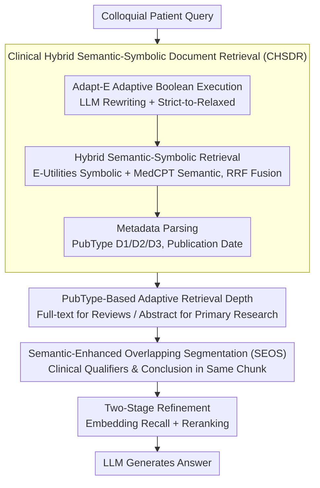

# Query Pipeline Optimization for Cancer Patient Question Answering Systems

**Conference**: ACL 2026 Findings  
**arXiv**: [2412.14751](https://arxiv.org/abs/2412.14751)  
**Code**: None  
**Area**: Medical NLP  
**Keywords**: Cancer QA, RAG Query Pipeline, Hybrid Retrieval, Semantic Segmentation, Metadata-Aware

## TL;DR

This paper proposes CoMeta, a three-layer controllable metadata-aware RAG framework for Cancer Patient Question Answering (CPQA). By utilizing Clinical Hybrid Semantic-Symbolic Document Retrieval (CHSDR), it fuses E-Utilities real-time Boolean search with MedCPT semantic retrieval. Combined with Semantic-Enhanced Overlapping Segmentation (SEOS) to prevent context fragmentation, the framework improves the accuracy of Claude-3-Haiku by 5.24% (vs. CoT) and approximately 3% (vs. naive RAG) on the CMMQA dataset.

## Background & Motivation

**Background**: LLMs demonstrate potential in medical question answering, but hallucination issues jeopardize patient safety. RAG mitigates hallucinations by anchoring outputs in external evidence. Existing medical RAG systems primarily adopt the dense retrieval paradigm, using domain-specific embedding models (e.g., MedCPT) for vector similarity search on offline indices. Advanced strategies like hybrid search, adaptive retrieval, and recursive search are essentially optimizations based on static indices.

**Limitations of Prior Work**: (1) Recency-Semantic Dilemma: Standard query pipelines (Dense or BM25) operate on static, metadata-blind indices, risking the retrieval of outdated evidence; conversely, real-time metadata-aware interfaces like E-Utilities are semantically fragile to informal patient queries. (2) Retrieval Depth Paradox: Review articles require full-text retrieval to capture high-level therapeutic synthesis, while primary research often only requires abstract retrieval to avoid methodological noise—most pipelines apply a uniform retrieval depth for all article types. (3) Context Fragmentation: Prior encoder-agnostic segmentation (fixed-length or lexical-level) severs the association between clinical qualifiers (e.g., specific mutation criteria) and treatment claims, producing recommendations that appear evidence-supported but lack critical constraints.

**Key Challenge**: Existing systems are forced to compromise between semantic robustness (static indexing) and retrieval controllability (real-time interfaces), failing to simultaneously meet the triple requirements of recency, metadata awareness, and semantic integrity for cancer QA.

**Goal**: Design a RAG framework specialized for CPQA that implements controllability across three dimensions: (1) robustness against the recency-semantic dilemma; (2) metadata-aware adaptive retrieval depth based on publication types; and (3) protection of clinical logic relational integrity using encoder-aware segmentation.

**Key Insight**: Rather than further optimizing static index pipelines, this work integrates E-Utilities as a real-time, metadata-aware sparse backend into the RAG system—a design that is orthogonal and complementary to previous RAG optimizations.

**Core Idea**: Construct an end-to-end controllable cancer QA pipeline by fusing E-Utilities real-time Boolean search with semantic retrieval to achieve "symbolic-semantic complementarity," combined with publication-type adaptive depth and encoder-aware semantic segmentation.

## Method

### Overall Architecture

CoMeta adopts a layered query pipeline design, divided into document-level and passage-level stages. At the document level, CHSDR performs hybrid retrieval and parses metadata, diverting reviews and primary research into different retrieval depths. At the passage level, SEOS performs semantic-aware segmentation, followed by a two-stage refinement (embedding recall + reranking) before being fed to the LLM. Controllability is implemented at every step of the retrieval lifecycle.

### Key Designs

**1. Clinical Hybrid Semantic-Symbolic Document Retrieval (CHSDR): Supplementing static index recency with real-time Boolean search controllability, and Boolean search fragility with semantic retrieval.**

The recency-semantic dilemma represents a trade-off: standard Dense/BM25 pipelines rely on static, metadata-blind indices, risking the retrieval of obsolete evidence; meanwhile, real-time metadata interfaces like E-Utilities are fragile to informal patient colloquialisms. CHSDR integrates both. It first performs **Adaptive Boolean Execution (Adapt-E)**: an LLM rewriter handles error correction, normalization, intent analysis, clinical abstraction (mapping to PICO elements), and generation of Boolean expressions and temporal constraints. These are executed in decreasing order of strictness—strict Boolean → clinical abstraction → relaxed Boolean—until sufficient documents are retrieved, fundamentally addressing the "Zero-Hit" problem. It then performs **Hybrid Semantic-Symbolic Retrieval**: Reciprocal Rank Fusion (RRF) merges results from E-Utilities symbolic search and MedCPT semantic retrieval. Both paths return PMIDs as unified document keys, allowing one to compensate for the other's omissions. During retrieval, **Metadata Utilization** is performed: parsing publication types (D1: PubMed Abstract / D2: PMC Review Full-text / D3: Non-review PMC Paper), publication dates, and abstract availability from E-Utilities XML, setting the stage for adaptive depth.

**2. PubType-Based Adaptive Retrieval Depth: Using full-text for reviews and abstracts for primary research to resolve the retrieval depth paradox.**

Review articles often require full-text content to capture high-level therapeutic synthesis across studies, whereas primary research often requires only the abstract, as full-text might introduce methodological noise. However, most pipelines apply the same retrieval depth to all article types. Leveraging the publication types (D1/D2/D3) parsed by CHSDR, CoMeta diversifies retrieval depth before passage retrieval. This diversion is calibrated by experimental data: the proportion of PMC review articles in Top-5 evidence increased ($0.10 \to 0.12$) more than other PMC papers ($0.28 \to 0.32$). Furthermore, including reviews (D1+D2) raised accuracy from 44.00% to 46.00%, while adding non-review full-text (D1+D2+D3) maintained accuracy but lowered Precision, Recall, and F1. Consequently, the system utilizes full-text for reviews and abstracts only for primary research to block noise without missing comprehensive evidence.

**3. Semantic-Enhanced Overlapping Segmentation (SEOS): Ensuring clinical qualifiers and their corresponding treatment conclusions are not separated during chunking.**

Once evidence enters the passage layer, prior encoder-agnostic segmentation (fixed-length or lexical-level) tends to split clinical qualifiers (e.g., "specific mutation criteria") and their constrained treatment claims into different chunks, leading to dangerous recommendations that seem evidence-supported but lack key constraints. Inspired by TextTiling, SEOS makes three critical modifications: (a) it replaces bag-of-words representations with domain-specific dense embeddings to handle medical terminology and discourse relations—TextTiling's lexical overlap fails in biomedical literature with high synonymy and complex semantic shifts; (b) it uses a target token budget to derive the optimal number of partitions $N$, selecting the Top-$N$ semantic local minima as split points rather than relying on fragile similarity thresholds; (c) it adaptively determines sentence overlap based on semantic continuity at split points, preserving unresolved semantic dependencies and explicitly storing adjacent chunk identifiers to allow for cross-segment context recovery. This design essentially incorporates the "interaction between chunk size and encoder performance" into the segmentation process rather than relying on a fixed window.

### Key Experimental Results

**Main Results: CMMQA Overall Performance (Claude-3-Haiku)**

| Method | MMLU | MedQA | MedMCQA | PMQA | BioASQ | Avg |
|:---|:---:|:---:|:---:|:---:|:---:|:---:|
| LLM + CoT | 78.26 | 68.60 | 65.59 | 45.00 | 80.49 | 67.15 |
| Naive RAG | 82.61 | 67.44 | 65.59 | 56.67 | 81.71 | 69.48 |
| **Ours** (CoMeta) | 82.61 | **69.77** | **68.82** | **65.00** | 81.71 | **72.39** |

**CHSDR Ablation (Document Retrieval Performance)**

| Method | BioASQ Hit@10 (Standard) | BioASQ Hit@10 (Narrative) | PubMedQA Hit@10 (Standard) | PubMedQA Hit@10 (Narrative) |
|:---|:---:|:---:|:---:|:---:|
| E-utils | 52.44 | 1.22 | 41.67 | 0.00 |
| Adapt-E | 65.85 | 50.00 | 48.33 | 8.33 |
| MedCPT | 63.41 | 41.46 | 10.00 | 3.33 |
| Hybrid | **80.49** | **60.98** | 46.67 | **10.00** |

### Ablation Study

**SEOS vs. Fixed Segmentation Strategies (Passage Retrieval Accuracy %)**

| Segmentation Strategy | PubMedBERT | BM25 | MedCPT |
|:---|:---:|:---:|:---:|
| 512 (Overlap 0) | 46 | 20 | 22 |
| 512 (Overlap 32) | 52 | 18 | 24 |
| 512 (Overlap 128) | 42 | 16 | 22 |
| **Ours** (SEOS) | **54** | **36** | **38** |

**Zero-Hit Failure Rate Comparison**

| Dataset-Setting | E-utils | Adapt-E (**Ours**) |
|:---|:---:|:---:|
| PubMedQA – Standard | 22/60 | 0/60 |
| PubMedQA – Narrative | 55/60 | 0/60 |
| BioASQ – Standard | 18/82 | 0/82 |
| BioASQ – Narrative | 76/82 | 0/82 |

### Key Findings

- CHSDR hybrid retrieval improved Hit@10 on BioASQ from E-utils' 52.44% to 80.49%, with semantic retrieval successfully recalling relevant documents missed by symbolic search.
- Adapt-E's adaptive query execution reduced Zero-Hit failures in the PubMedQA narrative setting from 55/60 to 0/60, achieving a qualitative leap in retrieval robustness.
- SEOS outperformed fixed segmentation strategies across all retrievers, with the most significant advantage seen in BM25 (20% → 36%), proving that semantic-aware segmentation is effective across different retrieval paradigms.
- The retrieval value of PMC review articles is significantly higher than non-review PMC papers—adding reviews increased accuracy by 2%, whereas further adding non-review full-text decreased the F1 score.
- The average 2.91% accuracy gain of CoMeta underestimates its actual contribution: it yielded an 8.33% improvement on PubMedQA where retrieval is the bottleneck, while the ceiling effect on saturated tasks like MMLU/BioASQ limited observable gains.

## Highlights & Insights

- Repositions E-Utilities from a traditional Boolean search tool to a real-time metadata-aware backend for RAG systems; this design paradigm is orthogonal and complementary to existing RAG optimizations.
- The "Adaptive Query Execution" strategy (strict-to-relaxed) is a concise yet highly practical engineering innovation that thoroughly resolves the Zero-Hit problem.
- The systematic analysis of "why average accuracy underestimates contribution" (ceiling effects, retrieval robustness blind spots, and evidence recency blind spots) demonstrates profound experimental insight.

## Limitations & Future Work

- Primarily validated in the cancer QA domain; while the authors argue this is a subset of general medical QA, generalization to other medical subfields requires further verification.
- Lack of comparison with emerging high-level semantic segmentation strategies.
- Dataset size (520 questions) is relatively limited and may not capture the full diversity of clinical scenarios.
- Dependency on the real-time availability of NCBI E-Utilities, which may be restricted in certain deployment environments.
- Future directions include adaptive retrieval mechanisms (dynamically deciding whether and how to retrieve) and validation across a broader range of backbone models.

## Related Work & Insights

- **vs. MedRAG / Self-BioRAG**: These systems optimize retrieval strategies on static indices. CoMeta introduces a real-time metadata-aware backend, providing an orthogonal design dimension.
- **vs. Pure E-Utilities**: E-Utilities is semantically fragile to informal queries (55/60 Zero-Hit). CoMeta’s LLM rewriter and adaptive execution completely resolve this issue.
- **vs. TextTiling**: TextTiling uses bag-of-words and fixed thresholds, which fail in the high-synonymy environment of biomedical literature. SEOS replaces these with dense embeddings and target budgets.

## Rating

- Novelty: ⭐⭐⭐⭐ Integrating E-Utilities as a RAG real-time backend is a novel design paradigm, and SEOS is a meaningful improvement to segmentation methods.
- Experimental Thoroughness: ⭐⭐⭐⭐ Covers multiple medical QA datasets with detailed ablation and retriever-reranker combination analysis, though limited by dataset size.
- Writing Quality: ⭐⭐⭐⭐ Problem definitions are clear (the three dilemmas) and analysis is deep, though some sections are slightly verbose.
- Value: ⭐⭐⭐⭐ Provides a practical query pipeline optimization for medical RAG with direct reference value for clinical applications.

<!-- RELATED:START -->

## Related Papers

- [\[ACL 2026\] HypEHR: Hyperbolic Modeling of Electronic Health Records for Efficient Question Answering](hypehr_hyperbolic_modeling_of_electronic_health_records_for_efficient_question_a.md)
- [\[ACL 2025\] ArgHiTZ at ArchEHR-QA 2025: A Two-Step Divide and Conquer Approach to Patient Question Answering for Top Factuality](../../ACL2025/medical_nlp/arghitz_at_archehr-qa_2025_a_two-step_divide_and_conquer_approach_to_patient_que.md)
- [\[AAAI 2026\] Expert-Guided Prompting and Retrieval-Augmented Generation for Emergency Medical Service Question Answering](../../AAAI2026/medical_nlp/expert-guided_prompting_and_retrieval-augmented_generation_for_emergency_medical.md)
- [\[ACL 2025\] Follow-up Question Generation for Enhanced Patient-Provider Conversations](../../ACL2025/medical_nlp/follow-up_question_generation_for_enhanced_patient-provider_conversations.md)
- [\[ACL 2025\] AfriMed-QA: A Pan-African, Multi-Specialty, Medical Question-Answering Benchmark Dataset](../../ACL2025/medical_nlp/afrimed_qa_pan_african.md)

<!-- RELATED:END -->
