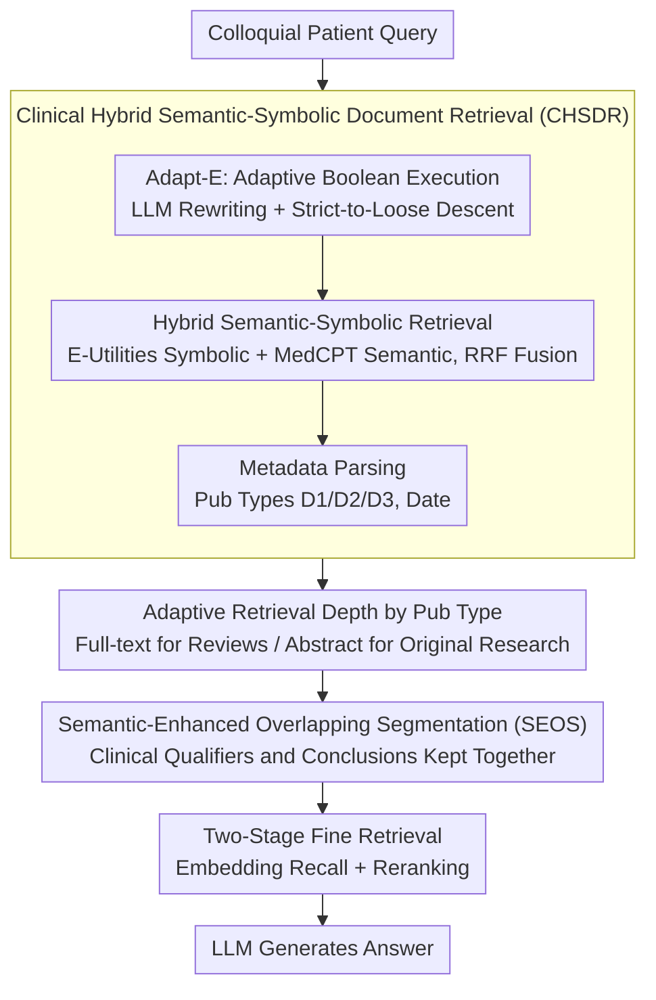

# Query Pipeline Optimization for Cancer Patient Question Answering Systems

**Conference**: ACL 2026 Findings  
**arXiv**: [2412.14751](https://arxiv.org/abs/2412.14751)  
**Code**: None  
**Area**: Medical NLP  
**Keywords**: Cancer Question Answering, RAG Query Pipeline, Hybrid Retrieval, Semantic Segmentation, Metadata-Aware

## TL;DR

This paper proposes CoMeta, a three-layer controllable metadata-aware RAG framework for Cancer Patient Question Answering (CPQA). By integrating Clinical Hybrid Semantic-Symbolic Document Retrieval (CHSDR)—which fuses E-Utilities real-time Boolean search with MedCPT semantic retrieval—and Semantic-Enhanced Overlapping Segmentation (SEOS) to prevent context fragmentation, the framework improves Claude-3-Haiku's answer accuracy on the CMMQA dataset by 5.24% (vs. CoT) and approximately 3% (vs. naive RAG).

## Background & Motivation

**Background**: LLMs demonstrate significant potential in medical QA, yet hallucination risks jeopardize patient safety. RAG mitigates hallucinations by anchoring outputs to external evidence. Current medical RAG systems primarily adopt dense retrieval paradigms, utilizing domain-specific embedding models (e.g., MedCPT) for vector similarity searches on offline indices. Advanced strategies like hybrid search, adaptive retrieval, and recursive search are essentially optimizations based on static indices.

**Limitations of Prior Work**: (1) Staleness-Semantic Dilemma: Standard query pipelines (Dense or BM25) rely on static, metadata-blind indices, risking the retrieval of outdated evidence; conversely, real-time metadata-aware interfaces like E-Utilities are semantically fragile to informal patient queries. (2) Retrieval Depth Paradox: Review articles require full-text retrieval to capture high-level treatment syntheses, whereas original research often only necessitates abstract retrieval to avoid methodological noise—most pipelines apply a uniform retrieval depth across all article types. (3) Context Fragmentation: Prior encoder-agnostic segmentation (fixed-length or lexical-level) severs the association between clinical qualifiers (e.g., specific mutation criteria) and treatment claims, producing recommendations that appear evidence-backed but lack critical constraints.

**Key Challenge**: Existing systems are forced to trade off between semantic robustness (static indices) and retrieval controllability (real-time interfaces), failing to simultaneously meet the triple requirements of timeliness, metadata awareness, and semantic integrity for cancer QA.

**Goal**: Design a RAG framework specifically for CPQA that enforces controllability across three dimensions: (1) robustness against the staleness-semantic dilemma; (2) metadata-aware adaptive retrieval depth based on publication type; and (3) relational integrity protection of clinical logic using encoder-aware segmentation.

**Key Insight**: Rather than further optimizing static index pipelines, integrate E-Utilities as a real-time, metadata-aware sparse backend into the RAG system—a design that is orthogonal and complementary to previous RAG optimizations.

**Core Idea**: Construct an end-to-end controllable cancer QA pipeline by fusing E-Utilities real-time Boolean search with semantic retrieval to achieve "symbolic-semantic complementarity," combined with publication-type adaptive depth and encoder-aware semantic segmentation.

## Method

### Overall Architecture

CoMeta employs a layered query pipeline design, divided into document-level and passage-level stages. At the document level, CHSDR performs hybrid retrieval and parses metadata to divert reviews and original research into different retrieval depths. At the passage level, SEOS performs semantic-aware segmentation, followed by a two-stage fine retrieval (embedding recall + reranking) before inputting to the LLM. The entire chain implements controllability at every step of the retrieval lifecycle.

### Key Designs

**1. Clinical Hybrid Semantic-Symbolic Document Retrieval (CHSDR): Supplementing Static Index Timeliness with Real-time Boolean Controllability and Mitigating Boolean Fragility with Semantic Retrieval**

The staleness-semantic dilemma arises because standard Dense/BM25 pipelines are built on static, metadata-blind indices, risking outdated evidence retrieval; meanwhile, real-time metadata interfaces like E-Utilities are fragile to informal patient queries. CHSDR combines both. It first executes **Adaptive Boolean Execution (Adapt-E)**: an LLM rewriter performs error correction, normalization, intent analysis, clinical abstraction (mapping to PICO elements), and generates Boolean expressions with temporal constraints. These are executed in descending order of strictness—Strict Boolean → Clinical Abstraction → Loose Boolean—until sufficient documents are retrieved, fundamentally solving the "Zero-Hit" issue. Next, **Hybrid Semantic-Symbolic Retrieval** uses Reciprocal Rank Fusion (RRF) to merge results from E-Utilities symbolic search and MedCPT semantic retrieval. Both paths return PMIDs as unified document keys, allowing one to compensate for the other's omissions. Simultaneously, **Metadata Utilization** parses publication types (D1: PubMed Abstract / D2: PMC Review Full-text / D3: Non-review PMC Full-text), publication dates, and abstract availability from E-Utilities XML, creating hooks for subsequent adaptive depth.

**2. Publication-Type-Based Adaptive Retrieval Depth: Full-text for Reviews, Abstracts for Original Research to Resolve the Retrieval Depth Paradox**

Review articles need full-text to capture high-level synthesis across studies, while original research often only requires abstracts, as full-text might introduce methodological noise. However, most pipelines apply a single retrieval depth to all article types. Leveraging the publication types parsed by CHSDR (D1/D2/D3), CoMeta diverges depth before passage retrieval. This divergence is calibrated by experimental data: the increase in the proportion of PMC reviews in Top-5 evidence ($0.10 \to 0.12$) exceeds that of other PMC papers ($0.28 \to 0.32$). Furthermore, including reviews (D1+D2) raises accuracy from 44.00% to 46.00%, while adding non-review full-text (D1+D2+D3) maintains accuracy but lowers Precision/Recall/F1. Thus, reviews utilize full-text while original research uses abstracts, preventing noise while retaining comprehensive evidence.

**3. Semantic-Enhanced Overlapping Segmentation (SEOS): Preventing the Separation of Clinical Qualifiers and Treatment Conclusions**

Once evidence enters the passage layer, prior encoder-agnostic segmentation (fixed-length or lexical) often splits clinical qualifiers (like "specific mutation criteria") and their associated treatment claims into different blocks, producing dangerous recommendations that lack key constraints. Inspired by TextTiling, SEOS introduces three key modifications: (a) replaces Bag-of-Words with domain-specific dense embeddings to handle medical terminology and discourse relations—TextTiling's lexical overlap fails in biomedical literature with high synonymy and complex semantic shifts; (b) uses a target token budget to derive the optimal number of partitions $N$, selecting Top-$N$ semantic minima as breakpoints rather than relying on fragile similarity thresholds; (c) adaptively determines sentence overlap at breakpoints based on semantic continuity, preserving unresolved semantic dependencies and explicitly storing adjacent block identifiers to allow for context recovery. This design essentially considers the "interaction between chunk size and encoder performance" rather than employing a fixed window.

### Example Walkthrough: A Colloquial Cancer Query Pipeline

Consider the query: "My mom has lung cancer with an EGFR mutation; is Osimertinib still effective?". A direct Boolean search via E-Utilities likely results in a Zero-Hit due to the narrative query's semantic looseness. Adapt-E first rewrites it into a canonical form, extracts PICO (P: EGFR-mutant NSCLC, I: Osimertinib), and generates a strict Boolean expression. If this yields insufficient results, it regresses to clinical abstraction and eventually loose Boolean search until enough PMIDs are retrieved. Simultaneously, MedCPT semantic retrieval runs in parallel, and RRF fuses both results, retrieving relevant reviews missed by the symbolic search. Metadata parsing identifies both PMC reviews (D2) and original research (D3) in the hits; consequently, reviews proceed as full-text while original research is restricted to abstracts for the passage layer. In SEOS segmentation, the "EGFR mutation" qualifier and "Osimertinib efficacy" conclusion are kept in the same block, ensuring critical constraints are preserved for the final two-stage retrieval (embedding + reranking) and LLM answer generation.

### Loss & Training
CoMeta is an inference-time framework and does not involve model training. Data-wise, CMMQA (520 cancer-related questions) was constructed from HealthSearchQA and MIRAGE benchmarks via MeSH term filtering. Llama-3-70B was used to rewrite questions into clinical narrative variants. Retrieval evaluation utilized PubMedQA and BioASQ with gold-standard citations, while passage retrieval was evaluated using synthetic QA pairs generated from PubMed abstracts, PMC full-texts, and medical textbooks.

## Key Experimental Results

### Main Results

**CMMQA Overall Performance (Claude-3-Haiku)**

| Method | MMLU | MedQA | MedMCQA | PMQA | BioASQ | Avg |
|------|------|-------|---------|------|--------|-----|
| LLM + CoT | 78.26 | 68.60 | 65.59 | 45.00 | 80.49 | 67.15 |
| Naive RAG | 82.61 | 67.44 | 65.59 | 56.67 | 81.71 | 69.48 |
| CoMeta | 82.61 | **69.77** | **68.82** | **65.00** | 81.71 | **72.39** |

**CHSDR Ablation (Document Retrieval Performance)**

| Method | BioASQ Hit@10 (Std) | BioASQ Hit@10 (Narr) | PubMedQA Hit@10 (Std) | PubMedQA Hit@10 (Narr) |
|------|---------------------|---------------------|----------------------|----------------------|
| E-utils | 52.44 | 1.22 | 41.67 | 0.00 |
| Adapt-E | 65.85 | 50.00 | 48.33 | 8.33 |
| MedCPT | 63.41 | 41.46 | 10.00 | 3.33 |
| Hybrid | **80.49** | **60.98** | 46.67 | **10.00** |

### Ablation Study

**SEOS vs. Fixed Splitting Strategies (Passage Retrieval Accuracy %)**

| Segmentation Strategy | PubMedBERT | BM25 | MedCPT |
|---------|-----------|------|--------|
| 512 (Overlap 0) | 46 | 20 | 22 |
| 512 (Overlap 32) | 52 | 18 | 24 |
| 512 (Overlap 128) | 42 | 16 | 22 |
| SEOS (Ours) | **54** | **36** | **38** |

**Zero-Hit Failure Rate Comparison**

| Dataset-Setting | E-utils | Adapt-E (Ours) |
|-----------|---------|--------------|
| PubMedQA – Standard | 22/60 | 0/60 |
| PubMedQA – Narrative | 55/60 | 0/60 |
| BioASQ – Standard | 18/82 | 0/82 |
| BioASQ – Narrative | 76/82 | 0/82 |

### Key Findings

- CHSDR's hybrid retrieval improved Hit@10 on BioASQ from 52.44% (E-utils) to 80.49%, with semantic retrieval successfully recalling documents missed by symbolic search.
- Adapt-E's adaptive query execution reduced Zero-Hit failures from 55/60 (PubMedQA Narrative) to 0/60, achieving a qualitative leap in retrieval robustness.
- SEOS outperformed fixed splitting strategies across all retrievers, with the most significant gain in BM25 (20% → 36%), indicating that semantic-aware segmentation benefits various retrieval paradigms.
- The retrieval value of PMC reviews is significantly higher than non-review PMC papers—adding reviews increased accuracy by 2%, while further adding non-review full-text decreased F1.
- CoMeta's average accuracy gain of 2.91% underestimates its actual contribution: it achieved an 8.33% improvement on PubMedQA where retrieval was the bottleneck, whereas ceiling effects on MMLU/BioASQ limited further gains.

## Highlights & Insights

- Repositioning E-Utilities from a traditional Boolean search tool to a real-time metadata-aware backend for RAG systems is a design paradigm orthogonal and complementary to existing RAG optimizations.
- The "Adaptive Query Execution" strategy (strict-to-loose descent) is a concise yet highly practical engineering innovation that thoroughly resolves the Zero-Hit problem.
- Systematic analysis of "why average accuracy underestimates contribution" (ceiling effects, retrieval robustness blind spots, evidence timeliness blind spots) demonstrates profound experimental insight.

## Limitations & Future Work

- Validation was primarily conducted in the cancer QA domain; although the authors argue this is a subset of general medical QA, generalization to other medical subfields requires further verification.
- Comparisons with emerging advanced semantic segmentation strategies are lacking.
- Dataset size (520 questions) is relatively limited and may not capture the full diversity of clinical scenarios.
- Dependence on the real-time availability of NCBI E-Utilities might be restricted in certain deployment environments.
- Future directions include adaptive retrieval mechanisms (dynamically deciding whether and how to retrieve) and broader backbone model validation.

## Related Work & Insights

- **vs. MedRAG/Self-BioRAG**: These systems optimize retrieval strategies on static indices; CoMeta introduces a real-time metadata-aware backend, providing an orthogonal design dimension.
- **vs. Pure E-Utilities**: E-Utilities are semantically fragile to informal queries (55/60 Zero-Hit); CoMeta’s LLM rewriter and adaptive execution completely resolve this.
- **vs. TextTiling**: TextTiling uses Bag-of-Words and fixed thresholds, which fail in the high-synonymy environment of biomedical literature; SEOS replaces these with dense embeddings and target budgets.

## Rating

- Novelty: ⭐⭐⭐⭐ Integrating E-Utilities as a real-time RAG backend is a novel design paradigm; SEOS is a meaningful improvement to segmentation methods.
- Experimental Thoroughness: ⭐⭐⭐⭐ Covers multiple medical QA datasets with detailed ablation and retriever-reranker combination analysis, though dataset size is limited.
- Writing Quality: ⭐⭐⭐⭐ Clear problem definitions (the three dilemmas) and deep analysis, though some sections are slightly verbose.
- Value: ⭐⭐⭐⭐ Provides practical query pipeline optimizations for medical RAG with direct reference value for clinical applications.

<!-- RELATED:START -->

## Related Papers

- [\[ACL 2026\] HypEHR: Hyperbolic Modeling of Electronic Health Records for Efficient Question Answering](hypehr_hyperbolic_modeling_of_electronic_health_records_for_efficient_question_a.md)
- [\[ACL 2025\] ArgHiTZ at ArchEHR-QA 2025: A Two-Step Divide and Conquer Approach to Patient Question Answering for Top Factuality](../../ACL2025/medical_nlp/arghitz_at_archehr-qa_2025_a_two-step_divide_and_conquer_approach_to_patient_que.md)
- [\[AAAI 2026\] Expert-Guided Prompting and Retrieval-Augmented Generation for Emergency Medical Service Question Answering](../../AAAI2026/medical_nlp/expert-guided_prompting_and_retrieval-augmented_generation_for_emergency_medical.md)
- [\[ACL 2025\] Follow-up Question Generation for Enhanced Patient-Provider Conversations](../../ACL2025/medical_nlp/follow-up_question_generation_for_enhanced_patient-provider_conversations.md)
- [\[ICLR 2026\] MedAraBench: Large-scale Arabic Medical Question Answering Dataset and Benchmark](../../ICLR2026/medical_nlp/medarabench_large-scale_arabic_medical_question_answering_dataset_and_benchmark.md)

<!-- RELATED:END -->
