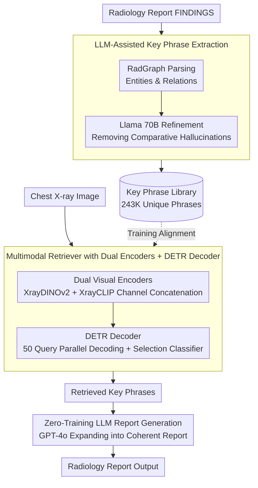

# RA-RRG: Multimodal Retrieval-Augmented Radiology Report Generation with Key Phrase Extraction

**Conference**: ACL 2026 Findings  
**arXiv**: [2504.07415](https://arxiv.org/abs/2504.07415)  
**Code**: [GitHub](https://github.com/deepnoid-ai/RA-RRG)  
**Area**: Medical NLP  
**Keywords**: Radiology Report Generation, Retrieval-Augmented Generation, Key Phrase Extraction, Hallucination Suppression, Multi-view  

## TL;DR
The authors propose the RA-RRG framework, which extracts clinical key phrases from radiology reports using an LLM to construct a retrieval library. Given a chest X-ray image, the framework retrieves relevant phrases and inputs them into an LLM to generate the report. This effectively suppresses hallucinations without LLM fine-tuning, requiring only 18 GPU hours for training while achieving SOTA on CheXbert metrics.

## Background & Motivation

**Background**: Automated radiology report generation (RRG) is a crucial direction for reducing the workload of radiologists. Multimodal LLMs (e.g., LLaVA-Rad, MAIRA) have demonstrated the capability to generate reports directly from chest X-rays but require substantial computational resources and large-scale fine-tuning data.

**Limitations of Prior Work**: (1) MLLM methods have high training costs (>200 GPU hours), limiting clinical deployment; (2) Retrieval-augmented methods (e.g., CXR-RePaiR) retrieve full sentences or reports, but multiple findings often co-occur in the same sentence in radiology reports. Naive retrieval may introduce information irrelevant or even contradictory to the current image; (3) Reports often contain comparative statements relative to previous exams (e.g., "unchanged", "improved"), which constitute "comparative hallucinations" in a single-image setting.

**Key Challenge**: Retrieval-augmented methods require retrieval units of sufficient granularity to avoid co-occurrence information pollution, yet overly fine segmentation may lose clinical context. A balance must be found between granularity and information completeness.

**Goal**: To design a retrieval-augmented RRG framework that requires no LLM fine-tuning, capable of retrieving fine-grained, hallucination-free clinical key phrases to generate accurate radiology reports.

**Key Insight**: Utilize RadGraph to extract the knowledge graph structure of reports and then use an LLM to refine these into minimal clinically meaningful phrases while explicitly excluding comparative statements.

**Core Idea**: Refine RadGraph outputs into hallucination-free key phrases using an LLM → Train a multimodal retriever to match images with phrases → Use an LLM to expand retrieved phrases into coherent reports, without fine-tuning the LLM throughout the process.

## Method

### Overall Architecture
RA-RRG consists of three stages: (1) Key phrase extraction—after parsing the report structure with RadGraph, an LLM (Llama 70B) refines it into key phrases that remove comparative hallucinations; (2) Multimodal retriever training—using dual vision encoders (XrayDINOv2 + XrayCLIP) to extract visual features, a DETR decoder outputs semantic embeddings aligned with MPNet text embeddings; (3) Report generation—retrieved phrases are fed into GPT-4o to generate coherent reports without LLM fine-tuning.

### Key Designs

**1. LLM-Assisted Key Phrase Extraction: Segmenting reports into "minimal clinically meaningful" granularity while stripping hallucination sources**

A persistent issue in retrieval-augmented RRG is the granularity of retrieval units—retrieving entire sentences drags in irrelevant co-occurring findings, while retrieving single entities loses clinical context. More troublesome are comparative statements like "unchanged" or "improved," which are baseless in single-image settings and are typical sources of "comparative hallucinations." RA-RRG adopts a two-step joint approach: first, it parses the FINDINGS section with RadGraph to obtain RadGraph phrases; then, it feeds both the RadGraph output and the original report to Llama 70B to refine them into key phrases, explicitly excluding comparative statements in this step.

The rationale for joining both instead of using one is that pure RadGraph outputs tend to fragment into sparse graph structures and do not handle comparative hallucinations, while pure LLM processing of raw text might miss domain-specific clinical details—the two information streams are complementary. The final training set associates an average of 7.16 key phrases per image, totaling 243,064 unique phrases after deduplication, forming the phrase library for retrieval.

**2. Multimodal Retriever with Dual Encoders + DETR Decoder: Treating "one-image-to-multiple-findings" as set prediction**

A single chest X-ray corresponds to multiple independent findings. A single vision encoder struggles to balance self-supervised fine-grained features with cross-modal alignment features. On the visual side, RA-RRG concatenates XrayDINOv2 (self-supervised features) and XrayCLIP (vision-language alignment features) channel-wise to obtain complementary visual representations. A DETR decoder then parallelly decodes $N=50$ query embeddings, each judged by a selection classifier for activation, while semantic embeddings are generated by a three-layer FFN. On the text side, a frozen MPNet encodes key phrases, with NEFTune-style noise added to suppress overfitting.

Using DETR-style set prediction instead of sentence-by-sentence retrieval is chosen because it naturally fits the "one-image-to-multiple-phrases" structure: 50 queries each attempt to identify a finding, with activation determined by the classifier, avoiding the forced fitting of a fixed number of retrieval results to every image. Training relies on Hungarian matching to align predicted embeddings with ground-truth phrases, optimized together with phrase matching loss and in-batch semantic contrastive loss.

**3. Zero-Training LLM Report Generation: Letting GPT-4o handle linguistic organization without touching clinical judgment**

The MLLM route for report generation often requires 200+ GPU hours of fine-tuning, a significant cost for clinical adoption. RA-RRG avoids fine-tuning any LLMs entirely: it passes retrieved key phrases along with task instructions to GPT-4o, letting it expand fragmented phrases into a coherent report. Since phrases have already undergone hallucination filtering in the first step, the LLM here only performs linguistic organization and does not need to make clinical judgments; the hallucination risk is shifted forward and resolved earlier.

The same framework extends seamlessly to multi-view RRG: phrases retrieved from frontal and lateral views are simply merged and used as input, requiring no changes to the generation end. Consequently, the entire pipeline only trains the DETR decoder, treating the LLMs as off-the-shelf tools and reducing training time to 18 GPU hours.

### Loss & Training
The total loss is $\mathcal{L} = \sum_b \mathcal{L}_{PM}(y^b, \hat{y}^b) + \lambda \mathcal{L}_{SC}(E)$, where the phrase matching loss $\mathcal{L}_{PM}$ uses Hungarian algorithm assignment + distribution-balanced classification loss + cosine similarity loss. The in-batch semantic contrastive loss $\mathcal{L}_{SC}$ adopts a CLIP-style symmetric cross-entropy, using soft targets to avoid penalizing non-matching pairs with similar semantics. $\lambda = 0.1$. Visual and text encoder parameters are frozen, training only the DETR decoder.

## Key Experimental Results

### Main Results
MIMIC-CXR Single-view RRG (FINDINGS section):

| Type | Model | CheXbert micro-F1 | RadGraph F1 | ROUGE-L |
|------|------|--------------------|-------------|---------|
| Generative | LLaVA-Rad | 57.3 | - | 30.6 |
| Generative | M4CXR | 58.1 | 21.7 | 28.4 |
| Retrieval | MCA-RG | - | - | 30.0 |
| **Retrieval** | **RA-RRG** | **62.3** | **24.3** | **30.7** |

### Ablation Study

| Configuration | CheXbert micro-F1 | RadGraph F1 |
|------|--------------------|-------------|
| RadGraph Phrases Only | 59.1 | 22.8 |
| LLM Key Phrases (No Comp. Filtering) | 60.5 | 23.4 |
| LLM Key Phrases (With Comp. Filtering) | **62.3** | **24.3** |
| Single Encoder (CLIP Only) | 58.7 | 22.1 |
| Dual Encoder (CLIP + DINOv2) | **62.3** | **24.3** |

### Key Findings
- Comparative hallucination filtering makes a significant contribution (micro-F1: 60.5 → 62.3), proving the necessity of excluding expressions like "unchanged/improved."
- Dual encoder fusion improves micro-F1 by 3.6% over a single encoder, as DINOv2 and CLIP features are complementary.
- RA-RRG requires only 18 GPU hours for training (vs. MLLM >200 GPU hours) and surpasses all MLLMs on CheXbert metrics.
- The framework extends naturally to multi-view RRG, where multi-view results show further improvements.

## Highlights & Insights
- The design of key phrases as retrieval units finds an excellent balance in granularity—finer than sentences to avoid co-occurrence pollution, yet coarser than entities to preserve clinical context. This design could be generalized to any domain requiring fine-grained retrieval.
- The LLM plays different roles across the two stages: knowledge refinement during extraction (Llama 70B) and linguistic organization during generation (GPT-4o). Neither stage requires fine-tuning, maximizing the out-of-the-box value of LLMs.
- The explicit definition and handling of comparative hallucinations is a highly practical contribution—these hallucinations are pervasive in radiology but were overlooked by previous methods.

## Limitations & Future Work
- Dependency on commercial APIs (GPT-4o) for report generation poses cost and privacy issues that limit clinical deployment.
- RadGraph itself may generate incomplete graph structures on complex reports.
- The recall of key phrase retrieval is limited by the phrase coverage of the training set—rare findings may lack matching phrases.
- Future work could replace GPT-4o with open-source LLMs or train the retriever and a small generative model end-to-end.

## Related Work & Insights
- **vs CXR-RePaiR**: CXR-RePaiR retrieves full reports/sentences, leading to co-occurrence information pollution; RA-RRG retrieves minimal clinical phrases, which are more precise.
- **vs MAIRA-1/LLaVA-Rad**: These MLLMs require large-scale fine-tuning; RA-RRG achieves lower costs through retrieval + frozen LLMs.

## Rating
- Novelty: ⭐⭐⭐⭐ The combination of key phrase extraction + dual-encoder retrieval + zero-training LLM generation is innovative.
- Experimental Thoroughness: ⭐⭐⭐⭐ Comprehensive evaluation on two datasets, thorough ablation, and inclusion of hallucination analysis.
- Writing Quality: ⭐⭐⭐⭐ Clear methodological descriptions and intuitive architectural diagrams.
- Value: ⭐⭐⭐⭐ Provides a practical solution for radiology report generation in resource-constrained scenarios.

<!-- RELATED:START -->

## Related Papers

- [\[ACL 2026\] MARCH: Multi-Agent Radiology Clinical Hierarchy for CT Report Generation](march_multi-agent_radiology_clinical_hierarchy_for_ct_report_generation.md)
- [\[ACL 2026\] HeteroRAG: A Heterogeneous Retrieval-Augmented Generation Framework for Medical Vision Language Tasks](heterorag_a_heterogeneous_retrieval-augmented_generation_framework_for_medical_v.md)
- [\[ACL 2026\] SEMA-RAG: A Self-Evolving Multi-Agent Retrieval-Augmented Generation Framework for Medical Reasoning](sema-rag_a_self-evolving_multi-agent_retrieval-augmented_generation_framework_fo.md)
- [\[ACL 2025\] Automated Structured Radiology Report Generation](../../ACL2025/medical_nlp/automated_structured_radiology_report_generation.md)
- [\[ACL 2025\] Online Iterative Self-Alignment for Radiology Report Generation](../../ACL2025/medical_nlp/oisa_radiology_report_gen.md)

<!-- RELATED:END -->
