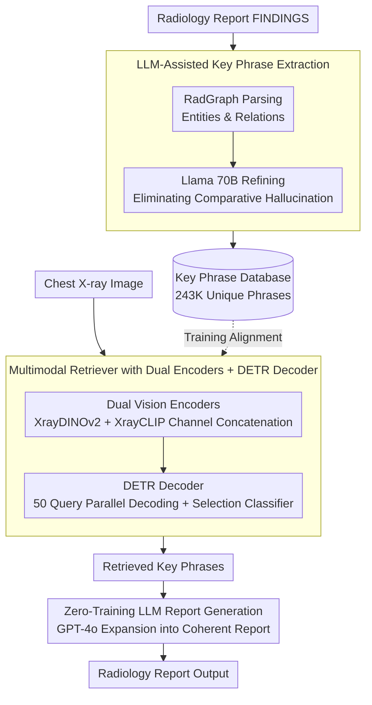

# RA-RRG: Multimodal Retrieval-Augmented Radiology Report Generation with Key Phrase Extraction

**Conference**: ACL 2026 Findings  
**arXiv**: [2504.07415](https://arxiv.org/abs/2504.07415)  
**Code**: [GitHub](https://github.com/deepnoid-ai/RA-RRG)  
**Area**: Medical NLP  
**Keywords**: Radiology Report Generation, Retrieval-Augmented Generation, Key Phrase Extraction, Hallucination Suppression, Multi-view

## TL;DR
The RA-RRG framework is proposed to extract clinical key phrases from radiology reports via LLMs to construct a retrieval database. Given chest X-ray images, relevant phrases are retrieved and input into an LLM to generate reports. This effectively suppresses hallucinations without requiring LLM fine-tuning, achieving SOTA on CheXbert metrics with only 18 GPU hours of training.

## Background & Motivation

**Background**: Automated Radiology Report Generation (RRG) is a crucial direction for reducing the clinical workload of radiologists. Multimodal LLMs (e.g., LLaVA-Rad, MAIRA) have demonstrated the capability to generate reports directly from chest X-rays but requires substantial computational resources and large-scale fine-tuning data.

**Limitations of Prior Work**: (1) MLLM methods incur high training costs (>200 GPU hours), limiting clinical deployment; (2) Retrieval-augmented methods (e.g., CXR-RePaiR) retrieve full sentences or reports, yet multiple clinical findings often co-occur in the same sentence, leading naive retrieval to introduce information irrelevant or even contradictory to the current image; (3) Reports frequently contain comparative statements with respect to previous exams (e.g., "unchanged", "improved"), which constitute "comparative hallucinations" in a single-image setting.

**Key Challenge**: Retrieval-augmented methods require sufficiently fine-grained retrieval units to avoid co-occurrence information pollution, yet excessively fine segmentation may lose clinical context. A balance must be struck between granularity and information integrity.

**Goal**: To design a retrieval-augmented RRG framework that requires no LLM fine-tuning, capable of retrieving fine-grained, hallucination-free clinical key phrases to generate accurate radiology reports.

**Key Insight**: Utilize RadGraph to extract the knowledge graph structure of reports, then use an LLM to refine it into minimal clinically meaningful phrases while explicitly excluding comparative statements.

**Core Idea**: Refine RadGraph outputs into hallucination-free key phrases using an LLM $\rightarrow$ train a multimodal retriever to match images with phrases $\rightarrow$ use an LLM to expand retrieved phrases into coherent reports, without fine-tuning the LLM throughout the process.

## Method

### Overall Architecture
RA-RRG consists of three stages: (1) Key phrase extraction—utilizing RadGraph to parse report structures, then refining them into key phrases without comparative hallucinations via an LLM (Llama 70B); (2) Multimodal retriever training—employing dual vision encoders (XrayDINOv2 + XrayCLIP) to extract visual features, with a DETR decoder outputting semantic embeddings aligned with MPNet text embeddings; (3) Report generation—inputting retrieved phrases into GPT-4o to generate coherent reports without LLM fine-tuning.

### Key Designs

**1. LLM-Assisted Key Phrase Extraction: Slicing reports to "minimal clinically meaningful" granularity while removing hallucination sources.**

A recurring issue in retrieval-augmented RRG is the granularity of retrieval units—retrieving full sentences drags in unrelated co-occurring findings, while retrieving single entities loses clinical context. More importantly, common comparative expressions like "unchanged" or "improved" lack evidence in a single-image setting and are typical sources of "comparative hallucinations". RA-RRG adopts a two-step joint approach: first, it parses the FINDINGS section using RadGraph to obtain entities and relations, then feeds both the RadGraph output and the original report to Llama 70B to refine them into key phrases, explicitly excluding comparative statements during this step.

The reason for the joint approach is that pure RadGraph outputs tend to fragment into scattered graph structures and fail to handle comparative hallucinations, while pure LLM processing of raw text might miss domain-specific clinical details; thus, the two information paths are complementary. The final training set associates an average of 7.16 key phrases per image, with 243,064 unique phrases after deduplication, forming the retrieval database.

**2. Multimodal Retriever with Dual Encoders + DETR Decoder: Treating "one image to multiple findings" as set prediction.**

A single chest X-ray corresponds to multiple independent findings. A single vision encoder struggles to simultaneously capture self-supervised fine-grained features and cross-modal alignment features. On the visual side, RA-RRG concatenates XrayDINOv2 (self-supervised features) and XrayCLIP (vision-language alignment features) along the channel dimension to obtain complementary visual representations. A DETR decoder then decodes $N=50$ query embeddings in parallel, where each query is judged by a selection classifier for activation, and semantic embeddings are generated via a three-layer FFN. On the text side, a frozen MPNet encodes key phrases, with NEFTune-style noise added to suppress overfitting.

Using DETR-style set prediction rather than sentence-by-sentence retrieval is intended to naturally fit the "one image to many phrases" structure: 50 queries each attempt to identify a finding, with activation determined by the classifier, avoiding the forced fitting of a fixed number of retrieval results to every image. Training utilizes Hungarian matching to align predicted embeddings with ground truth phrases, optimized by a phrase matching loss and an in-batch semantic contrastive loss.

**3. Zero-Training LLM Report Generation: Letting GPT-4o handle language organization without touching clinical judgment.**

The MLLM route for report generation often requires over 200 GPU hours of fine-tuning, which is a significant cost for clinical deployment. RA-RRG avoids fine-tuning any LLM entirely: it passes the retrieved key phrases along with task instructions to GPT-4o, letting it expand fragmented phrases into coherent reports. Since the phrases have already undergone hallucination filtering in the first stage, the LLM here only performs language organization without needing to make clinical judgments, shifting the hallucination risk upstream.

The same framework extends seamlessly to multi-view RRG: phrases retrieved from frontal and lateral views are merged as input without changing the generation side. Consequently, the entire pipeline only trains the DETR decoder, treating the LLM as a ready-made tool and compressing the training time to 18 GPU hours.

### Loss & Training
The total loss is $\mathcal{L} = \sum_b \mathcal{L}_{PM}(y^b, \hat{y}^b) + \lambda \mathcal{L}_{SC}(E)$, where the phrase matching loss $\mathcal{L}_{PM}$ utilizes Hungarian algorithm assignment alongside a distribution-balanced classification loss and cosine similarity loss. The in-batch semantic contrastive loss $\mathcal{L}_{SC}$ adopts CLIP-style symmetric cross-entropy, using soft targets to avoid penalizing non-matching pairs with similar semantics. $\lambda = 0.1$. Vision and text encoders are frozen, and only the DETR decoder is trained.

## Key Experimental Results

### Main Results
MIMIC-CXR single-view RRG (FINDINGS section):

| Type | Model | CheXbert micro-F1 | RadGraph F1 | ROUGE-L |
|------|------|--------------------|-------------|---------|
| Generative | LLaVA-Rad | 57.3 | - | 30.6 |
| Generative | M4CXR | 58.1 | 21.7 | 28.4 |
| Retrieval | MCA-RG | - | - | 30.0 |
| **Retrieval** | **Ours** | **62.3** | **24.3** | **30.7** |

### Ablation Study

| Configuration | CheXbert micro-F1 | RadGraph F1 |
|------|--------------------|-------------|
| RadGraph Phrases only | 59.1 | 22.8 |
| LLM Key Phrases (w/o comparative filtering) | 60.5 | 23.4 |
| LLM Key Phrases (w/ comparative filtering) | **62.3** | **24.3** |
| Single Encoder (CLIP only) | 58.7 | 22.1 |
| Dual Encoder (CLIP + DINOv2) | **62.3** | **24.3** |

### Key Findings
- Comparative hallucination filtering provides a significant contribution (micro-F1: 60.5 → 62.3), proving the necessity of excluding "unchanged/improved" expressions.
- Dual encoder fusion improves micro-F1 by 3.6% over a single encoder, as DINOv2 and CLIP features are complementary.
- RA-RRG requires only 18 GPU hours for training (vs. MLLM >200 GPU hours) and outperforms all MLLMs on CheXbert metrics.
- The framework extends naturally to multi-view RRG, and multi-view results show further improvements.

## Highlights & Insights
- The design of using key phrases as retrieval units finds an excellent balance in granularity—finer than sentences to avoid co-occurrence pollution, yet coarser than entities to preserve clinical context. This design can be generalized to any field requiring fine-grained retrieval.
- LLMs are assigned different roles in two stages: knowledge refinement during the extraction stage (Llama 70B) and language organization during the generation stage (GPT-4o). Neither stage requires fine-tuning, maximizing the off-the-shelf value of LLMs.
- The explicit definition and handling of comparative hallucinations is a practical contribution—such hallucinations are pervasive in radiology but were overlooked by previous methods.

## Limitations & Future Work
- Dependency on commercial APIs (GPT-4o) for report generation introduces costs and privacy concerns that limit clinical deployment.
- RadGraph itself may generate incomplete graph structures for complex reports.
- The recall of key phrase retrieval is limited by the phrase coverage of the training set—rare findings may lack matching phrases.
- Future work could replace GPT-4o with open-source LLMs or train the retriever end-to-end with a smaller generative model.

## Related Work & Insights
- **vs CXR-RePaiR**: Retrieves full reports/sentences, suffering from co-occurrence information pollution; RA-RRG retrieves minimal clinical phrases for higher precision.
- **vs MAIRA-1/LLaVA-Rad**: These MLLMs require large-scale fine-tuning, whereas RA-RRG achieves lower costs through retrieval and frozen LLMs.

## Rating
- Novelty: ⭐⭐⭐⭐ The combination of key phrase extraction, dual encoder retrieval, and zero-training LLM generation is innovative.
- Experimental Thoroughness: ⭐⭐⭐⭐ Comprehensive evaluation across two datasets with thorough ablation and hallucination analysis.
- Writing Quality: ⭐⭐⭐⭐ Clear methodological descriptions and intuitive architectural diagrams.
- Value: ⭐⭐⭐⭐ Provides a practical solution for radiology report generation in resource-constrained scenarios.

<!-- RELATED:START -->

## Related Papers

- [\[ACL 2026\] MARCH: Multi-Agent Radiology Clinical Hierarchy for CT Report Generation](march_multi-agent_radiology_clinical_hierarchy_for_ct_report_generation.md)
- [\[ACL 2025\] Automated Structured Radiology Report Generation](../../ACL2025/medical_nlp/automated_structured_radiology_report_generation.md)
- [\[ACL 2026\] HeteroRAG: A Heterogeneous Retrieval-Augmented Generation Framework for Medical Vision Language Tasks](heterorag_a_heterogeneous_retrieval-augmented_generation_framework_for_medical_v.md)
- [\[ACL 2025\] Online Iterative Self-Alignment for Radiology Report Generation](../../ACL2025/medical_nlp/oisa_radiology_report_gen.md)
- [\[ACL 2026\] SEMA-RAG: A Self-Evolving Multi-Agent Retrieval-Augmented Generation Framework for Medical Reasoning](sema-rag_a_self-evolving_multi-agent_retrieval-augmented_generation_framework_fo.md)

<!-- RELATED:END -->
