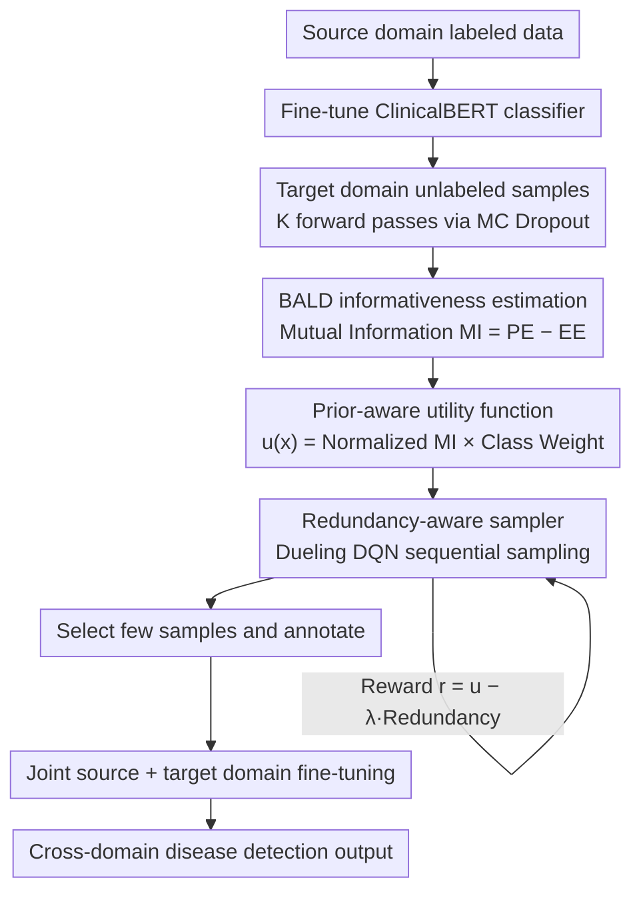

# RADS: Reinforcement Learning-Based Sample Selection Improves Transfer Learning in Low-resource and Imbalanced Clinical Settings

**Conference**: ACL 2026 Findings  
**arXiv**: [2604.20256](https://arxiv.org/abs/2604.20256)  
**Code**: [https://github.com/Wei-0808/RADS](https://github.com/Wei-0808/RADS)  
**Area**: Medical NLP  
**Keywords**: Reinforcement Learning, Sample Selection, Transfer Learning, Class Imbalance, Clinical NLP

## TL;DR
Ours proposes RADS (Reinforcement Adaptive Domain Sampling), an RL-based sample selection strategy that significantly improves cross-domain disease detection in extreme low-resource and imbalanced clinical scenarios by intelligently selecting a few target domain samples for annotation and joint fine-tuning.

## Background & Motivation

**Background**: NLP tasks for clinical text rely heavily on high-quality labeled data, but medical annotation costs are extreme (requiring specialists), and many diseases are rare, leading to a severe lack of positive samples. Transfer learning is the primary strategy to mitigate low-resource scenarios by transferring from a source domain after training to reduce annotation needs.

**Limitations of Prior Work**: Traditional active learning methods (e.g., uncertainty and diversity sampling) underperform in extreme low-resource and imbalanced conditions. Uncertainty sampling tends to select outliers on the edge of the distribution rather than informative samples; diversity sampling optimizes only a single metric and cannot simultaneously consider sample informativeness and redundancy. Furthermore, the heterogeneity of clinical reports (e.g., variations in terms used in CT, PET, and cytology reports) increases the difficulty of cross-domain transfer.

**Key Challenge**: Under a minimal annotation budget (e.g., only 5 samples), how to select the most valuable samples from the unlabeled target domain such that the fine-tuned model performs well on both the source and target domains.

**Goal**: Design an adaptive sample selection strategy that simultaneously considers informativeness, class balance, and sample diversity.

**Key Insight**: The authors model the sample selection problem as a sequential decision process, using a reinforcement learning agent to learn an optimal selection strategy that adaptively balances informativeness, class ratios, and redundancy.

**Core Idea**: Use a Dueling DQN to train a sample selection agent. Guided by BALD mutual information, the agent combines a prior-aware utility function with a redundancy penalty mechanism to select the optimal subset of samples from the target domain for annotation and fine-tuning.

## Method

### Overall Architecture
The RADS framework consists of three stages: (1) Active learner training: Fine-tune a ClinicalBERT classifier on the source domain, then calculate uncertainty signals for unlabeled target samples via MC dropout; (2) Prior-aware utility calculation: Construct a utility function considering both informativeness and class balance by combining BALD mutual information scores with pseudo-label class weights; (3) RL sampler training: Use a Dueling DQN to learn a selection strategy that maximizes utility while penalizing redundant selections. Finally, the selected samples are used to fine-tune the model jointly with the source domain to obtain a detection model adapted to both domains.

### Key Designs

**1. BALD informativeness estimation via MC Dropout: Selecting samples using internal model disagreement rather than simple uncertainty**

Traditional uncertainty sampling often picks outliers at the distribution edges under domain shift—samples that appear "uncertain" but are not useful. RADS uses BALD mutual information: by maintaining dropout activations and performing $K$ stochastic forward passes for each target sample, it computes the entropy of the predictive distribution $\mathrm{PE}(x)$ and the mean entropy of individual predictions $\mathrm{EE}(x)$. The difference is the mutual information $\mathrm{MI}(x) = \mathrm{PE}(x) - \mathrm{EE}(x)$.

This difference decomposes uncertainty into two layers: a high $\mathrm{PE}$ indicates overall model uncertainty, but if individual stochastic predictions are highly consistent (high $\mathrm{EE}$), the uncertainty is merely aleatoric (inherent data noise) which labels cannot resolve. Only when sub-models disagree significantly is the $\mathrm{MI}$ high, representing epistemic uncertainty (knowledge the model lacks). RADS selects samples with high $\mathrm{MI}$, naturally avoiding uninformative outliers.

**2. Prior-Aware Utility: Layering class balance over informativeness**

Relying solely on informativeness fails under extreme imbalance—the most informative samples might all belong to the positive (or negative) class, exacerbating skewness. RADS estimates the positive class prior $\hat{\pi}_+$ of the target domain via pseudo-labels and calculates a class weight $w_+ = \rho / \mathrm{clip}(\hat{\pi}_+)$, which is multiplied by the normalized mutual information to get the final utility $u(x) = \widetilde{\mathrm{MI}}(x) \cdot w_{y(x)}$. Rare classes receive higher weights due to smaller priors, making them more likely to be selected at equal informativeness levels. The hyperparameter $\rho$ acts as a knob to balance preference between rare classes and high informativeness.

**3. Dueling DQN-based Redundancy-aware Sampler: Modeling sample selection as sequential decision-making to avoid redundancy**

The previous steps score samples individually without considering mutual relationships—two samples with high $u(x)$ but nearly identical content would both be selected, wasting budget. RADS models selection as a sequential decision process for an RL agent. The state vector includes mean log-probabilities, predictive entropy, BALD scores, and current budget utilization. The reward for selecting a sample is:

$$r_t = u(x_t) - \lambda \cdot \mathrm{Red}(x_t, S_t)$$

where redundancy $\mathrm{Red}(x_t, S_t)$ is measured by the nearest neighbor distance between $x_t$ and the selected set $S_t$ in the predictive representation space. Using a Dueling DQN with $\epsilon$-greedy exploration, the agent can "look back" at what has been selected and dynamically adjust its criteria, allowing redundancy to be automatically avoided via rewards rather than post-hoc deduplication.

### Loss & Training
The active learner is trained on the source domain using standard cross-entropy. The RL sampler uses TD loss to train the Dueling DQN with an experience replay buffer and a target network. After sample selection, ClinicalBERT is fine-tuned on the combined source domain and annotated target domain samples.

## Key Experimental Results

### Main Results (CHIFIR → PIFIR Transfer, 5 samples)

| Strategy | PIFIR F1 | PIFIR ROC-AUC | CHIFIR F1 | Transfer Gap ΔF1 |
|------|----------|---------------|-----------|-------------|
| Random | 0.639 | 0.813 | 0.746 | — |
| Uncertainty | 0.545 | 0.830 | 0.824 | 0.278 |
| Diversity | 0.638 | 0.809 | 0.800 | 0.162 |
| BatchBALD | 0.849 | 0.783 | 0.500 | -0.349 |
| **RADS** | **0.871** | **0.833** | **0.750** | **-0.121** |

### Ablation Study

| Configuration | Key Metrics | Description |
|------|---------|------|
| Full RADS | F1=0.871, AUC=0.833 | Full model |
| w/o Redundancy Penalty | Near Uncertainty level | Redundancy penalty is vital for diversity |
| w/o Prior-Aware | Increased class skew | Necessary under imbalanced conditions |
| Full-shot (All target labels) | F1=0.900 | Upper bound; RADS approaches this with only 5 samples |

### Key Findings
- RADS achieves an F1 of 0.871 using only 5 annotated samples, approaching the full-shot upper bound (0.900) and significantly outperforming other active learning methods.
- Traditional uncertainty sampling degrades severely under class imbalance (F1 only 0.545) because it favors outliers.
- While BatchBALD shows high target F1 (0.849), it severely sacrifices source domain performance (CHIFIR F1 drops to 0.500), leading to the largest transfer gap.
- RADS is the only method that maintains strong performance across both target and source domains, achieving true dual-domain adaptation.

## Highlights & Insights
- **Modeling sample selection as an RL problem** is ingenious—compared to greedy active learning, an RL agent can optimize the overall utility of the selected subset from a global perspective, naturally balancing informativeness, class ratio, and diversity.
- The **prior-aware utility function** design is simple yet effective; a single hyperparameter $\rho$ controls the degree of class balancing, making it easily transferable to any low-resource classification task.
- Calculating redundancy in the representation space is a noteworthy approach—measuring distances in the MC dropout predictive distribution space rather than comparing raw text.

## Limitations & Future Work
- The evaluation dataset scale is small (CHIFIR 283, PIFIR 201); effectiveness on larger datasets remains to be verified.
- Training the RL sampler introduces extra computational costs and hyperparameter tuning, which may be less cost-effective in certain scenarios than simpler methods.
- Currently only validated on binary classification (disease presence/absence); the prior-aware utility function needs extension for multi-class scenarios.
- Future work could consider sharing the RL agent's selection policy across multiple transfer tasks to amortize training costs.

## Related Work & Insights
- **vs Uncertainty Sampling**: Uncertainty sampling considers only a single metric and picks outliers under imbalance and domain shift; RADS avoids this through multi-signal fusion and RL optimization.
- **vs BatchBALD**: BatchBALD selects batches via joint mutual information, theoretically considering inter-sample dependencies, but lacks a class balance mechanism, leading to severe source domain degradation.
- **vs LM-DPP**: DPP models both uncertainty and diversity, but its fixed weighting scheme is less flexible than the adaptive reinforcement learning strategy.

## Rating
- Novelty: ⭐⭐⭐⭐ RL-driven sample selection in active learning is not entirely new, but the combined design with prior-aware utility and redundancy penalty is innovative.
- Experimental Thoroughness: ⭐⭐⭐⭐ Compared against 6 baselines with complete multi-directional transfer experiments, though dataset size is limited.
- Writing Quality: ⭐⭐⭐⭐ The method formalization is clear and experimental analysis is detailed.
- Value: ⭐⭐⭐⭐ Highly practical for medical low-resource NLP; the method is generalizable to other domains.

<!-- RELATED:START -->

## Related Papers

- [\[ACL 2026\] Dr. Assistant: Enhancing Clinical Diagnostic Inquiry via Structured Diagnostic Reasoning Data and Reinforcement Learning](dr_assistant_enhancing_clinical_diagnostic_inquiry_via_structured_diagnostic_rea.md)
- [\[ICLR 2026\] Doctor-R1: Mastering Clinical Inquiry with Experiential Agentic Reinforcement Learning](../../ICLR2026/medical_nlp/doctor-r1_mastering_clinical_inquiry_with_experiential_agentic_reinforcement_lea.md)
- [\[ACL 2026\] Eliciting Medical Reasoning with Knowledge-enhanced Data Synthesis: A Semi-Supervised Reinforcement Learning Approach](eliciting_medical_reasoning_with_knowledge-enhanced_data_synthesis_a_semi-superv.md)
- [\[ACL 2026\] CURE-Med: Curriculum-Informed Reinforcement Learning for Multilingual Medical Reasoning](cure-med_curriculum-informed_reinforcement_learning_for_multilingual_medical_rea.md)
- [\[ACL 2026\] Learning Dynamic Representations and Policies from Multimodal Clinical Time-Series with Informative Missingness](learning_dynamic_representations_and_policies_from_multimodal_clinical_time-seri.md)

<!-- RELATED:END -->
