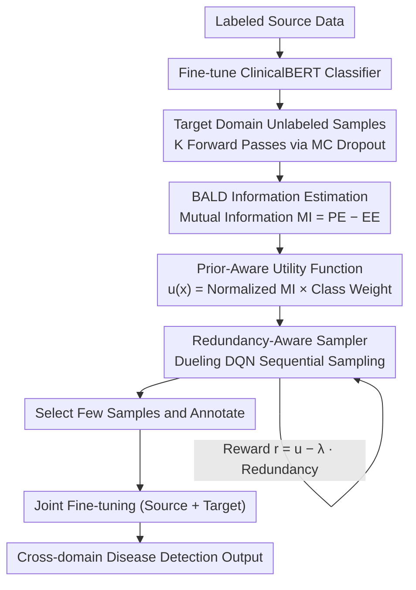

# RADS: Reinforcement Learning-Based Sample Selection Improves Transfer Learning in Low-resource and Imbalanced Clinical Settings

**Conference**: ACL 2026 Findings  
**arXiv**: [2604.20256](https://arxiv.org/abs/2604.20256)  
**Code**: [https://github.com/Wei-0808/RADS](https://github.com/Wei-0808/RADS)  
**Area**: Medical NLP  
**Keywords**: Reinforcement Learning, Sample Selection, Transfer Learning, Class Imbalance, Clinical NLP

## TL;DR
This paper proposes RADS (Reinforcement Adaptive Domain Sampling), a reinforcement learning-based sample selection strategy. It significantly enhances cross-domain disease detection in extreme low-resource and class-imbalanced clinical scenarios by intelligently selecting a small number of target-domain samples for annotation and joint fine-tuning.

## Background & Motivation

**Background**: NLP tasks for clinical text rely heavily on high-quality annotated data. However, annotation costs in the medical field are extremely high (requiring professional physicians), and many medical conditions are rare, leading to an extreme scarcity of positive samples. Transfer learning is the primary strategy for low-resource scenarios, reducing annotation requirements by transferring knowledge after training on a source domain.

**Limitations of Prior Work**: Traditional active learning methods, such as uncertainty sampling and diversity sampling, perform poorly under extreme low-resource and class-imbalanced conditions. Uncertainty sampling tends to select outliers at the distribution boundary rather than truly informative samples; diversity sampling optimizes only a single metric and fails to simultaneously consider sample informativeness and redundancy. Furthermore, the high heterogeneity of clinical reports (e.g., significant differences in terminology between CT, PET, and cytology reports) increases the difficulty of cross-domain transfer.

**Key Challenge**: When the annotation budget is extremely limited (e.g., only 5 samples can be annotated), how can the most valuable samples be selected from the unlabeled target domain such that the model performs well in both the source and target domains after joint fine-tuning?

**Goal**: To design an adaptive sample selection strategy that simultaneously considers informativeness, class balance, and sample diversity.

**Key Insight**: The authors model the sample selection problem as a sequential decision-making problem, using a reinforcement learning agent to learn the optimal selection policy, thereby adaptively balancing informativeness, class proportions, and redundancy.

**Core Idea**: A sample selection agent is trained using Dueling DQN. Guided by BALD mutual information, and combining a prior-aware utility function with a redundancy penalty mechanism, the agent selects the optimal subset of samples from the target domain for annotation and fine-tuning.

## Method

### Overall Architecture
The RADS framework consists of three stages: (1) Active Learner Training: A ClinicalBERT classifier is fine-tuned on the source domain, and uncertainty signals for unlabeled target domain samples are calculated via MC dropout; (2) Prior-Aware Utility Calculation: A utility function that considers both informativeness and class balance is constructed by combining BALD mutual information scores with pseudo-label class weights; (3) RL Sampler Training: A Dueling DQN learns a selection policy to maximize utility while penalizing redundant selections. Finally, the selected few samples are used for joint fine-tuning with the source domain to obtain a detection model adapted to both domains.

### Key Designs

**1. BALD Information Estimation via MC Dropout: Selecting samples based on internal model disagreement rather than simple "uncertainty"**

Traditional uncertainty sampling often selects outliers under domain shift—samples that appear "uncertain" but are actually uninformative. RADS utilizes BALD mutual information: by maintaining dropout activations and performing $K$ stochastic forward passes for each target sample, the entropy of the predictive distribution $\mathrm{PE}(x)$ and the mean entropy of individual predictions $\mathrm{EE}(x)$ are computed. The difference represents the mutual information $\mathrm{MI}(x) = \mathrm{PE}(x) - \mathrm{EE}(x)$.

This difference decomposes uncertainty into two layers: a high $\mathrm{PE}$ indicates the model is generally uncertain, but if predictions across stochastic passes are highly consistent (high $\mathrm{EE}$), the uncertainty is merely aleatoric (inherent data noise) which labels cannot resolve. Only when sub-models disagree significantly is the $\mathrm{MI}$ high, representing epistemic uncertainty (information the model has not seen and is worth annotating). RADS only picks samples with high $\mathrm{MI}$, naturally avoiding outliers.

**2. Prior-Aware Utility Function: Layering class balance over informativeness**

Relying solely on informativeness fails under extreme imbalance—the most informative samples might all belong to the majority class. RADS estimates the positive class prior $\hat{\pi}_+$ in the target domain using pseudo-labels, then calculates a class weight $w_+ = \rho / \mathrm{clip}(\hat{\pi}_+)$, which is multiplied by the normalized mutual information to get the final utility $u(x) = \widetilde{\mathrm{MI}}(x) \cdot w_{y(x)}$. Rare classes receive higher weights due to smaller priors, making them more likely to be selected at equivalent information levels. The hyperparameter $\rho$ acts as a "dial" to control the trade-off between favoring rare classes vs. high informativeness.

**3. Redundancy-Aware Sampler via Dueling DQN: Modeling sample selection as sequential decision-making to naturally avoid redundancy**

The previous steps evaluate samples independently and ignore inter-sample relationships—two samples with high $u(x)$ but nearly identical content would both be selected, wasting budget. RADS models selection as a sequential decision process for an RL agent. The state vector includes mean log-probabilities, predictive entropy, BALD scores, and budget utilization. The reward for selecting a sample at time $t$ is:

$$r_t = u(x_t) - \lambda \cdot \mathrm{Red}(x_t, S_t)$$

where redundancy $\mathrm{Red}(x_t, S_t)$ is measured by the nearest-neighbor distance between $x_t$ and the selected set $S_t$ in the predictive representation space. Using Dueling DQN with $\epsilon$-greedy exploration, the agent can "look back" at what has already been selected and dynamically adjust criteria, automatically avoiding redundancy through the reward signal rather than post-hoc deduplication.

### Loss & Training
The active learner is trained using standard cross-entropy on the source domain. The RL sampler is trained using TD loss for Dueling DQN, with an experience replay buffer and a target network. After sample selection, ClinicalBERT is fine-tuned on the combined source domain and the annotated target samples.

## Key Experimental Results

### Main Results (CHIFIR → PIFIR Transfer, 5 samples selected)

| Strategy | PIFIR F1 | PIFIR ROC-AUC | CHIFIR F1 | Transfer Gap ΔF1 |
|------|----------|---------------|-----------|-------------|
| Random | 0.639 | 0.813 | 0.746 | — |
| Uncertainty | 0.545 | 0.830 | 0.824 | 0.278 |
| Diversity | 0.638 | 0.809 | 0.800 | 0.162 |
| BatchBALD | 0.849 | 0.783 | 0.500 | -0.349 |
| **RADS** | **0.871** | **0.833** | **0.750** | **-0.121** |

### Ablation Study

| Configuration | Key Metric | Description |
|------|---------|------|
| RADS Full | F1=0.871, AUC=0.833 | Complete model |
| w/o Redundancy Penalty | Near Uncertainty level | Redundancy penalty is crucial for diversity |
| w/o Prior-Awareness | Increased class skew | Essential under imbalanced conditions |
| Full-shot (All target labels) | F1=0.900 | Upper bound; RADS approaches this with path 5 samples |

### Key Findings
- RADS achieves an F1 of 0.871 with only 5 annotated samples, approaching the full-shot upper bound (0.900) and far outperforming other active learning methods.
- Traditional uncertainty sampling degrades severely under class imbalance (F1 only 0.545) as it tends to select distribution outliers.
- While BatchBALD shows high F1 in the target domain (0.849), it severely sacrifices source domain performance (CHIFIR F1 drops to 0.500), showing the largest transfer gap.
- RADS is the only method that maintains strong performance in both target and source domains, achieving true dual-domain adaptation.

## Highlights & Insights
- **Modeling sample selection as an RL problem** is ingenious—compared to greedy active learning, an RL agent optimizes the collective utility of the selected subset from a global perspective, naturally balancing informativeness, class ratios, and diversity.
- The **Prior-Aware Utility Function** design is simple yet effective; the $\rho$ hyperparameter allows control over class balance and can be directly transferred to any low-resource classification task.
- Calculating redundancy in the representation space is a noteworthy approach—measuring distances in the predictive distribution space of MC dropout rather than directly comparing raw text.

## Limitations & Future Work
- The experimental dataset scale is relatively small (283 CHIFIR, 201 PIFIR); performance on larger datasets remains to be verified.
- Training the RL sampler introduces additional computational costs and hyperparameter tuning, which might be less cost-effective than simpler methods in certain scenarios.
- Currently, the approach is only validated for binary classification (disease presence/absence); the utility function requires extension for multi-class scenarios.
- Future work could consider sharing RL agent selection strategies across multiple transfer tasks to further reduce training costs.

## Related Work & Insights
- **vs Uncertainty Sampling**: Uncertainty sampling considers only a single metric and is prone to outliers under imbalance and domain shift; RADS avoids this via multi-signal fusion and RL optimization.
- **vs BatchBALD**: BatchBALD considers inter-sample dependencies via joint mutual information but lacks a class balance mechanism, leading to severe source domain performance degradation.
- **vs LM-DPP**: While DPP models both uncertainty and diversity, its fixed weighting scheme is less flexible than the adaptive strategy of RL.

## Rating
- Novelty: ⭐⭐⭐⭐ RL-driven sample selection in active learning is not entirely new, but the combination with prior-aware utility and redundancy penalties is novel.
- Experimental Thoroughness: ⭐⭐⭐⭐ Six baselines compared with complete multi-directional transfer experiments, though dataset size is limited.
- Writing Quality: ⭐⭐⭐⭐ Methodological formalization is clear, and experimental analysis is detailed.
- Value: ⭐⭐⭐⭐ High practical value for medical low-resource NLP; the method is generalizable to other fields.

<!-- RELATED:START -->

## Related Papers

- [\[ACL 2026\] Dr. Assistant: Enhancing Clinical Diagnostic Inquiry via Structured Diagnostic Reasoning Data and Reinforcement Learning](dr_assistant_enhancing_clinical_diagnostic_inquiry_via_structured_diagnostic_rea.md)
- [\[ACL 2026\] Eliciting Medical Reasoning with Knowledge-enhanced Data Synthesis: A Semi-Supervised Reinforcement Learning Approach](eliciting_medical_reasoning_with_knowledge-enhanced_data_synthesis_a_semi-superv.md)
- [\[ACL 2026\] CURE-Med: Curriculum-Informed Reinforcement Learning for Multilingual Medical Reasoning](cure-med_curriculum-informed_reinforcement_learning_for_multilingual_medical_rea.md)
- [\[ACL 2026\] Learning Dynamic Representations and Policies from Multimodal Clinical Time-Series with Informative Missingness](learning_dynamic_representations_and_policies_from_multimodal_clinical_time-seri.md)
- [\[ACL 2025\] CSTRL: Context-Driven Sequential Transfer Learning for Abstractive Radiology Report Summarization](../../ACL2025/medical_nlp/cstrl_context-driven_sequential_transfer_learning_for_abstractive_radiology_repo.md)

<!-- RELATED:END -->
