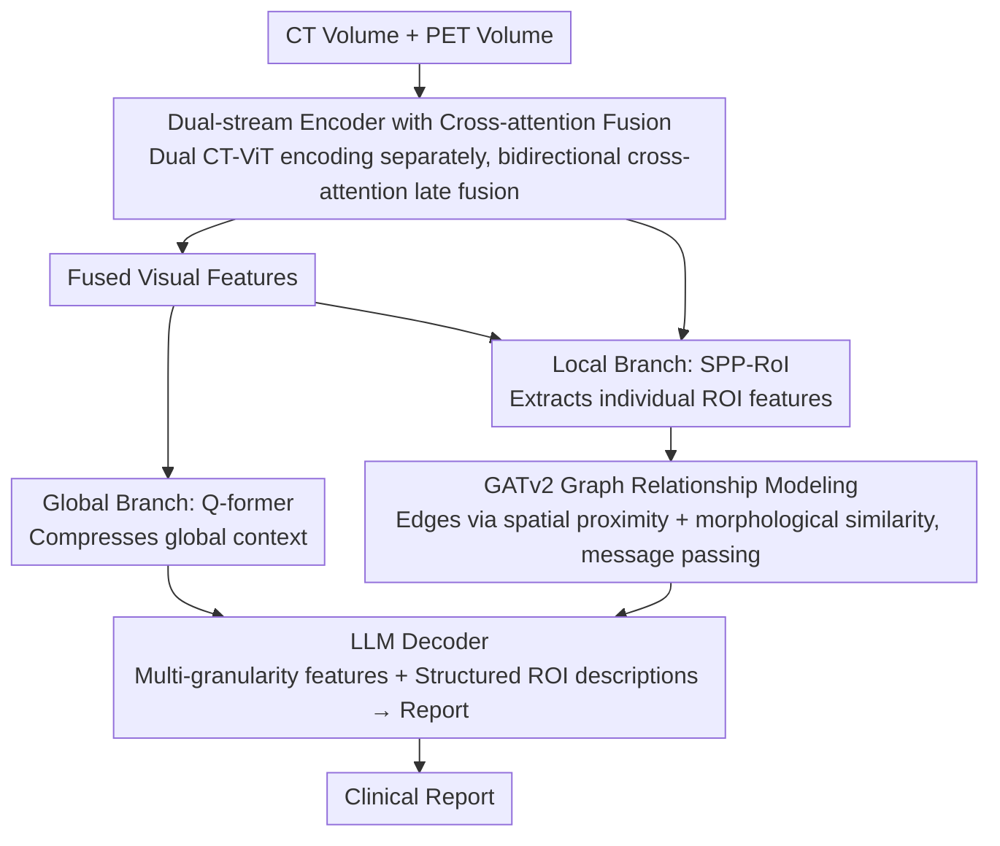

# Region-Grounded Report Generation for 3D Medical Imaging: A Fine-Grained Dataset and Graph-Enhanced Framework

**Conference**: ACL 2026  
**arXiv**: [2604.18145](https://arxiv.org/abs/2604.18145)  
**Code**: Available (GitHub, to be released after paper acceptance)  
**Area**: Medical NLP  
**Keywords**: PET/CT Report Generation, ROI Annotation, Graph Neural Networks, 3D Medical Imaging, Low-resource Languages

## TL;DR
This paper introduces VietPET-RoI, the first 3D PET/CT dataset (Vietnamese) with fine-grained ROI annotations, and HiRRA, a hierarchical report generation framework that simulates the diagnostic workflow of radiologists. By modeling spatial-morphological relationships between ROIs using Graph Neural Networks, the framework achieves a 19.7% improvement in BLEU-4 and a 45.8% increase in the clinical metric RoIQ.

## Background & Motivation

**Background**: Vision-Language Models (VLMs) have achieved significant progress in automated medical report generation, but report generation for 3D PET/CT remains in its early stages. Current models suffer from unsatisfactory accuracy and severe hallucinations, creating a large gap between model performance and clinical requirements.

**Limitations of Prior Work**: Current PET/CT report generation models follow an end-to-end paradigm—directly mapping the entire 3D volume to a text report. This "black box" strategy ignores the inherent complexity of PET/CT data. In clinical practice, radiologists follow a systematic diagnostic workflow: identifying specific Regions of Interest (ROIs), evaluating the attributes of each ROI (size, density, SUVmax, etc.), analyzing spatial and physiological relationships between ROIs, and finally synthesizing these findings to write a report. Furthermore, existing datasets either provide segmentation masks without reports or reports without ROI-level annotations, particularly lacking data for low-resource languages like Vietnamese.

**Key Challenge**: End-to-end models lack the inductive biases of clinical workflows, preventing them from learning the reasoning process "from region-level findings to diagnostic conclusions." Additionally, there is a lack of training data with ROI-level annotations to support region-based learning.

**Goal**: (1) Construct the first 3D PET/CT dataset with fine-grained ROI annotations; (2) design a hierarchical framework that simulates the diagnostic workflow of radiologists.

**Key Insight**: The authors observe that radiologist diagnosis is essentially a hierarchical process—local analysis followed by global synthesis. Therefore, it is necessary to provide both global volume features and local ROI features while modeling dependencies between ROIs (e.g., adjacent lesions may suggest local invasion, while distant lesions with similar metabolic patterns may suggest metastasis).

**Core Idea**: Utilize a dual-stream encoder to extract CT (anatomical) and PET (metabolic) features respectively, then model the spatial-morphological relationships between ROIs through a GATv2 Graph Neural Network. Finally, inject multi-granularity global and local features into an LLM to generate the report.

## Method

### Overall Architecture
HiRRA consists of three core modules: (1) Dual-stream Encoder: processes CT and PET volumes separately and fuses them via cross-attention to obtain visual features; (2) Hierarchical Feature Extractor: a global context branch compresses global information through a Q-former, while a local context branch extracts ROI features via SPP-RoI and models inter-ROI relationships using GATv2; (3) LLM Decoder: receives multi-granularity features and structured ROI descriptions as prompts to generate clinical reports.

### Key Designs

**1. Dual-stream Encoder and Cross-attention Fusion: Decoupling Anatomy (CT) and Metabolism (PET)**

Directly concatenating CT and PET volumes for a single encoder causes modal features to blend too early, leading to mutual interference. CT captures tissue boundaries and organ morphology, while PET quantifies glucose metabolic activity—complementary but distinct information. HiRRA uses two independent CT-ViT 3D encoders to extract $F_{CT}$ and $F_{PET} \in \mathbb{R}^{B \times N \times D}$, and performs cross-modal fusion at higher levels using bidirectional cross-attention:

$$\tilde{F}_{CT} = F_{CT} + \text{CA}(F_{CT}, F_{PET})$$

The same applies to the PET stream. The results are averaged and processed through a multi-scale pyramid network. This allows CT to provide localization and morphology ("where and what") while PET provides functional signals ("abnormal metabolism"), and late fusion preserves idiosyncratic modal properties.

**2. GATv2 Graph Relationship Modeling: Connecting Isolated ROIs for Metastasis and Invasion Reasoning**

Analyzing ROIs in isolation misses critical clinical clues—neighboring lesions might imply local invasion, whereas distant lesions with similar metabolic patterns might suggest metastasis. HiRRA constructs a graph with ROIs as nodes and edges based on two criteria: spatial proximity (centroid geometric distance $d_{ij} < \tau_d$) and morphological similarity (feature cosine similarity $s_{ij} > \tau_s$). Edge features encode spatial relations (distance, direction, volume ratio) and morphological relations (similarity, average CT/PET intensity), with GATv2 attention mechanisms propagating information. This explicitly embeds "spatial adjacency" and "metabolic similarity" into the representations.

**3. Clinical Evaluation Metrics (RoI Coverage and RoI Quality Index): Measuring Quality via Clinical Accuracy over Lexical Overlap**

BLEU/ROUGE only measure surface-level overlap; a well-phrased report with incorrect lesion localization can still score high, which is clinically dangerous. HiRRA proposes two region-level metrics: RoI Coverage uses Hungarian matching to pair predicted and ground-truth ROIs to calculate Precision/Recall/F1; RoI Quality Index (RoIQ) performs attribute-level evaluation on matched ROI pairs:

$$\text{RoIQ} = \sqrt{S_{\text{region}} \cdot S_{\text{lesion}}} \times \frac{1}{|\mathcal{A}|}\sum_k S_k$$

The geometric mean of anatomical region score $S_{\text{region}}$ and lesion type score $S_{\text{lesion}}$ serves as a non-linear penalty—if a core attribute is wrong, the geometric mean drops sharply, preventing high scores in secondary attributes from compensating. This ensures RoIQ reflects "diagnostic correctness" rather than "sentence similarity."

### Loss & Training
A four-stage progressive training strategy is adopted: Stage 1 involves pre-training the dual-stream encoder using CLIP contrastive learning; Stage 2 freezes the encoder and LLM to train the Q-former for vision-language alignment; Stage 3 introduces the local context modules (SPP-RoI + GATv2) with frozen parameters from previous stages; Stage 4 uses LoRA ($r=16, \alpha=32$) for end-to-end fine-tuning.

## Key Experimental Results

### Main Results

| Method | BLEU-4 | ROUGE-L | BERT | Correct ROI Count | RoI F1 | RoIQ |
|------|--------|---------|------|----------|--------|------|
| MedM-VL | 31.69 | 50.00 | 91.92 | 62/416 | 14.16 | 23.24 |
| M3D-LaMed | 44.30 | 64.39 | 85.90 | 193/416 | 39.83 | 36.31 |
| HiRRA (No RoI) | 52.48 | 66.51 | 95.13 | 187/416 | 37.58 | 33.89 |
| **Ours (HiRRA)** | **62.80** | **69.66** | **95.79** | **223/416** | **42.47** | **56.86** |
| Gain Δ% | +19.7% | +4.7% | +0.7% | +15.5% | +6.6% | **+45.8%** |

### Ablation Study

| Configuration | Key Metric | Description |
|------|---------|------|
| HiRRA Full | RoIQ=56.86 | Complete model |
| Without ROI annotation (No RoI) | RoIQ=33.89 | ROI-level supervision contributes most; RoIQ drops by 22.97 |
| Single CT Encoder | Performance Drop | Missing PET metabolic information |
| Single PET Encoder | Greater Drop | Missing CT anatomical structure information |

### Key Findings
- ROI-level annotation significantly improves clinical metrics—RoIQ increased from 33.89 to 56.86 (+45.8%), indicating that fine-grained regional supervision is key to reducing hallucinations.
- Existing VLMs perform poorly on Vietnamese (BLEU-4 near 0), highlighting a lag in medical AI for low-resource languages.
- GATv2 graph relationship modeling is most beneficial for diagnosing metastatic diseases by correlating distant ROIs with similar metabolic patterns.
- Dual-modal fusion shows distinct advantages over single-modality; CT provides localization while PET provides functional information, both being indispensable.

## Highlights & Insights
- The **ROI-level annotation strategy** transforms report generation from an "end-to-end black box" into an interpretable "analyze-then-synthesize" paradigm, which is transferable to other 3D medical imaging tasks.
- The **RoIQ metric design** is sophisticated—using a geometric mean to apply non-linear penalties to core attributes ensures that errors in anatomical localization or lesion type cannot be masked by high scores in minor attributes. This hierarchical evaluation can be extended to any task requiring structured output assessment.
- The **four-stage progressive training strategy** effectively balances the learning of different modules—from global alignment to local refinement and finally end-to-end optimization.

## Limitations & Future Work
- The dataset size is relatively small (200 patients, 600 samples, 1960 ROIs), which limits the model's generalization capabilities.
- Currently, it only supports Vietnamese; extension to more languages is needed to verify the framework's universality.
- ROI annotation relies on manual work from 8 nuclear medicine specialists, which is costly and difficult to scale.
- Future work could consider integrating an automatic ROI detection module to replace manual annotation for end-to-end automation.
- Explicitly visualizing the ROI-level reasoning process to provide more detailed diagnostic explanations is a potential direction.

## Related Work & Insights
- **vs M3D-LaMed**: M3D-LaMed is a general 3D medical VLM but lacks ROI-level supervision, performing significantly worse on clinical metrics than HiRRA (RoIQ 36.31 vs 56.86).
- **vs ViMed-PET**: ViMed-PET provides Vietnamese PET/CT report data but only contains global report labels without fine-grained ROI-level annotations.
- **vs CT2Rep**: CT2Rep is limited to global CT-only report mapping and does not support the PET modality or ROI-level reasoning.

## Rating
- Novelty: ⭐⭐⭐⭐⭐ First 3D PET/CT dataset with ROI-level annotations; novel graph-enhanced framework design.
- Experimental Thoroughness: ⭐⭐⭐⭐ Comprehensive multi-baseline comparisons, ablation analysis, and clinical metrics, though the dataset scale is small.
- Writing Quality: ⭐⭐⭐⭐ Clear structure and well-articulated clinical motivation.
- Value: ⭐⭐⭐⭐⭐ The dataset and evaluation metrics are significant contributions to the medical imaging AI community.

<!-- RELATED:START -->

## Related Papers

- [\[ACL 2026\] CT-FineBench: A Diagnostic Fidelity Benchmark for Fine-Grained Evaluation of CT Report Generation](ct-finebench_a_diagnostic_fidelity_benchmark_for_fine-grained_evaluation_of_ct_r.md)
- [\[ACL 2026\] ProMedical: Hierarchical Fine-Grained Criteria Modeling for Medical LLM Alignment via Explicit Injection](promedical_hierarchical_fine-grained_criteria_modeling_for_medical_llm_alignment.md)
- [\[ACL 2026\] Text-Attributed Knowledge Graph Enrichment with Large Language Models for Medical Concept Representation](text-attributed_knowledge_graph_enrichment_with_large_language_models_for_medica.md)
- [\[ACL 2026\] MHGraphBench: Knowledge Graph-Grounded Benchmarking of Mental Health Knowledge in Large Language Models](mhgraphbench_knowledge_graph-grounded_benchmarking_of_mental_health_knowledge_in.md)
- [\[ACL 2026\] MARCH: Multi-Agent Radiology Clinical Hierarchy for CT Report Generation](march_multi-agent_radiology_clinical_hierarchy_for_ct_report_generation.md)

<!-- RELATED:END -->
