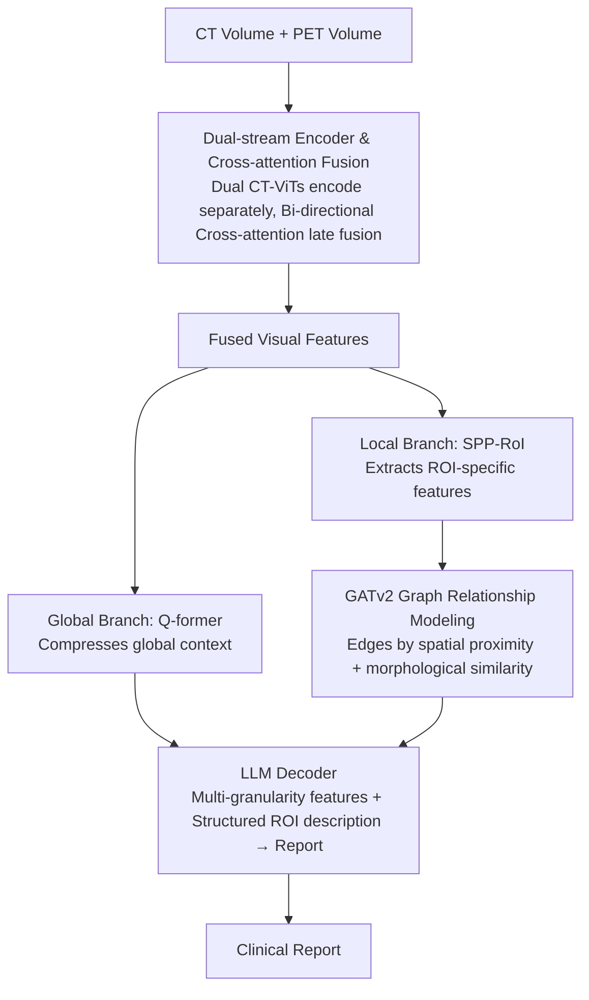

# Region-Grounded Report Generation for 3D Medical Imaging: A Fine-Grained Dataset and Graph-Enhanced Framework

**Conference**: ACL 2026  
**arXiv**: [2604.18145](https://arxiv.org/abs/2604.18145)  
**Code**: Yes (GitHub, to be released upon paper acceptance)  
**Area**: Medical NLP  
**Keywords**: PET/CT report generation, ROI annotation, GNN, 3D medical imaging, low-resource languages

## TL;DR
This paper introduces VietPET-RoI, the first 3D PET/CT dataset (Vietnamese) with fine-grained ROI annotations, and HiRRA, a hierarchical report generation framework that simulates radiologist diagnostic workflows. By modeling spatial-morphological relationships between ROIs via graph neural networks, it achieves a 19.7% improvement in BLEU-4 and a 45.8% increase in the clinical metric RoIQ.

## Background & Motivation

**Background**: Vision-language models (VLMs) have made significant progress in automated medical report generation, but 3D PET/CT report generation is still in its early stages. Current models suffer from suboptimal accuracy and severe hallucination, presenting a large gap from clinical requirements.

**Limitations of Prior Work**: Existing PET/CT report generation models follow an end-to-end paradigm—directly mapping the entire 3D volume to a text report. This "black box" strategy ignores the intrinsic complexity of PET/CT data. In clinical practice, the diagnostic workflow of a radiologist involves: systematically identifying specific Regions of Interest (ROIs), evaluating attributes of each ROI (size, density, SUVmax, etc.), analyzing spatial and physiological relationships between ROIs, and finally synthesizing all findings to write the report. Furthermore, existing datasets either contain segmentations without reports or reports without ROI-level annotations, particularly lacking data for low-resource languages like Vietnamese.

**Key Challenge**: End-to-end models lack the inductive biases of clinical workflows and cannot learn the reasoning process "from region-level findings to diagnostic conclusions." There is also a lack of training data with ROI-level annotations to support regional learning.

**Goal**: (1) Construct the first 3D PET/CT dataset with fine-grained ROI annotations; (2) Design a hierarchical framework simulating the radiologist's diagnostic process.

**Key Insight**: The authors observe that radiologist diagnosis is essentially a hierarchical process—local analysis followed by global synthesis. Therefore, it is necessary to provide both global volumetric features and local ROI features while modeling dependencies between ROIs (e.g., adjacent lesions may suggest local invasion, while distant lesions with similar metabolic patterns may suggest metastasis).

**Core Idea**: A dual-stream encoder is used to extract CT (anatomical) and PET (metabolic) features respectively. A GATv2 graph neural network then models the spatial-morphological relationships between ROIs. Finally, multi-granularity global and local features are injected into an LLM to generate reports.

## Method

### Overall Architecture
HiRRA consists of three core modules: (1) Dual-stream encoder: processes CT and PET volumes separately, fused via cross-attention to obtain visual features; (2) Hierarchical feature extractor: the global context branch compresses global information via Q-former, while the local context branch extracts ROI features via SPP-RoI and models inter-ROI relationships via GATv2; (3) LLM decoder: receives multi-granularity features and structured ROI descriptions as prompts to generate clinical reports.

### Key Designs

**1. Dual-stream Encoder with Cross-attention Fusion: Decoupling Anatomy (CT) and Metabolism (PET)**

Directly concatenating CT and PET before encoding leads to early modality mixing where features drown each other out. Anatomical shapes in CT and glucose metabolic activity in PET are complementary but distinct. HiRRA uses two independent CT-ViT 3D encoders to extract $F_{CT}$ and $F_{PET} \in \mathbb{R}^{B \times N \times D}$ respectively, performing cross-modal fusion only at higher levels using bi-directional cross-attention:

$$\tilde{F}_{CT} = F_{CT} + \text{CA}(F_{CT}, F_{PET})$$

The same applies to the PET stream. The average is taken and passed through a multi-scale pyramid network. This ensures CT provides localization and morphology while PET provides functional signals, maintaining modality-specific characteristics while allowing mutual calibration.

**2. GATv2 Graph Relationship Modeling: Connecting Isolated ROIs for Metastasis and Invasion Inference**

Analyzing ROIs in isolation misses critical clinical clues—neighboring lesions might imply local invasion, while distant lesions with similar metabolic patterns might suggest metastasis. HiRRA builds a graph with ROIs as nodes. Edges are established based on: spatial proximity (centroid geometric distance $d_{ij} < \tau_d$) and morphological similarity (feature cosine similarity $s_{ij} > \tau_s$). Edge features encode spatial relationships (distance, relative direction, volume ratio) and morphological relationships (similarity, mean CT/PET intensity), with messages propagated via GATv2. This explicitly builds clinical relationships into the representation.

**3. Clinical Metrics (RoI Coverage and RoI Quality Index): Measuring Quality Beyond Token Overlap**

BLEU/ROUGE only measure lexical overlap; a report with correct wording but wrong lesion localization can still score high. HiRRA proposes two region-level metrics: RoI Coverage uses Hungarian matching between predicted and ground-truth ROIs to calculate Precision/Recall/F1. RoI Quality Index (RoIQ) performs attribute-level evaluation on matched ROI pairs:

$$\text{RoIQ} = \sqrt{S_{\text{region}} \cdot S_{\text{lesion}}} \times \frac{1}{|\mathcal{A}|}\sum_k S_k$$

The geometric mean of anatomical region score $S_{\text{region}}$ and lesion type score $S_{\text{lesion}}$ acts as a deliberate non-linear penalty—if a core attribute (localization or lesion type) is wrong, the low geometric mean prevents secondary attributes from inflating the score. This ensures RoIQ reflects "diagnostic accuracy" rather than "sentence similarity."

### Loss & Training
A four-stage progressive training strategy is employed: Stage 1 involves CLIP contrastive pre-training for the dual-stream encoder; Stage 2 freezes the encoder and LLM to train the Q-former for vision-language alignment; Stage 3 introduces the local context module (SPP-RoI + GATv2); Stage 4 uses LoRA ($r=16, \alpha=32$) for end-to-end fine-tuning.

## Key Experimental Results

### Main Results

| Method | BLEU-4 | ROUGE-L | BERT | Correct ROIs | RoI F1 | RoIQ |
|------|--------|---------|------|----------|--------|------|
| MedM-VL | 31.69 | 50.00 | 91.92 | 62/416 | 14.16 | 23.24 |
| M3D-LaMed | 44.30 | 64.39 | 85.90 | 193/416 | 39.83 | 36.31 |
| HiRRA (No RoI) | 52.48 | 66.51 | 95.13 | 187/416 | 37.58 | 33.89 |
| **HiRRA** | **62.80** | **69.66** | **95.79** | **223/416** | **42.47** | **56.86** |
| Gain Δ% | +19.7% | +4.7% | +0.7% | +15.5% | +6.6% | **+45.8%** |

### Ablation Study

| Configuration | Key Metric | Description |
|------|---------|------|
| HiRRA Full | RoIQ=56.86 | Full model |
| No ROI Annotation | RoIQ=33.89 | ROI-level supervision has highest impact, RoIQ drops by 22.97 |
| Single CT Encoder | Performance drop | Lacks PET metabolic information |
| Single PET Encoder | Higher perf. drop | Lacks CT anatomical structure |

### Key Findings
- ROI-level annotations significantly boost clinical metrics—RoIQ improved from 33.89 to 56.86 (+45.8%), indicating fine-grained regional supervision is key to reducing hallucinations.
- Existing VLMs perform poorly on Vietnamese (BLEU-4 near 0), highlighting a lag in medical AI for low-resource languages.
- GATv2 graph modeling is most helpful for diagnosing metastatic diseases by correlating distant lesions with similar metabolic patterns.
- Dual-modality fusion is superior to single modality, as CT provides localization and PET provides functional signals.

## Highlights & Insights
- The **ROI-level annotation strategy** transforms report generation from an "end-to-end black box" into an interpretable "analyze then synthesize" paradigm, a concept transferable to other 3D medical imaging tasks.
- The **RoIQ metric design** is sophisticated—using a geometric mean to apply a non-linear penalty to core attributes ensures that localization or lesion type errors cannot be masked by high scores in minor attributes.
- The four-stage progressive training strategy effectively balances the learning of different modules, from global alignment to local refinement.

## Limitations & Future Work
- The dataset size is relatively small (200 patients, 600 samples, 1,960 ROIs), which may limit model generalization.
- Currently supports only Vietnamese; extension to more languages is needed to verify framework versatility.
- ROI annotation relies on manual labeling by 8 nuclear medicine specialists, which is costly and difficult to scale.
- Future work could introduce automated ROI detection modules to replace manual annotation for fully automated pipelines.

## Related Work & Insights
- **vs M3D-LaMed**: M3D-LaMed is a general 3D medical VLM but lacks ROI-level supervision, performing significantly worse on clinical metrics (RoIQ 36.31 vs 56.86).
- **vs ViMed-PET**: ViMed-PET provides Vietnamese PET/CT report data but lacks fine-grained ROI-level annotations.
- **vs CT2Rep**: CT2Rep is limited to global CT-only report mapping and does not support PET modality or ROI-level reasoning.

## Rating
- Novelty: ⭐⭐⭐⭐⭐ First 3D PET/CT dataset with ROI-level labels; innovative graph-enhanced framework.
- Experimental Thoroughness: ⭐⭐⭐⭐ Comprehensive baselines and clinical metrics, though dataset size is limited.
- Writing Quality: ⭐⭐⭐⭐ Clear structure and strong clinical motivation.
- Value: ⭐⭐⭐⭐⭐ Significant contribution to the medical imaging AI community regarding datasets and evaluation metrics.

## Related Papers

- [\[ACL 2026\] CT-FineBench: A Diagnostic Fidelity Benchmark for Fine-Grained Evaluation of CT Report Generation](ct-finebench_a_diagnostic_fidelity_benchmark_for_fine-grained_evaluation_of_ct_r.md)
- [\[ACL 2026\] ProMedical: Hierarchical Fine-Grained Criteria Modeling for Medical LLM Alignment via Explicit Injection](promedical_hierarchical_fine-grained_criteria_modeling_for_medical_llm_alignment.md)
- [\[ACL 2026\] Text-Attributed Knowledge Graph Enrichment with Large Language Models for Medical Concept Representation](text-attributed_knowledge_graph_enrichment_with_large_language_models_for_medica.md)
- [\[ACL 2026\] MHGraphBench: Knowledge Graph-Grounded Benchmarking of Mental Health Knowledge in Large Language Models](mhgraphbench_knowledge_graph-grounded_benchmarking_of_mental_health_knowledge_in.md)
- [\[ACL 2026\] MARCH: Multi-Agent Radiology Clinical Hierarchy for CT Report Generation](march_multi-agent_radiology_clinical_hierarchy_for_ct_report_generation.md)

<!-- RELATED:END -->

<!-- RELATED:START -->

## Related Papers

- [\[ACL 2026\] SEMA-RAG: A Self-Evolving Multi-Agent Retrieval-Augmented Generation Framework for Medical Reasoning](sema-rag_a_self-evolving_multi-agent_retrieval-augmented_generation_framework_fo.md)
- [\[ACL 2026\] Anonpsy: A Graph-Based Framework for Structure-Preserving De-identification of Psychiatric Narratives](anonpsy_a_graph-based_framework_for_structure-preserving_de-identification_of_ps.md)
- [\[ACL 2026\] Beyond Prompt: Fine-grained Simulation of Cognitively Impaired Standardized Patients via Stochastic Steering](beyond_prompt_fine-grained_simulation_of_cognitively_impaired_standardized_patie.md)
- [\[ACL 2026\] RA-RRG: Multimodal Retrieval-Augmented Radiology Report Generation with Key Phrase Extraction](ra-rrg_multimodal_retrieval-augmented_radiology_report_generation_with_key_phras.md)
- [\[ACL 2026\] PrinciplismQA: A Philosophy-Grounded Approach to Assessing LLM-Human Clinical Medical Ethics Alignment](principlismqa_a_philosophy-grounded_approach_to_assessing_llm-human_clinical_med.md)

<!-- RELATED:END -->
