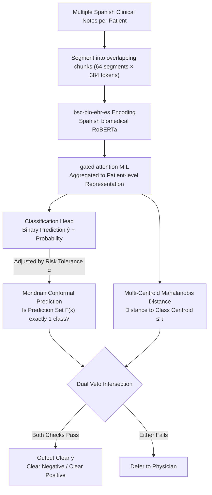

# Reliable Automated Triage in Spanish Clinical Notes: A Hybrid Framework for Risk-Aware HIV Suspicion Identification

**Conference**: ACL2026  
**arXiv**: [2605.21256](https://arxiv.org/abs/2605.21256)  
**Code**: https://github.com/romorale/mil_uq_public  
**Area**: Clinical NLP / Medical Text Triage  
**Keywords**: Clinical NLP, Selective Classification, Uncertainty Quantification, HIV Suspicion Identification, Spanish EHRs  

## TL;DR
This paper proposes a dual-validation selective triage framework for early HIV suspicion identification in Spanish clinical notes, utilizing MCP to handle aleatoric uncertainty and MCMD geometric veto to handle epistemic uncertainty. The system automatically processes 67.7% of cases while achieving a 0.982 Clear $F_2$ under strict safety constraints.

## Background & Motivation
**Background**: Medical text NLP often treats Electronic Health Record (EHR) classification as a deterministic binary task, reporting overall metrics such as AUROC, F1, or $F_2$. For early HIV suspicion identification, NLP systems can help filter out clearly negative cases, reserving clinical resources for patients who more urgently require physician judgment.

**Limitations of Prior Work**: Clinical suspicion is not equivalent to a final serological diagnosis; rather, it is a partially observable construct determined by physician notes, testing behaviors, and the medical context of the records. If a model is forced to provide binary classifications for all cases, it produces overconfident errors on ambiguous narratives, out-of-distribution (OOD) cases, and minority class samples, which is far more severe in clinical triage than in standard benchmarks.

**Key Challenge**: Clinical automation requires high coverage to reduce manual burden, yet medical safety requires the system to know when to defer. Standard UQ methods often rely solely on predictive entropy, conflating the inherent ambiguity of text with the risks of unseen distributions, leading to either the excessive deferral of true positives or the dangerous automation of anomalous cases.

**Goal**: The authors aim to replace forced classification with a trinary triage with rejection: Clear Negative, Clear Positive, or Defer. The system does not pursue automatic determination for all samples but instead ensures sufficient reliability within an automatable subdomain while returning high-risk samples to physicians.

**Key Insight**: The paper decomposes uncertainty into two categories: MCP handles aleatoric ambiguity at the probabilistic level, and MCMD handles epistemic anomaly in the latent space. Only cases that pass both checks simultaneously are permitted for automatic output.

**Core Idea**: Clinical narratives must simultaneously pass the probabilistic safety boundary of conformal prediction and the geometric in-distribution check of Mahalanobis distance, converting unreliable binary predictions into risk-controlled selective triage through a dual veto.

## Method
The core of this paper is not the proposal of a larger text encoder, but rather placing a clinical text classifier inside a safety shell capable of rejection. The model utilizes Spanish biomedical RoBERTa and MIL to process long clinical records, followed by specialized uncertainty post-processing to decide which cases can be automated.

### Overall Architecture
The input consists of multiple Spanish clinical notes for a single patient, and the task is to determine the presence of HIV clinical suspicion. The system first segments the records into up to 64 overlapping chunks of 384 tokens each, encoded using PlanTL-GOB-ES/bsc-bio-ehr-es; subsequently, gated attention MIL aggregates these into patient-level representations. A classification head provides binary predictions, and a post-processing module then determines whether to defer.

Training and evaluation use an anonymized EHR cohort from HUFA hospital, comprising 13,642 patients and 63,802 notes. The suspected cohort is filtered by HIV serology test requests and EuroTEST indicator conditions, while the non-suspected cohort consists of patients with no relevant testing history. The authors also proactively removed HIV abbreviations and direct testing recommendations to reduce explicit leakage.

The final decision logic is a strict intersection: the system outputs $\hat{y}$ only when the MCP prediction set size is 1 AND the Mahalanobis distance from the sample to the local centroid of the predicted class does not exceed the class threshold $\tau_{dist}(\hat{y})$; otherwise, it outputs a deferral.

### Key Designs
**1. Mondrian Conformal Prediction for aleatoric uncertainty: Determining if textual evidence is sufficiently clear**

Clinical narratives are often incomplete or ambiguously phrased; this ambiguity cannot be resolved by simply changing a classification threshold—hard decisions on ambiguous cases merely produce overconfident errors. MCP first applies temperature scaling to validation set logits to mitigate overconfidence, then constructs a prediction set $\Gamma^{\alpha}(x)$ based on the risk tolerance $\alpha$. If the set contains exactly one class, the evidence is considered sufficiently clear; if the set contains multiple classes (conflicting evidence) or is empty (insufficient evidence), a deferral is triggered. In other words, conformal prediction explicitly quantifies "probabilistic ambiguity" as set size, allowing hospital administrators to read the current risk level directly rather than being misled by a seemingly confident softmax.

**2. Multi-Centroid Mahalanobis Distance for epistemic uncertainty: Blocking OOD cases where softmax is confident but representation is anomalous**

Probabilities alone are insufficient—some cases receive high softmax confidence while their latent representations fall outside the training distribution, meaning the model is "extrapolating confidently." MCMD automatically selects multiple local centroids per class using k-means in an $L_2$ normalized latent space (the minimum number of clusters $K$ is determined by the elbow where inertia gain falls below 0.05). The anomaly score of a sample is the minimum Mahalanobis distance to any centroid of the predicted class:

$$d_M(x,\hat{y})=\min_k\sqrt{r_{\hat{y},k}^\top\Sigma^{-1}r_{\hat{y},k}}$$

The global precision matrix $\Sigma^{-1}$ is robustly estimated using OAS shrinkage from residuals. Multi-centroid is used instead of a single Gaussian because HIV suspicion phenotypes are highly heterogeneous; a single center would overestimate the variance of minority classes, causing the geometric veto to fail. Multi-centroid preserves phenotypic diversity while avoiding unstable local covariance estimation in high dimensions.

**3. Risk-asymmetric clinical evaluation and adjustable operational dial: Metrics aligned with the cost structure of early screening**

Standard F1 treats all errors equally, but missing an early HIV diagnosis delays ART and increases transmission risk, which is far costlier than an unnecessary test. Evaluation functions that do not reflect this asymmetry mislead deployment decisions. The authors use $F_2$ to emphasize the penalty on false negatives, ECE for calibration, and coverage/TPDR/AURC for triage efficiency. They also designed a Custom Risk-Kappa, where the penalty for an automated false negative is 1.0, false positive and true positive deferral is 0.5, and true negative deferral is 0.25. Accompanying this, the risk tolerance $\alpha$ is designed as an adjustable knob: decreasing it leads to higher caution and lower coverage but higher Clear $F_2$, while increasing it raises coverage by automating more cases.

### Loss & Training
Two MIL architectures are compared at the encoder level. Standard MIL uses Label-Smoothed Focal Loss for class imbalance and adds R-Drop to constrain KL consistency between two forward passes. MD-SN MIL utilizes a Mahalanobis Distance + Spectral Normalization structure combined with Logit Adjustment, adding class priors to logits to prevent focal loss from distorting probability calibration. SN is applied to the dense layers of the MIL head to obtain a smoother feature space suitable for the geometric veto.

The UQ backend includes MC Dropout, 10-fold CV Deep Ensembles, and deterministic MD-SN. Threshold fitting uses out-of-fold calibration to avoid optimistic bias from tuning on training samples.

## Key Experimental Results

### Main Results
The main results evaluate forced binary versus selective screening under a strict risk tolerance of $\alpha=0.01$. The primary conclusion is that while forced binary scores appear acceptable, only the dual veto isolates a reliable subdomain suitable for clinical automation once safety constraints are introduced.

| Architecture / UQ | Binary $F_2$ | Clear $F_2$ | Binary ECE | Clear ECE | Coverage | TPDR | AURC | Risk-Kappa |
|-----------|--------------|-------------|------------|-----------|----------|------|------|------------|
| Encoder baseline + CV Ensemble | 0.769 | 0.973 | 0.077 | 0.031 | 47.8% | 50.5% | - | - |
| Standard MIL + MD-SN | 0.813 | 0.966 | 0.028 | 0.026 | 70.7% | 31.9% | 0.012 | 0.601 |
| MD-SN MIL + CV Ensemble | 0.821 | 0.982 | 0.022 | 0.021 | 67.7% | 33.2% | 0.006 | 0.576 |

### Ablation Study
The ablation primarily verifies the necessity of the dual veto and the utility of $\alpha$ as an operational knob.

| Configuration | Coverage | Clear $F_2$ | Risk-Kappa | Description |
|------|----------|-------------|------------|------|
| Aleatoric Only / MCP | 92.6% | 0.902 | 0.751 | Detects probabilistic ambiguity but misses geometric anomalies |
| Epistemic Only / MCMD | 98.8% | 0.831 | 0.788 | High coverage but significant safety degradation |
| Standard Uncertainty | 99.3% | 0.824 | 0.788 | Conventional entropy thresholding creates inflated coverage |
| Dual Veto / Hybrid | 91.3% | 0.913 | 0.755 | Clear $F_2$ is 0.089 higher than standard UQ with non-overlapping CI |

| Model | $\alpha$ | Coverage | TPDR | Clear $F_2$ | Clear ECE | Risk-Kappa |
|------|----------|----------|------|-------------|-----------|------------|
| Standard MIL | 0.01 | 63.5% | 29.6% | 0.979 | 0.009 | 0.546 |
| Standard MIL | 0.05 | 91.1% | 7.0% | 0.902 | 0.015 | 0.747 |
| MD-SN MIL | 0.01 | 67.7% | 33.2% | 0.982 | 0.021 | 0.576 |
| MD-SN MIL | 0.05 | 91.3% | 10.2% | 0.913 | 0.029 | 0.755 |

### Key Findings
- Forced binary evaluation masks risks. For instance, the MD-SN architecture with MC Dropout achieves the highest Binary $F_2$ of 0.839, but its ECE degrades to 0.044, suggesting it is unsuitable for clinical automation.
- The benefit of the dual veto lies in safety rather than a significant advantage in Risk-Kappa. While Risk-Kappa confidence intervals often overlap, the improvement in Clear $F_2$ over standard uncertainty is statistically robust.
- $\alpha$ serves as a hospital operational knob. Relaxing $\alpha$ from 0.01 to 0.05 for MD-SN MIL increases coverage from 67.7% to 91.3% while maintaining a Clear $F_2$ of 0.913.
- Feature attribution shows that system errors are not entirely random: automated false positives are often driven by EuroTEST guideline-concordant indicator conditions like HCV or tuberculosis, reflecting the partial observability of EHR labeling/testing behavior.

## Highlights & Insights
- The greatest value of this paper lies in shifting clinical NLP from "classification accuracy" toward "automatable subdomains." This is closer to real-world deployment problems than simply scaling models.
- Aleatoric/epistemic decoupling is highly practical: MCP handles narrative ambiguity while MCMD handles OOD anomalies. Since they correspond to different clinical failure modes, they require intersection rather than substitution.
- While the Custom Risk-Kappa is task-specific, it forces readers to confront the asymmetry of medical error costs. Similar designs can be migrated to pharmacovigilance or emergency triage by redefining the penalty matrix.
- The paper avoids generative LLMs in favor of a deterministic spectrally normalized encoder, a pragmatic deployment choice: in high-risk medical scenarios, calibration, rejection, and interpretability are often more critical than generative capability.

## Limitations & Future Work
- Custom Risk-Kappa relies heavily on early infectious disease screening assumptions. For tasks with high physical intervention risks (e.g., tumor biopsy), the cost of false positives changes significantly, necessitating new health economic validation.
- Static geometric thresholds in MCMD may be affected by temporal or demographic shifts. $\tau_{dist}$ would require recalibration if hospital departments, recording styles, or patient populations change.
- Generative LLMs were not included in the core experiments. The authors argue that reliable UQ for autoregressive models remains unsolved, though this limits the direct applicability of the conclusions to current LLM medical assistants.
- Empirical data is from a single center (HUFA). HIV suspicion depends heavily on clinical writing habits and testing thresholds; multi-institutional validation is a necessary step before deployment.

## Related Work & Insights
- **vs. Standard Biomedical NLP Classifiers**: Standard classifiers optimize forced binary metrics; this work focuses on Clear $F_2$, coverage, and TPDR after selective screening, which is more aligned with clinical workflows.
- **vs. MC Dropout / Deep Ensembles**: MC Dropout is computationally light but under-calibrated; Deep Ensembles are safe but carry 10x the computation/storage burden. MD-SN attempts to obtain ensemble-like geometric uncertainty via a single forward pass.
- **vs. Traditional Selective Classification**: Conventional methods often use entropy thresholds. This paper shows such thresholds automate 99.3% of samples but with a Clear $F_2$ of only 0.824, proving a single threshold cannot cover complex clinical risks.
- **vs. Medical LLM Triage**: This paper emphasizes rejection and calibration over explanation generation; the insight for medical LLMs is that proving when a system *should not* answer may be more critical than expanding its answering capacity.

## Rating
- Novelty: ⭐⭐⭐⭐☆ The dual veto components are derived from mature methods, but combining MCP and multi-centroid Mahalanobis veto into a clinical risk triage framework is robust.
- Experimental Thoroughness: ⭐⭐⭐⭐☆ Metrics, ablations, confidence intervals, and threshold analyses are complete; the weakness is the single-center data without cross-institutional validation.
- Writing Quality: ⭐⭐⭐⭐☆ Problem definition and clinical motivation are clear; tables are information-dense but the narrative is smooth.
- Value: ⭐⭐⭐⭐⭐ Highly valuable for high-risk medical NLP deployment, particularly the design philosophy of "not forcing the model to answer every case."

<!-- RELATED:START -->

<!-- RELATED:END -->

## Related Papers

- [\[ACL 2026\] CURA: Clinical Uncertainty Risk Alignment for Language Model-Based Risk Prediction](cura_clinical_uncertainty_risk_alignment_for_language_model-based_risk_predictio.md)
- [\[ACL 2026\] Anonpsy: A Graph-Based Framework for Structure-Preserving De-identification of Psychiatric Narratives](anonpsy_a_graph-based_framework_for_structure-preserving_de-identification_of_ps.md)
- [\[ACL 2025\] RedactX: An LLM-Powered Framework for Automatic Clinical Data De-Identification](../../ACL2025/medical_nlp/redactor_an_llm-powered_framework_for_automatic_clinical_data_de-identification.md)
- [\[ACL 2025\] ReflecTool: Towards Reflection-Aware Tool-Augmented Clinical Agents](../../ACL2025/medical_nlp/reflectool_clinical_agent.md)
- [\[ACL 2026\] MultiDx: A Multi-Source Knowledge Integration Framework towards Diagnostic Reasoning](multidx_a_multi-source_knowledge_integration_framework_towards_diagnostic_reason.md)

<!-- RELATED:END -->
