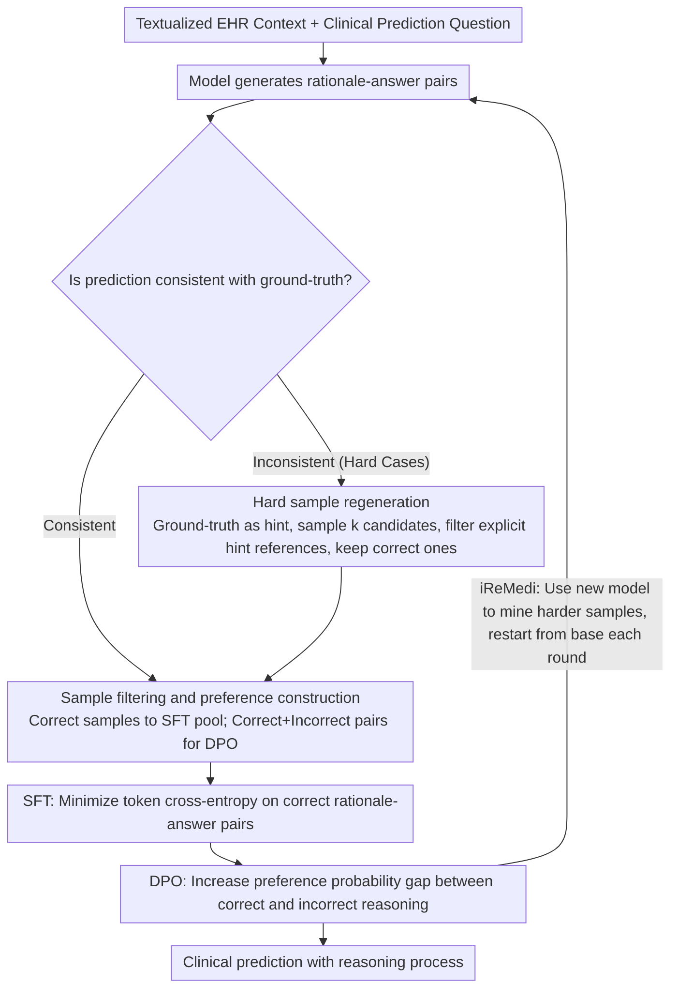

# ReMedi: Reasoner for Medical Clinical Prediction

**Conference**: ACL 2026 Findings  
**arXiv**: [2605.01474](https://arxiv.org/abs/2605.01474)  
**Code**: No public code found  
**Area**: Medical Clinical Prediction / EHR Modeling / Medical LLMs  
**Keywords**: Electronic Health Records, Clinical Prediction, Reasoning Fine-tuning, Preference Optimization, Hard Sample Regeneration

## TL;DR
ReMedi reformulates EHR clinical prediction as a "rationale-prediction" generation and preference learning task. By utilizing hard sample regeneration with ground-truth outcome hints, SFT, and DPO, it teaches medical LLMs to provide fine-grained explanations for patient risks. It achieves up to a 19.9 F1 point improvement over KARE across three clinical prediction tasks on MIMIC-IV.

## Background & Motivation
**Background**: Electronic Health Records (EHR) containing diagnoses, medications, examinations, and hospitalization trajectories are vital for predicting mortality risk, readmission, and length of stay (LOS). Recent approaches convert EHR into text for direct processing by medical LLMs or supplement domain knowledge via medical knowledge graphs, Retrieval-Augmented Generation (RAG), and knowledge distillation.

**Limitations of Prior Work**: These methods primarily focus on "knowledge injection," assuming that models are already capable of interpreting complex EHR contexts. Actual clinical prediction is not a simple factual QA; models must distinguish nuances in disease severity, treatment trajectories, and chronic risks. Simply outputting labels often causes models to learn positive-biased or overly conservative patterns.

**Key Challenge**: Clinical prediction requires both interpretable reasoning chains and accurate final labels. However, directly generating reasoning chains does not guarantee consistency between reasoning and the answer, and expensive expert annotations are difficult to scale across massive EHR samples. The core conflict identifies how to utilize existing ground-truth outcomes to low-costly construct supervision and preference data to train the model's reasoning capabilities.

**Goal**: The authors aim to enable models to automatically generate high-quality rationales from hard cases without relying on proprietary teacher models or predefined medical ontologies, transforming the relationship between correct rationales, incorrect rationales, and final answers into optimizable training signals.

**Key Insight**: Ground-truth clinical outcomes can serve as "hints" to help models back-explain difficult cases. By using label hints during the data construction phase and filtering out content that explicitly leaks the hint before training, labels are converted into reasoning data generators rather than "cheating" information during inference.

**Core Idea**: Generate more reliable rationale-answer pairs using "hard samples + ground-truth hints," followed by SFT/DPO training to align the medical LLM's prediction results with its reasoning process simultaneously.

## Method
ReMedi does not modify the EHR encoder. Instead, it reshapes the "read case, identify risk, provide conclusion" reasoning habit during the LLM post-training phase: first, the model generates its own reasoning and predictions for each EHR question; correct samples are used for SFT. For incorrect hard cases, ground-truth outcomes are used as hints to induce more reasonable explanations. Finally, correct and incorrect responses are paired for DPO.

### Overall Architecture
The input consists of a textualized patient EHR context and a clinical prediction question; the output is a predicted answer accompanied by a reasoning process. The pipeline consists of three steps: generating rationale-answer pairs from the training set; performing label-hinted regeneration for incorrect or difficult samples; and using correct samples for SFT and paired correct/incorrect responses for DPO. Additionally, the authors propose iReMedi, which executes this three-stage process iteratively—using the model trained in the previous round as the data generator for the next, while always re-initializing from the original base model to prevent noise accumulation.

### Key Designs

**1. Ground-truth based Filtering & Preference Construction: Converting existing EHR labels into supervision and preference signals**

While clinical labels (mortality, readmission, LOS) are readily available, reasoning chains explaining "why" are extremely expensive. This design uses labels as filters for reasoning quality: given a question $q_i$ and ground-truth $a_i$, the generator outputs rationale $\hat r_i$ and answer $\hat a_i$. If $\hat a_i = a_i$, the pair enters the SFT dataset. When both correct and incorrect outputs are sampled for the same question, they are paired as preferred and dispreferred data for DPO. Training signals thus constrain the explanation behind the answer without additional annotation costs.

**2. Hard Sample Regeneration: Focusing compute on boundary cases the model currently fails**

Easy samples provide marginal utility; the model is truly limited by complex cases where readmission or mortality risks are ambiguous. This design specifically recycles failed samples: the ground-truth answer is passed back as a hint for label rationalization. For each sample, $k$ candidates are sampled, retaining only those that provide the correct answer without explicitly mentioning the hint in the rationale. This forces the model to ground its reasoning in the patient case itself.

**3. SFT/DPO & Iterative iReMedi: Imitating correct reasoning, then separating probabilities of correct vs. incorrect reasoning**

SFT alone may lead to superficial patterns—plausible rationales with incorrect answers. ReMedi uses two stages: SFT minimizes token cross-entropy on correct rationale-answer pairs to teach "how to reason"; DPO then optimizes the preference for correct over incorrect outputs, explicitly penalizing "plausible-looking but wrong" reasoning. iReMedi iterates this, mining harder samples each round, but restarting from the original base model to avoid being locked into the generation quality of the initial model.

### Loss & Training
The experiments use HuatuoGPT-o1-7B as the base model, fine-tuned using TRL, Transformers, DeepSpeed, and Flash-Attention2. The learning rate is $5e^{-6}$ with the AdamW optimizer and a batch size of 16. Data from MIMIC-IV is split 0.8/0.1/0.1 for training, validation, and testing. SFT minimizes cross-entropy for correct tokens; DPO maximizes the preference ratio of correct vs. incorrect rationale-answer pairs.

## Key Experimental Results

### Main Results
Evaluation is performed on MIMIC-IV for three clinical predictions: Mortality, 15-day readmission, and LOS. Each task maintains 10,000 samples. The mortality task includes 2,701 positive outcomes; readmission is balanced (5,000/5,000); LOS is a four-class task with 2,500 samples per class.

| Method | Mortality Acc/F1 | Readmission Acc/F1 | LOS Acc/F1 | Main Conclusion |
|------|-------------|----------------|------------------|----------|
| Few-shot HuatuoGPT-o1-7B | 75.2 / 73.9 | 52.2 / 41.8 | 31.4 / 24.6 | Prompted reasoning is insufficient |
| SFT | 88.9 / 88.3 | 69.2 / 66.4 | 39.9 / 36.6 | Supervision helps, but LOS remains weak |
| KARE | 95.9 / 95.5 | 81.2 / 81.3 | 40.4 / 35.9 | Strong baseline relying on KGs/Distillation |
| ReMedi | 97.7 / 97.6 | 90.5 / 90.4 | 55.6 / 55.5 | Outperforms KARE across all tasks |
| iReMedi | 97.8 / 97.6 | 91.5 / 91.4 | 56.1 / 55.8 | Iterative training further boosts results |

### Ablation Study
The paper analyzes the contributions of DPO, iterative training, and STaR-style self-training on the readmission task.

| Configuration | Acc | F1 | TPR | TNR | Notes |
|------|-----|----|-----|-----|------|
| ReMedi | 90.5 | 90.4 | 80.6 | 100.0 | Full three-stage process |
| ReMedi w/o DPO | 84.4 | 84.4 | 85.3 | 83.6 | Performance drops, TNR becomes unstable |
| iReMedi | 91.5 | 91.4 | 83.8 | 100.0 | Best iterative version |
| iReMedi w/o DPO | 86.8 | 86.8 | 83.7 | 89.9 | Iteration helps, but DPO is critical |
| STaR | 59.1 | 53.2 | 96.1 | 23.4 | Generic self-training is unsuitable here |

Human inspection of reasoning-prediction consistency shows that while KARE achieves 60.0% consistency, ReMedi reaches 92.5%. This indicates ReMedi improves not just label accuracy but also the alignment between explanation and conclusion.

### Key Findings
- The strongest improvement comes from the combination of hard sample regeneration and DPO: hard samples provide informative training points, while DPO suppresses incorrect reasoning.
- The LOS task saw the largest gain (15.2 Acc points over KARE), proving effective for multi-classification and fine-grained risk assessment.
- Zero-shot LLMs often suffer from high TPR but low TNR in readmission (over-predicting risk); ReMedi successfully distinguishes "stable chronic disease" from "truly high-risk chronic disease."

## Highlights & Insights
- ReMedi effectively turns labels from "final supervision" into "scaffolding for reasoning data generation." Ground-truth outcomes are used only as hints during construction, preventing leakage while improving sample quality.
- The paper demonstrates that post-training strategies alone can significantly improve EHR prediction without introducing complex external knowledge bases, which is valuable for resource-constrained medical settings.
- Alignment analysis is crucial: "plausible rationale but wrong answer" undermines trust. ReMedi treats reasoning-prediction alignment as an observable goal, providing a metric closer to deployment risk than simple accuracy.
- The method is transferable to other tasks with ground-truth labels but lacking reasoning annotations, such as ICU intervention prediction or adverse drug reaction modeling.

## Limitations & Future Work
- ReMedi still exhibits some reasoning-prediction inconsistency, indicating that filtering rules and DPO cannot fully guarantee faithfulness of explanations yet.
- Experiments are limited to classification-style clinical prediction and have not yet validated open-ended clinical QA or treatment plan generation.
- The study primarily uses HuatuoGPT-o1-7B; whether 70B+ models require the same intensity of regeneration and preference optimization is not systematically researched.
- Human evaluation only covered alignment; clinical experts did not strictly evaluate the medical correctness of every rationale, limiting conclusions on clinical reliability.

## Related Work & Insights
- **vs KARE**: KARE enhances reasoning via knowledge distillation and structured graphs; ReMedi uses label-guided self-generation and DPO to shape reasoning directly. The former is knowledge-dependent, while the latter is more scalable and lightweight.
- **vs STaR**: STaR uses model-generated rationales for iterative self-training but performs poorly in clinical settings. ReMedi differs by using ground-truth hints for hard samples and utilizing preference data to constrain incorrect rationales.
- **vs RAG Medical LLMs**: RAG addresses external knowledge coverage, whereas ReMedi addresses EHR context interpretation. The two are complementary.
- **Inspiration**: For high-risk tasks with labels but no explanations, a "label hint generation + leakage filtering + preference optimization" pipeline is more effective than direct label-based SFT.

## Rating
- Novelty: ⭐⭐⭐⭐☆ Combines label rationalization, hard samples, and DPO for EHR tasks effectively.
- Experimental Thoroughness: ⭐⭐⭐⭐☆ Main experiments, ablations, and alignment studies are complete, though expert evaluation is limited.
- Writing Quality: ⭐⭐⭐⭐☆ Clear methodology and sufficient tabular data.
- Value: ⭐⭐⭐⭐⭐ Highly relevant for "accurate prediction + consistent explanation" in clinical LLMs.

<!-- RELATED:START -->

## Related Papers

- [\[ACL 2026\] CURA: Clinical Uncertainty Risk Alignment for Language Model-Based Risk Prediction](cura_clinical_uncertainty_risk_alignment_for_language_model-based_risk_predictio.md)
- [\[ACL 2026\] Efficient and Effective Internal Memory Retrieval for LLM-Based Healthcare Prediction](efficient_and_effective_internal_memory_retrieval_for_llm-based_healthcare_predi.md)
- [\[ACL 2026\] PrinciplismQA: A Philosophy-Grounded Approach to Assessing LLM-Human Clinical Medical Ethics Alignment](principlismqa_a_philosophy-grounded_approach_to_assessing_llm-human_clinical_med.md)
- [\[ACL 2026\] Beyond the Individual: Virtualizing Multi-Disciplinary Reasoning for Clinical Intake via Collaborative Agents](beyond_the_individual_virtualizing_multi-disciplinary_reasoning_for_clinical_int.md)
- [\[ACL 2026\] Learning Dynamic Representations and Policies from Multimodal Clinical Time-Series with Informative Missingness](learning_dynamic_representations_and_policies_from_multimodal_clinical_time-seri.md)

<!-- RELATED:END -->
