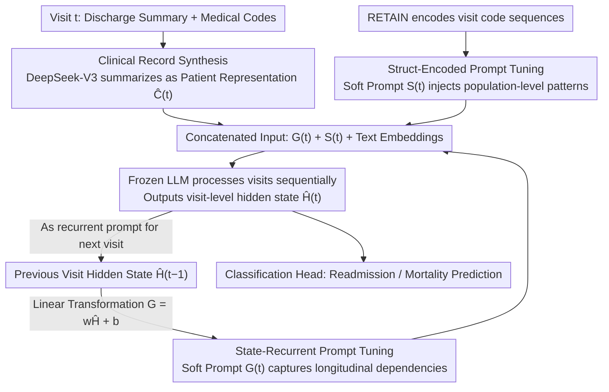

# RePrompT: Recurrent Prompt Tuning for Integrating Structured EHR Encoders with Large Language Models

**Conference**: ACL 2026  
**arXiv**: [2604.17725](https://arxiv.org/abs/2604.17725)  
**Code**: [https://github.com/KU-AI4H/RePrompT](https://github.com/KU-AI4H/RePrompT)  
**Area**: Medical NLP  
**Keywords**: Electronic Health Records, Prompt Tuning, Recurrent State Propagation, Structured Encoder, Clinical Prediction

## TL;DR
This paper proposes RePrompT, a time-aware LLM framework that consistently outperforms EHR and LLM baselines on readmission and mortality prediction tasks in MIMIC-III/IV through two complementary mechanisms: recurrent prompt tuning (using the hidden state of the previous visit as a soft prompt for the next) and struct-encoded prompt tuning (injecting embeddings from population-level EHR encoders).

## Background & Motivation

**Background**: Electronic Health Records (EHR) contain longitudinal information such as diagnoses, medications, and procedures from multiple patient visits, serving as a vital data source for clinical decision support. Large Language Models (LLMs) have demonstrated potential in EHR mining tasks (e.g., mortality and readmission prediction) but still face two core challenges when processing structured EHR signals.

**Limitations of Prior Work**: The first challenge is the loss of temporal structure. Linearizing longitudinal EHR data into pure text ("Visit 1: ... Visit 2: ...") obscures temporal dependencies and the discrete identity of clinical codes. Although delimiters can mark visit boundaries, LLMs inherently treat the input as a single document, lacking an explicit mechanism for modeling inter-visit temporal dependencies. The second challenge is the lack of population-level information. Traditional EHR prediction models (e.g., RETAIN, GRAM) are jointly trained on patient populations to learn a shared, task-aligned representation space, enabling the discovery of population-level patterns such as disease co-occurrence and longitudinal progression. In contrast, LLMs perform case-isolated reasoning for each patient, lacking a mechanism to utilize information from other similar patients to assist in prediction.

**Key Challenge**: LLMs excel at extracting rich contextual information from text but lack the ability to model longitudinal temporal structures and utilize population-level knowledge; structured EHR encoders excel at temporal modeling and population pattern discovery but have limited representation capabilities. The core problem is how to combine their complementary strengths.

**Goal**: Design a lightweight framework to inject temporal and population-level information from structured EHR encoders into LLMs without modifying the LLM architecture.

**Key Insight**: Prompt tuning allows the injection of external information without altering LLM parameters by simply encoding external information into trainable soft prompt vectors.

**Core Idea**: Enhance the LLM with two complementary soft prompt mechanisms: (1) Recurrent prompts pass the LLM's hidden state from the previous visit to the current visit to explicitly model longitudinal dependencies; (2) Struct-encoded prompts inject embeddings from a population-trained EHR encoder (RETAIN) into the LLM to introduce population-level patterns.

## Method

### Overall Architecture
The goal of RePrompT is to supplement the text-only LLM with the "temporal structure + population patterns" at which structured EHR encoders excel, while keeping LLM parameters frozen. It consists of three modules: first, DeepSeek-V3 condenses lengthy discharge summaries and structured medical codes from each visit into concise patient summaries; second, the LLM processes visits sequentially, using the hidden state of the previous visit transformed linearly as a soft prompt for the current visit to capture longitudinal dependencies; simultaneously, a population-trained RETAIN encoder encodes the structured EHR sequence into dense representations, injected as another set of soft prompts. The final input fed to the LLM is a concatenation of the recurrent prompt $G_{i,t}$, the structured prompt $S_{i,t}$, and text embeddings.

### Key Designs

**1. Clinical Record Synthesis: Refining lengthy, noisy raw records into clean summaries before LLM processing**

Raw discharge summaries are long and filled with template boilerplate; feeding them directly to an LLM consumes the context window and introduces noise. This design adds a preprocessing step: using DeepSeek-V3 to summarize discharge summaries and corresponding medical codes for each visit, removing template sections and redundancy to produce a standardized patient representation $\hat{C}_{i,t}$. This ensures that subsequent soft prompts and text embeddings align with a patient history having a higher signal-to-noise ratio.

**2. State-Recurrent Prompt Tuning: Using RNN-style hidden state propagation to explicitly model temporal dependencies between visits**

Linearly concatenating multiple visits into a single text block causes the model to treat the entire record as a single document, flattening visit boundaries and chronological order. This design takes the opposite approach: the LLM processes only one visit at a time. After processing, the token-level hidden state $H_{i,t}$ from the last layer is extracted and average-pooled to obtain a visit-level hidden state $\hat{H}_{i,t}$, which then undergoes a linear transformation $G_{i,t+1} = w_t \hat{H}_{i,t} + b_t$ to generate the soft prompt for the next visit. Consequently, when the LLM processes visit $t+1$, it holds a "memory" concentrated from the previous $t$ visits. Information propagates step-by-step like an RNN hidden state, rather than relying on attention to reconstruct temporal order from a large concatenated block.

**3. Struct-Encoded Prompt Tuning: Feeding knowledge from population-trained EHR encoders as soft prompts**

LLMs perform case-isolated reasoning for each patient and cannot see "what other similar patients look like," thus failing to learn population-level patterns such as disease co-occurrence or medication patterns. This design employs RETAIN (trained on a patient population with dual-level attention and recurrent modeling), which encodes visit-level medical code sequences $\{V_{i,j}\}_{j=1}^t$ into dense representations $S_{i,t} \in \mathbb{R}^{P \times D}$ that are injected directly into the LLM as soft prompts. This acts as a "population reference" within each patient's input, allowing single-patient reasoning to leverage population statistics.

### A Complete Example: A Patient with Three Visits
Assume a patient has three visits. For Visit 1, there is no history; the LLM reads only the summary $\hat{C}_{i,1}$ and the structured prompt $S_{i,1}$ provided by RETAIN, outputting hidden state $\hat{H}_{i,1}$. For Visit 2, this $\hat{H}_{i,1}$ is linearly transformed into the recurrent prompt $G_{i,2}$ and fed in with the current summary $\hat{C}_{i,2}$ and structured prompt $S_{i,2}$. The model now "remembers" the first visit's condition. Visit 3 similarly receives $\hat{H}_{i,2}$. Finally, a classification head is attached to the Visit 3 hidden state to output readmission or mortality predictions—the prediction is now based on the complete visit trajectory compressed and passed along by the recurrent prompts, rather than a flattened concatenated text.

### Loss & Training
Binary Cross-Entropy loss is used for binary/multi-label classification. Trainable parameters include: the RETAIN encoder, the linear transformation layer for recurrent states, and the output classification head. The LLaMA model remains frozen during training and inference. Llama 3.1 1B from the LLM2Vec framework is used as the embedding extractor.

## Key Experimental Results

### Main Results (Comparison with EHR Baselines)

| Model | MIMIC-IV Readmission AUROC | MIMIC-IV Mortality AUROC | MIMIC-III Readmission AUROC | MIMIC-III Mortality AUROC |
|------|---------------------|---------------------|---------------------|---------------------|
| RETAIN | 0.670 | 0.601 | 0.660 | 0.608 |
| StageNet | 0.656 | 0.664 | 0.676 | 0.633 |
| ARCI | 0.663 | 0.611 | 0.652 | 0.618 |
| **Ours (RePrompT)** | **0.706** | **0.673** | **0.688** | **0.646** |

### Ablation Study

| Configuration | MIMIC-IV Readmission AUROC | MIMIC-IV Mortality AUROC | Description |
|------|---------------------|---------------------|------|
| RePrompT Full | 0.706 | 0.673 | Full model |
| w/o Both Modules | 0.673 | 0.635 | Baseline level |
| w/o Recurrent Prompt | 0.693 | 0.642 | Recurrent prompt contributes more |
| w/o Struct-Encoded | 0.698 | 0.665 | Struct-encoded also contributes |
| w/o DeepSeek Summary | 0.685 | 0.640 | Summary preprocessing also helps |

### Key Findings
- RePrompT consistently outperforms all EHR and LLM baselines across all datasets and tasks, with AUROC gains of approximately 3-7 percentage points.
- The contribution of the recurrent state prompt is greater than that of the struct-encoded prompt—removing the recurrent prompt results in a larger AUROC decrease, indicating that longitudinal temporal dependency modeling is most critical.
- The comparison with LLM baselines is particularly striking: the Zero-shot LLM (GPT-5) achieved an AUROC of only 0.512 (readmission), while RePrompT reached 0.706, a significant gap.
- In comparisons between different EHR encoders, RETAIN performed best, while the Transformer encoder performed worst—likely because Transformers are less effective than RNNs at modeling sequential visit dependencies.
- Although DeepSeek summary preprocessing is helpful, RePrompT still outperforms RETAIN without it, proving that performance gains stem mainly from the framework design rather than summary quality.

## Highlights & Insights
- The design of **Recurrent Prompt Tuning** is elegant—it introduces the sequential processing philosophy of RNNs into the LLM prompt space, enabling the LLM to process temporal data incrementally. This idea can be migrated to any LLM application requiring temporal document processing.
- **Injecting EHR encoders as soft prompts into the LLM** provides a general paradigm for "Expert Knowledge Injection"—any domain-specific encoder can be fused with an LLM in this way without modifying the LLM itself.
- The finding that Transformers are inferior to RNNs for EHR temporal modeling is insightful—positional encodings are insufficient to replace the explicit temporal propagation of an RNN.

## Limitations & Future Work
- Currently, only Llama 3.1 1B has been validated as a base model; larger-scale LLMs might exhibit different behaviors.
- Using DeepSeek-V3 for summary preprocessing introduces additional dependencies and costs.
- The number of soft prompts $P=10$ is a hyperparameter, and its impact was not fully discussed.
- Consideration could be given to extending recurrent prompts to multi-scale—passing not just information from the most recent visit but also aggregated information over longer time spans.
- Future work could explore extending the method to more complex clinical prediction tasks, such as multi-label medication recommendation.

## Related Work & Insights
- **vs RETAIN**: RETAIN uses only structured code sequences and lacks text understanding; RePrompT introduces deep semantic understanding of discharge summaries via the LLM while retaining RETAIN's population-level patterns.
- **vs COCONUT**: COCONUT also uses soft tokens for reasoning but lacks explicit temporal structure modeling, underperforming RePrompT on sequential EHR tasks.
- **vs Zero-shot GPT-5**: Even the strongest general-purpose LLMs fall far short of domain-specific methods in EHR prediction, indicating that the injection of structured medical knowledge is indispensable.

## Rating
- Novelty: ⭐⭐⭐⭐ The combined design of recurrent prompt tuning and struct-encoded prompts is innovative, though individual components (prompt tuning, RNN state propagation) are not entirely new.
- Experimental Thoroughness: ⭐⭐⭐⭐⭐ Extremely thorough, with two datasets, two tasks, 8 EHR baselines + 3 LLM baselines, multi-level ablations, and encoder comparisons.
- Writing Quality: ⭐⭐⭐⭐ Clear framework diagrams, well-articulated motivation, and detailed ablation analysis.
- Value: ⭐⭐⭐⭐ Provides a lightweight and effective LLM-EHR fusion paradigm with practical significance for clinical AI.

<!-- RELATED:START -->

## Related Papers

- [\[ACL 2026\] Text-Attributed Knowledge Graph Enrichment with Large Language Models for Medical Concept Representation](text-attributed_knowledge_graph_enrichment_with_large_language_models_for_medica.md)
- [\[ACL 2026\] Beyond the Leaderboard: Rethinking Medical Benchmarks for Large Language Models](beyond_the_leaderboard_rethinking_medical_benchmarks_for_large_language_models.md)
- [\[ICML 2026\] MedCase-Structured: A Text-to-FHIR Dataset for Benchmarking Diagnostic Reasoning in Clinically Realistic EHR Settings](../../ICML2026/medical_nlp/medcase-structured_a_text-to-fhir_dataset_for_benchmarking_diagnostic_reasoning_.md)
- [\[ACL 2026\] MedFact: Benchmarking the Fact-Checking Capabilities of Large Language Models on Chinese Medical Texts](medfact_benchmarking_the_fact-checking_capabilities_of_large_language_models_on_.md)
- [\[ACL 2026\] MHGraphBench: Knowledge Graph-Grounded Benchmarking of Mental Health Knowledge in Large Language Models](mhgraphbench_knowledge_graph-grounded_benchmarking_of_mental_health_knowledge_in.md)

<!-- RELATED:END -->
