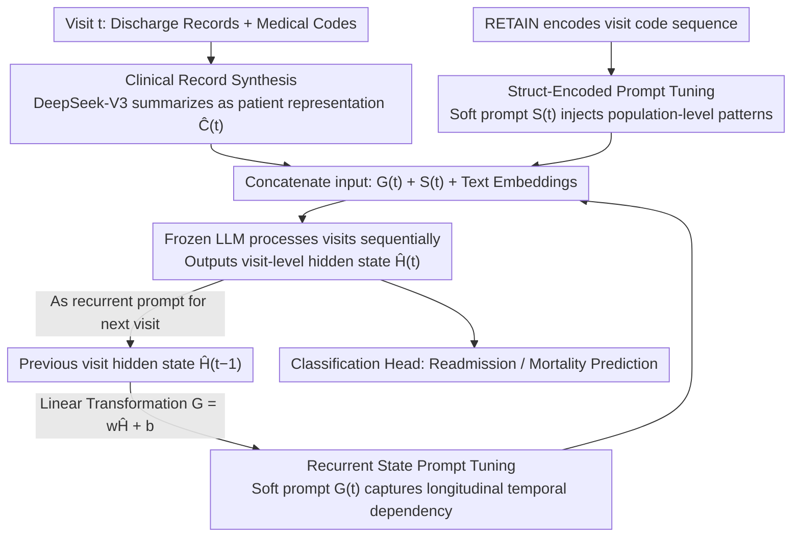

# RePrompT: Recurrent Prompt Tuning for Integrating Structured EHR Encoders with Large Language Models

**Conference**: ACL 2026  
**arXiv**: [2604.17725](https://arxiv.org/abs/2604.17725)  
**Code**: [https://github.com/KU-AI4H/RePrompT](https://github.com/KU-AI4H/RePrompT)  
**Area**: Medical NLP
**Keywords**: Electronic Health Records, Prompt Tuning, Recurrent State Propagation, Structured Encoder, Clinical Prediction

## TL;DR
This paper proposes RePrompT, a time-aware LLM framework. Through two complementary mechanisms—recurrent prompt tuning (passing the hidden state from the previous visit as a soft prompt for the next) and struct-encoded prompt tuning (injecting embeddings from population-level EHR encoders)—it consistently outperforms EHR and LLM baselines on readmission and mortality prediction tasks using MIMIC-III/IV.

## Background & Motivation

**Background**: Electronic Health Records (EHR) contain longitudinal information such as diagnoses, medications, and procedures across multiple patient visits, serving as a critical data source for clinical decision support. Large Language Models (LLMs) have shown potential in EHR mining tasks (e.g., mortality and readmission prediction) but face two core challenges when processing structured EHR signals.

**Limitations of Prior Work**: The first challenge is the loss of temporal structure. When longitudinal EHR data is linearized into pure text ("Visit 1: ... Visit 2: ..."), temporal dependencies and the discrete identities of clinical codes are obscured. Although delimiters can mark visit boundaries, LLMs inherently treat inputs as a single document and lack an explicit mechanism for modeling temporal dependencies between visits. The second challenge is the lack of population-level information. Traditional EHR prediction models (e.g., RETAIN, GRAM) are jointly trained on patient populations to learn a shared, task-aligned representation space that discovers population-level patterns like disease co-occurrence and longitudinal progression. In contrast, LLMs perform case-isolated inference for each patient, lacking a mechanism to leverage information from other similar patients to assist in prediction.

**Key Challenge**: LLMs are adept at extracting rich contextual information from text but lack the ability to model longitudinal temporal structures and utilize population-level knowledge; structured EHR encoders are proficient in temporal modeling and pattern discovery but have limited representation capabilities. The core problem is how to combine these complementary strengths.

**Goal**: To design a lightweight framework that injects temporal and population-level information from structured EHR encoders into LLMs without modifying the LLM architecture.

**Key Insight**: Prompt tuning allows the injection of external information without changing LLM parameters—simply by encoding external information into trainable soft prompt vectors.

**Core Idea**: Enhance the LLM with two complementary soft prompt mechanisms: (1) recurrent prompts pass the LLM hidden state from the previous visit to the current visit to explicitly model longitudinal dependencies; (2) struct-encoded prompts inject embeddings from a population-trained EHR encoder (RETAIN) into the LLM to introduce population-level patterns.

## Method

### Overall Architecture
The goal of RePrompT is to supplement the text-only LLM with the "temporal structure + population patterns" that structured EHR encoders excel at, all while keeping LLM parameters frozen. It consists of three modules: first, DeepSeek-V3 compresses lengthy discharge summaries and structured medical codes from each visit into concise patient summaries; next, the LLM processes visits sequentially, using a linear transformation of the previous visit's hidden state as a soft prompt for the current visit to explicitly capture longitudinal dependencies; simultaneously, a population-trained RETAIN encoder encodes the structured EHR sequence into dense representations, injected as another set of soft prompts. The final input fed to the LLM is a concatenation of the recurrent prompts $G_{i,t}$, structured prompts $S_{i,t}$, and text embeddings.

### Key Designs

**1. Clinical Record Synthesis: Condensing noisy raw records into clean summaries before LLM processing**

Original discharge summaries are long and filled with template boilerplate; feeding them directly to an LLM wastes context window space and introduces noise. This design adds a preprocessing step using DeepSeek-V3 to summarize the discharge records and corresponding medical codes for each visit, removing template sections and redundancies to produce a standardized patient representation $\hat{C}_{i,t}$. This ensures that subsequent soft prompts and text embeddings are aligned with a higher signal-to-noise ratio patient history.

**2. State-Recurrent Prompt Tuning: Explicitly modeling temporal dependencies via RNN-style hidden state propagation**

Linearly concatenating multiple visits into a single text block causes the model to treat the entire record as a single document, flattening visit boundaries and chronological order. This design does the opposite: the LLM processes only one visit at a time. After processing, the token-level hidden state $H_{i,t}$ from the last layer is extracted, mean-pooled into a visit-level hidden state $\hat{H}_{i,t}$, and transformed via a linear layer $G_{i,t+1} = w_t \hat{H}_{i,t} + b_t$ to generate the soft prompt for the next visit. Consequently, when processing visit $t+1$, the LLM holds a "memory" condensed from the previous $t$ visits. Information propagates step-by-step like an RNN hidden state, rather than relying on attention to reconstruct temporal order from a long concatenated string.

**3. Struct-Encoded Prompt Tuning: Injecting knowledge from population-trained EHR encoders via soft prompts**

LLMs perform case-isolated inference on individual patients and cannot see "what other similar patients look like," thus failing to learn population-level patterns like disease co-occurrence or medication trends. This design employs RETAIN (which features dual-level attention and recurrent modeling), trained on a patient population. It encodes the visit-level medical code sequence $\{V_{i,j}\}_{j=1}^t$ into a dense representation $S_{i,t} \in \mathbb{R}^{P \times D}$, which is directly injected as a soft prompt. This acts as a "population reference" within each patient's input, allowing single-patient inference to benefit from population statistics.

### A Complete Example: A Patient with Three Visits
Assume a patient has three visits. For Visit 1, there is no history; the LLM reads only the summary $\hat{C}_{i,1}$ and the structured prompt $S_{i,1}$ from RETAIN, outputting hidden state $\hat{H}_{i,1}$. At Visit 2, this $\hat{H}_{i,1}$ is transformed into the recurrent prompt $G_{i,2}$, concatenated with the current summary $\hat{C}_{i,2}$ and structured prompt $S_{i,2}$; the model now "remembers" the first visit. Visit 3 similarly receives $\hat{H}_{i,2}$. Finally, a classification head is attached to the Visit 3 hidden state to output readmission or mortality predictions—the prediction is now based on the complete trajectory compressed through the recurrent prompts, rather than a flattened text concatenation.

### Loss & Training
Binary Cross-Entropy loss is used for binary/multi-label classification. Trainable parameters include: the RETAIN encoder, the linear transformation layers for recurrent states, and the output classification head. The LLaMA model remains frozen during training and inference. Llama 3.1 1B from the LLM2Vec framework is used as the embedding extractor.

## Key Experimental Results

### Main Results (Comparison with EHR Baselines)

| Model | MIMIC-IV Readmit AUROC | MIMIC-IV Mortality AUROC | MIMIC-III Readmit AUROC | MIMIC-III Mortality AUROC |
|------|---------------------|---------------------|---------------------|---------------------|
| RETAIN | 0.670 | 0.601 | 0.660 | 0.608 |
| StageNet | 0.656 | 0.664 | 0.676 | 0.633 |
| ARCI | 0.663 | 0.611 | 0.652 | 0.618 |
| **RePrompT** | **0.706** | **0.673** | **0.688** | **0.646** |

### Ablation Study

| Configuration | MIMIC-IV Readmit AUROC | MIMIC-IV Mortality AUROC | Description |
|------|---------------------|---------------------|------|
| RePrompT Full | 0.706 | 0.673 | Full model |
| w/o Both Modules | 0.673 | 0.635 | Baseline level |
| w/o Recurrent Prompt | 0.693 | 0.642 | Recurrent prompt has larger contribution |
| w/o Struct-Encoded | 0.698 | 0.665 | Struct-encoded also contributes |
| w/o DeepSeek Summary | 0.685 | 0.640 | Summary preprocessing is helpful |

### Key Findings
- RePrompT consistently outperforms all EHR and LLM baselines across all datasets and tasks, with AUROC gains of approximately 3-7 percentage points.
- The contribution of recurrent state prompts is greater than that of struct-encoded prompts—removing recurrent prompts results in a larger AUROC drop, indicating that longitudinal temporal modeling is most critical.
- The comparison with LLM baselines is particularly striking: Zero-shot LLM (GPT-5) AUROC is only 0.512 (readmission), while RePrompT reaches 0.706, highlighting a massive gap.
- Among different EHR encoders, RETAIN performs the best, while Transformer encoders performed worst—suggesting Transformers are less effective than RNNs at modeling sequential visit dependencies.
- Although DeepSeek summary preprocessing is helpful, RePrompT still outperforms RETAIN without it, proving gains stem primarily from the framework design rather than summary quality.

## Highlights & Insights
- The **Recurrent Prompt Tuning** design is elegant—it brings RNN sequential processing into the LLM prompt space, allowing LLMs to process temporal data step-by-step like an RNN. This idea is transferable to any LLM application involving sequential documents.
- **Injecting EHR encoders as soft prompts** provides a general recipe for "expert knowledge injection"—any domain-specific encoder can be fused with an LLM this way without modifying the LLM itself.
- The finding that Transformers are inferior to RNNs for EHR sequence modeling is insightful—positional embeddings are not a sufficient substitute for the explicit temporal propagation found in RNNs.

## Limitations & Future Work
- Currently, only Llama 3.1 1B has been validated as a base model; larger LLMs might exhibit different behaviors.
- Using DeepSeek-V3 for summary preprocessing introduces additional dependencies and costs.
- The number of soft prompts $P=10$ is a hyperparameter, and its impact is not fully explored.
- Future work could extend recurrent prompts to be multi-scale—passing not just the most recent visit info but aggregated info over longer time spans.
- Exploration of more complex clinical tasks, such as multi-label medication recommendation, is a viable future direction.

## Related Work & Insights
- **vs RETAIN**: RETAIN uses only structured code sequences and lacks text understanding; RePrompT introduces deep semantic understanding of discharge summaries via the LLM while retaining RETAIN's population-level patterns.
- **vs COCONUT**: COCONUT also uses soft tokens for reasoning but lacks explicit temporal structure modeling, underperforming compared to RePrompT on EHR temporal tasks.
- **vs Zero-shot GPT-5**: Even the strongest general LLMs are far inferior to domain-specific methods for EHR prediction, indicating that structured medical knowledge injection is indispensable.

## Rating
- Novelty: ⭐⭐⭐⭐ The combination of recurrent prompt tuning and struct-encoded prompts is creative, though individual components (prompt tuning, RNN state passing) are known.
- Experimental Thoroughness: ⭐⭐⭐⭐⭐ Two datasets, two tasks, 8 EHR baselines + 3 LLM baselines, plus multi-level ablation and encoder comparisons. Very thorough.
- Writing Quality: ⭐⭐⭐⭐ Clear framework diagrams, well-articulated motivation, and detailed ablation analysis.
- Value: ⭐⭐⭐⭐ Provides a lightweight and effective LLM-EHR fusion paradigm with practical implications for clinical AI.

<!-- RELATED:START -->

## Related Papers

- [\[ACL 2026\] Text-Attributed Knowledge Graph Enrichment with Large Language Models for Medical Concept Representation](text-attributed_knowledge_graph_enrichment_with_large_language_models_for_medica.md)
- [\[ACL 2026\] Beyond the Leaderboard: Rethinking Medical Benchmarks for Large Language Models](beyond_the_leaderboard_rethinking_medical_benchmarks_for_large_language_models.md)
- [\[ACL 2026\] MedFact: Benchmarking the Fact-Checking Capabilities of Large Language Models on Chinese Medical Texts](medfact_benchmarking_the_fact-checking_capabilities_of_large_language_models_on_.md)
- [\[ACL 2026\] MHGraphBench: Knowledge Graph-Grounded Benchmarking of Mental Health Knowledge in Large Language Models](mhgraphbench_knowledge_graph-grounded_benchmarking_of_mental_health_knowledge_in.md)
- [\[ICML 2026\] MedCase-Structured: A Text-to-FHIR Dataset for Benchmarking Diagnostic Reasoning in Clinically Realistic EHR Settings](../../ICML2026/medical_nlp/medcase-structured_a_text-to-fhir_dataset_for_benchmarking_diagnostic_reasoning_.md)

<!-- RELATED:END -->
