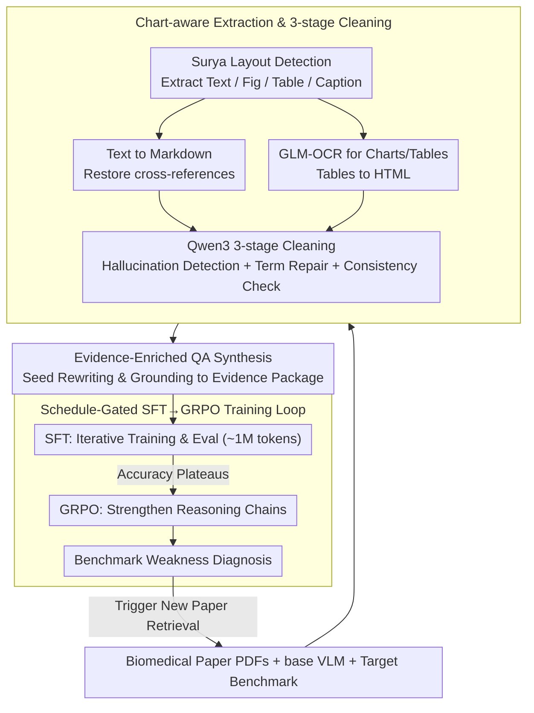

# Ryze: Evidence-Enriched Data Synthesis from Biomedical Papers

**Conference**: ACL2026  
**arXiv**: [2606.00902](https://arxiv.org/abs/2606.00902)  
**Code**: https://github.com/Chivier/Ryze  
**Area**: Medical NLP  
**Keywords**: Biomedical VLM, Evidence-enriched data synthesis, Scientific PDF understanding, Chart-aware OCR, GRPO

## TL;DR
Ryze automatically transforms biomedical paper PDFs into evidence-enriched QA data that preserves figures, captions, structured extractions, and cited paragraphs. By employing a schedule-gated SFT+GRPO strategy to train BioVLM-8B, it achieves a 48.0% weighted accuracy on LAB-Bench, outperforming the Qwen3-VL-8B base by 12.6 percentage points and GPT-5.2 by 3.8 percentage points.

## Background & Motivation
**Background**: General VLMs have become capable of handling daily multimodal tasks, but scientific paper understanding is more than simple image-text QA. Answers in biomedical papers are often scattered across multi-column text, figure captions, coordinate axes, legends, multi-line table headers, and textual explanations of figures. Models must extract these evidence chains simultaneously to answer questions regarding experimental design, sequence analysis, protocol tracing, or literature synthesis.

**Limitations of Prior Work**: The bottleneck for domain-specific VLMs lies not just in model scale, but in training data. Expert-annotated biomedical QA is expensive and has narrow coverage. Directly reusing PubMedQA or MedQA results in the loss of visual and structural evidence. General OCR or Markdown conversion tools frequently misidentify gene names, chemical formulas, chart values, and figure/table references, causing subsequent synthesized QA to inherit these errors.

**Key Challenge**: Scientific QA requires "evidence integrity," whereas common data synthesis pipelines only preserve local text or figure-caption pairs. Without referring prose, table structures, and chart annotations, training samples may contain answers but actually train the model to memorize shallow patterns rather than learning cross-element evidence-grounded reasoning.

**Goal**: The authors aim to solve a systemic problem: given a set of open-access biomedical PDFs, a base VLM, and a target evaluation benchmark, can high-quality domain QA data be automatically generated without relying on human annotation to train an 8B-class model like Qwen3-VL-8B into a locally deployable BioVLM?

**Key Insight**: Ryze’s key observation is that the minimum unit for scientific document data synthesis should not be a "text snippet" or a "figure-caption pair," but a complete evidence package: visual elements, captions, extracted structures, and the paragraphs in the body text that cite them, along with context after terminology repair and consistency checks.

**Core Idea**: Replace ordinary text synthesis with evidence-enriched scientific document extraction and QA synthesis, then use SFT to inject domain knowledge and GRPO to strengthen complex evidence reasoning.

## Method
Ryze is an end-to-end workflow rather than a single model architecture. Starting from raw PDFs, it performs chart-aware extraction and cleaning, generates QA based on complete evidence packages, and uses a schedule-gated strategy to determine when to switch from SFT to GRPO. Finally, it feeds weaknesses identified during evaluation back into the data generation phase.

### Overall Architecture
Inputs include a batch of biomedical paper PDFs, a base VLM (Qwen3-VL-8B in the paper), and a target evaluation benchmark (LAB-Bench). Ryze first segments the PDF into text blocks, figures, tables, and captions, recovering figure/table cross-references in the body text. It then retrieves associated evidence for each question to generate QA with complete evidence. Subsequently, it performs iterative synthesis, SFT, and evaluation in increments of approximately 1M tokens, switching to GRPO once SFT gains plateau. Finally, a weakness diagnosis of benchmark categories triggers a new round of paper searching and data augmentation.

### Key Designs

**1. Chart-aware extraction and three-stage cleaning: Convert PDFs into a credible structured evidence base before synthesis**

In biomedical papers, a misidentified gene name or a misread coordinate value will contaminate all downstream QA in the pipeline. Thus, Ryze prioritizes "credibility" during the extraction phase. It uses Surya for layout detection to segment pages into text, figures, tables, and captions. Text regions are converted to Markdown preserving section structures, and cross-references like "Table 1 / Figure 3" are repaired to bind each visual element with its caption and referring paragraphs. Figures and tables are processed by GLM-OCR for chart/table-aware extraction, converting tables into HTML that preserves merged cells and multi-line headers rather than flattening them into plain text.

The final step uses Qwen3 for three-stage cleaning—hallucination detection, domain terminology repair, and cross-element consistency checks. By calibrating structure and terminology first, data synthesis avoids amplifying OCR errors into "learned knowledge." This is the fundamental reason why replacing this with general OCR (Marker / DeepSeek OCR) results in a drop of up to -7.8pp in ChartQA in the ablation studies.

**2. Evidence-enriched QA synthesis: Ensure every question can be traced back to visual and textual evidence in the original paper**

Common synthesis pipelines often retain only local text or figure-caption pairs, leading to training samples where the model might memorize shallow patterns. Ryze’s question seeds come from two sources: general domain questions from the original papers and skill categories abstracted from the target benchmark (chart interpretation, protocol tracing, literature synthesis, etc.). It does not copy benchmark questions or answers; instead, it uses Qwen3-VL-235B to rewrite and diversify these coarse-grained skills, then strictly grounds each answer to visual elements, captions, OCR annotations, HTML tables, and referring paragraphs retrieved from the source PDF corpus.

This approach resembles curriculum-aware active learning: the benchmark identifies "which capabilities to cover" without revealing specific questions or answers. This allows for targeted reinforcement of LAB-Bench related capabilities while minimizing the risk of direct data leakage—though generalization must ultimately be validated by held-out benchmarks not involved in the curriculum design.

**3. Schedule-gated SFT→GRPO training loop: Use evaluation plateaus as signals to automatically switch from data accumulation to reinforced reasoning**

Indiscriminately piling up SFT tokens after saturation results in redundant samples and wasted budget. Ryze generates and trains an SFT checkpoint every ~1M tokens and evaluates it. If accuracy plateaus consecutively, SFT is deemed saturated. The data is then frozen, converted to RL format, and the model is trained using GRPO to generate more coherent reasoning chains. The division of labor is clear: the SFT phase absorbs terminology, common sense, and basic biological concepts, while the GRPO phase strengthens complex tasks requiring inference across charts, tables, captions, and text.

Experiments confirm the value of this switch—SFT-only already matches GPT-5.2 ($43.7$ vs $44.2$), but the gains that lead to outperformance primarily come from GRPO, indicating that "remembering facts first, then learning to reason based on evidence" is more cost-effective than simply adding more synthetic samples.

### Loss & Training
Training is divided into two stages: LoRA SFT and GRPO. SFT alternates between text QA and visual QA batches, allowing the model to simultaneously absorb textual terminology and visual evidence. GRPO does not rely on a separate reward model; instead, it converts accumulated evidence-enriched SFT data into a format suitable for strengthening reasoning chains, focusing on tasks requiring cross-modal inference. All training configurations utilize the same token budget: $8,051,591$ tokens for SFT and $1,584,412$ tokens for GRPO. The experimental hardware includes an AMD EPYC 7313P CPU and 4 NVIDIA RTX A6000 48GB GPUs.

## Key Experimental Results

### Main Results
LAB-Bench contains 1,967 samples across 8 biological categories. Starting from Qwen3-VL-8B, BioVLM-8B reaches a weighted average of 48.0%, a $+12.6$pp Gain over the base and a $+3.8$pp Gain over GPT-5.2.

| Category | Qwen3-VL-8B | GPT-5.2 | BioVLM-8B (SFT only) | BioVLM-8B |
|------|-------------|---------|----------------------|-----------|
| Cloning | 24.2 | 36.4 | 34.5 | 38.4 |
| DbQA | 31.2 | 41.7 | 44.7 | 48.9 |
| FigQA | 24.7 | 36.5 | 31.8 | 35.2 |
| LitQA2 | 38.7 | 45.7 | 58.2 | 65.5 |
| ProtocolQA | 38.3 | 65.7 | 68.1 | 72.3 |
| SeqQA | 43.4 | 47.0 | 39.5 | 42.8 |
| SuppQA | 24.8 | 48.8 | 40.9 | 44.2 |
| TableQA | 34.0 | 36.9 | 40.3 | 45.6 |
| Weighted Avg | 35.4 | 44.2 | 43.7 | 48.0 |

### Ablation Study
Ryze validated data sources, the OCR pipeline, and cross-model generalization. The following figures highlight the mechanism's impact.

| Configuration | Key Metric | Description |
|------|----------|------|
| BioVLM-8B Full Model | 48.0 weighted accuracy | Final result after SFT and GRPO |
| BioVLM-8B (SFT only) | 43.7 weighted accuracy | Nearly matches GPT-5.2's 44.2 but lacks final reasoning gains |
| PubMedQA SFT | 26.6 weighted accuracy | Much lower than evidence-enriched data under the same budget |
| MedQA SFT | 29.0 weighted accuracy | Existing QA data cannot replace scientific document evidence packages |
| Ours OCR pipeline | ChartQA 75.8 | Significantly outperforms general OCR on chart-intensive tasks |
| Without OCR / Marker / DeepSeek OCR | ChartQA 68.0 / 69.3 / 69.1 | Replacing the custom pipeline leads to drops up to ~ -7.8pp |

### Key Findings
- Ryze's largest gains stem from preserving the full evidence chain: outperforming GPT-5.2 by $+19.8$pp, $+8.7$pp, and $+7.2$pp in LitQA2, TableQA, and DbQA respectively.
- GPT-5.2 still leads in FigQA, SeqQA, and SuppQA, indicating that BioVLM’s visual understanding and sequence analysis are not yet dominant in all areas.
- The same evidence-enriched SFT data yields improvements when migrated to other base models: Qwen2.5-7B (33.1 to 35.1), LLaMA-3.2 (31.3 to 34.4), and Gemma-2 (31.8 to 33.5).
- Low cost is a systemic highlight: OCR+cleansing costs ~$18, QA synthesis ~$143, SFT ~$24, and GRPO ~$12, totaling less than $200.

## Highlights & Insights
- The most valuable aspect of this paper is not proposing a new VLM backbone, but defining the "scientific document evidence package" as the core object of data synthesis. For scientific tasks, the data format itself defines the ceiling of model capability.
- Schedule-gating is highly practical: it avoids wasting the budget on redundant samples after SFT saturation, shifting the latter half of computation to GRPO so the model learns to reason over existing evidence.
- The paper clearly defines the boundaries of benchmark contamination by using capability categories rather than specific questions/answers. This approach is suitable for domain-specific model customization, though generalization still requires external held-out benchmarks.
- Ryze's pipeline is friendly to small labs. With training costs under $200, an 8B model, and local deployment capability, it is more suitable than closed-source APIs for privacy-sensitive lab notes, internal reports, or unpublished papers.

## Limitations & Future Work
- Current experiments only cover biology and biomedicine. Although the authors mention expanding to climate change, geoscience, and civil engineering, results for these areas are not yet systematically reported.
- BioVLM-8B still lags behind GPT-5.2 in FigQA, SeqQA, and SuppQA, suggesting that visual detail, sequence analysis, and supporting evidence localization require stronger multimodal RL or better visual extraction.
- The scaling behavior of the schedule-gating strategy on larger models is unclear. SFT saturation points and GRPO gains on an 8B model may not transfer directly to 32B or 70B models.
- Data generation referenced coarse-grained skill categories from LAB-Bench; while specific questions were not used, future validation on completely unrelated benchmarks is preferred.

## Related Work & Insights
- **vs LLaVA-Med / PMC-VQA**: These works mostly use medical images or figure-caption data to adapt VLMs. Ryze emphasizes the binding of captions, chart structures, and body text referring prose, which is better for fine-grained scientific reasoning.
- **vs PubMedQA / MedQA SFT**: Existing QA data acts more like textual knowledge injection; Ryze’s data comes from full evidence packages of original PDFs. PubMedQA and MedQA significantly underperform under the same token budget, showing that data structure is more important than whether the source is nominally "medical."
- **vs General OCR/Document Parsing Tools**: Tools like Marker or DeepSeek OCR focus on general conversion quality. Ryze is designed for charts and cross-references in scientific papers, specifically helping build training data for chart/table-heavy tasks.
- **Insight**: This paradigm can be replicated for other scientific fields: first define the domain's evidence package, then perform task-aware synthesis, and finally use weakness feedback to drive data increments rather than just feeding PDF chunks to an LLM.

## Rating
- Novelty: ⭐⭐⭐⭐☆ Strong system design; core innovation lies in evidence-enriched synthesis and schedule-gated training rather than model architecture.
- Experimental Thoroughness: ⭐⭐⭐⭐☆ Main experiments, data source comparisons, OCR ablations, cross-model generalization, and cost analysis are complete, though cross-domain validation is missing.
- Writing Quality: ⭐⭐⭐⭐☆ Motivations and workflows are clear, results are focused, and benchmark leakage is proactively discussed.
- Value: ⭐⭐⭐⭐⭐ Highly practical for scientific VLM adaptation, especially for low-cost, local deployment, and privacy-sensitive domain training.

<!-- RELATED:START -->

## Related Papers

- [\[ACL 2026\] Eliciting Medical Reasoning with Knowledge-enhanced Data Synthesis: A Semi-Supervised Reinforcement Learning Approach](eliciting_medical_reasoning_with_knowledge-enhanced_data_synthesis_a_semi-superv.md)
- [\[ACL 2025\] Query-driven Document-level Scientific Evidence Extraction from Biomedical Studies](../../ACL2025/medical_nlp/urca_biomedical_evidence_extraction.md)
- [\[ICLR 2026\] MedAgentGym: A Scalable Agentic Training Environment for Code-Centric Reasoning in Biomedical Data Science](../../ICLR2026/medical_nlp/medagentgym_agentic_training_biomedical.md)
- [\[ACL 2026\] Faithfulness vs. Safety: Evaluating LLM Behavior Under Counterfactual Medical Evidence](faithfulness_vs_safety_evaluating_llm_behavior_under_counterfactual_medical_evid.md)
- [\[ACL 2026\] Language Reconstruction with Brain Predictive Coding from fMRI Data](language_reconstruction_with_brain_predictive_coding_from_fmri_data.md)

<!-- RELATED:END -->
