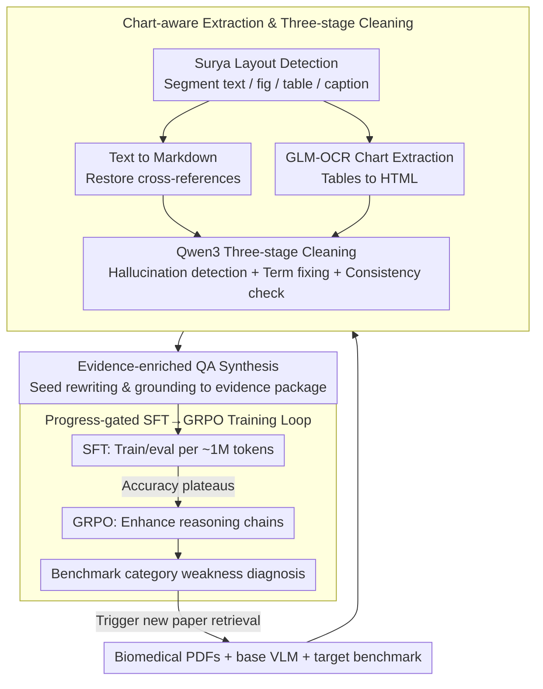

# Ryze: Evidence-Enriched Data Synthesis from Biomedical Papers

**Conference**: ACL2026  
**arXiv**: [2606.00902](https://arxiv.org/abs/2606.00902)  
**Code**: https://github.com/Chivier/Ryze  
**Area**: Medical NLP  
**Keywords**: Biomedical VLM, Evidence-enriched Data Synthesis, Scientific PDF Understanding, Chart-aware OCR, GRPO

## TL;DR
Ryze automatically converts biomedical paper PDFs into evidence-enriched QA data that preserves figures, captions, structured extractions, and cited paragraphs. Using a progress-gated SFT+GRPO strategy to train BioVLM-8B, it achieves 48.0% weighted accuracy on LAB-Bench, outperforming the Qwen3-VL-8B base by 12.6 percentage points and GPT-5.2 by 3.8 percentage points.

## Background & Motivation
**Background**: General VLMs are capable of handling everyday vision-language tasks, but understanding scientific papers exceeds basic QA. In biomedical papers, answers are often scattered across multi-column text, figure captions, coordinate axes, legends, multi-row table headers, and textual explanations of figures. Models must read these evidence chains simultaneously to answer questions regarding experimental design, sequence analysis, protocol tracing, or literature synthesis.

**Limitations of Prior Work**: The bottleneck for domain VLMs is not just model scale, but training data. Expert-annotated biomedical QA is costly and has narrow coverage. Directly reusing PubMedQA or MedQA loses visual and structural evidence. General OCR/Markdown tools often misidentify gene names, chemical formulas, chart values, and figure/table citations, and subsequent synthetic QA inherits these errors.

**Key Challenge**: Scientific QA requires "evidence integrity," whereas common data synthesis pipelines only preserve local text or figure-caption pairs. Without referring prose, table structures, and chart annotations, training samples may contain answers but actually train models to memorize shallow patterns rather than learning cross-element evidence-grounded reasoning.

**Goal**: The authors aim to solve a systematic problem: given a set of open-access biomedical PDFs, a base VLM, and a target evaluation benchmark, can high-quality domain QA data be automatically generated without human labeling to train an 8B-class model (like Qwen3-VL-8B) into a locally deployable BioVLM?

**Key Insight**: The minimal unit of scientific document data synthesis should not be "text snippets" or "image-caption pairs," but a complete evidence package: visual elements, captions, extracted structures, and the paragraphs in the main text that cite them, along with context after terminology correction and consistency checks.

**Core Idea**: Replace ordinary text synthesis with evidence-enriched scientific document extraction and QA synthesis, then use SFT to inject domain knowledge and GRPO to strengthen complex evidence reasoning.

## Method
Ryze is an end-to-end workflow rather than a single model architecture. Starting from raw PDFs, it performs chart-aware extraction and cleaning, generates QA based on complete evidence packages, uses a progress-gated strategy to decide when to switch from SFT to GRPO, and finally feeds weakness categories identified during evaluation back into the data generation phase.

### Overall Architecture
Inputs include biomedical paper PDFs, a base VLM (Qwen3-VL-8B), and a target benchmark (LAB-Bench). Ryze first segments the PDF into text blocks, figures, tables, and captions, and restores figure/table cross-references. It then retrieves associated evidence for each question to generate QA with full evidence. Training follows an incremental cycle of synthesis, SFT, and evaluation (approx. 1M tokens per cycle), switching to GRPO when SFT gains plateau. Finally, a weakness diagnosis of benchmark categories triggers a new round of paper searching and data augmentation.

### Key Designs

**1. Chart-aware extraction and three-stage cleaning: Establish a credible structured evidence base before synthesis.**

In biomedical papers, a misidentified gene name or a misread axis value can contaminate the entire downstream pipeline. Ryze prioritizes "credibility" during extraction. It uses Surya for layout detection to segment the page and converts text into Markdown while restoring cross-references (e.g., "Table 1 / Figure 3") to link visual elements with their captions and citing paragraphs. Figures and tables are handled by GLM-OCR for chart/table-aware extraction, converting tables into HTML to preserve merged cells and multi-row headers. 

The final stage involves Qwen3-based three-stage cleaning: hallucination detection, domain terminology repair, and cross-element consistency checks. Calibrating structure and terminology prevents the synthesis stage from amplifying OCR errors into "learned knowledge," which is why switching to general OCR (Marker / DeepSeek OCR) causes a drop of up to $-7.8$pp on ChartQA in ablations.

**2. Evidence-enriched QA synthesis: Trace every question back to original visual and textual evidence.**

Ordinary synthesis pipelines often only retain local text or figure-caption pairs, leading models to memorize shallow patterns. Ryze generates seeds from general domain questions in papers and skill categories abstracted from the target benchmark (chart interpretation, protocol tracing, etc.). Instead of copying benchmark questions, it uses Qwen3-VL-235B to rewrite and diversify these skills, strictly grounding each answer to visual elements, captions, OCR annotations, HTML tables, and referring paragraphs retrieved from the source PDF corpus.

This approach functions like curriculum-aware active learning: the benchmark identifies "which capabilities to cover" without providing specific questions or answers. This targets LAB-Bench related abilities while minimizing direct data leakage, though generalization ultimately relies on a held-out benchmark.

**3. Progress-gated SFT→GRPO training loop: Use evaluation plateaus to signal the switch from data accumulation to reinforced reasoning.**

Continuously adding SFT tokens leads to diminishing returns once saturated. Ryze evaluates an SFT checkpoint every ~1M synthetic tokens. Once accuracy consistently plateaus, SFT is deemed saturated. The data is frozen and converted into RL format, switching to GRPO to train the model to generate coherent reasoning chains. The division of labor is clear: the SFT phase absorbs terminology, common sense, and basic biological concepts, while the GRPO phase strengthens complex tasks requiring inference across charts, tables, captions, and text.

Experiments confirm this: SFT-only already matches GPT-5.2 ($43.7$ vs $44.2$), but the gain that allows it to surpass the baseline primarily comes from GRPO, suggesting that "memorizing facts first, then learning to reason based on evidence" is more efficient than simply adding more synthetic samples.

### Loss & Training
Training is divided into LoRA SFT and GRPO. SFT alternates between text QA and visual QA batches to balance terminology and visual evidence. GRPO does not rely on a separate reward model; instead, it converts accumulated evidence-enriched SFT data into a reinforcement-ready format to improve tasks requiring cross-modal inference. All training used the same token budget: $8,051,591$ tokens for SFT and $1,584,412$ tokens for GRPO. Hardware included AMD EPYC 7313P CPUs and 4x NVIDIA RTX A6000 48GB GPUs.

## Key Experimental Results

### Main Results
LAB-Bench contains 1,967 samples across 8 biology categories. Starting from Qwen3-VL-8B, BioVLM-8B reaches a weighted average of 48.0%, a Gain of $+12.6$pp over the base and $+3.8$pp over GPT-5.2.

| Category | Qwen3-VL-8B | GPT-5.2 | BioVLM-8B (SFT only) | BioVLM-8B (Ours) |
|----------|-------------|---------|----------------------|------------------|
| Cloning  | 24.2        | 36.4    | 34.5                 | 38.4             |
| DbQA     | 31.2        | 41.7    | 44.7                 | 48.9             |
| FigQA    | 24.7        | 36.5    | 31.8                 | 35.2             |
| LitQA2   | 38.7        | 45.7    | 58.2                 | 65.5             |
| ProtocolQA| 38.3        | 65.7    | 68.1                 | 72.3             |
| SeqQA    | 43.4        | 47.0    | 39.5                 | 42.8             |
| SuppQA   | 24.8        | 48.8    | 40.9                 | 44.2             |
| TableQA  | 34.0        | 36.9    | 40.3                 | 45.6             |
| **Weighted Avg** | 35.4 | 44.2 | 43.7 | **48.0** |

### Ablation Study
Ryze validated data sources, the OCR pipeline, and cross-model generalization.

| Configuration | Key Metric | Description |
|---------------|------------|-------------|
| BioVLM-8B Full Model | 48.0 weighted accuracy | Result after SFT and GRPO |
| BioVLM-8B (SFT only) | 43.7 weighted accuracy | Matches GPT-5.2 ($44.2$) but lacks final reasoning gain |
| PubMedQA SFT | 26.6 weighted accuracy | Much lower than evidence-enriched data at same budget |
| MedQA SFT | 29.0 weighted accuracy | Existing QA data cannot replace scientific evidence packages |
| Ours OCR pipeline | ChartQA 75.8 | Significantly outperforms general OCR on chart-heavy tasks |
| Without OCR / Marker / DeepSeek OCR | ChartQA 68.0 / 69.3 / 69.1 | Replacing the pipeline leads to a decrease of ~$-7.8$pp |

### Key Findings
- The largest gains come from preserving the full evidence chain: BioVLM-8B outperforms GPT-5.2 on LitQA2, TableQA, and DbQA by $+19.8$pp, $+8.7$pp, and $+7.2$pp respectively.
- GPT-5.2 still leads in FigQA, SeqQA, and SuppQA, indicating that BioVLM visual understanding and sequence analysis are not yet dominant in all areas.
- The same evidence-enriched SFT data improves other base models: Qwen2.5-7B ($33.1 \to 35.1$), LLaMA-3.2 ($31.3 \to 34.4$), Gemma-2 ($31.8 \to 33.5$), and Qwen3-VL-8B ($35.4 \to 43.7$).
- Low cost is a highlight: OCR+cleansing cost ~$18, QA synthesis ~$143, SFT ~$24, and GRPO ~$12, totaling less than $200.

## Highlights & Insights
- The primary value is not a new VLM backbone, but the definition of the "scientific document evidence package" as the core object of data synthesis. For scientific tasks, the data format defines the ceiling of model capability.
- Progress gating is highly practical: it prevents wasting budget on redundant samples after SFT saturation and shifts computation to GRPO to teach the model how to reason on existing evidence.
- The paper clearly defines benchmark contamination boundaries: it uses capability categories rather than specific questions/answers. This is suitable for domain customization, though held-out benchmarks are still needed to prove generalization.
- The pipeline is friendly to small labs. With a training cost below $200 and 8B-scale local deployment, it is more suitable for privacy-sensitive lab notes or internal reports than closed-source APIs.

## Limitations & Future Work
- Current experiments only cover biology/biomedicine. While expansion to climate change, geoscience, and civil engineering is mentioned, systematic results are not yet reported.
- BioVLM-8B still lags behind GPT-5.2 in FigQA, SeqQA, and SuppQA, suggesting visual detail, sequence analysis, and supporting evidence localization require stronger multimodal RL or better visual extraction.
- The scaling behavior of the progress-gated strategy on larger models is unknown. SFT saturation points and GRPO gains on 8B models may not transfer directly to 32B or 70B models.
- Data generation referred to coarse-grained skill categories from LAB-Bench; while specific questions were not used, future validation against entirely independent benchmarks is preferred.

## Related Work & Insights
- **vs LLaVA-Med / PMC-VQA**: Those works use medical images or simple figure-caption data to adapt VLMs. Ryze emphasizes the binding of captions, chart structures, and referring prose for fine-grained scientific reasoning.
- **vs PubMedQA / MedQA SFT**: Existing QA data acts as textual knowledge injection. Ryze's data comes from full evidence packages of raw PDFs. Under the same token budget, PubMedQA and MedQA significantly lag behind, proving that data structure is more important than data source.
- **vs General OCR/Parsing Tools**: Tools like Marker or DeepSeek OCR focus on general conversion quality. Ryze is designed for scientific charts and cross-references, making it superior for constructing chart/table-heavy training data.
- **Insight**: The same paradigm can be reused for other scientific fields: define the domain-specific evidence package, perform task-aware synthesis, and drive data increments with weakness feedback.

## Rating
- Novelty: ⭐⭐⭐⭐☆ Strong system design; innovation lies in evidence-enriched synthesis and progress-gated training.
- Experimental Thoroughness: ⭐⭐⭐⭐☆ Main results, data source comparisons, OCR ablations, and cost analysis are complete, though cross-domain verification is lacking.
- Writing Quality: ⭐⭐⭐⭐☆ Motivation and workflows are clear; benchmark leakage is proactively discussed.
- Value: ⭐⭐⭐⭐⭐ Highly practical for scientific VLM adaptation, especially for low-cost, local, and privacy-sensitive domain training.

<!-- RELATED:START -->

## Related Papers

- [\[ACL 2026\] Eliciting Medical Reasoning with Knowledge-enhanced Data Synthesis: A Semi-Supervised Reinforcement Learning Approach](eliciting_medical_reasoning_with_knowledge-enhanced_data_synthesis_a_semi-superv.md)
- [\[ACL 2025\] Query-driven Document-level Scientific Evidence Extraction from Biomedical Studies](../../ACL2025/medical_nlp/urca_biomedical_evidence_extraction.md)
- [\[ACL 2026\] Faithfulness vs. Safety: Evaluating LLM Behavior Under Counterfactual Medical Evidence](faithfulness_vs_safety_evaluating_llm_behavior_under_counterfactual_medical_evid.md)
- [\[ICLR 2026\] MedAgentGym: A Scalable Agentic Training Environment for Code-Centric Reasoning in Biomedical Data Science](../../ICLR2026/medical_nlp/medagentgym_agentic_training_biomedical.md)
- [\[ACL 2026\] Language Reconstruction with Brain Predictive Coding from fMRI Data](language_reconstruction_with_brain_predictive_coding_from_fmri_data.md)

<!-- RELATED:END -->
