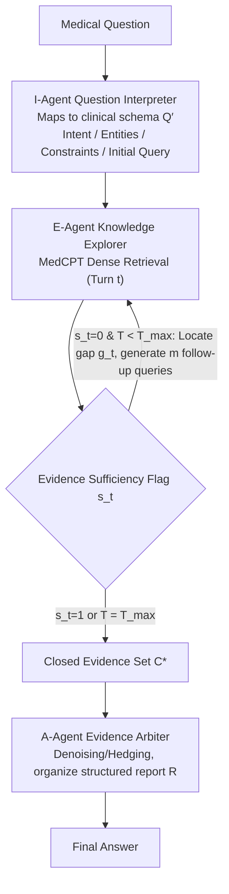

# SEMA-RAG: A Self-Evolving Multi-Agent Retrieval-Augmented Generation Framework for Medical Reasoning

**Conference**: ACL 2026 Findings  
**arXiv**: [2605.17101](https://arxiv.org/abs/2605.17101)  
**Code**: None  
**Area**: Medical NLP  
**Keywords**: Medical QA, Multi-agent RAG, Self-evolving retrieval, Evidence chain construction, Clinical reasoning

## TL;DR
The authors propose SEMA-RAG, a self-evolving multi-agent Retrival-Augmented Generation framework. By simulating phased clinical reasoning via three specialized agents (Interpreter, Explorer, Arbiter), it outperforms the strongest baselines by an average of +6.46 accuracy points across 5 medical QA benchmarks.

## Background & Motivation
**Background**: RAG is widely used to mitigate LLM hallucinations and outdated knowledge in medical QA; however, existing RAG methods primarily adopt a single-turn static retrieval paradigm.

**Limitations of Prior Work**: (1) The transformation from question to query lacks clinical semantic interpretation, making it difficult to explicitize implicit constraints; (2) Retrieval lacks a sufficiency feedback mechanism, hindering the formation of reliable evidence chains; (3) Coupling three heterogeneous tasks—interpretation, exploration, and adjudication—within a single reasoning chain imposes excessive cognitive load.

**Key Challenge**: Single-turn static RAG effectively asks a clinician to simultaneously analyze, retrieve, evaluate, and diagnose immediately upon receiving an initial case file, failing to adjust reasoning based on new evidence—a significant mismatch with the multi-stage clinical reasoning process.

**Goal**: Reconstruct the RAG workflow to match phased clinical reasoning: expanding single-turn queries into multi-turn iterative exploration, evaluating evidence sufficiency after each retrieval turn to decide the next action.

**Key Insight**: Task decoupling + role specialization—assigning interpretation, exploration, and adjudication to three collaborating specialized agents.

**Core Idea**: A three-agent division of labor (I-Agent interprets $\rightarrow$ E-Agent performs sufficiency-driven self-evolving retrieval $\rightarrow$ A-Agent performs evidence arbitration), enhancing the reliability of medical RAG through closed-loop evidence chain construction.

## Method

### Overall Architecture
SEMA-RAG consists of three agent roles sharing the same underlying LLM, distinguished solely by role prompts: (1) I-Agent maps the raw question to a structured clinical schema; (2) E-Agent accumulates evidence turn-by-turn through a sufficiency-driven self-evolving retrieval loop; (3) A-Agent arbitrates the converged evidence set and outputs the final answer.

### Key Designs

**1. I-Agent (Question Interpreter): Mapping questions to structured clinical schemas prior to retrieval**

Critical constraints in medical questions are often implicit—"7th day of hospitalization" implies a nosocomial infection. Using the raw sentence for retrieval often misses this semantic layer. The I-Agent maps unstructured questions into a schema tuple $Q' = \langle o_{\text{int}}, o_{\text{ent}}, o_{\text{cons}}, q_{\text{init}} \rangle$, representing clinical intent, medical entities, clinical constraints, and initial retrieval queries. By explicitizing implicit constraints, subsequent retrieval turns have clear alignment targets.

**2. E-Agent (Knowledge Explorer): Multi-turn self-evolving retrieval driven by evidence sufficiency**

Single-turn static retrieval cannot guarantee coverage of all key constraints. E-Agent treats retrieval as a closed loop: after each turn (using MedCPT for dense retrieval), it evaluates a sufficiency flag $s_t \in \{0,1\}$. If $s_t=0$ (insufficient), it identifies the evidence gap $g_t$ and generates $m$ targeted follow-up queries $\mathcal{Q}_{t+1}$. The process terminates when $s_t=1$ or $T_{\max}$ is reached, yielding the closed evidence set $C^*$.

This "gap identification $\rightarrow$ targeted follow-up" early-stopping mechanism is the core performance driver—removing E-Agent leads to a 6.37 point drop on MedQA-US, the largest among the three agents. It is also more efficient than fixed-turn iterations, gathering sufficient evidence with fewer tokens rather than exhausting a budget and potentially introducing noise.

**3. A-Agent (Evidence Arbiter): Denoising and hedging converged evidence for traceable judgment**

Evidence accumulated via multi-turn retrieval is often redundant or contradictory. The A-Agent serves as an arbitrator: it deduplicates and denoises the evidence set, identifies consistencies and conflicts, and organizes supporting/refuting clues into a structured report $R$. Finally, it performs discrete answer selection: $\tilde{y} = \text{Agent}_A(\text{Pmt}_{\text{ans}}, [Q, R])$. Decoupling evidence integration into a separate role provides the model with a stable basis for judgment.

### Case Example: Workflow for a "Fever on Hospitalization Day 7" question

For a question with implicit nosocomial infection clues: The I-Agent first parses it into a schema—Intent: "Differential Diagnosis," Entities: "Fever + Day 7 Hospitalization," Constraints explicitly labeled: "nosocomial." Based on this, it generates $q_{\text{init}}$. In Turn 1, the E-Agent determines $s_1=0$ because retrieved evidence only covers community-acquired infections. The gap $g_1$ is identified as "nosocomial pathogen spectrum and catheter-related infections," prompting $m=3$ follow-up queries. Turn 2 achieves $s_2=1$ as targeted evidence is found. The A-Agent then denoises this set, hedges against community-acquired distractors, organizes report $R$, and selects the answer. The process averages 4.8 LLM calls, 3.4 retrievals, and 9.5s latency, consuming 19,488 tokens—more efficient and 15.17% more accurate than i-MedRAG's fixed 3-turn approach.

### Loss & Training
- Training-free: The three agents share the same base LLM and are distinguished via role prompting.
- Default Hyperparameters: $T_{\max}=2$, $k=16$ (Top-k retrieval), $m=3$ (follow-up queries per turn).
- Temperature: 1.0 for I/E-Agent, 0.0 for A-Agent (deterministic output).

## Key Experimental Results

### Main Results (5 Benchmarks × 5 LLM Backbones, Accuracy %)

| Method | MMLU-Med | MedQA-US | MedMCQA | PubMedQA* | BioASQ | Average |
|------|---------|---------|--------|----------|--------|------|
| deepseek-v3.1 + CoT | 88.15 | 77.53 | 71.69 | 38.40 | 80.10 | 71.17 |
| deepseek-v3.1 + MedRAG | 88.61 | 77.14 | 67.99 | 44.60 | 78.48 | 71.36 |
| deepseek-v3.1 + i-MedRAG | 85.86 | 74.78 | 65.65 | 50.60 | 80.58 | 71.49 |
| **deepseek-v3.1 + SEMA-RAG** | **91.46** | **89.95** | **75.09** | **59.20** | **82.85** | **79.71** |
| gemini-2.0-flash + CoT | 58.22 | 65.12 | 41.33 | 40.20 | 68.45 | 54.66 |
| **gemini-2.0-flash + SEMA-RAG** | **80.99** | **90.42** | **71.60** | **59.20** | **88.19** | **78.08** |

### Ablation Study (deepseek-v3.1, MedQA-US / PubMedQA*)

| Configuration | MedQA-US | PubMedQA* |
|------|---------|----------|
| w/o I-Agent | 85.47 | 54.20 |
| w/o E-Agent | 83.58 | 50.80 |
| w/o A-Agent | 86.49 | 53.60 |
| **Full SEMA-RAG** | **89.95** | **59.20** |

### Key Findings
- Removing the E-Agent leads to the most significant performance degradation (-6.37 on MedQA-US), confirming self-evolving retrieval as the core benefit.
- Query width $m$: $m=1$ (86.72%), $m=2$ (89.00%), $m=3$ (89.95%); gains show diminishing returns.
- Exploration depth $T_{\max}$: Optimal at 2-3 turns; exceeding this may introduce noise.
- Efficiency: SEMA-RAG averages 4.8 LLM calls / 3.4 retrievals / 9.5s latency and 19,488 tokens—fewer tokens than i-MedRAG (21,517) with a +15.17% accuracy improvement.

## Highlights & Insights
- The multi-agent architecture precisely simulates the phased workflow of clinical reasoning (Interpretation → Exploration → Adjudication), demonstrating the universality of task decoupling.
- The sufficiency-driven early stopping mechanism is more efficient than fixed-turn iterations, achieving higher accuracy with fewer tokens.
- Significant improvements on Gemini-2.0-flash (+23.42 average) suggest the framework provides stronger enhancement for relatively weaker models.
- Case studies vividly demonstrate how the "structured interpretation → gap identification → targeted retrieval" sequence forms a reliable evidence chain.

## Limitations & Future Work
- Evaluation is limited to benchmark environments and lacks validation in real clinical workflows (e.g., longitudinal EHR reasoning).
- The framework depends on the quality and coverage of the retrieval corpus; self-evolution may converge on incomplete evidence if key knowledge is missing.
- Sufficiency judgment criteria are not yet optimized for option-level separability or generative completeness.
- Additional overhead from multi-turn reasoning is superior to fixed-step baselines but remains higher than single-turn methods.

## Related Work & Insights
- MedRAG / MedCPT provide the retrieval foundation for medical domains, while SEMA-RAG builds a multi-turn closed loop upon them.
- SEMA-RAG improves upon i-MedRAG's iterative approach by introducing a sufficiency feedback mechanism.
- Multi-agent collaboration (CAMEL / MetaGPT / MedAgents) principles can be extended to other high-stakes domains requiring multi-stage reasoning.
- The "gap detection + targeted follow-up" pattern in self-evolving retrieval can inspire complex RAG system designs outside of medicine.

## Rating
- Novelty: ⭐⭐⭐⭐ Task decoupling + sufficiency-driven self-evolving retrieval are clear innovations.
- Experimental Thoroughness: ⭐⭐⭐⭐⭐ 5 benchmarks × 5 LLM backbones + complete ablation + efficiency analysis + case studies.
- Writing Quality: ⭐⭐⭐⭐ Rigorous formalization and intuitive clinical analogies.
- Value: ⭐⭐⭐⭐⭐ Significant and consistent improvements in medical QA; framework logic is broadly applicable.

<!-- RELATED:START -->

## Related Papers

- [\[ACL 2026\] HeteroRAG: A Heterogeneous Retrieval-Augmented Generation Framework for Medical Vision Language Tasks](heterorag_a_heterogeneous_retrieval-augmented_generation_framework_for_medical_v.md)
- [\[ACL 2026\] MultiDx: A Multi-Source Knowledge Integration Framework towards Diagnostic Reasoning](multidx_a_multi-source_knowledge_integration_framework_towards_diagnostic_reason.md)
- [\[ACL 2025\] Towards Omni-RAG: Comprehensive Retrieval-Augmented Generation for Large Language Models in Medical Applications](../../ACL2025/medical_nlp/omni_rag_medical.md)
- [\[ACL 2026\] MARCH: Multi-Agent Radiology Clinical Hierarchy for CT Report Generation](march_multi-agent_radiology_clinical_hierarchy_for_ct_report_generation.md)
- [\[ACL 2026\] RA-RRG: Multimodal Retrieval-Augmented Radiology Report Generation with Key Phrase Extraction](ra-rrg_multimodal_retrieval-augmented_radiology_report_generation_with_key_phras.md)

<!-- RELATED:END -->
