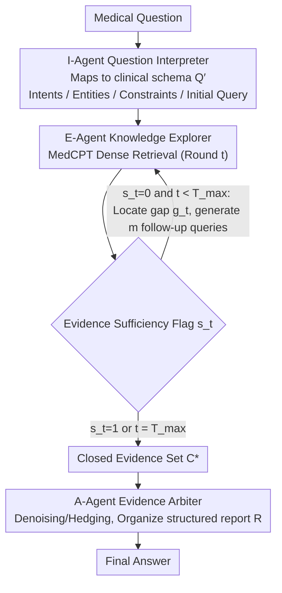

# SEMA-RAG: A Self-Evolving Multi-Agent Retrieval-Augmented Generation Framework for Medical Reasoning

**Conference**: ACL 2026 Findings  
**arXiv**: [2605.17101](https://arxiv.org/abs/2605.17101)  
**Code**: None  
**Area**: Medical NLP  
**Keywords**: Medical QA, Multi-Agent RAG, Self-evolving retrieval, Evidence chain construction, Clinical reasoning

## TL;DR
The authors propose SEMA-RAG, a self-evolving multi-agent RAG framework that simulates the phased workflow of clinical reasoning through three specialized agents (Interpreter, Explorer, and Arbiter). It surpasses the strongest baselines by an average of +6.46 accuracy points across 5 medical QA benchmarks.

## Background & Motivation
**Background**: RAG is widely used to mitigate hallucinations and knowledge obsolescence in LLMs for medical QA. However, existing RAG methods primarily employ a single-turn static retrieval paradigm.

**Limitations of Prior Work**: (1) Question-to-query transformation lacks clinical semantic interpretation, making implicit constraints difficult to explicitize; (2) Retrieval lacks a sufficiency feedback mechanism, hindering the formation of reliable evidence chains; (3) Coupling explanation, exploration, and adjudication tasks within a single reasoning chain imposes excessive cognitive load.

**Key Challenge**: Single-turn static RAG requires clinicians to analyze, retrieve, evaluate, and diagnose simultaneously upon receiving an initial medical record. This inability to adjust reasoning as new evidence emerges is severely misaligned with multi-stage clinical reasoning processes.

**Goal**: Restructure the RAG workflow to match phased clinical reasoning by extending single-round queries into multi-round iterative exploration, assessing evidence sufficiency after each retrieval to determine subsequent actions.

**Key Insight**: Task decoupling + role specialization—assigning interpretation, exploration, and adjudication to three specialized agents.

**Core Idea**: A three-agent division of labor (I-Agent interpretation → E-Agent sufficiency-driven self-evolving retrieval → A-Agent evidence arbitration), enhancing medical RAG reliability through closed-loop evidence chain construction.

## Method

### Overall Architecture
SEMA-RAG consists of three role-based agents sharing the same underlying LLM, distinguished only by role prompts: (1) I-Agent maps the raw question to a structured clinical schema; (2) E-Agent accumulates evidence through an iterative self-evolving retrieval loop driven by evidence sufficiency; (3) A-Agent arbitrates the converged evidence set and outputs the final answer.

### Key Designs

**1. I-Agent (Question Interpreter): Mapping questions to structured clinical schemas prior to retrieval**

Critical constraints in medical questions are often implicit; for instance, "hospitalization day 7" suggests nosocomial infection. Retrieving with the raw sentence may miss this semantic layer. The I-Agent maps unstructured questions into a schema tuple $Q' = \langle o_{\text{int}}, o_{\text{ent}}, o_{\text{cons}}, q_{\text{init}} \rangle$, representing clinical intent, medical entities, clinical constraints, and the initial retrieval query. By making implicit constraints explicit, subsequent retrieval rounds have clear alignment targets rather than navigating vague semantics.

**2. E-Agent (Knowledge Explorer): Sufficiency-driven multi-round self-evolving retrieval**

Single-turn static retrieval cannot guarantee coverage of all key constraints, akin to forcing a clinician to diagnose immediately after a single look at a chart. The E-Agent implements retrieval as a closed loop: after each round (using MedCPT for dense retrieval), it evaluates a sufficiency flag $s_t \in \{0, 1\}$. If $s_t=0$, it identifies an evidence gap $g_t$ and generates $m$ targeted follow-up queries $\mathcal{Q}_{t+1}$ for the next round. The loop terminates when $s_t=1$ or the limit $T_{\max}$ is reached, yielding the closed evidence set $C^*$.

This "gap identification → targeted retrieval" early-stopping mechanism is the primary source of performance gain; removing the E-Agent leads to a 6.37 drop on MedQA-US, the largest among all agents. It is also more efficient than fixed-round iteration, gathering sufficient evidence with fewer tokens without the noise introduced by redundant cycles.

**3. A-Agent (Evidence Arbiter): Denoising and hedging converged evidence for traceable judgments**

Evidence accumulated over multiple rounds is often redundant or contradictory. The A-Agent serves as an arbiter: it removes noise and duplicates from the evidence set, identifies consistencies and conflicts, and organizes supporting/refuting clues into a structured report $R$. It then performs discrete answer selection based on the report: $\tilde{y} = \text{Agent}_A(\text{Pmt}_{\text{ans}}, [Q, R])$. Decoupling evidence integration into a dedicated role provides the model with a stable basis for judgment rather than oscillating between conflicting data points.

### Process Example: A "Hospitalization Day 7 Fever" Case

Consider a case with implicit nosocomial infection clues: The I-Agent parses it into a schema—intent: "differential diagnosis"; entities: "fever + day 7 of hospitalization"; constraints: "nosocomial setting"; and generates $q_{\text{init}}$. After round 1, the E-Agent determines $s_1=0$ because evidence only covers community-acquired infection. It identifies gap $g_1$ as "nosocomial pathogens and catheter-related infections" and generates $m=3$ follow-up queries. Round 2 retrieves targeted evidence, resulting in $s_2=1$. Within $T_{\max}=2$, it converges on $C^*$. The A-Agent then denoises this evidence, hedges against community infection distractors, and selects the answer. The process averages 4.8 LLM calls, 3.4 retrievals, 9.5s latency, and 19,488 tokens—more efficient than i-MedRAG's fixed 3 rounds (21,517 tokens) with 15.17% higher accuracy.

### Loss & Training
- Training-free: Agents share the same base LLM and are distinguished via role prompts.
- Hyperparameters: $T_{\max}=2$, $k=16$ (Top-k retrieval), $m=3$ (follow-up queries per round).
- Temperature: 1.0 for I/E-Agent, 0.0 for A-Agent (deterministic output).

## Key Experimental Results

### Main Results (5 Benchmarks × 5 LLM Backbones, Accuracy %)

| Method | MMLU-Med | MedQA-US | MedMCQA | PubMedQA* | BioASQ | Average |
|------|---------|---------|--------|----------|--------|------|
| deepseek-v3.1 + CoT | 88.15 | 77.53 | 71.69 | 38.40 | 80.10 | 71.17 |
| deepseek-v3.1 + MedRAG | 88.61 | 77.14 | 67.99 | 44.60 | 78.48 | 71.36 |
| deepseek-v3.1 + i-MedRAG | 85.86 | 74.78 | 65.65 | 50.60 | 80.58 | 71.49 |
| **deepseek-v3.1 + SEMA-RAG** | **91.46** | **89.95** | **75.09** | **59.20** | **82.85** | **79.71** |
| gemini-2.0-flash + CoT | 58.22 | 65.12 | 41.33 | 40.20 | 68.45 | 54.66 |
| **gemini-2.0-flash + SEMA-RAG** | **80.99** | **90.42** | **71.60** | **59.20** | **88.19** | **78.08** |

### Ablation Study (deepseek-v3.1, MedQA-US / PubMedQA*)

| Configuration | MedQA-US | PubMedQA* |
|------|---------|----------|
| w/o I-Agent | 85.47 | 54.20 |
| w/o E-Agent | 83.58 | 50.80 |
| w/o A-Agent | 86.49 | 53.60 |
| **Full SEMA-RAG** | **89.95** | **59.20** |

### Key Findings
- Removing the E-Agent caused the most significant performance drop (-6.37 on MedQA-US), confirming self-evolving retrieval as the core contributor.
- Query width $m$: Increasing from $m=1$ (86.72%) to $m=3$ (89.95%) showed diminishing returns.
- Exploration depth $T_{\max}$ peaks at 2-3 rounds; exceeding this potentially introduces noise.
- Efficiency: SEMA-RAG averages 4.8 LLM calls / 3.4 retrievals / 9.5s latency, consuming 19,488 tokens (vs. 21,517 for i-MedRAG) while achieving 15.17% higher accuracy.

## Highlights & Insights
- The three-agent architecture simulates the phased clinical reasoning workflow (Interpretation → Exploration → Arbitration) with universal task-decoupling principles.
- Sufficiency-driven early stopping is more efficient than fixed-round iterations (like i-MedRAG), achieving higher accuracy with fewer tokens.
- Gains are most pronounced on gemini-2.0-flash (average +23.42), indicating stronger enhancement for relatively weaker models.
- Case studies demonstrate how structured interpretation → gap identification → targeted retrieval forms a reliable evidence chain.

## Limitations & Future Work
- Evaluation is limited to benchmark environments and has not been validated in real clinical workflows (e.g., longitudinal EHR reasoning).
- The framework depends on the quality and coverage of the retrieval corpus; if key evidence is missing or outdated, the loop may converge on incomplete data.
- Sufficiency judgment criteria are not yet optimized for option-level separability or generative completeness.
- While more efficient than fixed-step baselines, multi-round reasoning still incurs higher overhead than single-turn methods.

## Related Work & Insights
- MedRAG / MedCPT provide the retrieval foundation for the medical domain, while SEMA-RAG builds multi-round closed loops upon them.
- SEMA-RAG improves upon i-MedRAG by introducing sufficiency feedback.
- Multi-agent collaboration concepts (CAMEL / MetaGPT / MedAgents) can be extended to other high-risk domains requiring multi-stage reasoning.
- The gap detection + targeted follow-up pattern in self-evolving retrieval can inspire complex RAG system designs in non-medical fields.

## Rating
- Novelty: ⭐⭐⭐⭐ Task decoupling + sufficiency-driven self-evolving retrieval represent clear innovations.
- Experimental Thoroughness: ⭐⭐⭐⭐⭐ 5 benchmarks × 5 LLM backbones × complete ablations + efficiency analysis + case studies.
- Writing Quality: ⭐⭐⭐⭐ Formal expressions are rigorous, and clinical reasoning analogies are intuitive.
- Value: ⭐⭐⭐⭐⭐ Significant and consistent improvements in medical QA; the framework's philosophy is broadly applicable.

<!-- RELATED:START -->

## Related Papers

- [\[ACL 2026\] HeteroRAG: A Heterogeneous Retrieval-Augmented Generation Framework for Medical Vision Language Tasks](heterorag_a_heterogeneous_retrieval-augmented_generation_framework_for_medical_v.md)
- [\[ACL 2026\] MultiDx: A Multi-Source Knowledge Integration Framework towards Diagnostic Reasoning](multidx_a_multi-source_knowledge_integration_framework_towards_diagnostic_reason.md)
- [\[ACL 2026\] MARCH: Multi-Agent Radiology Clinical Hierarchy for CT Report Generation](march_multi-agent_radiology_clinical_hierarchy_for_ct_report_generation.md)
- [\[ACL 2025\] Towards Omni-RAG: Comprehensive Retrieval-Augmented Generation for Large Language Models in Medical Applications](../../ACL2025/medical_nlp/omni_rag_medical.md)
- [\[ACL 2026\] RA-RRG: Multimodal Retrieval-Augmented Radiology Report Generation with Key Phrase Extraction](ra-rrg_multimodal_retrieval-augmented_radiology_report_generation_with_key_phras.md)

<!-- RELATED:END -->
