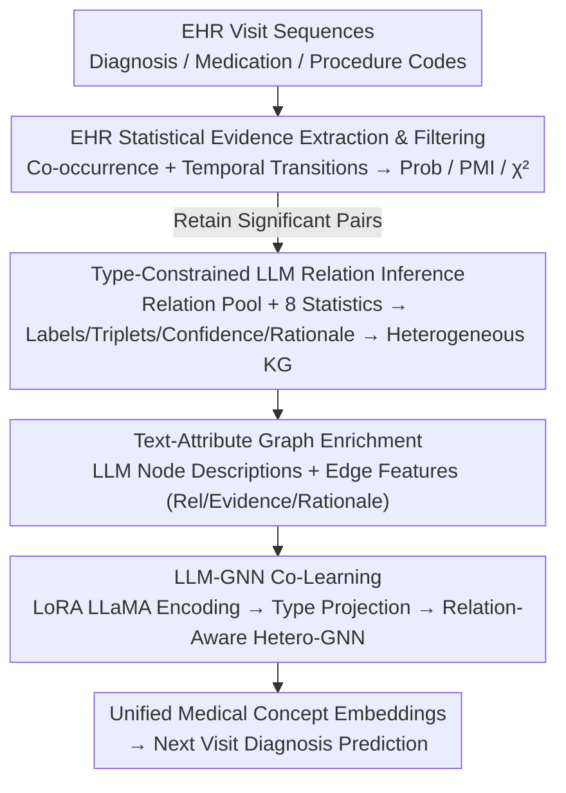

# Text-Attributed Knowledge Graph Enrichment with Large Language Models for Medical Concept Representation

**Conference**: ACL 2026  
**arXiv**: [2604.13331](https://arxiv.org/abs/2604.13331)  
**Code**: None  
**Area**: Medical NLP  
**Keywords**: Medical concept representation, Knowledge Graph, LLM-GNN co-learning, Electronic Health Records, Text-Attributed Graph

## TL;DR

This paper proposes CoMed, an LLM-empowered graph learning framework. By combining statistical evidence from EHR with type-constrained LLM reasoning to construct a global medical KG, then enriching it into a text-attributed graph (TAG) via LLM-generated node descriptions and edge rationales, the framework jointly trains a LoRA-finetuned LLaMA encoder and a heterogeneous GNN to learn unified medical concept embeddings. It significantly improves diagnosis prediction performance on MIMIC-III/IV.

## Background & Motivation

**Background**: Learning high-quality medical concept representations (embeddings for diagnosis/medication/procedure codes) is fundamental for clinical prediction in EHR mining. Existing methods primarily utilize the hierarchical structures of medical ontologies (e.g., parent-child relationships in ICD) or limited cross-type semantics (e.g., UMLS) to guide representation learning.

**Limitations of Prior Work**: (1) Cross-type dependencies (e.g., diagnosis-treatment relationships, medication-procedure associations) are largely missing or incomplete in existing ontologies; (2) Rich clinical semantics usually exist in textual form but are difficult to integrate with KG structures; (3) Unconstrained LLM prompting may produce plausible-sounding but unsupported edges with inconsistent outputs.

**Key Challenge**: While LLMs encode broad biomedical knowledge, KG inference for clinical modeling must remain evidence-based, type-aware, and globally consistent—balancing the semantic richness of LLMs with the empirical support of EHR data.

**Goal**: To construct a clinically interpretable and evidence-supported heterogeneous KG, and to learn unified medical concept embeddings that fuse textual semantics and graph structures.

**Key Insight**: First extract statistically significant code pairs from EHR as candidate relationships, then use LLMs to infer semantic relationship types under type constraints and evidence conditions—a "statistical filtering + LLM inference" dual-insurance strategy.

**Core Idea**: EHR statistical evidence provides the empirical foundation, while LLMs provide semantic explanations and relationship types. The two complement each other to build the KG, followed by LLM-GNN co-learning to fuse textual and structural information.

## Method

### Overall Architecture

CoMed consists of four steps: (1) Extract co-occurrence and temporal transition statistics from EHR, retaining statistically significant code pairs; (2) Use type-constrained LLM prompting to infer directed relationship types, confidence levels, and rationales for each pair; (3) Enrich the KG into a text-attributed graph using LLM-generated node descriptions and edge features; (4) Jointly train a LoRA-finetuned LLaMA-1B encoder and a heterogeneous GNN to learn concept embeddings.

### Key Designs

**1. EHR Statistical Evidence Extraction and Filtering: Mining candidate relationships with empirical support**

Relying solely on LLM inference for relationships risks hallucinating "plausible but unsupported" edges. Therefore, CoMed lets the data speak first. It calculates three statistics for each pair of codes—smoothed conditional probability, PMI (Pointwise Mutual Information), and the p-value of a chi-square independence test—under two settings: co-occurrence within the same admission and temporal transitions across visits. Code pairs with low support, low association, or non-significance ($p > 0.05$) are filtered out.

This step tightens the criteria for candidate edges from "clinically plausible" to "actually observed in this dataset," effectively setting an empirically grounded candidate pool for subsequent LLM inference.

**2. Type-Constrained LLM Relationship Inference: Qualifying relationships under dual constraints**

Statistical co-occurrence alone does not reveal the specific relationship between two codes, yet unconstrained LLM inference might produce semantically nonsensical edges like "diagnosis-treats-diagnosis." CoMed defines a candidate relationship pool (causes, treats, diagnostic_of, etc.) for each code type combination (dx-dx, rx-dx, px-dx, etc.). It then feeds structured prompts containing code identifiers, frequencies, and 8 statistical indicators (with definitions) to the LLM, which returns relationship labels, directed triplets, confidence scores, and a 50–60 word clinical rationale.

Type constraints prevent semantically invalid relationships, while evidence conditions force the LLM to synthesize clinical knowledge with statistical signals. Clinical experts gave an average rating of 4.84/5 for 50 randomly sampled edges, confirming that this "statistical filtering + type-constrained inference" strategy produces high-quality, interpretable edges.

**3. Text-Attributed Graph Enrichment: Upgrading symbolic KG with clinical semantics**

At this stage, the KG is merely a skeleton of "code nodes + relationship types," and GNNs cannot read clinical semantics during message passing. This is the core problem addressed by "text-attributed knowledge graph enrichment." CoMed uses the LLM as a high-coverage medical knowledge base to enrich the KG: on the node side, it generates clinical descriptions (typical presentation, indications, role in treatment) for each code using type-specific prompts; on the edge side, it concatenates relationship labels, confidence, and free-text rationales with the 8 EHR statistical indicators into edge feature vectors.

This acts as the bridge between "symbolic KG" and "semantic encoding." Without node descriptions, the LLaMA encoder would lack readable input; without edge features, the GNN could not utilize relationship types or empirical signals during message passing.

**4. LLM-GNN Co-Learning (CoMed): Mutual compensation of text semantics and graph structure**

GNNs excel at aggregating structural information but cannot read long text; LLMs encode rich semantics but lack global relational constraints. CoMed integrates them end-to-end: a LoRA-finetuned LLaMA-1B encodes node descriptions into text embeddings, which are mapped to the GNN space via type-specific linear projections. The heterogeneous GNN then performs relation-aware message passing on the KG to output final concept embeddings.

To address the long-tail distribution of medical codes, a two-phase LoRA update scheduling is used. Early training prioritizes "least-updated-first" to ensure coverage, while later stages mix low-frequency and high-frequency codes to solve the under-updating of rare codes in mini-batch training. This is key to boosting performance for rare diagnosis labels (0–25% frequency) from 40.60 to 47.67 (+7.07) in ablation studies.

### Loss & Training

A multi-label cross-entropy loss is used for training the next-visit diagnosis prediction task. CoMed acts as a plug-and-play concept encoder integrated into standard EHR models for end-to-end training.

## Key Experimental Results

### Main Results

**MIMIC-III Diagnosis Prediction Performance Comparison**

| Method | AUPRC | F1 | Acc@15 |
|------|-------|-----|--------|
| Base Transformer | 41.00 | 33.16 | 47.20 |
| GRAM | 41.70 | 34.60 | 48.60 |
| LINKO | 44.91 | 38.20 | 52.30 |
| GraphCare | 43.35 | 35.46 | 52.76 |
| **CoMed (Ours)** | **47.21** | **42.28** | **54.20** |

### Ablation Study

**Plug-and-play analysis (Integrating CoMed into different backbones)**

| Backbone | Without CoMed | With CoMed | Gain |
|----------|---------|---------|------|
| Transformer | 41.00 | 47.21 | +6.21 |
| RETAIN | ~40 | ~46 | +6 |
| GRAM | 41.70 | ~47 | +5 |

### Key Findings

- CoMed improves AUPRC on MIMIC-III from 41.00 to 47.21 (+6.21), ranking first among all baselines.
- The improvement is particularly significant for rare labels (0-25% frequency)—from 40.60 to 47.67 (+7.07)—as KG relationships allow rare concepts to borrow information from associated ones.
- CoMed consistently improves performance as a plug-and-play concept encoder across multiple backbones.
- Clinical expert ratings for LLM-inferred edges (4.84±0.29/5) validate the clinical validity of the KG.
- Consistent improvements on MIMIC-IV demonstrate cross-dataset generalization.

## Highlights & Insights

- The "statistical filtering + LLM inference" dual-insurance strategy ensures both empirical support and semantic rationality for the KG.
- Two-phase LoRA update scheduling cleverly addresses training imbalances caused by the long-tail distribution of medical codes.
- The significant boost for rare diagnoses is clinically meaningful, as rare diseases are often the hardest to predict and require the most attention.

## Limitations & Future Work

- LLM-generated node descriptions and rationales may contain subtle hallucinations or biases.
- Evaluation is limited to diagnosis prediction; performance on medication recommendation or readmission prediction is not yet verified.
- KG construction depends on statistics from the target dataset; EHRs from different hospitals might generate different KGs.
- The text encoding capability of LLaMA-1B is finite; larger LLMs might yield better embeddings.

## Related Work & Insights

- **vs GRAM**: GRAM only uses ICD hierarchies, whereas CoMed introduces cross-type relationships and textual semantics—resulting in +5.51 AUPRC.
- **vs GraphCare**: The latter uses external medical KGs without aligning with EHR data; CoMed ensures empirical support through statistical filtering.
- **vs LINKO**: LINKO uses link prediction for KG construction but does not fuse textual semantics; CoMed's LLM-GNN co-learning is more comprehensive.

## Rating

- Novelty: ⭐⭐⭐⭐ The idea of EHR statistics + LLM inference for KG construction and the LLM-GNN co-learning framework is novel.
- Experimental Thoroughness: ⭐⭐⭐⭐⭐ MIMIC-III/IV × multiple baselines + plug-and-play analysis + clinical expert validation.
- Writing Quality: ⭐⭐⭐⭐ Clear methodology flow with well-motivated design steps.
- Value: ⭐⭐⭐⭐⭐ Highly valuable to the EHR research community as a plug-and-play concept encoder.

<!-- RELATED:START -->

## Related Papers

- [\[ACL 2026\] MHGraphBench: Knowledge Graph-Grounded Benchmarking of Mental Health Knowledge in Large Language Models](mhgraphbench_knowledge_graph-grounded_benchmarking_of_mental_health_knowledge_in.md)
- [\[ACL 2026\] Beyond the Leaderboard: Rethinking Medical Benchmarks for Large Language Models](beyond_the_leaderboard_rethinking_medical_benchmarks_for_large_language_models.md)
- [\[ACL 2026\] RePrompT: Recurrent Prompt Tuning for Integrating Structured EHR Encoders with Large Language Models](reprompt_recurrent_prompt_tuning_for_integrating_structured_ehr_encoders_with_la.md)
- [\[ACL 2026\] Region-Grounded Report Generation for 3D Medical Imaging: A Fine-Grained Dataset and Graph-Enhanced Framework](region-grounded_report_generation_for_3d_medical_imaging_a_fine-grained_dataset_.md)
- [\[ACL 2026\] MedFact: Benchmarking the Fact-Checking Capabilities of Large Language Models on Chinese Medical Texts](medfact_benchmarking_the_fact-checking_capabilities_of_large_language_models_on_.md)

<!-- RELATED:END -->
