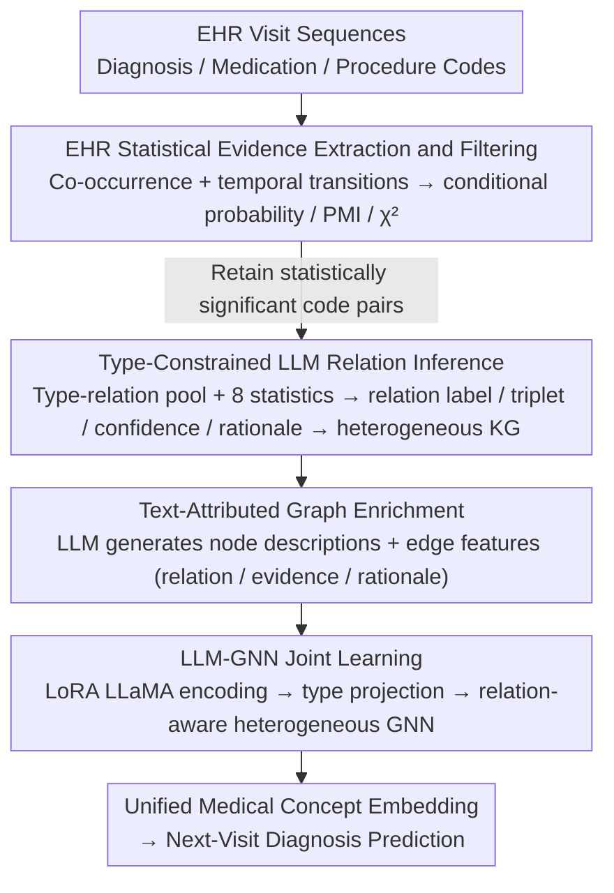

# Text-Attributed Knowledge Graph Enrichment with Large Language Models for Medical Concept Representation

**Conference**: ACL 2026  
**arXiv**: [2604.13331](https://arxiv.org/abs/2604.13331)  
**Code**: None  
**Area**: Medical NLP  
**Keywords**: Medical concept representation, knowledge graph, LLM-GNN joint learning, Electronic Health Records, text-attributed graphs

## TL;DR

This paper proposes CoMed, an LLM-empowered graph learning framework. It constructs a global medical knowledge graph by combining EHR statistical evidence with type-constrained LLM reasoning. It then enriches the graph into a text-attributed graph using LLM-generated node descriptions and edge rationales. Finally, it jointly trains a LoRA-finetuned LLaMA encoder and a heterogeneous GNN to learn unified medical concept embeddings, significantly improving diagnosis prediction performance on MIMIC-III/IV.

## Background & Motivation

**Background**: In EHR mining, learning high-quality medical concept representations (embeddings for diagnosis, medication, and procedure codes) is the foundation for clinical prediction. Existing methods primarily utilize the hierarchical structure of medical ontologies (e.g., ICD parent-child relations) or limited cross-type semantics (e.g., UMLS) to construct knowledge graphs (KGs) that guide representation learning.

**Limitations of Prior Work**: (1) Cross-type dependencies (e.g., diagnosis-treatment relations, medication-procedure associations) are largely missing or incomplete in existing ontologies; (2) Rich clinical semantics usually exist in text form but are difficult to integrate with KG structures; (3) Unconstrained LLM prompting may produce plausible but unsupported edges with inconsistent outputs.

**Key Challenge**: LLMs encode broad biomedical knowledge, but KG inference for clinical modeling must remain evidence-based, type-aware, and globally consistent—requiring a balance between the semantic richness of LLMs and the empirical support of EHRs.

**Goal**: To construct a clinically interpretable and empirically supported heterogeneous KG, and learn unified medical concept embeddings that fuse textual semantics and graph structures.

**Key Insight**: First extract statistically significant code pairs from EHRs as candidate relations, then use LLMs to infer semantic relation types under type constraints and evidence conditions—a "statistical filtering + LLM inference" double-protection strategy.

**Core Idea**: EHR statistical evidence provides an empirical foundation, while LLMs provide semantic explanations and relation types—the two complement each other to construct the KG, followed by LLM-GNN joint learning to fuse textual and structural information.

## Method

### Overall Architecture

CoMed consists of four steps: (1) Extract co-occurrence and temporal transition statistics from EHRs, retaining statistically significant code pairs; (2) Use type-constrained LLM prompting to infer directed relation types, confidence, and rationales for each code pair; (3) Enrich the KG into a text-attributed graph using LLM-generated node descriptions and edge features; (4) Jointly train a LoRA-finetuned LLaMA-1B encoder and a heterogeneous GNN to learn concept embeddings.

### Key Designs

**1. EHR Statistical Evidence Extraction and Filtering: Extracting empirical candidate relations from data first**

Pure LLM inference is prone to hallucinating "plausible but unsupported" edges. Therefore, CoMed grounds the process in data first. It calculates three statistics for each code pair: smoothed conditional probability, PMI association, and the p-value from a Chi-square independence test. Statistics are collected under two settings: co-occurrence within the same hospitalization and temporal transitions across visits. Code pairs with low support, low association, or non-significance ($p > 0.05$) are filtered out.

The significance of this step is to tighten the criteria for candidate edges from "clinically plausible" to "actually observed in this dataset," establishing an empirical foundation for subsequent LLM inference rather than allowing the model to wander freely in the entire biomedical knowledge space.

**2. Type-Constrained LLM Relation Inference: Defining relations under dual constraints of type and evidence**

While statistical co-occurrence reveals connections, it does not define the nature of the relationship. Conversely, unconstrained LLM inference might produce semantically nonsensical edges like "diagnosis treats diagnosis." CoMed predefines candidate relation pools for each code type combination (dx-dx, rx-dx, px-dx, etc.). It then feeds structured prompts containing code identifiers, frequencies, and 8 statistical indicators (with descriptions) to the LLM. The LLM returns relation labels, directed triples, confidence scores, and a clinical rationale of 50–60 words.

Type constraints prevent semantically irrational relations, while evidence conditions force the LLM to synthesize clinical knowledge with statistical signals. Clinical experts gave an average rating of 4.84/5 to 50 randomly sampled edges, demonstrating that this "statistical filtering + type-constrained inference" strategy produces high-quality, interpretable edges.

**3. Text-Attributed Graph Enrichment: Upgrading the symbolic KG to a clinical semantic graph for GNN consumption**

At this stage, the KG only contains a skeleton of "code nodes + relation types." GNNs cannot read clinical semantics during message passing. This is the core problem addressed by "Text-Attributed Knowledge Graph Enrichment." CoMed uses the LLM as a high-coverage medical knowledge base to enrich the KG into a text-attributed graph. On the node side, type-specific prompts generate clinical descriptions (typical manifestations, indications, clinical roles, and key considerations), which are attached as node attributes. On the edge side, the relation labels, confidence, rationales, and 8 EHR statistics are concatenated into edge feature vectors.

This step bridges "symbolic KG" and "semantic encoding." Without node descriptions, the LLaMA encoder would have no readable text input; without edge features, the GNN could not utilize relation types and empirical signals during message passing. This allows the KG to possess both the relational power of graphs and the semantic richness of LLMs.

**4. LLM-GNN Joint Learning (CoMed): Enabling text semantics and graph structure to complement each other during training**

GNNs excel at aggregating structural information but cannot interpret long text; LLMs encode rich semantics but lack global relational constraints. CoMed joins them end-to-end: a LoRA-finetuned LLaMA-1B encodes node descriptions to obtain text embeddings, which are mapped to the GNN space via type-specific linear projections. A heterogeneous GNN then performs relation-aware message passing on the KG to output the final concept embeddings.

To address the long-tail distribution of medical codes, a two-stage LoRA update schedule is employed. Early training focuses on "least-update first" to ensure coverage, while later stages mix low-frequency and high-frequency codes to resolve insufficient updates for rare codes in mini-batch training. This is key to the improvement in rare diagnosis labels (0–25% frequency) from 40.60 to 47.67 (+7.07), as the KG allows rare concepts to borrow information from related ones.

### Loss & Training

A multi-label cross-entropy loss is used for the next-visit diagnosis prediction task. CoMed acts as a plug-and-play concept encoder integrated into standard EHR models for end-to-end training.

## Key Experimental Results

### Main Results

**MIMIC-III Diagnosis Prediction Performance Comparison**

| Method | AUPRC | F1 | Acc@15 |
|------|-------|-----|--------|
| Base Transformer | 41.00 | 33.16 | 47.20 |
| GRAM | 41.70 | 34.60 | 48.60 |
| LINKO | 44.91 | 38.20 | 52.30 |
| GraphCare | 43.35 | 35.46 | 52.76 |
| **Ours (CoMed)** | **47.21** | **42.28** | **54.20** |

### Ablation Study

**Plug-and-play analysis (Integrating CoMed into different backbones)**

| Backbone | Without CoMed | With CoMed | Gain |
|----------|---------------|------------|------|
| Transformer | 41.00 | 47.21 | +6.21 |
| RETAIN | ~40 | ~46 | +6 |
| GRAM | 41.70 | ~47 | +5 |

### Key Findings

- CoMed improves AUPRC on MIMIC-III from 41.00 to 47.21 (+6.21), ranking first among all baselines.
- Improvements are particularly significant for rare diagnosis labels (0-25% frequency)—from 40.60 to 47.67 (+7.07)—as KG relations help rare concepts leverage information from associated concepts.
- CoMed consistently improves performance as a plug-and-play concept encoder across multiple backbones.
- Clinical experts rated the LLM-inferred edges at 4.84±0.29/5, validating the clinical validity of the KG.
- Consistent gains on MIMIC-IV demonstrate cross-dataset generalization.

## Highlights & Insights

- The "statistical filtering + LLM inference" strategy ensures both the empirical grounding and semantic rationality of KG relations.
- The two-stage LoRA update schedule elegantly addresses the training imbalance caused by the long-tail distribution of medical codes.
- The significant improvement for rare diagnoses has high clinical value, as rare diseases are often the most difficult to predict and require the most attention.

## Limitations & Future Work

- LLM-generated node descriptions and relation rationales may contain subtle hallucinations or biases.
- Evaluation is limited to diagnosis prediction; performance on tasks like medication recommendation or readmission prediction has not been verified.
- KG construction depends on statistics from the target dataset; different hospital EHRs may yield different KGs.
- The text encoding capability of LLaMA-1B is limited; larger LLMs might yield better embeddings.

## Related Work & Insights

- **vs GRAM**: GRAM uses only ICD hierarchy; CoMed introduces cross-type relations and textual semantics—resulting in +5.51 AUPRC.
- **vs GraphCare**: The latter uses external medical KGs not aligned with EHR data, whereas CoMed ensures empirical support via statistical filtering.
- **vs LINKO**: The latter uses link prediction to build KGs but does not fuse textual semantics; CoMed's LLM-GNN joint learning is more comprehensive.

## Rating

- Novelty: ⭐⭐⭐⭐ The idea of EHR statistics + LLM inference for KG construction and the LLM-GNN joint learning framework is novel.
- Experimental Thoroughness: ⭐⭐⭐⭐⭐ MIMIC-III/IV × multiple baselines + plug-and-play analysis + clinical expert validation.
- Writing Quality: ⭐⭐⭐⭐ Clear methodological flow with explicit motivation for each design step.
- Value: ⭐⭐⭐⭐⭐ High value to the EHR research community as a plug-and-play concept encoder.

<!-- RELATED:START -->

## Related Papers

- [\[ACL 2026\] MHGraphBench: Knowledge Graph-Grounded Benchmarking of Mental Health Knowledge in Large Language Models](mhgraphbench_knowledge_graph-grounded_benchmarking_of_mental_health_knowledge_in.md)
- [\[ACL 2026\] Beyond the Leaderboard: Rethinking Medical Benchmarks for Large Language Models](beyond_the_leaderboard_rethinking_medical_benchmarks_for_large_language_models.md)
- [\[ACL 2026\] RePrompT: Recurrent Prompt Tuning for Integrating Structured EHR Encoders with Large Language Models](reprompt_recurrent_prompt_tuning_for_integrating_structured_ehr_encoders_with_la.md)
- [\[ACL 2026\] MedFact: Benchmarking the Fact-Checking Capabilities of Large Language Models on Chinese Medical Texts](medfact_benchmarking_the_fact-checking_capabilities_of_large_language_models_on_.md)
- [\[ACL 2026\] Can Continual Pre-training Bridge the Performance Gap between General-purpose and Specialized Language Models in the Medical Domain?](can_continual_pre-training_bridge_the_performance_gap_between_general-purpose_an.md)

<!-- RELATED:END -->
