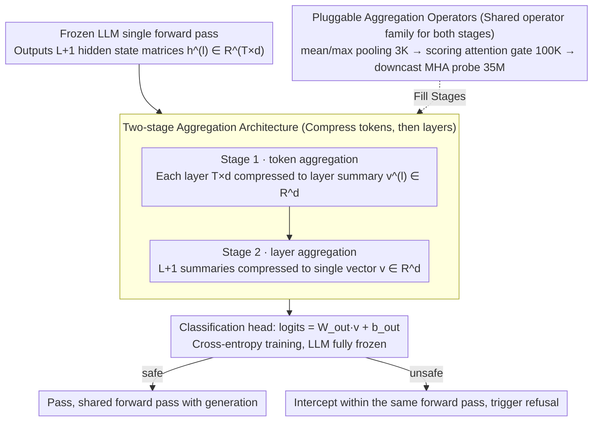

# A BERTology View of LLM Orchestrations: Token- and Layer-Selective Probes for Efficient Single-Pass Classification

**Conference**: ACL 2026  
**arXiv**: [2601.13288](https://arxiv.org/abs/2601.13288)  
**Code**: No public repository  
**Area**: Model Compression / LLM Efficiency  
**Keywords**: probing, hidden state reuse, safety classification, single forward pass, BERTology

## TL;DR
This paper treats the $token \times layer$ hidden state tensor of a production LLM as a minable resource. By utilizing a two-stage aggregation probe that "compresses tokens first, then layers," it performs safety/sentiment classification within the same forward pass. With only 35M trainable parameters, it approaches the performance of standalone guard models while eliminating an extra LLM call.

## Background & Motivation
**Background**: LLM services in production environments typically employ an orchestration architecture comprising a "serving LLM + auxiliary classifiers (safety / policy / jailbreak / retrieval filter)." Each auxiliary model requires independent training, deployment, and a separate forward pass for every request, which multiplies VRAM consumption and latency.

**Limitations of Prior Work**: Existing methods for reusing serving LLM computation—such as MULI (using first-token logits), ShieldHead (using last-layer hidden states), or OmniGuard (using a fixed layer)—all hardcode the "readout position" to a single token or layer. However, BERTology research consistently demonstrates that different Transformer layers encode various levels of abstraction (e.g., low-layer syntax vs. high-layer semantics). Fixing the readout position wastes discriminative signals distributed across the depth of the model.

**Key Challenge**: Information is distributed throughout the entire $L \times T \times d$ hidden state tensor. Logit-only or single-layer probes effectively reduce this tensor to 1D before classification, discarding vital discriminative signals during this initial compression step.

**Goal**: Reformulate moderation/NLU classification as a "representation selection problem across the entire $token \times layer$ tensor," allowing the probe to autonomously learn which tokens and layers are most discriminative.

**Key Insight**: Treat the LLM as a frozen feature extractor and "piggyback" the classification task within its internal forward pass. Consequently, classification and generation share the same KV/attention computation, adding negligible latency.

**Core Idea**: "Two-stage aggregation = internal token-level aggregation into layer summaries, followed by layer-level aggregation into a single vector." The same family of aggregation operators (pooling / scoring gate / MHA) is applied at both stages, with adjustable parameter counts from 3K to 35M.

## Method

### Overall Architecture
Given a frozen decoder-only LLM, an input prompt of $T$ tokens produces $L+1$ hidden state matrices $\mathbf{h}^{(l)} \in \mathbb{R}^{T \times d}$ (including the embedding layer). The pipeline for the probe $C_\theta$ is as follows:

1.  **Stage 1 (token agg)**: For each layer $l$, use an operator $\mathcal{A}^{(l)}_\text{token}$ to compress $T \times d$ into $\mathbf{v}^{(l)} \in \mathbb{R}^d$, resulting in $L+1$ layer summaries.
2.  **Stage 2 (layer agg)**: Use $\mathcal{A}_\text{layer}$ to compress the $L+1$ summaries into a single vector $\mathbf{v} \in \mathbb{R}^d$.
3.  **Classification Head**: $\text{logits} = \mathbf{W}_\text{out} \mathbf{v} + \mathbf{b}_\text{out}$, trained with cross-entropy while the LLM remains fully frozen.

During inference, classification and generation share the same forward pass. If a prompt is judged unsafe, the orchestration layer can block it before any tokens are generated and trigger a contextual refusal (without requiring an additional model call).

### Key Designs

**1. Two-stage Aggregation Architecture: Decoupling 3D tensors to avoid parameter explosion**

Directly feeding an $L \times T \times d$ hidden state tensor into a lightweight classifier would require millions of parameters just for the mapping, which is unsustainable for large $T$ in long prompts. This work decomposes the readout into two sequential 1D reductions: Stage 1 compresses $T \times d$ into a layer summary $\mathbf{v}^{(l)} \in \mathbb{R}^d$ for each layer, and Stage 2 aggregates these $L+1$ summaries into a single vector $\mathbf{v}$. This maintains architectural uniformity.

The layer-level aggregation in Stage 2 allows the model to learn task-specific weights $\alpha_l$, transforming the BERTology intuition of "different layers encoding different abstractions" into a learnable "soft layer selection." This preserves depth-distributed signals while reducing parameter complexity from $O(T \cdot L \cdot d)$ to $O(L \cdot d)$.

**2. Scoring attention gate: Replacing softmax-attention with linear scoring for 100K parameters**

Mean/max pooling are too coarse as they treat all tokens/layers equally, discarding information about which positions are most discriminative. Full attention is too expensive. The scoring gate calculates a scalar importance score $s_i = \tanh(\mathbf{w}^\top \mathbf{X}[i, :])$ for each token/layer vector $\mathbf{X}[i, :]$. After softmax normalization, the output is $\mathbf{v} = \sum_i \alpha_i \mathbf{X}[i, :]$. With only 100K parameters, it outperforms the logit-only MULI by approximately 3 F1 points.

**3. Downcast MHA probe: Reaching the expressivity limit via aggressive downsampling**

The scoring gate scores positions independently and cannot capture interactions between tokens or layers. The MHA probe introduces multi-head self-attention to address this. To prevent parameter explosion, QKV projection dimensions are aggressively downsampled from $d$ to $d_\text{inner} \in \{d/16, d/32\}$. The total parameter count is approximately 35M, and it leverages `scaled_dot_product_attention` for FlashAttention optimization. This 35M probe matches the F1 score of a 780M standalone T5 classifier on ToxicChat with 22x parameter efficiency.

### Loss & Training
LLM parameters are frozen throughout. Only the probe parameters $\theta$ are trained using a standard cross-entropy loss. All backbones (Llama-3.2-3B-Instruct, GPT-OSS-20B, Qwen3-30B-A3B) utilize the same architectural template.

## Key Experimental Results

### Main Results: ToxicChat Safety Classification (F1 / AUPRC)

| Backbone | Method | F1 (%) | AUPRC | Added Params (M) | Extra LM Call |
|----------|------|--------|-------|-------------|-----|
| - | ToxicChat-T5-large (Standalone) | 82.2 | 0.885 | 780 | Yes |
| - | MULI (logit-only reuse) | 77.8 | 0.829 | 0.13 | No |
| Llama-3.2-3B | Direct pooling | 73.53 ± 0.68 | 0.812 | 0.003 | No |
| Llama-3.2-3B | Scoring attention | 80.49 ± 1.17 | 0.854 | 0.10 | No |
| Llama-3.2-3B | **Multi-head self-attn** | **84.51 ± 0.43** | **0.898** | 35 | No |
| GPT-OSS-20B | Multi-head self-attn | 86.17 ± 0.51 | 0.915 | 27 | No |
| Qwen3-30B-A3B | Multi-head self-attn | 83.76 ± 0.9 | — | — | No |

### Ablation Study: Aggregation Operator Family

| Configuration | F1 (Llama-3.2-3B) | Params (M) | Description |
|------|-------------------|------------|------|
| Direct pooling (mean/max) | 73.53 | 0.003 | Baseline, no learnable parameters |
| Scoring attention gate | 80.49 | 0.10 | Adds token/layer importance scoring, +7 F1 |
| Multi-head self-attn (downcast) | 84.51 | 35 | Full expressivity, +4 F1 additional |
| w/o layer agg (last-layer only) | Near ShieldHead | — | Loss of distributed signals |
| w/o token agg (first-token only) | Near MULI | — | Loss of token-wise information |

### Key Findings
- The ranking of the three operators (pooling < scoring < MHA) is consistent across all three backbones, indicating that the benefit of joint token-layer readout is architecture-agnostic.
- The 35M MHA probe achieves 22x parameter efficiency compared to a 780M T5 classifier while maintaining similar performance.
- The scoring attention gate provides a high performance-to-parameter ratio, offering a 3-point F1 gain over logit-only methods with only 100K parameters.

## Highlights & Insights
- **"BERTology meets production"**: Applying research on Transformer layer abstractions to deployment scenarios highlights the value of multi-layer readout over single-layer fixed readout.
- **Dimensionality Decomposition**: The two-stage breakdown prevents parameter explosion by reducing complexity from $O(TLd)$ to $O(Ld)$, making it applicable to long contexts.
- **Zero Extra Latency**: By physically attaching the probe to the generation pass, the system avoids the significant latency costs associated with calling an auxiliary LLM.
- **MoE Generalization**: Validation on GPT-OSS-20B and Qwen3-30B-A3B demonstrates that hidden-state probing is effective regardless of specific routing strategies.

## Limitations & Future Work
- Experiments were primarily conducted on English safety and sentiment tasks; multi-lingual or multi-label policy classification remains to be explored.
- The probe requires labeled data similar to a standalone classifier, saving only deployment costs rather than annotation costs.
- Maintaining all $L+1$ layer hidden states in memory introduces $O(LTd)$ memory pressure beyond the KV cache, which is non-trivial for ultra-long contexts.
- Future work should address adversarial robustness and joint training of probes with MoE routers.

## Related Work & Insights
- **vs MULI**: MULI uses first-token logits from the last layer. This work uses the full tensor with 35M parameters, gaining +7 F1 points.
- **vs ShieldHead / OmniGuard**: These use fixed single-layer hidden states; this work implements a learnable "soft layer selector."
- **vs Standalone guard**: Standalone models require extra forward passes and GBs of VRAM; this probe is effectively "free."
- **vs EAGLE-3**: While EAGLE-3 fuses features for speculative decoding, this work demonstrates the universality of multi-layer fusion for classification tasks.

## Rating
- Novelty: ⭐⭐⭐⭐
- Experimental Thoroughness: ⭐⭐⭐⭐
- Writing Quality: ⭐⭐⭐⭐
- Value: ⭐⭐⭐⭐

<!-- RELATED:START -->

## Related Papers

- [\[ACL 2026\] Adaptive Layer Selection for Layer-Wise Token Pruning in LLM Inference](adaptive_layer_selection_for_layer-wise_token_pruning_in_llm_inference.md)
- [\[ICLR 2026\] A Fano-Style Accuracy Upper Bound for LLM Single-Pass Reasoning in Multi-Hop QA](../../ICLR2026/model_compression/a_fano-style_accuracy_upper_bound_for_llm_single-pass_reasoning_in_multi-hop_qa.md)
- [\[CVPR 2026\] Cross-View Distillation and Adaptive Masking for Incomplete Multi-View Multi-Label Classification](../../CVPR2026/model_compression/cross-view_distillation_and_adaptive_masking_for_incomplete_multi-view_multi-lab.md)
- [\[CVPR 2026\] SelecTKD: Selective Token-Weighted Knowledge Distillation for LLMs](../../CVPR2026/model_compression/selectkd_selective_token-weighted_knowledge_distillation_for_llms.md)
- [\[NeurIPS 2025\] Single-Teacher View Augmentation: Boosting Knowledge Distillation via Angular Diversity](../../NeurIPS2025/model_compression/single-teacher_view_augmentation_boosting_knowledge_distillation_via_angular_div.md)

<!-- RELATED:END -->
