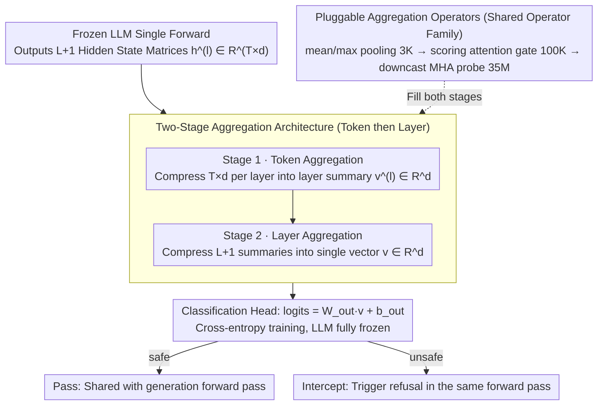

# A BERTology View of LLM Orchestrations: Token- and Layer-Selective Probes for Efficient Single-Pass Classification

**Conference**: ACL 2026  
**arXiv**: [2601.13288](https://arxiv.org/abs/2601.13288)  
**Code**: No public repository  
**Area**: Model Compression / LLM Efficiency  
**Keywords**: probing, hidden state reuse, safety classification, single forward pass, BERTology

## TL;DR
This work treats the $token \times layer$ hidden state tensor of a production LLM as a mineable resource. By using a two-stage aggregation probe that "compresses tokens then layers," safety and sentiment classification are completed during the same forward pass. With 35M trainable parameters, this approach approximates independent guard models while eliminating an additional LLM call.

## Background & Motivation
**Background**: LLM services in production often utilize an orchestration architecture consisting of a "serving LLM + multiple auxiliary classifiers (safety / policy / jailbreak / retrieval filter)." Each auxiliary model requires individual training and deployment, adding extra forward passes per request, which significantly increases memory and latency.

**Limitations of Prior Work**: Existing methods for reusing serving LLM computations (e.g., MULI using first-token logits, ShieldHead using last-layer hidden states, or OmniGuard using a fixed layer) hardcode the "readout position" to a single token or layer. However, BERTology research consistently proves that different transformer layers encode different levels of abstraction (low-level syntax vs. high-level semantics). Fixing the readout position wastes discriminative signals distributed across the model depth.

**Key Challenge**: Information is distributed throughout the entire $L \times T \times d$ hidden state tensor. Logit-only or single-layer probes reduce this tensor to 1D before classification, discarding critical discriminative signals during this early compression.

**Goal**: Reformulate moderation/NLU classification as a "representation selection problem across the entire $token \times layer$ tensor," allowing the probe to learn which tokens and layers are most discriminative.

**Key Insight**: Treat the LLM as a frozen feature extractor and "piggyback" classification onto its internal forward pass. Consequently, classification and generation share the same KV/attention computation, incurring almost no additional latency.

**Core Idea**: A "two-stage aggregation" mechanism (token-level internal aggregation into layer summaries, followed by layer-level aggregation into a single vector). A unified family of aggregation operators (pooling / scoring gate / MHA) is used in both stages, with adjustable parameter counts from 3K to 35M.

## Method

### Overall Architecture
Given a frozen decoder-only LLM, an input prompt with $T$ tokens produces $L+1$ hidden state matrices $\mathbf{h}^{(l)} \in \mathbb{R}^{T \times d}$ (including the embedding layer). The pipeline for Probe $C_\theta$ is:

1. **Stage 1 (token agg)**: For each layer $l$, an operator $\mathcal{A}^{(l)}_\text{token}$ compresses $T \times d$ into $\mathbf{v}^{(l)} \in \mathbb{R}^d$, yielding $L+1$ layer summaries.
2. **Stage 2 (layer agg)**: An operator $\mathcal{A}_\text{layer}$ aggregates the $L+1$ summaries into a single vector $\mathbf{v} \in \mathbb{R}^d$.
3. **Classification Head**: $\text{logits} = \mathbf{W}_\text{out} \mathbf{v} + \mathbf{b}_\text{out}$, trained using cross-entropy while the LLM remains frozen.

During inference, classification and generation share a single forward pass. If classified as unsafe, the orchestration layer can intercept the request before any tokens are released and trigger a contextual refusal (without an additional model call).

### Key Designs

**1. Two-stage aggregation architecture: Splitting 3D tensors into sequential 1D reductions to avoid parameter explosion**

Directly feeding an $L \times T \times d$ hidden state tensor into a lightweight classifier would require millions of parameters just for the mapping, which becomes unsustainable as $T$ grows with long prompts. Ours splits the readout into two serial 1D summaries: Stage 1 compresses $T \times d$ into a layer summary $\mathbf{v}^{(l)} \in \mathbb{R}^d$ for each layer, and Stage 2 aggregates these $L+1$ summaries into $\mathbf{v}$. This maintains architectural consistency while reusing the same operator family.

Critically, Stage 2 layer-level aggregation learns task-specific layer weights $\alpha_l$, transforming the BERTology intuition that "different layers encode different abstractions" into a learnable "soft layer selection." This preserves depth-distributed signals while reducing parameter complexity from $O(T \cdot L \cdot d)$ to $O(L \cdot d)$, making it naturally scalable to long prompts.

**2. Scoring attention gate: Replacing softmax-attention with linear scoring for 100K-parameter task-aware selection**

Mean/max pooling is too blunt, treating all tokens/layers equally and losing information about "which positions are more discriminative." Standard attention is too expensive. The scoring gate takes a middle path: it calculates a scalar importance score $s_i = \tanh(\mathbf{w}^\top \mathbf{X}[i, :])$ for each token/layer vector $\mathbf{X}[i, :]$. After normalizing with softmax (ignoring padding), weight $\alpha_i$ is used to compute $\mathbf{v} = \sum_i \alpha_i \mathbf{X}[i, :]$. Stage 1 uses one independent gate per layer, and Stage 2 shares one gate, with total parameters totaling only $(L+2)d$.

This linear projection utilizes orders of magnitude fewer parameters than MHA while gaining the ability to select task-relevant features, hitting a "sweet spot" between expressivity and cost. Experiments show it achieves an F1 score approximately 3 points higher than logit-only MULI with only ~100K parameters.

**3. Downcast MHA probe: Reaching the expressivity ceiling with Multi-Head Attention via aggressive downsampling**

Since the scoring gate scores positions independently, it cannot capture interactions between tokens or layers. The MHA probe addresses this using Multi-Head Self-Attention. To prevent parameter explosion, QKV projection dimensions are aggressively downsampled from $d$ to $d_\text{inner} \in \{d/16, d/32\}$ before applying $H$ heads. The heads compute $\text{Attn}_h(\mathbf{Q}_h, \mathbf{K}_h, \mathbf{V}_h) = \text{softmax}(\mathbf{Q}_h \mathbf{K}_h^\top / \sqrt{d_\text{head}}) \mathbf{V}_h$, and results are concatenated back to $d$ before final pooling. With $L+2$ MHA modules, the total parameters are $(L+2) \cdot 4 d \cdot d_\text{inner}$, roughly 35M. Internally, this leverages PyTorch `scaled_dot_product_attention` for FlashAttention optimization.

While 35M represents the probe's upper limit of expressivity, it remains an order of magnitude smaller than standalone guard models ($>1\text{B}$ parameters). In ToxicChat experiments, it matched a 780M standalone T5 classifier with 22x parameter efficiency.

### Loss & Training
LLM parameters are frozen throughout. Only the probe head $\theta$ is trained using standard cross-entropy. All backbones (Llama-3.2-3B-Instruct, GPT-OSS-20B, Qwen3-30B-A3B) utilize the same architectural template while training individual probes.

## Key Experimental Results

### Main Results: ToxicChat Safety Classification (F1 / AUPRC, added params in M)

| Backbone | Method | F1 (%) | AUPRC | Extra Params (M) | Extra LM Call |
|----------|------|--------|-------|-------------|-----|
| - | ToxicChat-T5-large (Standalone) | 82.2 | 0.885 | 780 | Yes |
| - | MULI (logit-only reuse) | 77.8 | 0.829 | 0.13 | No |
| Llama-3.2-3B | Direct pooling | 73.53 ± 0.68 | 0.812 | 0.003 | No |
| Llama-3.2-3B | Scoring attention | 80.49 ± 1.17 | 0.854 | 0.10 | No |
| Llama-3.2-3B | **Multi-head self-attn** | **84.51 ± 0.43** | **0.898** | 35 | No |
| GPT-OSS-20B | Multi-head self-attn | 86.17 ± 0.51 | 0.915 | 27 | No |
| Qwen3-30B-A3B | Multi-head self-attn | 83.76 ± 0.9 | — | — | No |

The MHA probe outperformed MULI (+6 F1) across all backbones and matched the F1 of the 780M standalone T5 model with ~35M parameters, demonstrating 22x parameter efficiency.

### Ablation Study: Aggregation Operator Family

| Configuration | F1 (Llama-3.2-3B) | Params (M) | Description |
|------|-------------------|------------|------|
| Direct pooling (mean/max) | 73.53 | 0.003 | No learnable parameters, baseline |
| Scoring attention gate | 80.49 | 0.10 | Adds token/layer importance scoring, +7 F1 |
| Multi-head self-attn (downcast) | 84.51 | 35 | Full expressivity upper bound, +4 F1 |
| w/o Layer agg (Last layer only) | Near ShieldHead | — | Loss of distributed signals |
| w/o Token agg (First token only) | Near MULI | — | Loss of token-dimension information |

### Key Findings
- The performance ranking of the three operators (pooling < scoring < MHA) is consistent across all three backbones, suggesting the "joint token+layer readout" gain is architecture-agnostic.
- The MHA probe achieved higher F1 on GPT-OSS-20B (86.17 vs 84.51), supporting the hypothesis that larger models contain richer hidden state signals for the probe to extract.
- The 35M MHA probe approximates the 780M T5 classifier (difference of ~0.01 AUPRC) while eliminating an extra LM call, bringing end-to-end latency close to pure generation latency.
- The scoring attention gate is the optimal point for performance/parameter trade-off, outperforming MULI by ~3 F1 points with only 100K parameters.

## Highlights & Insights
- **BERTology meets production**: This work bridges a decade of research on transformer layer abstraction with deployment scenarios, emphasizing that readout positions should not be chosen arbitrarily. This retrofit approach is specifically valuable for existing LLM services without requiring re-alignment.
- **Two-stage decomposition avoids dimensionality explosion**: Instead of learning a direct $T \cdot L \cdot d \to C$ classifier, which involves millions of parameters, the two-stage approach reduces complexity to $O(L \cdot d)$. This is transferable to other probing tasks like factuality detection or toxicity attribution.
- **"Same forward pass" is the key for end-to-end latency**: Unlike many reuse-computation works that focus solely on parameter efficiency, this work highlights the latency cost of redundant LLM calls. The probe is physically integrated into the generation forward pass, achieving zero additional inference overhead.
- **Generalization to MoE architectures**: Validated on GPT-OSS-20B (MoE) and Qwen3-30B-A3B, proving that reading hidden states is independent of specific routing strategies.

## Limitations & Future Work
- Experiments primarily focus on English safety/sentiment tasks; multilingual or complex multi-label policy classification remains to be covered.
- Probe training still requires labeled data (same labeling cost as standalone classifiers); the savings are in deployment latency, not annotation.
- While the 35M MHA probe is small, it requires retaining hidden states from all $L+1$ layers in memory for aggregation, creating $O(LT d)$ memory pressure alongside the KV cache, which is non-trivial for ultra-long contexts.
- Adversarial robustness: Could an attacker perturb a prompt to bypass the probe at specific layers if the probe's integration point is known? This remains future work.
- Future exploration could involve joint training of probes and routers (tasking MoE to aggregate discriminative signals into layers/tokens selected by the probe).

## Related Work & Insights
- **vs MULI (logit-only)**: MULI uses sparse classifiers on first-token logits (0.13M params) but only reads the final layer and one position. Ours uses 35M parameters to read the full tensor, gaining +7 F1 points.
- **vs ShieldHead / OmniGuard (single-layer probe)**: These fix the readout at the last layer; ours learns "which layer to read," using the scoring gate as a soft layer selector to avoid human bias.
- **vs Standalone guard (Llama-Guard / ToxicChat-T5)**: Standalone models require a separate forward pass (additional seconds of latency and GBs of VRAM); ours is "free" by comparison.
- **vs EAGLE-3 (Multi-layer feature fusion)**: EAGLE-3 showed that fusion outperforms top-layer readouts for speculative decoding; this work extends that logic to classification tasks, validating the universality of multi-layer fusion.

## Rating
- Novelty: ⭐⭐⭐⭐ Connects BERTology with production LLM orchestration; the two-stage aggregation is a clean contribution.
- Experimental Thoroughness: ⭐⭐⭐⭐ Covers various backbones, MoE/Dense, and multiple tasks; lacks multilingual and adversarial testing.
- Writing Quality: ⭐⭐⭐⭐ Clear motivation (BERTology → representation selection → two-stage aggregation) with well-organized tables.
- Value: ⭐⭐⭐⭐ High practical value for engineering; reduces deployment costs and latency with a low implementation barrier.

<!-- RELATED:START -->

## Related Papers

- [\[ACL 2026\] Adaptive Layer Selection for Layer-Wise Token Pruning in LLM Inference](adaptive_layer_selection_for_layer-wise_token_pruning_in_llm_inference.md)
- [\[ICLR 2026\] A Fano-Style Accuracy Upper Bound for LLM Single-Pass Reasoning in Multi-Hop QA](../../ICLR2026/model_compression/a_fano-style_accuracy_upper_bound_for_llm_single-pass_reasoning_in_multi-hop_qa.md)
- [\[CVPR 2026\] SelecTKD: Selective Token-Weighted Knowledge Distillation for LLMs](../../CVPR2026/model_compression/selectkd_selective_token-weighted_knowledge_distillation_for_llms.md)
- [\[NeurIPS 2025\] Single-Teacher View Augmentation: Boosting Knowledge Distillation via Angular Diversity](../../NeurIPS2025/model_compression/single-teacher_view_augmentation_boosting_knowledge_distillation_via_angular_div.md)
- [\[CVPR 2026\] One Layer's Trash is Another Layer's Treasure: Adaptive Layer-wise Visual Token Selection in LVLMs](../../CVPR2026/model_compression/one_layers_trash_is_another_layers_treasure_adaptive_layer-wise_visual_token_sel.md)

<!-- RELATED:END -->
