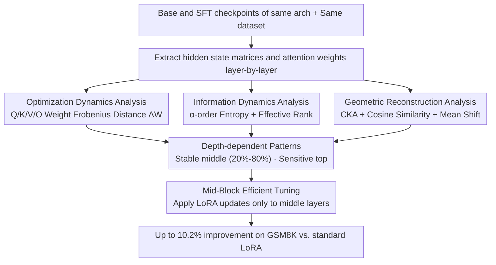

# A Layer-wise Analysis of Supervised Fine-Tuning

**Conference**: ACL 2026  
**arXiv**: [2604.11838](https://arxiv.org/abs/2604.11838)  
**Code**: [GitHub](https://github.com/lshowway/base)  
**Area**: Model Compression  
**Keywords**: Supervised Fine-Tuning, Layer-wise Analysis, Parameter-Efficient Fine-Tuning, Catastrophic Forgetting, LoRA

## TL;DR
This paper conducts a layer-wise analysis of SFT in 1B-32B models through information-theoretic, geometric, and optimization perspectives. It reveals that instruction-following capabilities are concentrated in the intermediate layers (20%-80%) rather than being uniformly distributed. Based on this, a Mid-Block Efficient Tuning strategy is proposed to selectively update intermediate layers, achieving up to a 10.2% improvement on GSM8K compared to standard LoRA.

## Background & Motivation

**Background**: Supervised Fine-Tuning (SFT) is a cornerstone method for aligning LLMs with human intent. Research indicates that only about 1,000 high-quality samples are needed to transform a base model into an instruction-following agent. Existing studies have shown that SFT primarily recalibrates attention patterns and adjusts the distribution of stylized tokens, essentially functioning as a "surface-level" adaptation.

**Limitations of Prior Work**: Current parameter-efficient fine-tuning (PEFT) methods, such as LoRA, apply updates uniformly across all layers, implicitly assuming that all layers contribute equally to alignment. However, this assumption is sub-optimal—different layers may have entirely different functional roles. More critically, uniform updates may waste parameter budgets on insensitive layers while resulting in insufficient updates for sensitive ones.

**Key Challenge**: While the "what" of changes during SFT (attention patterns, token distribution) is known, the "where"—how these changes are distributed across the model's depth—remains unclear. Which layers are critical for instruction-following capabilities?

**Goal**: (1) Systematically reveal layer-wise change patterns induced by SFT; (2) Identify the layer intervals most critical for task adaptation; (3) Propose more efficient fine-tuning strategies based on analytical insights.

**Key Insight**: A systematic layer-level anatomy is performed across 1B-32B model scales by integrating information-theoretic metrics (entropy, effective rank), geometric metrics (CKA, cosine similarity), and optimization metrics (weight change magnitude).

**Core Idea**: Effective alignment in SFT is "architecturally localized" rather than uniformly distributed. The intermediate layers (20%-80%) serve as a stable foundation for knowledge integration, while the top layers are the primary sources of catastrophic forgetting. Therefore, updates should be concentrated on the intermediate layers.

## Method

### Overall Architecture
A layer-wise representation analysis pipeline for Base and SFT models is constructed: given Base and SFT checkpoints of the same architecture, hidden state matrices and attention weights for each layer are extracted from the same dataset. Layer differences are then quantified from three perspectives: optimization dynamics, information dynamics, and geometric reconstruction. All three perspectives converge on a consistent "stable middle (20%-80%), sensitive top" pattern, which leads to the Mid-Block Efficient Tuning strategy—applying LoRA updates only to the intermediate layers.

### Key Designs

**1. Optimization Dynamics Analysis: Directly identifying the SFT "force" distribution from parameter space**

To answer "where the changes occur," the most direct method is observing how much the parameters themselves move. For all projection matrices (Q/K/V/O) in the $l$-th attention module, $\Delta \mathcal{W}^{(l)}$ is defined as the Frobenius distance between the Base and SFT models. A higher $\Delta \mathcal{W}^{(l)}$ indicates more aggressive modification of that layer. This perspective maps the distribution of the SFT "force" along the depth, verifying non-uniform updates. In experiments, $\Delta \mathcal{W}$ exhibits a J-shaped trajectory (approx. 0.05 in early layers, increasing to >0.10 near the output).

**2. Information Dynamics Analysis: Monitoring information capacity compression in representation space**

Parameter changes do not always equal information capacity changes. Thus, the second perspective utilizes matrix-based $\alpha$-order entropy and effective rank to quantify changes in layer-wise information density before and after SFT. Prompt entropy characterizes token-level information density within a sequence, Dataset entropy captures diversity between samples, and effective rank measures the dimensions actually utilized in the representation space. These metrics test the information bottleneck hypothesis—whether SFT forces the model to compress general pre-trained features to fit downstream task constraints.

**3. Geometric Reconstruction Analysis: Determining if SFT reorients or relocates the representation space**

Beyond information volume, it is crucial to understand how spatial structure evolves. This perspective uses three complementary geometric measures: CKA measures the global structural similarity between Base and SFT at each layer, Cosine Similarity measures directional reorientation, and Mean Shift measures whether representations are translated to new regions in the vector space. Together, they distinguish between "rotation only" and "fundamental reconstruction," linking parameter space changes (Perspective 1) to representation space changes (Perspective 3). Experimentally, CKA stays stable in shallow layers (>0.98) and drops sharply in the last ~20% of layers.

**4. Mid-Block Efficient Tuning: Translating analysis into a deployable layer selection strategy**

The three perspectives converge on the same conclusion: the intermediate layers (20%-80%) are a stable base for knowledge integration, while the top layers are prone to drastic parameter reshaping and catastrophic forgetting. Mid-Block transforms this into a tuning strategy: freeze peripheral layers and apply LoRA low-rank updates only to intermediate layers. This targets the parameter budget precisely at the most robust segments. This strategy serves as an "analysis-driven proof of concept" to validate the depth-dependent patterns. On GSM8K (OLMo2-7B), it improves accuracy from 28% (standard LoRA) to 37.5%, confirming that "precision placement" outperforms "broadcasting."

### Validation Design
The paper establishes causal relationships through three complementary validation experiments: (1) **Layer-wise Probing**: Predicting the next token directly from intermediate layer outputs to observe the "dormancy $\to$ emergence" pattern of task capabilities; (2) **Layer-wise Weight Changes**: Tracking the magnitude of L2 updates per layer after LoRA fine-tuning; (3) **Layer Swapping**: Replacing specific blocks of the Base model with corresponding SFT layers (and vice versa) to observe performance fluctuations.

## Key Experimental Results

### Main Results (Mid-Block Efficient Tuning vs. Standard LoRA, GSM8K Accuracy)

| Model | Standard LoRA | Mid-Block (Best) | Gain |
|------|--------------|-----------------|------|
| OLMo2-1B | 0.19 | 0.21 (01100) | +10.5% |
| OLMo2-7B | 0.28 | 0.375 (01000) | +33.9% |
| OLMo2-13B | 0.27 | 0.30 (01110) | +11.1% |
| OLMo2-32B | 0.29 | 0.32 (01100) | +10.3% |

### Ablation Study (Layer Block Selection, OLMo2-7B, GSM8K)

| Layer Configuration | Accuracy | Description |
|---------|----------|------|
| 10000 (Bottom 20%) | ~0.22 | Worst, far below baseline |
| 01000 (Mid-High layers) | 0.375 | **Best**, +10pp over baseline |
| 00010 (Mid-Low layers) | ~0.27 | Close to baseline |
| 00001 (Top 20%) | ~0.135 | Extremely poor, mapping layers cannot function alone |
| 11111 (Full layers) | 0.28 | Standard LoRA baseline |

### Key Findings
- **Depth-dependent patterns are consistent across all scales (1B-32B)**: CKA is stable in shallow layers (>0.98) and drops sharply in the final ~20% of layers.
- **Layer-wise probing shows a "dormancy $\to$ emergence" pattern**: In OLMo2-32B, accuracy is near zero for the first 50 layers and rises sharply to 0.60 in the final 14 layers.
- **Weight changes follow a J-shaped trajectory**: Changes are minimal in early layers (~0.05) and increase significantly closer to the output (0.10+).
- **The performance gap between best intermediate and worst peripheral layers often exceeds 20%**, confirming the criticality of layer selection.
- **Layer swapping experiments show an inverted U-shape**: Replacing peripheral layers leads to performance degradation, while replacing middle layers can yield slight improvements.

## Highlights & Insights
- **The complementarity of the three analytical perspectives** is a methodological highlight: Information-theory examines "how much information changed," geometry examines "how much the spatial structure changed," and optimization examines "how much the parameters changed."
- The finding that **"intermediate layers are stable bases for knowledge integration, while top layers are primary sources of catastrophic forgetting"** has broad practical implications—guiding LoRA layer selection, freezing strategies, and layer allocation in multi-task tuning.
- The **Mid-Block strategy achieves better performance with fewer parameters**, demonstrating that "precision placement" is more effective than "broadcasting," providing insights for the PEFT field.

## Limitations & Future Work
- Validation is limited to standard dense decoder-only architectures; MoE or encoder-decoder architectures have not been explored.
- The study focuses solely on the SFT stage, without examining layer-wise dynamics following RLHF/DPO.
- The 20%-80% range for Mid-Block is an empirical choice; an adaptive method for determining layer boundaries is lacking.
- Evaluation tasks are primarily mathematical reasoning (GSM8K); generalization to other task types requires further verification.
- Integrating adaptive methods like AdaLoRA to automatically learn the optimal rank allocation for each layer remains an open direction.

## Related Work & Insights
- **vs. Standard LoRA**: LoRA applies low-rank updates uniformly, wasting parameter budget. This work proves concentrating on intermediate layers is more effective.
- **vs. Layer-wise Pruning literature**: Pruning focuses on "which layers can be removed," while this work focuses on "which layers should be updated." The two are complementary.
- **vs. Surface Alignment Hypothesis**: This work provides a layer-level refinement of the hypothesis—surface alignment does not occur uniformly but is concentrated at specific depths.

## Rating
- Novelty: ⭐⭐⭐⭐ Comprehensive perspectives, though the core finding (large top-layer changes) is somewhat intuitive.
- Experimental Thoroughness: ⭐⭐⭐⭐ Validated across 1B-32B models, but downstream task evaluation is relatively narrow.
- Writing Quality: ⭐⭐⭐⭐ Clear structure and rich visualizations, though formula-heavy.
- Value: ⭐⭐⭐⭐ Provides direct guidance for PEFT practitioners; the Mid-Block strategy is simple yet effective.

<!-- RELATED:START -->

## Related Papers

- [\[ACL 2026\] Adaptive Layer Selection for Layer-Wise Token Pruning in LLM Inference](adaptive_layer_selection_for_layer-wise_token_pruning_in_llm_inference.md)
- [\[ACL 2026\] LEAP: Layer-wise Exit-Aware Pretraining for Efficient Transformer Inference](leap_layer-wise_exit-aware_pretraining_for_efficient_transformer_inference.md)
- [\[CVPR 2026\] One Layer's Trash is Another Layer's Treasure: Adaptive Layer-wise Visual Token Selection in LVLMs](../../CVPR2026/model_compression/one_layers_trash_is_another_layers_treasure_adaptive_layer-wise_visual_token_sel.md)
- [\[ICLR 2026\] ABBA-Adapters: Efficient and Expressive Fine-Tuning of Foundation Models](../../ICLR2026/model_compression/abba-adapters_efficient_and_expressive_fine-tuning_of_foundation_models.md)
- [\[ACL 2026\] Rethinking Parameter Sharing for LLM Fine-Tuning with Multiple LoRAs](rethinking_parameter_sharing_for_llm_fine-tuning_with_multiple_loras.md)

<!-- RELATED:END -->
