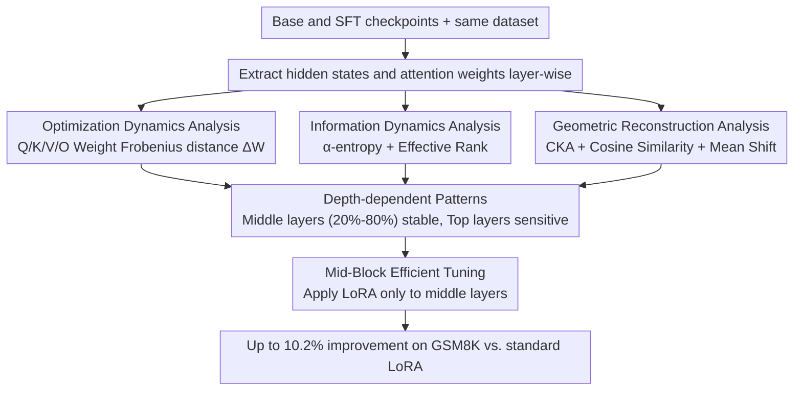

# A Layer-wise Analysis of Supervised Fine-Tuning

**Conference**: ACL 2026  
**arXiv**: [2604.11838](https://arxiv.org/abs/2604.11838)  
**Code**: [GitHub](https://github.com/lshowway/base)  
**Area**: Model Compression  
**Keywords**: Supervised Fine-Tuning, Layer-wise Analysis, Parameter-Efficient Fine-Tuning, Catastrophic Forgetting, LoRA

## TL;DR
This work conducts a layer-wise analysis of SFT in 1B-32B models through information-theoretic, geometric, and optimization perspectives. It finds that instruction-following capabilities are concentrated in the middle layers (20%-80%) rather than being uniformly distributed. Based on this, a Mid-Block Efficient Tuning strategy is proposed to selectively update middle layers, achieving up to a 10.2% improvement on GSM8K over standard LoRA.

## Background & Motivation

**Background**: Supervised Fine-Tuning (SFT) is a foundational method for aligning LLMs with human intentions. Research indicates that only approximately 1,000 high-quality samples are needed to transform a base model into an instruction-following agent. Existing studies have revealed that SFT primarily recalibrates attention patterns and adjusts stylized token distributions, essentially acting as a "surface-level" adaptation.

**Limitations of Prior Work**: Current parameter-efficient fine-tuning (PEFT) methods, such as LoRA, apply updates uniformly across all layers, implicitly assuming that all layers contribute equally to alignment. However, this assumption is suboptimal—different layers may have entirely different functional roles. Crucially, uniform updates may waste parameter budgets on insensitive layers while leading to insufficient updates in sensitive ones.

**Key Challenge**: While it is known "what changes" during SFT (attention patterns, token distributions), it remains unclear "where it changes"—how are these changes distributed across the model depth? Which layers are critical for instruction-following ability?

**Goal**: (1) Systematically reveal the layer-wise change patterns induced by SFT; (2) identify the layer intervals most critical for task adaptation; (3) propose more efficient fine-tuning strategies based on analytical insights.

**Key Insight**: A systematic layer-level dissection is performed across 1B-32B model scales using a combination of information-theoretic metrics (entropy, effective rank), geometric metrics (CKA, cosine similarity), and optimization metrics (weight change magnitude).

**Core Idea**: Effective SFT alignment is "architecturally localized" rather than uniformly distributed. Middle layers (20%-80%) serve as a stable foundation for knowledge integration, while top layers are the primary source of catastrophic forgetting. Therefore, updates should be concentrated on the middle layers.

## Method

### Overall Architecture
A layer-wise representation analysis pipeline is constructed for Base and SFT models. Given Base and SFT checkpoints of the same architecture, hidden state matrices and attention weights for each layer are extracted from the same dataset. Layer-wise differences are then quantified from three perspectives: optimization dynamics, information dynamics, and geometric reconstruction. These three perspectives converge on a consistent pattern: "middle layers (20%-80%) are stable, while top layers are sensitive." Based on this, the Mid-Block Efficient Tuning strategy is implemented, applying LoRA updates only to the middle blocks.

### Key Designs

**1. Optimization Dynamics Analysis: Directly detecting SFT "forces" in the parameter space**

To answer "where it changes," the most direct method is observing the parameter shifts. For all projection matrices (Q/K/V/O) in the $l$-th attention module, $\Delta \mathcal{W}^{(l)}$ is defined as the Frobenius distance between the Base and SFT models. A higher $\Delta \mathcal{W}^{(l)}$ indicates more aggressive modification of that layer. This perspective maps the distribution of SFT "force" across depth, allowing verification of non-uniform updates due to gradient decay. In subsequent experiments, $\Delta \mathcal{W}$ exhibits a J-shaped trajectory (early layers ~0.05, near output >0.10).

**2. Information Dynamics Analysis: Monitoring information capacity compression via entropy and effective rank**

Parameter changes do not inherently equate to changes in information capacity. Thus, the second perspective shifts to the representation space, using matrix-based $\alpha$-entropy and effective rank to quantify changes in layer-wise information density before and after SFT. Prompt entropy characterizes token-level information density within a sequence, Dataset entropy characterizes diversity across samples, and effective rank measures the dimensions actually utilized in the representation space. These metrics test the Information Bottleneck hypothesis—whether SFT forces the model to compress general pre-trained features to fit downstream task constraints.

**3. Geometric Reconstruction Analysis: Determining if SFT reorients or relocates the representation space**

Knowing the change in information volume is insufficient; the change in spatial structure must also be understood. This perspective uses three complementary geometric quantities: CKA measures the global structural similarity between Base and SFT at each layer, Cosine Similarity measures directional reorientation, and Mean Shift measures whether representations are translated to new regions of the vector space. Together, these distinguish "rotation only" from "fundamental reconstruction," linking parameter space changes (Perspective 1) to representation space changes (Perspective 3). The experiment shows CKA remains stable in shallow layers (>0.98) but drops sharply in the final 20% of layers.

**4. Mid-Block Efficient Tuning: Translating insights into an actionable layer selection strategy**

The first three perspectives converge on the conclusion that middle layers (20%-80%) are stable foundations for knowledge integration, while top layers are prone to drastic parameter reshaping and catastrophic forgetting. Mid-Block translates this into a fine-tuning strategy: freeze boundary layers and apply LoRA low-rank updates only to middle layers. This precisely targets the parameter budget at the most robust sections for adaptation. This work positions Mid-Block as an "analysis-driven proof-of-concept" to validate depth-dependent patterns rather than competing with PEFT methods like QLoRA or AdaLoRA. Using standard LoRA as the primary baseline isolates the effect of the "layer depth" variable. On GSM8K (OLMo2-7B), it improves accuracy from 28% to 37.5%, confirming that "precise targeting" outperforms "broad application."

### Experimental Design

The paper establishes causality through three complementary validation experiments: (1) **Layer-wise Probing**: predicting the next token directly from each intermediate layer's output to observe "dormancy $\rightarrow$ emergence" patterns of task capability; (2) **Layer-wise Weight Change**: tracking the magnitude of L2 updates per layer after LoRA fine-tuning; (3) **Layer Swapping**: replacing specific layer blocks of the Base model with SFT counterparts (and vice versa) to observe performance fluctuations.

## Key Experimental Results

### Main Results (Mid-Block Efficient Tuning vs. Standard LoRA, GSM8K Accuracy)

| Model | Standard LoRA | Mid-Block (Best) | Gain |
|------|--------------|-----------------|------|
| OLMo2-1B | 0.19 | 0.21 (01100) | +10.5% |
| OLMo2-7B | 0.28 | 0.375 (01000) | +33.9% |
| OLMo2-13B | 0.27 | 0.30 (01110) | +11.1% |
| OLMo2-32B | 0.29 | 0.32 (01100) | +10.3% |

### Ablation Study (Layer Block Selection, OLMo2-7B, GSM8K)

| Layer Configuration | Accuracy | Description |
|---------|----------|------|
| 10000 (Bottom 20%) | ~0.22 | Worst performance, significantly below baseline |
| 01000 (Mid-Upper) | 0.375 | **Best**, exceeds baseline by 10pp |
| 00010 (Mid-Lower) | ~0.27 | Close to baseline |
| 00001 (Top 20%) | ~0.135 | Extremely poor; mapping layers cannot function independently |
| 11111 (Full Layers) | 0.28 | Standard LoRA baseline |

### Key Findings
- **Depth-dependent patterns are consistent across scales (1B-32B)**: CKA is stable in shallow layers (>0.98) and drops sharply in the final ~20% of layers.
- **Layer-wise probing follows a "dormancy $\rightarrow$ emergence" pattern**: In OLMo2-32B, accuracy is near zero for the first 50 layers and rises sharply to 0.60 in the last 14 layers.
- **Weight changes follow a J-shaped trajectory**: Minimal changes (~0.05) in early layers, increasing significantly (>0.10) near the output.
- **Performance gaps between optimal middle layers and worst boundary layers often exceed 20%**, confirming the criticality of layer selection.
- **Layer swapping follows an inverted U-shape**: Replacing boundary layers degrades performance, while replacing middle layers can yield slight improvements.

## Highlights & Insights
- **The complementarity of the three perspectives** is a methodological highlight: Information-theoretic metrics track "information volume," geometric metrics track "spatial structure," and optimization metrics track "parameter changes," forming a complete evidence chain.
- The finding that **"middle layers are stable foundations for knowledge integration, while top layers are the primary source of catastrophic forgetting"** has broad practical implications—guiding LoRA layer selection, freezing strategies, and layer allocation in multi-task fine-tuning.
- The **Mid-Block strategy achieves better performance with fewer parameters**, demonstrating that "precise targeting" is more effective than "broad application," providing insights for the PEFT field.

## Limitations & Future Work
- Validation was only performed on standard dense decoder-only architectures, not MoE or encoder-decoder architectures.
- The study focuses solely on the SFT stage, without examining layer-level dynamics after RLHF/DPO.
- The 20%-80% range for Mid-Block is an empirical selection; an adaptive method for determining layer boundaries is lacking.
- Evaluation tasks are primarily mathematical reasoning (GSM8K); generalization to other task types requires further validation.
- Future work could explore combining this with adaptive methods like AdaLoRA to automatically learn the optimal rank allocation per layer.

## Related Work & Insights
- **vs. Standard LoRA**: LoRA applies low-rank updates uniformly, wasting parameter budget. This work proves concentrating updates in middle layers is more effective.
- **vs. Layer-wise Pruning literature**: Pruning focuses on "which layers can be removed," while this work focuses on "which layers should be updated."
- **vs. Surface Alignment Hypothesis**: This work provides a layer-wise refinement of the hypothesis—surface alignment does not occur uniformly across all layers but is concentrated at specific depths.

## Rating
- Novelty: ⭐⭐⭐⭐ Comprehensive analysis perspectives, though the core finding (large changes in top layers) is intuitively expected.
- Experimental Thoroughness: ⭐⭐⭐⭐ Validated across 1B-32B models, though downstream evaluation tasks are limited.
- Writing Quality: ⭐⭐⭐⭐ Clear structure and rich visualizations, though mathematically dense.
- Value: ⭐⭐⭐⭐ Directly provides guidance for PEFT practitioners; the Mid-Block strategy is simple and effective.

<!-- RELATED:START -->

## Related Papers

- [\[ICLR 2026\] TRAC: Tensor-Train Based Across-Layer Compression for Parameter-Efficient Fine-Tuning](../../ICLR2026/model_compression/trac_tensor-train_based_across-layer_compression_for_parameter-efficient_fine-tu.md)
- [\[ACL 2026\] Adaptive Layer Selection for Layer-Wise Token Pruning in LLM Inference](adaptive_layer_selection_for_layer-wise_token_pruning_in_llm_inference.md)
- [\[ACL 2026\] LEAP: Layer-wise Exit-Aware Pretraining for Efficient Transformer Inference](leap_layer-wise_exit-aware_pretraining_for_efficient_transformer_inference.md)
- [\[ICLR 2026\] Improving Block-Wise LLM Quantization by 4-bit Block-Wise Optimal Float (BOF4): Analysis and Variations](../../ICLR2026/model_compression/improving_block-wise_llm_quantization_by_4-bit_block-wise_optimal_float_bof4_ana.md)
- [\[ICLR 2026\] ABBA-Adapters: Efficient and Expressive Fine-Tuning of Foundation Models](../../ICLR2026/model_compression/abba-adapters_efficient_and_expressive_fine-tuning_of_foundation_models.md)

<!-- RELATED:END -->
