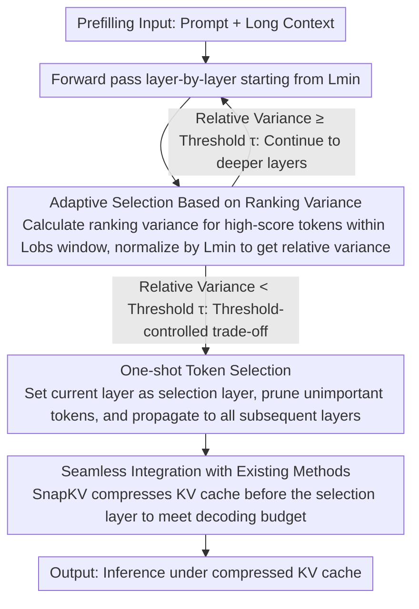

# Adaptive Layer Selection for Layer-Wise Token Pruning in LLM Inference

**Conference**: ACL 2026 Findings  
**arXiv**: [2601.07667](https://arxiv.org/abs/2601.07667)  
**Code**: [GitHub](https://github.com/TANIGUCHIREI/ASL)  
**Area**: Model Compression / KV Cache Optimization  
**Keywords**: KV cache compression, adaptive layer selection, attention pruning, long-context inference, training-free method

## TL;DR

Ours proposes ASL (Adaptive Selection Layer), which adaptively determines the layer location for KV cache pruning by monitoring the variance of token attention score rankings. It significantly outperforms fixed-layer selection methods on difficult tasks while remaining training-free.

## Background & Motivation

**Background**: KV cache is the main memory bottleneck in LLM inference. Layer-wise token pruning (selecting a subset of important tokens at a specific layer and pruning the rest) is a mainstream compression scheme.

**Limitations of Prior Work**: Existing layer-wise pruning methods (e.g., FastKV, GemFilter) use predefined fixed selection layers—this design is effective for simple tasks (e.g., QA) but severely degrades on difficult tasks (e.g., KV retrieval). The reason is that in difficult tasks, the semantic similarity between the question and the context is high, making it difficult for early layers to distinguish relevant tokens.

**Key Challenge**: Fixed selection layers face a fundamental trade-off—early selection saves computation but loses accuracy, while late selection maintains accuracy but reduces memory savings. The optimal selection layer varies significantly across different tasks.

**Goal**: Design an adaptive method to automatically determine the optimal token selection layer based on task difficulty.

**Key Insight**: It is observed that the speed at which attention score rankings converge to a stable subset varies across different tasks—simple tasks stabilize at middle layers, while difficult tasks require deeper layers to stabilize.

**Core Idea**: Monitor the token ranking variance as an indicator of "attention focus." Token selection is triggered when the variance drops below a certain threshold.

## Method

### Overall Architecture

ASL runs during the prefilling phase: starting from layer $L_{min}$, it calculates the ranking variance of pooled attention scores over $L_{obs}$ consecutive layers, then divides it by the initial variance at $L_{min}$ to obtain the relative variance. When the relative variance falls below a user-specified threshold $\tau$, the current layer is designated as the selection layer, one-shot token selection is executed, and the selected tokens are propagated to all subsequent layers. It can be jointly optimized with methods like SnapKV during the decoding phase.

### Key Designs

**1. Adaptive Selection Based on Ranking Variance: Let "which layer to select tokens" follow task difficulty**

The fundamental flaw of fixed selection layers is that they ignore the task—simple tasks can distinguish relevant tokens in shallow layers, whereas difficult tasks (like KV retrieval) have queries so semantically similar to the context that they cannot be separated in shallow layers. The core of ASL is quantifying "whether attention has focused" as a trigger signal: first calculate pooled attention scores $PA = \text{pool}(\text{softmax}(\frac{\mathbf{q}_w \mathbf{k}_c + \mathbf{m}_w}{\sqrt{d}}))$, then calculate the variance of token rankings over $L_{obs}$ consecutive layers. Low variance implies that the subset of tokens being focused on has stabilized.

The reason for focusing on ranking variance rather than raw attention scores is that the former is more robust: it does not depend on the specific values a token receives, but only on whether the "set of tokens being attended to" is still changing. Once the variance stabilizes, one-shot selection is performed. Simple tasks naturally trigger at middle layers (~layer 15), while difficult tasks are pushed to deeper layers (~layer 25 and above).

**2. Threshold-Controlled Adaptive Trade-off: Converging "Accuracy vs. Memory Savings" into a single user-tunable knob**

Early selection saves computation but drops accuracy; late selection maintains accuracy but saves less memory. There is no universal optimal point for this trade-off. ASL exposes this as a single threshold $\tau$: selection is triggered as soon as the relative variance drops below $\tau$. A higher $\tau$ leads to earlier selection (faster, potential accuracy loss), while a lower $\tau$ leads to later selection (more accurate, slower). Compared to requiring engineers to manually test selection layers for every task, a continuously adjustable knob for switching between different accuracy-speed requirements is much more practical—threshold scanning in experiments indeed shows a smooth transition rather than abrupt changes.

**3. Seamless Integration with Existing Methods: ASL only manage "at which layer to select," leaving other stages to existing methods**

ASL is an orthogonal improvement targeting the layer selection step in the prefilling phase. Thus, it can directly replace the hard-coded fixed selection layer components in existing methods without rewriting the entire pipeline. A typical combination is ASL handling prefilling (determining the selection layer) and SnapKV handling decoding (compressing the KV cache before the selection layer). It can also be paired with GemFilter in a two-pass strategy. Because it only modifies "layer selection," it can be grafted as a plug-and-play component onto various existing KV compression pipelines.

### Loss & Training

ASL is entirely training-free and only runs during inference. Two hyperparameters $L_{min}$ and $L_{obs}$ control the starting monitoring layer and the observation window size, respectively.

## Key Experimental Results

### Main Results

| Method | KV Retrieval (Hard) | QA (Simple) | NIAH | Memory Usage |
|------|------------|---------|------|--------|
| FastKV (Fixed) | Severely Degraded | Strong | Moderate | Low |
| GemFilter (Fixed) | Degraded | Strong | Moderate | Low |
| ASL (Adaptive) | Significant Gain | Maintained | Gain | Comparable |

### Ablation Study

| Configuration | Key Metric | Description |
|------|---------|------|
| Threshold Sensitivity | Smooth Transition | Different thresholds produce continuous accuracy-speed trade-offs |
| Cross-task Adaptability | InfiniteBench 10 Tasks | Automatically selects different depth layers for different tasks |
| 256K Context | Works Effectively | Equally applicable in long-context scenarios |

### Key Findings
- In simple tasks (QA), attention stabilizes at middle layers (~layer 15), while difficult tasks (KV retrieval) require deeper layers (~layer 25 and above).
- ASL significantly outperforms fixed-layer methods on difficult tasks while maintaining comparable performance on simple tasks.
- Relative variance serves as an effective "task difficulty probe"—allowing adaptation without prior knowledge of the task type.

## Highlights & Insights
- Transforms the "when to select" problem from manual hyperparameter tuning to automatic detection, significantly improving practicality.
- Observation-driven method design—starting from the laws of cross-layer evolution in attention patterns, with a clear logical chain.
- Completely training-free, plug-and-play, and orthogonal/composable with existing methods.

## Limitations & Future Work
- Currently only validated on Llama 3.1 8B; needs testing on more model architectures.
- Monitoring ranking variance incurs some computational overhead (albeit small), which might need optimization for extreme low-latency scenarios.
- The optimal value for the threshold still requires user selection based on the scenario.
- Future work could explore a progressive version—gradual pruning across multiple adaptively selected layers.

## Related Work & Insights
- **vs FastKV/GemFilter**: Replaces fixed layers with adaptive selection to fundamentally solve the problem of task sensitivity.
- **vs PyramidKV/DynamicKV**: These methods adaptively allocate budgets but do not adaptively select layers; the two are complementary.
- **vs SnapKV**: ASL optimizes layer selection in the prefilling phase, while SnapKV optimizes token retention in the decoding phase; they can be used in combination.

## Rating
- Novelty: ⭐⭐⭐⭐ The idea of using ranking variance as a task difficulty probe is simple and effective.
- Experimental Thoroughness: ⭐⭐⭐⭐ Comprehensive evaluation across multiple benchmarks and context lengths.
- Writing Quality: ⭐⭐⭐⭐⭐ The logical chain of observation → motivation → method → verification is very clear.
- Value: ⭐⭐⭐⭐ Direct practical value for LLM long-context inference optimization.

<!-- RELATED:START -->

## Related Papers

- [\[ACL 2026\] LEAP: Layer-wise Exit-Aware Pretraining for Efficient Transformer Inference](leap_layer-wise_exit-aware_pretraining_for_efficient_transformer_inference.md)
- [\[ACL 2026\] A Layer-wise Analysis of Supervised Fine-Tuning](a_layer-wise_analysis_of_supervised_fine-tuning.md)
- [\[ACL 2026\] A BERTology View of LLM Orchestrations: Token- and Layer-Selective Probes for Efficient Single-Pass Classification](a_bertology_view_of_llm_orchestrations_token-_and_layer-selective_probes_for_eff.md)
- [\[ICML 2026\] ReSpinQuant: Efficient Layer-Wise LLM Quantization via Subspace Residual Rotation Approximation](../../ICML2026/model_compression/respinquant_efficient_layer-wise_llm_quantization_via_subspace_residual_rotation.md)
- [\[ICML 2025\] OrthoRank: Token Selection via Sink Token Orthogonality for Efficient LLM Inference](../../ICML2025/model_compression/orthorank_token_selection_via_sink_token_orthogonality_for_efficient_llm_inferen.md)

<!-- RELATED:END -->
