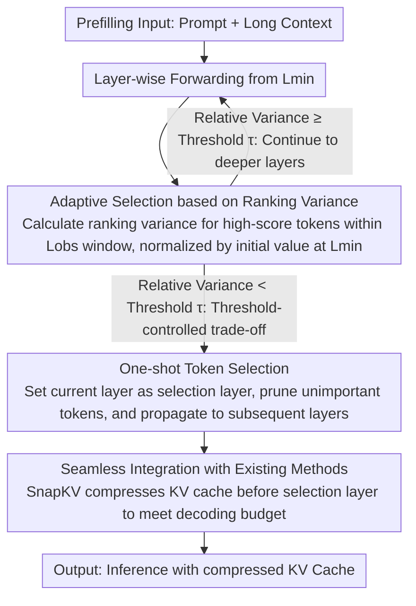

# Adaptive Layer Selection for Layer-Wise Token Pruning in LLM Inference

**Conference**: ACL 2026 Findings  
**arXiv**: [2601.07667](https://arxiv.org/abs/2601.07667)  
**Code**: [GitHub](https://github.com/TANIGUCHIREI/ASL)  
**Area**: Model Compression / KV Cache Optimization  
**Keywords**: KV Cache Compression, Adaptive Layer Selection, Attention Pruning, Long-Context Inference, Training-free method

## TL;DR

ASL (Adaptive Selection Layer) is proposed to adaptively determine the layer position for KV cache pruning by monitoring the variance of token attention score rankings. It significantly outperforms fixed-layer selection methods on difficult tasks while remaining training-free.

## Background & Motivation

**Background**: KV cache is the primary memory bottleneck for LLM inference. Layer-wise token pruning—selecting an important subset of tokens at a specific layer and pruning the rest—is a mainstream compression scheme.

**Limitations of Prior Work**: Existing layer-wise pruning methods (e.g., FastKV, GemFilter) use predefined fixed selection layers. This design is effective for simple tasks (e.g., QA) but degrades severely on difficult tasks (e.g., KV retrieval) because high semantic similarity between the question and context in difficult tasks makes it hard for early layers to distinguish relevant tokens.

**Key Challenge**: Fixed selection layers face a fundamental trade-off: early selection saves computation but sacrifices accuracy, while late selection maintains accuracy but reduces memory savings. The optimal selection layer varies significantly across tasks.

**Goal**: Design an adaptive method to automatically determine the optimal token selection layer based on task difficulty.

**Key Insight**: It is observed that the speed at which attention score rankings converge to a stable subset varies across tasks—simple tasks stabilize in middle layers, while difficult tasks require deeper layers to achieve stability.

**Core Idea**: Monitor the variance of token rankings as an indicator of "attention focus." Token selection is triggered when the variance falls below a specific threshold.

## Method

### Overall Architecture

ASL operates during the prefilling stage. Starting from layer $L_{min}$, it calculates the ranking variance of pooled attention scores over $L_{obs}$ consecutive layers, divided by the initial variance at $L_{min}$ to obtain the relative variance. When the relative variance falls below a user-specified threshold $\tau$, the current layer is designated as the selection layer, one-shot token selection is performed, and the selected tokens are propagated to all subsequent layers. This can be jointly optimized with methods like SnapKV for the decoding stage.

### Key Designs

**1. Adaptive Selection Based on Ranking Variance: Dynamic selection layers following task difficulty**

The fundamental flaw of fixed selection layers is their task-agnostic nature. Simple tasks can distinguish relevant tokens in shallow layers, whereas difficult tasks (like KV retrieval) require deeper layers due to high semantic similarity. ASL quantifies whether attention has focused as a trigger signal: it calculates pooled attention scores $PA = \text{pool}(\text{softmax}(\frac{\mathbf{q}_w \mathbf{k}_c + \mathbf{m}_w}{\sqrt{d}}))$, and then monitors the variance of token rankings across $L_{obs}$ consecutive layers. Low variance indicates that the subset of attended tokens has stabilized.

Ranking variance is more robust than raw attention scores because it focuses on whether "which tokens are being attended to" remains stable, rather than the specific floating-point values. Simple tasks naturally trigger in middle layers (~layer 15), while difficult tasks are pushed to deeper layers (~layer 25+).

**2. Threshold-Controlled Adaptive Trade-off: Converting precision vs. memory into a tunable knob**

Early selection saves computation but loses accuracy, while late selection preserves accuracy but reduces memory savings. ASL exposes this trade-off as a single threshold $\tau$. Selection is triggered once relative variance drops below $\tau$. A higher $\tau$ leads to earlier selection (faster, potential accuracy loss), and a lower $\tau$ leads to later selection (more accurate, slower). This provides a practical, continuously adjustable knob for different precision-speed requirements.

**3. Seamless Integration: ASL manages "where to select," leaving the rest to existing pipelines**

ASL is an orthogonal improvement targeting the layer selection step in prefilling. It can replace hardcoded selection components in existing methods without rewriting entire pipelines. A typical combination involves ASL for prefilling (determining the selection layer) and SnapKV for decoding (compressing KV cache before the selection layer). It can also be integrated with GemFilter into a two-pass strategy.

### Loss & Training

ASL is entirely training-free and operates only during inference. The two hyperparameters, $L_{min}$ and $L_{obs}$, control the initial monitoring layer and the observation window size, respectively.

## Key Experimental Results

### Main Results

| Method | KV Retrieval (Hard) | QA (Simple) | NIAH | Memory Occupancy |
|------|------------|---------|------|--------|
| FastKV (Fixed) | Severe degradation | House | Moderate | Low |
| GemFilter (Fixed) | Degradation | Strong | Moderate | Low |
| ASL (Ours) | Significant Gain | Maintained | Gain | Comparable |

### Ablation Study

| Configuration | Key Metric | Description |
|------|---------|------|
| Threshold Sensitivity | Smooth transition | Different thresholds produce a continuous accuracy-speed trade-off |
| Cross-task Adaptivity | InfiniteBench 10 tasks | Automatically selects different depth layers for different tasks |
| 256K Context | Effective | Applicable to extremely long-context scenarios |

### Key Findings
- Simple tasks (QA) stabilize attention at middle layers (~15), while difficult tasks (KV retrieval) require deeper layers (~25+).
- ASL significantly outperforms fixed-layer methods on difficult tasks while maintaining performance on simple ones.
- Relative variance serves as an effective "task difficulty probe" without requiring prior knowledge of the task type.

## Highlights & Insights
- Practicality is enhanced by converting the "when to select" hyperparameter tuning problem into automatic detection.
- The observation-driven design focuses on the cross-layer evolution patterns of attention.
- The method is training-free, plug-and-play, and orthogonal to existing KV compression frameworks.

## Limitations & Future Work
- Currently verified only on Llama 3.1 8B; testing on more architectures is required.
- Monitoring ranking variance introduces minor computational overhead; optimization may be needed for extreme low-latency scenarios.
- The optimal threshold still requires user selection based on specific use cases.
- Future work could explore a progressive version—gradual pruning across multiple adaptively selected layers.

## Related Work & Insights
- **vs FastKV/GemFilter**: Replaces fixed layers with adaptive selection to solve task sensitivity.
- **vs PyramidKV/DynamicKV**: These methods adaptively allocate budgets but not selection layers; they are complementary.
- **vs SnapKV**: ASL optimizes layer selection in prefilling, while SnapKV optimizes token retention in decoding.

## Rating
- Novelty: ⭐⭐⭐⭐ The use of ranking variance as a task difficulty probe is simple and effective.
- Experimental Thoroughness: ⭐⭐⭐⭐ Comprehensive evaluation across multiple benchmarks and context lengths.
- Writing Quality: ⭐⭐⭐⭐⭐ The logical chain from observation to method and validation is very clear.
- Value: ⭐⭐⭐⭐ Direct practical value for optimizing LLM long-context inference.

<!-- RELATED:START -->

## Related Papers

- [\[CVPR 2026\] One Layer's Trash is Another Layer's Treasure: Adaptive Layer-wise Visual Token Selection in LVLMs](../../CVPR2026/model_compression/one_layers_trash_is_another_layers_treasure_adaptive_layer-wise_visual_token_sel.md)
- [\[ACL 2026\] LEAP: Layer-wise Exit-Aware Pretraining for Efficient Transformer Inference](leap_layer-wise_exit-aware_pretraining_for_efficient_transformer_inference.md)
- [\[ACL 2026\] A Layer-wise Analysis of Supervised Fine-Tuning](a_layer-wise_analysis_of_supervised_fine-tuning.md)
- [\[ACL 2026\] DASH-KV: Accelerating Long-Context LLM Inference via Asymmetric KV Cache Hashing](dash-kv_accelerating_long-context_llm_inference_via_asymmetric_kv_cache_hashing.md)
- [\[ACL 2026\] A BERTology View of LLM Orchestrations: Token- and Layer-Selective Probes for Efficient Single-Pass Classification](a_bertology_view_of_llm_orchestrations_token-_and_layer-selective_probes_for_eff.md)

<!-- RELATED:END -->
