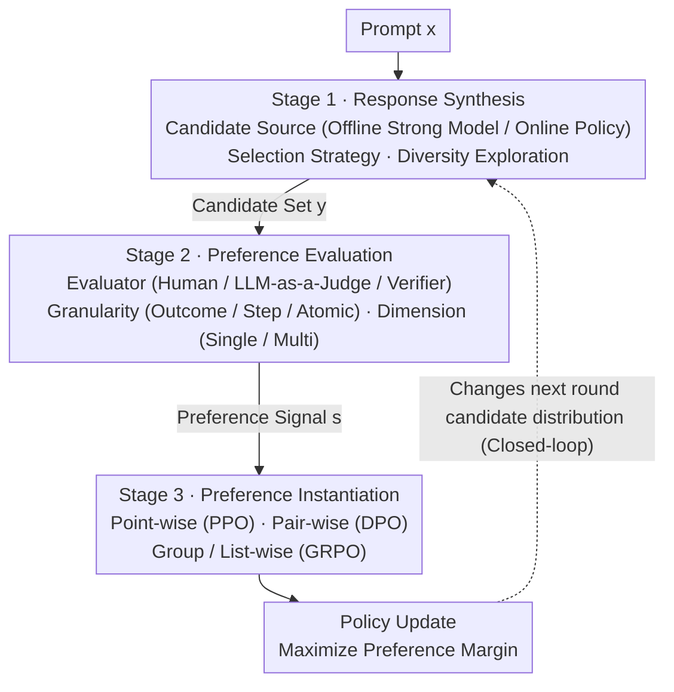

# Alignment Tuning for Large Language Models: A Data-Centric Lens on Alignment Data Pipelines

**Conference**: ACL 2026 Findings  
**arXiv**: [2605.26442](https://arxiv.org/abs/2605.26442)  
**Code**: No public code / Not applicable (Survey paper)  
**Area**: LLM Alignment / Alignment Data Pipelines  
**Keywords**: Alignment Tuning, Preference Data, RLHF, DPO, Data-centric AI

## TL;DR
This paper reinterprets LLM alignment tuning as a dynamic data pipeline design problem: what the model ultimately learns depends not only on optimization algorithms like PPO, DPO, or GRPO, but also on how candidate responses are generated, how preferences are evaluated, and how preference signals are instantiated as training objectives.

## Background & Motivation
**Background**: Early performance gains in large language models primarily came from scaling up parameters, architectures, and optimization algorithms. However, as the marginal returns of scaling diminish, research focus has shifted toward data quality. Existing data-centric research mostly discusses pre-training corpora, SFT data mixtures, and static data filtering, assuming "data" to be a pre-given set.

**Limitations of Prior Work**: Data in alignment tuning is not a static corpus. Preference data emerges from cyclic interactions between prompts, candidate responses generated by the current policy model, human or model feedback, and subsequent training objectives. For the same prompt, the source of candidate responses, evaluator bias, feedback granularity, and loss form all alter the final optimization signal. Treating it merely as "filtering a cleaner dataset" cannot explain phenomena like reward hacking, mode collapse, alignment tax, or online self-play instability.

**Key Challenge**: Optimization algorithms are often identified as the primary cause for the success or failure of alignment, yet the algorithms themselves only consume pre-constructed preference signals. The real bottleneck lies in the behavioral coverage, preference boundaries, and relational structures provided to the optimizer by the data pipeline: if candidate responses are too narrow, even strong evaluators lack discriminable objects; if feedback signals are too coarse, complex reasoning cannot perform credit assignment; if multi-objective preferences are compressed into a single scalar, the trade-off between safety and helpfulness is obscured.

**Goal**: The authors aim to establish a unified perspective by decomposing alignment tuning into three analyzable, composable, and diagnostic stages: response synthesis, preference evaluation, and preference instantiation. This aims to organize existing methods and provide practitioners with a framework for selecting pipeline configurations based on resource constraints and task complexity.

**Key Insight**: The paper starts from the observation that "alignment data is the source of optimization signals." Rather than asking if a specific loss is stronger, it first asks if the behavioral space, preference labels, and preference structures seen by that loss are reliable. This perspective is promising because it places disparate work—such as offline/online preference learning, LLM-as-a-Judge, process rewards, and DPO/GRPO/list-wise objectives—into a single chain of data generation and signal transmission.

**Core Idea**: Replace the narrative of "a single algorithm determining alignment effects" with "data pipelines collectively constructing optimization signals," framing alignment tuning as a co-optimization problem of response synthesis, preference evaluation, and preference instantiation.

## Method
This paper does not propose a new training algorithm but rather an analytical framework. It first reviews the fundamental objective of alignment tuning: given a prompt $x$ and a model response $y$, the ideal policy must maximize human preference rewards while using a KL term to constrain the new policy from drifting too far from the reference policy. PPO, DPO, and GRPO can all be viewed as adjusting the policy on different forms of preference signals, but these algorithms do not automatically guarantee that the preference signals themselves are high-quality.

The authors further formalize alignment data as a set of structured samples: each sample contains a prompt $x$, a set of candidate responses $\mathbf{y}$ generated by a synthesis policy $\mathcal{S}$, and a preference signal $\mathbf{s}$ produced by an evaluator $\mathcal{E}$. In other words, alignment data is not a simple collection of $(x, y)$, but an optimization object jointly produced by "what candidates are generated, how they are judged, and how judgments are converted into training signals."

Under this view, alignment optimization can be understood as margin alignment: the implicit preference boundary induced by the model policy must be consistent with the explicit preference boundary produced by the data pipeline. If candidate responses lack sufficient diversity, the margin is weak; if the evaluator is biased, the margin is skewed; if the instantiation method compresses multi-dimensional preferences into a single value, the margin loses its structure. The primary method of the paper revolves around these sources of margin, systematically analyzing the design space and interactions of the three pipeline stages.

### Overall Architecture
The overall pipeline consists of three stages.

The first stage is **response synthesis**, which generates a set of candidate responses for each prompt. This determines which behaviors the alignment process can see, i.e., the behavioral support. Key questions include: Do responses come from an offline strong model or the current online policy? Is margin or uncertainty used to select more informative samples? Is diversity actively maintained to prevent the model from learning only a few high-probability styles?

The second stage is **preference evaluation**, which assigns preference signals to the candidate responses. While early RLHF relied on human preferences, much current work uses LLM-as-a-Judge, verifiers, rubrics, or multi-agent debate to reduce labeling costs. The paper emphasizes that evaluation involves not only "who judges" but also "at what granularity" and "across which dimensions": outcome-level is suitable for short responses, step-level is better for math and code, and atomic-level is more appropriate for long-form factuality and safety; single-dimensional rewards easily introduce alignment tax, while multi-dimensional rubrics better preserve value conflicts.

The third stage is **preference instantiation**, which converts evaluation results into training signals consumable by the optimizer. Point-wise methods assign scores or binary labels to individual responses; pair-wise methods construct $(x, y_w, y_l)$ preference pairs, which is the mainstream form for the DPO family; group-wise/list-wise methods utilize the relative ranking of a set of candidates, suitable for high-variance reasoning tasks and multi-candidate comparisons.

These three stages are not linearly independent. Response synthesis sets the upper bound for evaluation; evaluation granularity and dimensionality determine what instantiation can model; after instantiation updates the policy, it changes the candidate distribution for the next round of synthesis. Thus, alignment tuning is more like a closed-loop control system than a one-time data cleaning process.

### Key Designs

**1. Three-stage data-centric taxonomy: Shifting alignment failure attribution from "wrong loss" to "contaminated pipeline signal"**

It is common to associate alignment quality with algorithm names like PPO, DPO, or GRPO. However, algorithms merely consume pre-constructed preference signals; the signal quality is determined by the data chain preceding them. The paper subdivides each stage: response synthesis into response source, selection strategy, and creative exploration; preference evaluation into adjudicator type, judgment granularity, and objective dimensionality; preference instantiation into point-wise, pair-wise, and group-wise/list-wise. Table 5 categorizes 41 representative methods along these dimensions.

The value of this coordinate system lies in tracing many "loss-related problems" back to pipeline mismatches. Using outcome-level binary labels to feed token-level preference objectives is essentially a failure of supervision granularity; using responses from an offline strong model to train a current weak policy introduces distribution shift; compressing safety and helpfulness into a single scalar reward directly obscures the Pareto trade-off between the two. In other words, diagnosis should first locate which segment of the signal is problematic rather than rushing to replace the optimizer.

**2. Explaining optimization signals through data construction: Grounding abstract "human preferences" into actual candidate sets and structures**

Alignment goals are often described as "aligning with human preferences," but the model never sees true preferences—only data. The paper formalizes alignment data as $\mathcal{D}=\{(x, \mathbf{y}, \mathbf{s})\}$, where candidates $\mathbf{y}$ come from the synthesis policy and preference signals $\mathbf{s}$ come from the evaluator. During training, the model does not maximize true preference but the preference margin induced by these samples. PPO uses point-wise rewards, DPO uses pair-wise contrasts, and GRPO uses group-relative baselines—all are essentially calibrating this margin on preference data with different structures.

This abstraction explains why "changing the loss alone often fails": if the synthesis stage only produces mediocre or highly similar candidates, even a strong DPO can only learn a weak boundary; if the evaluator carries length, position, or model-family biases, the optimizer will treat these biases as true preferences; if instantiation prematurely compresses multi-dimensional signals into scalars, the model will take shortcuts along the easiest dimension to optimize. The coverage, fidelity, and structure of the margin are determined by the data long before the algorithm is applied.

**3. Constraint-oriented practical guide: Translating taxonomy into actionable selections based on budget**

Beyond description, the paper provides "constraint → strategy" mappings for synthesis, evaluation, and instantiation in Tables 2-4, and combines them into end-to-end scenario configurations in Appendix B / Table 6. For example, low-budget general chat is suited for offline data + pre-labeled/heuristic evaluation + reference-free pair-wise objectives; complex reasoning is suited for multi-rollout + step-level verifiers + group-wise training; safety compliance necessitates red-teaming prompts, multi-dimensional evaluation, and multi-objective optimization.

The stance is that one should not seek a "one-size-fits-all" algorithm but rather ensure components match each other: where data is lacking, add on-policy synthesis; where evaluation is difficult, increase granularity; where VRAM is tight, bypass reward/reference models; where objectives conflict, do not scalarize rewards. The optimal configuration drifts with data availability, task complexity, and compute budget, making "pipeline selection" a more foundational decision than "loss selection."

### Loss & Training
This paper does not propose new loss functions but explains mainstream training strategies within a unified signal structure.

PPO represents point-wise reward maximization: it first trains a reward model $r_\phi(x,y)$, then maximizes the reward while using a KL term to constrain policy drift. Its advantage is its ability to use scalar rewards directly, while its disadvantages include the need for a reward model and stable RL updates, making it susceptible to reward hacking.

DPO represents pair-wise preference optimization: instead of explicitly training a reward model, it uses preference pairs $(x, y_w, y_l)$ to directly increase the likelihood ratio of the preferred response relative to the rejected one. It reduces system complexity but relies on high-quality preference pairs and may suffer from over-fitting, entropy collapse, and exploration shrinkage under strong contrastive updates.

GRPO represents group-wise optimization: multiple candidates are sampled for the same prompt, and the intra-group average reward is used as a baseline to increase the probability of responses above the group average. It is suitable for reasoning scenarios with $N>1$ rollouts, as it reduces variance and avoids a separate value network, though it still relies on reliable verifiers or reward signals.

The training strategy recommendations can be summarized as: first determine candidate coverage based on task and resources, then match evaluation granularity, and finally choose an optimization objective that preserves the corresponding preference structure. In other words, the loss is the final carrier of the data design from the previous two stages, not the starting point.

## Key Experimental Results
This is a survey/framework paper and does not report new model training experiments, benchmark SOTA values, or traditional ablation studies. Therefore, rather than reporting empirical accuracy, the structural results and design conclusions are organized below.

### Main Results

| Evidence in Paper | Scale / Quantity | Meaning | Implications for Practice |
|:---|:---|:---|:---|
| Three-stage framework | 3 stages | response synthesis, preference evaluation, preference instantiation | When diagnosing alignment failure, first locate which segment of the signal is contaminated or compressed. |
| Table 1 | 6 design principles | Pipeline defines signal, coverage first, fidelity as ceiling, granularity for credit assignment, preserve structure, closed-loop design | Expand "changing loss" to "jointly designing data generation, evaluation, and objectives." |
| Tables 2-4 | 3 stage-level decision tables | "Constraint → Strategy" mappings for synthesis, evaluation, and instantiation | Low budget, complex reasoning, and safety compliance should not share the same pipeline. |
| Table 5 | 41 representative methods | Categorized by response source, selection, creative exploration, granularity, dimensionality, and instantiation | PPO/DPO/GRPO can be viewed as different points in the same data pipeline design space. |
| Table 6 | 5 deployment scenarios | Low-budget chat, complex reasoning, open creation, safety compliance, cold-start adaptation | Provides end-to-end component combinations rather than isolated algorithm recommendations. |

### Ablation Study
The paper does not contain traditional ablation studies but provides a structural analysis of "design variable ablations" in Section 7, showing how improper choices in one stage limit subsequent stages.

| Design Variable | If Mishandled | Consequences in Paper | Direction for Improvement |
|:---|:---|:---|:---|
| Response source | Mismatch between offline data and current policy | off-policy bias, value estimation shift | policy-aware reweighting or online self-play |
| Candidate diversity | Candidates are too similar or early mode collapse | Evaluator cannot produce effective preference margins; weak gradients | diversity sampling, creative exploration, DivPO/CRPO methods |
| Evaluation granularity | Using outcome-level labels for complex reasoning | Inability to locate intermediate errors; coarse credit assignment | step-level verifier, process reward, atomic-level supervision |
| Objective dimensionality | Multi-objective preferences compressed into a scalar | alignment tax, reward hacking, obscured helpfulness/safety trade-off | rubric, multi-dimensional reward, multi-objective optimization |
| Instantiation form | Expressing complex relations with coarse point-wise signals | Loss of ranking structure and intra-group normalization info | pair-wise, group-wise, or list-wise objectives |

### Key Findings
- **Evaluation fidelity is the ceiling**: If LLM-as-a-Judge exhibits length bias, position bias, or self-preference bias, the downstream optimization will learn these biases instead of true human preferences.
- **Coverage precedes optimization**: Alignment can only occur within the behavioral space sampled during the synthesis stage; narrower candidate spaces lead to brittle alignment and subsequent exploration exhaustion.
- **Closed-loop is more realistic than open-loop**: In online alignment, the current loss changes policy entropy and output distribution, which in turn changes the next round of training data; open-loop assumptions (fixed data/evaluator/reward) fail easily.
- **Different tasks require different granularities**: Short text preferences can use outcome-level comparisons; math, code, and agentic workflows require step/trajectory-level signals; long-form factuality and safety are better served by atomic-level supervision.
- **No single optimal algorithm**: SimPO/ORPO (reference-free pair-wise) are more practical for low-VRAM; GRPO/list-wise are more natural for high-variance reasoning; safety compliance requires multi-dimensional evaluation and constrained optimization.

## Highlights & Insights
- **Advancing "data quality" from static corpora to dynamic pipelines**: While much data-centric LLM work discusses pre-training/SFT data, this paper points out that alignment data evolves with the policy. This is critical as it transforms alignment failure from a one-time data cleaning issue into a closed-loop system design problem.
- **Unifying PPO, DPO, and GRPO signals through margins**: The paper does not stop at listing algorithms but emphasizes that different objectives simply consume differently structured preference signals. This view helps readers judge whether to change sampling, evaluation, or the loss itself.
- **Taxonomy is practitioner-friendly**: The three-stage framework translates directly into engineering decisions, such as reducing online generation/reference models when budgets are low, or avoiding reward scalarization when goals conflict. This is more actionable than a traditional survey.
- **Clear cross-stage interactions**: Response synthesis, evaluation, and instantiation are not independent modules but limit each other. Specifically, the closed-loop view—where instantiation affects the next round of synthesis—is helpful for understanding phenomena like diversity drop in DPO or distribution shifts in GRPO rollouts.

## Limitations & Future Work
- **Lack of empirical verification**: The paper is primarily a taxonomy and summary of principles. It does not compare pipeline configurations on unified benchmarks or prove that one guideline is consistently superior to another on a fixed task.
- **Rapidly evolving field**: Alignment tuning is moving fast, particularly in reasoning RL, agentic alignment, multimodal rewards, and automated judge calibration. The 41 methods in Table 5 represent only a snapshot at the time of writing.
- **Overlapping classification boundaries**: Many new methods change synthesis, evaluation, and instantiation simultaneously. Forcing them into single table fields might weaken their systemic innovations.
- **Prescriptive rather than technical solutions for judge reliability**: The paper identifies biases in LLM-as-a-Judge but does not provide reusable judge calibration protocols or quantified error-propagation methods.
- **Future directions for expansion**: Prompt-level alignment, agentic systems, evolving objectives, and multi-modal alignment all require more granular state modeling than the current three-stage text pipeline, particularly for trajectory-level preferences in long-horizon agents.

## Related Work & Insights
- **vs RLHF / PPO**: While PPO views alignment as policy optimization under a learned reward, this paper asks how the reward model's training data and candidate responses were constructed. The advantage is explaining reward hacking and evaluator bias; the disadvantage is not providing a runnable new algorithm like PPO.
- **vs DPO Surveys**: DPO surveys usually focus on pair-wise loss, reference models, and margin calibration. This paper places DPO within the preference instantiation stage and warns that pair-wise objectives are limited by synthesis coverage and evaluation granularity.
- **vs LLM-as-a-Judge Papers**: Judge-related papers focus on the biases, rubrics, or ensemble mechanisms of evaluators. This paper treats the judge as a component of preference evaluation, discussing how it constrains subsequent point-wise/pair-wise/group-wise training objectives.
- **vs Data Selection / SFT Quality Work**: Traditional data-centric research often handles static corpus filtering and mixing; the insight here is that alignment data should be seen as a dynamic object generated by the current policy, sampling strategy, evaluator, and loss.
- **Inspiration for Future Research**: When designing a new alignment method, researchers should first state which segment of the pipeline they are changing and how it improves the coverage, fidelity, or structure of the preference margin. This is more verifiable and reusable than simply claiming a "new loss is better."

## Rating
- Novelty: ⭐⭐⭐⭐☆ High conceptual novelty; the core contribution is the systemic restructuring of alignment tuning as a pipeline problem, though it does not propose a new training algorithm.
- Experimental Thoroughness: ⭐⭐☆☆☆ As a survey, it does not include new benchmarks or ablation experiments; evidence is based on literature review, taxonomies, and principled derivation.
- Writing Quality: ⭐⭐⭐⭐☆ Well-structured; the three-stage framework and practical tables are very useful. Some taxonomy boundaries overlap due to the nature of the methods.
- Value: ⭐⭐⭐⭐☆ Highly relevant for anyone working on RLHF/DPO/GRPO, LLM-as-a-Judge, reasoning RL, or safety alignment, especially for pipeline diagnosis and method positioning.

<!-- RELATED:START -->

## Related Papers

- [\[ACL 2025\] Language Models Resist Alignment: Evidence From Data Compression](../../ACL2025/model_compression/language_models_resist_alignment.md)
- [\[ACL 2026\] SRA: Span Representation Alignment for Large Language Model Distillation](sra_span_representation_alignment_for_large_language_model_distillation.md)
- [\[ACL 2026\] MTA: Multi-Granular Trajectory Alignment for Large Language Model Distillation](mta_multi-granular_trajectory_alignment_for_large_language_model_distillation.md)
- [\[ICLR 2026\] Alignment through Meta-Weighted Online Sampling: Bridging the Gap between Data Generation and Preference Optimization](../../ICLR2026/model_compression/alignment_through_meta-weighted_online_sampling_bridging_the_gap_between_data_ge.md)
- [\[ACL 2026\] Training-Free Test-Time Contrastive Learning for Large Language Models](training-free_test-time_contrastive_learning_for_large_language_models.md)

<!-- RELATED:END -->
