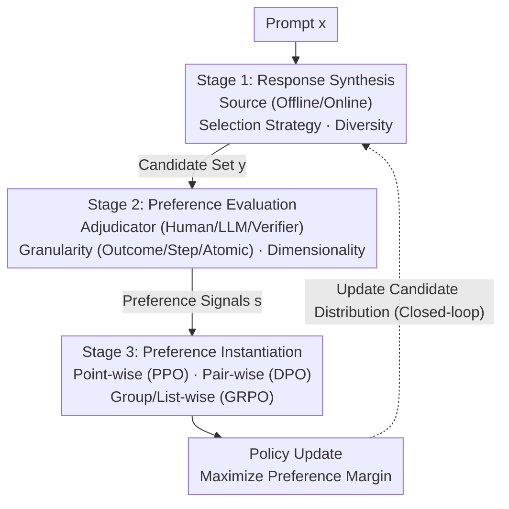

# Alignment Tuning for Large Language Models: A Data-Centric Lens on Alignment Data Pipelines

**Conference**: ACL 2026 Findings  
**arXiv**: [2605.26442](https://arxiv.org/abs/2605.26442)  
**Code**: No public code / Not applicable (Survey paper)  
**Area**: LLM Alignment / Alignment Data Pipelines  
**Keywords**: Alignment Tuning, Preference Data, RLHF, DPO, Data-centric AI

## TL;DR
This paper reinterprets LLM alignment tuning as a dynamic data pipeline design problem: what the model eventually learns depends not only on optimization algorithms like PPO, DPO, or GRPO, but more crucially on how candidate responses are synthesized, how preferences are evaluated, and how preference signals are instantiated into training objectives.

## Background & Motivation
**Background**: Early performance gains in large language models primarily stemmed from scaling parameter sizes, architectures, and optimization algorithms. As the marginal returns of scaling diminish, research focus has shifted toward data quality. Existing data-centric research often discusses pre-training corpora, SFT data mixing, and static data filtering, treating "data" as a pre-given static set.

**Limitations of Prior Work**: Data in alignment tuning is not a static corpus. Preference data emerges from cyclic interactions between prompts, candidate responses generated by current policy models, human or model critiques, and subsequent training objectives. For the same prompt, the source of candidate responses, evaluator bias, feedback granularity, and loss formulations all alter the final optimization signal. Treating it merely as a "cleaner dataset" fails to explain phenomena like reward hacking, mode collapse, alignment tax, and instability in online self-play.

**Key Challenge**: Optimization algorithms are often blamed or credited for alignment outcomes, yet algorithms only consume pre-constructed preference signals. The true bottleneck lies in the behavioral coverage, preference boundaries, and relational structures provided to the optimizer by the data pipeline. If candidate responses are too narrow, even strong evaluators lack discriminative objects; if feedback signals are too coarse, complex reasoning cannot achieve proper credit assignment; if multi-objective preferences are compressed into a single scalar, the trade-off between safety and helpfulness is obscured.

**Goal**: The authors aim to establish a unified perspective by decomposing alignment tuning into three analyzable, composable, and diagnosable stages: response synthesis, preference evaluation, and preference instantiation. This provides a framework for organizing existing methods and helps practitioners select pipeline configurations based on resource constraints and task complexity.

**Key Insight**: The paper starts from the observation that "alignment data is the source of optimization signals." Rather than asking if a loss function is superior, one should first ask if the behavior space, preference labels, and preference structures seen by that loss are reliable. This perspective integrates seemingly disparate works—offline/online preference learning, LLM-as-a-Judge, process rewards, and DPO/GRPO/list-wise objectives—into a single chain of data generation and signal transmission.

**Core Idea**: Replace the narrative that "a single algorithm determines alignment success" with "data pipelines collectively construct the optimization signal," designing alignment tuning as a synergistic optimization of response synthesis, preference evaluation, and preference instantiation.

## Method
The paper proposes an analytical framework rather than a new training algorithm. It reviews the fundamental goal of alignment tuning: given a prompt $x$ and response $y$, the ideal policy maximizes human preference rewards while being constrained by a KL term to stay near the reference policy. PPO, DPO, and GRPO are viewed as refining policies based on different forms of preference signals, but these algorithms do not automatically guarantee the quality of the signals themselves.

The authors formalize alignment data as a structured set of samples: each sample includes a prompt $x$, a set of candidate responses $\mathbf{y}$ produced by a synthesis policy $\mathcal{S}$, and preference signals $\mathbf{s}$ generated by an evaluator $\mathcal{E}$. In other words, alignment data is not a simple $(x, y)$ pair, but an optimization object jointly produced by "what candidates are generated, how they are judged, and how judgments become training signals."

From this lens, alignment optimization is understood as margin alignment: the implicit preference boundary induced by the model policy must align with the explicit preference boundary produced by the data pipeline. If candidates lack sufficient variance, the margin is weak; if evaluators are biased, the margin is skewed; if instantiation compresses multi-dimensional preferences into a single value, the margin loses its structure. The methodology systematically analyzes the design space and interactions of these three pipeline stages surrounding the sources of these margins.

### Overall Architecture
The overall pipeline consists of three stages.

The first stage is **response synthesis**, which generates candidate response sets for each prompt. This determines which behaviors the alignment process observes, termed behavioral support. Key questions include: Do responses come from a strong offline model or the current online policy? Are margin or uncertainty-based strategies used to select informative samples? Is diversity actively maintained to prevent the model from learning only a few high-probability styles?

The second stage is **preference evaluation**, which assigns preference signals to candidate responses. While early RLHF relied on human preferences, widespread work now utilizes LLM-as-a-Judge, verifiers, rubrics, or multi-agent debate to reduce costs. The paper emphasizes that evaluation involves not just "who judges," but also "how granular" and "across how many dimensions": outcome-level is suitable for short responses, step-level for math and code, and atomic-level for long-form factuality and safety. Single-dimensional rewards may introduce alignment tax, whereas multi-dimensional rubrics preserve value conflicts.

The third stage is **preference instantiation**, converting evaluation results into training signals for the optimizer. Point-wise methods assign scores or binary labels to single responses; pair-wise methods construct $(x, y_w, y_l)$ preference pairs, the mainstream form for DPO series; group-wise / list-wise methods utilize relative rankings among a set of candidates, suitable for high-variance reasoning tasks and multi-candidate comparisons.

These three stages are not linearly independent. Response synthesis sets the ceiling for evaluation; evaluation granularity and dimensionality determine what instantiation can model; and after instantiation updates the policy, it changes the candidate distribution for the next synthesis round. Thus, alignment tuning functions as a closed-loop control system rather than a one-time data cleaning process.

### Key Designs

**1. Three-stage Data-centric Taxonomy: Relocating alignment failure from "wrong loss" to "contaminated pipeline signals"**

Alignment success is often attributed to PPO/DPO/GRPO algorithms, but algorithms merely consume pre-constructed signals. The paper subdivides each stage: response synthesis into response source, selection strategy, and creative exploration; preference evaluation into adjudicator type, judgement granularity, and objective dimensionality; preference instantiation into point-wise, pair-wise, and group/list-wise. Table 5 categorizes 41 representative methods along these dimensions. This coordinate system reveals that many "algorithm issues" are actually pipeline mismatches, such as using outcome-level labels for token-level goals or compressing multidimensional safety/helpfulness into a single scalar.

**2. Explaining Optimization Signals through Data Construction: Grounding "Human Preference" in candidate sets and structures**

Alignment objectives are often described as "aligning with human preferences," but models only see data. The paper formalizes alignment data as $\mathcal{D}=\{(x, \mathbf{y}, \mathbf{s})\}$. During training, the model maximizes the preference margin induced by these samples. Whether using point-wise rewards (PPO), pair-wise contrast (DPO), or group-relative baselines (GRPO), the model is essentially calibrating this margin across different data structures. If synthesis produces mediocre or identical candidates, the margin is weak regardless of the loss function.

**3. Constraint-Oriented Practical Guide: Mapping classification to "budget vs. pipeline" selection**

The paper provides mappings between "constraints and strategies" for each stage in Tables 2-4. It argues against a "one-size-fits-all" algorithm, emphasizing component matching: use on-policy synthesis when data is scarce, increase granularity when evaluation is difficult, avoid reward/reference models when VRAM is limited, and avoid scalarizing rewards when objectives conflict. Optimal configuration shifts with data availability, task complexity, and compute budget.

### Loss & Training
This paper summarizes mainstream training strategies within a unified signal structure rather than proposing new losses.

PPO represents point-wise reward maximization: it trains a reward model $r_\phi(x,y)$ then maximizes that reward constrained by a KL term. Its advantage is direct use of scalar rewards, but it requires reward models and stable RL updates, making it susceptible to reward hacking.

DPO represents pair-wise preference optimization: it skips explicit reward model training and uses preference pairs $(x, y_w, y_l)$ to directly increase the likelihood ratio of preferred responses over rejected ones. It reduces system complexity but relies on high-quality pairs and may lead to over-fitting or entropy collapse under strong contrastive updates.

GRPO represents group-wise optimization: it samples multiple candidates for the same prompt and uses the group mean reward as a baseline. It is suitable for reasoning scenarios with $N>1$ rollouts, reducing variance and avoiding a separate value network, though it still relies on reliable verifiers or rewards.

The training strategy recommendation emphasizes that the loss function is the final carrier of data design from the previous two stages rather than the starting point.

## Key Experimental Results

### Main Results

| Evidence | Scale / Quantity | Definition | Practical Insight |
|---------|-------------|----------|--------------|
| Three-stage Framework | 3 Stages | synthesis, evaluation, instantiation | Locate contaminated or compressed signals when diagnosing alignment failure. |
| Table 1 | 6 Design Principles | Pipeline defines signals, coverage first, fidelity ceiling, granularity for credit assignment, etc. | Expand "changing loss" to "joint design of data, evaluation, and target." |
| Tables 2-4 | 3 Decision Tables | Resource constraints vs. recommended strategies | Different scenarios (low budget, reasoning, safety) should not share the same pipeline. |
| Table 5 | 41 Methods | Categorized by source, selection, granularity, dimensionality, and instantiation | View PPO/DPO/GRPO as different points in the same pipeline design space. |
| Table 6 | 5 Deployment Scenarios | Low-budget chat, reasoning, creative, safety, cold-start | Provides end-to-end component combinations rather than isolated algorithms. |

### Ablation Study
The paper provides a structural "design variable ablation" in Section 7.

| Design Variable | If Mismanaged | Consequence | Improvement Direction |
|---------|------------|----------------|--------------|
| Response source | Distribution mismatch between offline data and policy | Off-policy bias, value estimation shift | Policy-aware reweighting or online self-play |
| Candidate diversity | Candidates are too similar or mode collapse | Weak preference margin, weak gradients | Diversity sampling, creative exploration |
| Evaluation granularity | Coarse outcome-level labels for complex reasoning | Poor credit assignment | Step-level verifiers, process rewards |
| Objective dimensionality | Multi-objective preferences compressed to one scalar | Alignment tax, reward hacking | Rubrics, multi-dimensional rewards |
| Instantiation form | Using coarse point-wise signals for complex relations | Loss of ranking and normalization info | Pair-wise, group-wise, or list-wise targets |

### Key Findings
- **Evaluation Fidelity is the Ceiling**: If an LLM-as-a-Judge has verbosity, position, or self-preference bias, the optimization learns these biases rather than true human preferences.
- **Coverage Precedes Optimization**: Alignment only occurs within the behavior space sampled during synthesis; narrow candidate spaces lead to brittle alignment and exploration exhaustion.
- **Closed-loop is Realistic**: In online alignment, current loss changes the policy distribution, which in turn changes the next round's data; open-loop assumptions (fixed data/reward) easily fail.
- **Task-Dependent Granularity**: Short summaries work with outcome-level labels, but reasoning (math/code) requires step-level signals, and long-form factuality requires atomic-level supervision.
- **No Single Optimal Algorithm**: SimPO/ORPO suit low-VRAM needs; GRPO/list-wise suit high-variance reasoning; safety requires multi-dimensional evaluation.

## Highlights & Insights
- **From Static Corpus to Dynamic Pipeline**: Alignment data is dynamic and policy-dependent. This shifts alignment failure from a data cleaning issue to a closed-loop system design issue.
- **Unifying Algorithms via Margin**: By focusing on the margin, the paper helps users decide whether to modify sampling, evaluation, or the loss function itself.
- **Actionable Taxonomy**: The framework provides engineering decisions based on budget and task (e.g., increasing granularity for reasoning or avoiding scalarization for safety).
- **Cross-stage Interactions**: The insight that instantiation affects subsequent synthesis distributions explains known phenomena like diversity loss after DPO or shift in GRPO rollout distributions.

## Limitations & Future Work
- **Lack of Empirical Validation**: The paper primarily offers taxonomy and principles without comparing pipeline configurations on a unified benchmark.
- **Rapid Obsolescence**: Alignment tuning evolves quickly (e.g., reasoning RL, agentic alignment); the 41 methods reflect a snapshot in time.
- **Overlapping Categories**: New methods often innovate across multiple stages simultaneously, making rigid classification difficult.
- **Principled but not Algorithmic Judge Solutions**: While highlighting judge bias, the paper offers principles rather than plug-and-play calibration protocols.
- **Future Directions**: Prompt-level alignment, agentic systems, and multi-modal alignment require finer state modeling than current text pipelines.

## Related Work & Insights
- **vs. RLHF / PPO**: While PPO treats alignment as reward maximization, this paper investigates how those reward signals and candidates are constructed, explaining reward hacking.
- **vs. DPO Surveys**: Unlike surveys focused on DPO loss variants, this work places DPO within the instantiation stage and highlights how its effect is capped by synthesis and evaluation.
- **vs. LLM-as-a-Judge Research**: It treats judges as components within a larger chain, discussing how their output constraints subsequent point-wise/pair-wise training targets.
- **Insight for Future Research**: New alignment methods should specify which pipeline stage they target and how they improve the coverage, fidelity, or structure of the preference margin.

## Rating
- Novelty: ⭐⭐⭐⭐☆ High perspective novelty; redefines alignment tuning as a pipeline problem.
- Experimental Thoroughness: ⭐⭐☆☆☆ Mainly a survey/framework; lacks new empirical benchmark results.
- Writing Quality: ⭐⭐⭐⭐☆ Clear structure and useful tables, though categories occasionally overlap.
- Value: ⭐⭐⭐⭐☆ Highly relevant for practitioners in RLHF, DPO, reasoning RL, and safety for pipeline diagnosis and method positioning.

<!-- RELATED:START -->

## Related Papers

- [\[ACL 2025\] Language Models Resist Alignment: Evidence From Data Compression](../../ACL2025/model_compression/language_models_resist_alignment.md)
- [\[ACL 2026\] SRA: Span Representation Alignment for Large Language Model Distillation](sra_span_representation_alignment_for_large_language_model_distillation.md)
- [\[ACL 2026\] MTA: Multi-Granular Trajectory Alignment for Large Language Model Distillation](mta_multi-granular_trajectory_alignment_for_large_language_model_distillation.md)
- [\[ICLR 2026\] Alignment through Meta-Weighted Online Sampling: Bridging the Gap between Data Generation and Preference Optimization](../../ICLR2026/model_compression/alignment_through_meta-weighted_online_sampling_bridging_the_gap_between_data_ge.md)
- [\[ACL 2026\] Training-Free Test-Time Contrastive Learning for Large Language Models](training-free_test-time_contrastive_learning_for_large_language_models.md)

<!-- RELATED:END -->
