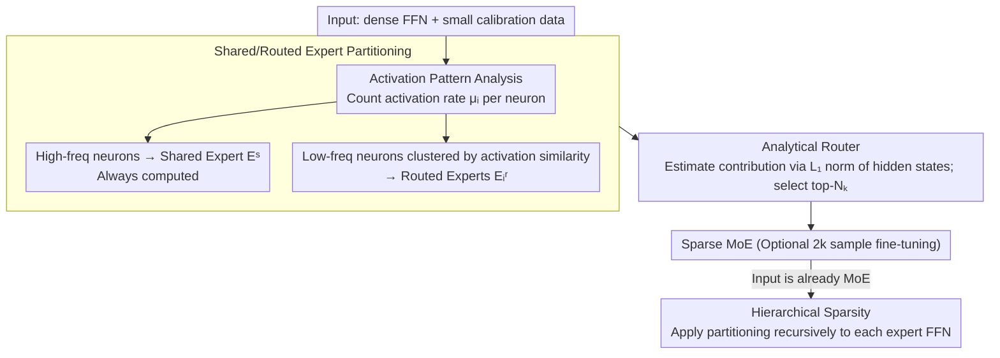

# Analytical FFN-to-MoE Restructuring via Activation Pattern Analysis

**Conference**: ACL 2026  
**arXiv**: [2502.04416](https://arxiv.org/abs/2502.04416)  
**Code**: [GitHub](https://github.com/JarvisPei/CMoE)  
**Area**: Model Compression / MoE  
**Keywords**: FFN-to-MoE, Activation Pattern Analysis, Shared Experts, Analytical Routing, Post-training Compression

## TL;DR

This paper proposes an analytical post-training framework that rapidly restructures dense FFNs into sparse MoEs through neuron activation pattern analysis. By distinguishing high-frequency shared experts from low-frequency routed experts and constructing routers derived from activation statistics, the method achieves a 1.17× speedup with fine-tuning on only 2k samples.

## Background & Motivation

**Background**: MoE architectures decouple parameter scale from computational cost via sparse activation. However, traditional methods require training MoE models from scratch, which is prohibitively expensive.

**Limitations of Prior Work**: (1) Existing dense-to-MoE methods (e.g., MoEfication) rely on weight clustering, ignoring differences in activation frequencies among neurons. (2) Methods like LLaMA-MoE require continual training on 200B tokens to recover model quality. (3) A critical observation is overlooked—neuron activation frequencies follow a bi-modal distribution, where a few neurons are always active while most are only conditionally active.

**Key Challenge**: Treating high-frequency (always active) neurons and low-frequency (conditionally active) neurons uniformly forces the router to activate most experts for nearly all inputs, which undermines the sparsity of the MoE.

**Goal**: Develop an analytical (no large-scale training required) FFN-to-MoE method by leveraging the bi-modal structure of activation patterns.

**Key Insight**: Hidden activations in FFNs are highly sparse and bi-modal. High-frequency neurons can be grouped into shared experts, while low-frequency neurons are clustered into routed experts based on co-activation patterns. Routers can be constructed directly from statistical data.

**Core Idea**: Structural partitioning into shared and routed experts exploits the natural structure of activations, allowing the router to choose only among experts that are truly input-dependent.

## Method

### Overall Architecture

The framework consists of a three-stage pipeline: (A) Activation pattern analysis—calculating the activation rate $\mu_i$ for each neuron using a small calibration dataset; (B) Shared/routed expert partitioning—grouping high-frequency neurons into a shared expert $E^s$ and clustering low-frequency neurons into routed experts $E_i^r$ based on activation similarity; (C) Analytical router—constructing the routing function directly from activation statistics without training. Additionally, if the input model is already an MoE, the partitioning is applied recursively to each expert's FFN to achieve hierarchical sparsity.

### Key Designs

**1. Activation Rate-based Shared/Routed Partitioning: Following the natural bi-modal structure rather than treating all neurons equally.**

The limitation of methods like MoEfication is that they cluster by weights, scattering high-frequency neurons across different experts. Consequently, to avoid missing these globally important neurons, the router activates almost all experts, nullifying sparsity. This paper first uses calibration data to calculate the activation rate $\mu_i$ (the proportion of times it appears in top-$K_a$). High-frequency neurons are grouped into a shared expert $E^s$ that is always active, while the remaining low-frequency neurons are clustered based on activation similarity into routed experts $E_i^r$. 

With this partitioning, the shared expert handles the "common" computation required for any input, while the router only selects among low-frequency experts that vary with the input. Since activation frequency naturally follows a bi-modal distribution, aligning the architecture to this distribution prevents high-frequency neurons from dragging down sparsity.

**2. Analytical Router Construction: Extracting experts directly from statistics instead of training a router.**

Traditional methods require training a separate router, which is costly. This paper reformulates the objective as minimizing the reconstruction error $\|F_{MoE}(\mathbf{x}) - F(\mathbf{x})\|^2$, showing that this is equivalent to minimizing the output contribution of "missed" inactive experts. Therefore, the top-$N_k$ experts are selected by estimating the contribution of each expert to the current input. The $L_1$ norm of each expert's hidden state is used as a proxy for contribution.

The advantage is bypassing expensive router training: routing signals come directly from the activation statistics of the original FFN, making the entire reconstruction pipeline analytical and nearly training-free.

**3. Hierarchical Sparsity: Applying the framework recursively to existing MoE experts for fine-grained acceleration.**

While the first two designs target dense FFNs, many modern models are already MoEs. The paper observes that each expert within an MoE is essentially an FFN. By recursively applying the shared/routed partitioning to these expert FFNs, they create another layer of shared+routed structure. This expands the dense-to-MoE approach to further accelerate existing MoE models.

### Loss & Training

The analytical reconstruction is completely training-free (the training-free baseline is ready for deployment). An optional fine-tuning step using 2k samples and standard language modeling loss is used to further enhance quality.

## Key Experimental Results

### Main Results

| Configuration | Speedup | Processing Time | Quality |
| :--- | :--- | :--- | :--- |
| Training-free | 1.17× | Minutes | Usable |
| +2k Fine-tuning | 1.17× | Minutes + FT | Surpasses methods requiring more resources |

### Ablation Study

| Configuration | Key Metrics | Note |
| :--- | :--- | :--- |
| Uniform vs. Partitioned Experts | Partitioned is significantly better | Validates bi-modal partitioning |
| Analytical vs. Learned Routing | Analytical is comparable | No need to train a router |
| Recursive Hierarchical Sparsity | Effective | Further accelerates MoE models |

### Key Findings
- Bi-modal activation patterns are universal across multiple LLM architectures (LLaMA-2, Mistral, etc.).
- Minute-level processing and 2k sample fine-tuning can outperform methods requiring 200B tokens of training.
- The quality of the analytical router is close to that of a learned router, significantly reducing costs.

## Highlights & Insights
- **Observation-driven design**: Starting from the bi-modal distribution of activation patterns makes the design natural and elegant.
- **Efficiency Paradox**: The contrast between "minute-level processing" and "200B token training" is highly compelling.
- **Versatility**: Recursive application allows the method to work on both dense and MoE models.

## Limitations & Future Work
- The 1.17× speedup is relatively modest and may be insufficient for extreme low-latency scenarios.
- The selection of the shared expert proportion requires per-model adjustment.
- Testing on vision or multimodal models is currently absent.
- Future work could combine this with orthogonal technologies like quantization for further acceleration.

## Related Work & Insights
- **vs. MoEfication**: Specifically distinguishes shared and routed neurons instead of uniform clustering, fundamentally exploiting activation structures.
- **vs. LLaMA-MoE**: Eliminates the need for large-scale continual training, reducing costs by orders of magnitude.
- **vs. Activation Sparsity (e.g., DejaVu)**: Operates at different granularities and can be used in combination.

## Rating
- **Novelty**: ⭐⭐⭐⭐ Combination of bi-modal activation observation and analytical routers.
- **Experimental Thoroughness**: ⭐⭐⭐⭐ Multi-model, multi-task, and comparison with strong baselines.
- **Writing Quality**: ⭐⭐⭐⭐⭐ Excellent logical flow from observation to motivation to verification.
- **Value**: ⭐⭐⭐⭐ Directly practical for efficient LLM inference.

<!-- RELATED:START -->

## Related Papers

- [\[ICLR 2026\] Steering MoE LLMs via Expert (De)Activation](../../ICLR2026/model_compression/steering_moe_llms_via_expert_deactivation.md)
- [\[ACL 2026\] IMPACT: Importance-Aware Activation Space Reconstruction](impact_importance-aware_activation_space_reconstruction.md)
- [\[ACL 2026\] A Layer-wise Analysis of Supervised Fine-Tuning](a_layer-wise_analysis_of_supervised_fine-tuning.md)
- [\[AAAI 2026\] CAMERA: Multi-Matrix Joint Compression for MoE Models via Micro-Expert Redundancy Analysis](../../AAAI2026/model_compression/camera_multi-matrix_joint_compression_for_moe_models_via_mic.md)
- [\[ACL 2026\] When Reviews Disagree: Fine-Grained Contradiction Analysis in Scientific Peer Reviews](when_reviews_disagree_fine-grained_contradiction_analysis_in_scientific_peer_rev.md)

<!-- RELATED:END -->
