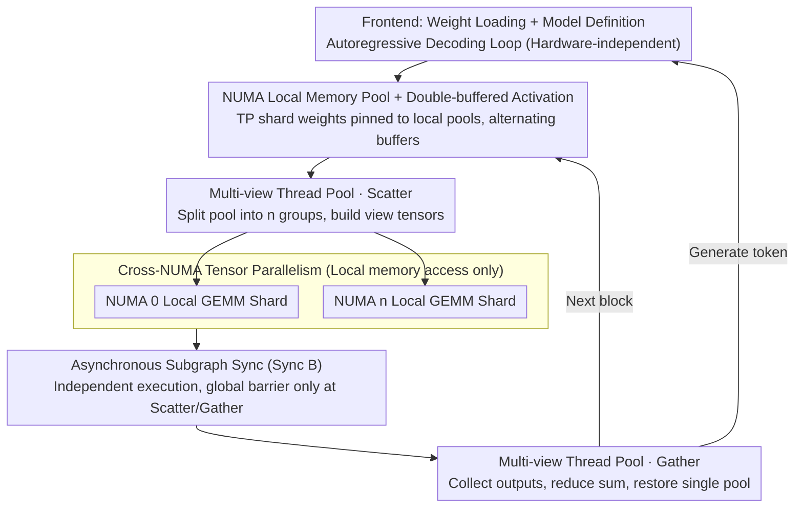

# ArcLight: A Lightweight LLM Inference Architecture for Many-Core CPUs

**Conference**: ACL 2026  
**arXiv**: [2603.07770](https://arxiv.org/abs/2603.07770)  
**Code**: https://github.com/OpenBMB/ArcLight  
**Area**: Model Compression / Inference Optimization / CPU Deployment  
**Keywords**: Many-Core CPU, NUMA-aware, Tensor Parallelism, llama.cpp, LLM Inference Framework

## TL;DR
ArcLight is a lightweight LLM inference framework written from scratch (approximately 10 C++ files) designed for many-core CPUs with multiple NUMA nodes. By utilizing NUMA-local memory pools, multi-view thread pools, cross-NUMA tensor parallelism, and asynchronous subgraph synchronization, it breaks the "remote memory wall." On a 192-core ARM Kunpeng platform, it improves the decode throughput of Qwen3-4B Q4_0 by up to 46% compared to llama.cpp.

## Background & Motivation

**Background**: Mainstream LLM inference frameworks follow two paths: GPU-centric (vLLM, TensorRT, SGLang) and CPU-centric (represented by llama.cpp). The CPU route is critical for edge deployment, web servers, and high-end networking equipment, as it leverages existing hardware.

**Limitations of Prior Work**: Web servers and network devices commonly use many-core CPUs (48–192 cores across 2–4 NUMA nodes). Cross-NUMA memory access latency is approximately $4\times$ higher than local access. Experiments on a 192-core machine show local memory bandwidth at ~102 GB/s, while cross-node bandwidth drops to 22–26 GB/s. llama.cpp only supports `--numa distribute` to evenly distribute threads but **does not explicitly bind tensors to NUMA nodes**. The OS allocates physical pages based on a first-touch policy, leading to excessive cross-node memory access. Consequently, while compute capacity scales from 6 to 48 cores, it hits a memory wall when reaching 192 cores.

**Key Challenge**: Traditional CPU frameworks are designed with a "UMA + single thread pool + serial computation graph" approach. This cannot express NUMA-aware computation patterns where multiple NUMA nodes run different subgraphs in parallel, with each subgraph strictly accessing local tensors. Modifying llama.cpp would require radical surgical refactoring from low-level memory allocation to high-level model definitions.

**Goal**: To design a minimal, modular, and NUMA-aware CPU inference framework from scratch to overcome the cross-node memory wall.

**Key Insight**: In Transformers, $W_q, W_k, W_v, W_{gate}, W_{up}$ can be split by row, while $W_o, W_{down}$ can be split by column, corresponding to Megatron-style Tensor Parallelism (TP). By ensuring each shard resides in the local memory of a specific NUMA node, subgraphs can compute entirely within nodes, restricting cross-node communication to simple Gather/Scatter steps.

**Core Idea**: Downshift the Megatron-style tensor parallelism common in multi-GPU setups to multi-NUMA CPU nodes. Combined with NUMA-local memory pools, multi-view thread groups, and asynchronous subgraph synchronization, this eliminates cross-node memory access within the GEMM main loop.

## Method

### Overall Architecture
The architecture comprises two layers. **Frontend**: Handles weight loading, model definition, and the autoregressive decoding loop (hardware-independent). **Backend Inference Engine**: Consists of 5 core modules—Tensor Library (C++ classes encapsulating header and data), Memory Manager (independent memory pools per NUMA node + double-buffered activation), Thread Manager (multi-view thread groups + global/local barriers), Forward Graph Builder (append-only static graph construction), and Graph Computation Scheduler (operator scheduling in container order). The engine consists of ~10 C++ files and reuses llama.cpp's kernels (GEMM, FlashAttention, etc.). At runtime, each transformer block follows this flow: weights are pinned to NUMA nodes; a Scatter op splits the thread pool into $n$ groups and creates view tensors; each group independently executes TP-sharded GEMM within its node; groups merge and sum via a Gather op only at the exit.

### Key Designs

**1. NUMA Local Memory Pool + Double-buffered Activation: Pinning physical pages to local NUMA memory while halving peak activation memory.**

llama.cpp uses a single UMA buffer, letting the OS decide page placement via first-touch under distributed threads, which causes most GEMMs to read weights across nodes—where bandwidth is only a quarter of local speed. Ours uses an independent memory pool for each node when NUMA is enabled. Tensor shards are explicitly bound to the local pool of the corresponding node. Consequently, weight placement is an explicit framework decision rather than an OS heuristic. 

Additionally, activations use double-buffering, where adjacent layers alternate between two buffers. This reduces resident memory by half, making it suitable for memory-constrained edge devices.

**2. Multi-view Thread Pool + Global/Local Barrier: Enabling worker groups to either cooperate on a single GEMM or split into $n$ groups for subgraphs.**

A single thread pool cannot express parallelism across multiple subgraphs after TP splitting. Ours introduces "thread group" logical abstractions within the thread pool. Threads can be reorganized through explicit APIs during initialization or graph execution, supporting both intra-group barriers and global barriers across all groups. During TP execution, the Scatter operator splits the pool into $n$ groups and creates view tensors for subgraphs; at the exit, the Gather operator restores the single-group pool. This avoids the overhead of maintaining and switching between multiple physical thread pools.

**3. Cross-NUMA Tensor Parallelism + Asynchronous Subgraph Synchronization: Splitting GEMM sequences into TP shards equal to the node count, minimizing cross-node communication.**

Since $W_q, W_k, W_v, W_{gate}, W_{up}$ are row-parallel and $W_o, W_{down}$ are column-parallel, Ours implements Megatron-style TP. For an MLP, $Y=\sigma(AX), Z=BY$ is split into $[Y_1, Y_2]=[\sigma(A_1 X), \sigma(A_2 X)]$ and $[Z_1, Z_2]=[B_1 Y_1, B_2 Y_2]$, where $Z=Z_1+Z_2$ is reduced only during the Gather phase. All TP tensors resident in their respective NUMA local pools. This ensures GEMM operations from the attention/MLP entry to exit access local memory only.

For synchronization, Ours employs "Sync B" instead of the standard "Sync A." Sync A places a cross-group barrier after every GEMM, causing idle threads when waiting for the slowest group. Sync B allows groups to proceed at their own pace, placing global barriers only at the Scatter entry and Gather exit, providing a gain of ~5 tokens/s.

## Key Experimental Results

### Main Results (Qwen3-4B Q4_0, prompt=15 / decode=256, HUAWEI Kunpeng-920 ARM, 4 NUMA × 48 Cores)

**Single NUMA Node (Intra-node scalability)**

| Threads | llama.cpp (tok/s) | ArcLight (tok/s) | Gain |
|---|---|---|---|
| 6 | ~12 | ~13 | +8% |
| 24 | ~28 | ~31 | +11% |
| 48 | ~32 | ~36 | +12% |

Ours is slightly faster due to enforced local allocation.

**Multiple NUMA Nodes (Core scenarios)**

| Configuration | llama.cpp | Ours (Sync A) | Ours (Sync B) | Relative to llama.cpp |
|---|---|---|---|---|
| 2 NUMA × 48 cores = 96 | ~38 tok/s | ~50 tok/s | ~55 tok/s | **+45%** |
| 4 NUMA × 48 cores = 192 | ~42 tok/s | ~57 tok/s | ~62 tok/s | **+46%** |

llama.cpp barely scales at 192 cores due to the memory wall, whereas Ours maintains near-linear scaling.

### Memory Benchmarks (4-node machine, 48 ARM cores + 6×DDR4 per node)

| Core Location \ Memory Location | node 0 | node 1 | node 2 | node 3 |
|---|---|---|---|---|
| node 0 | **102** | 26 | 24 | 23 |
| node 1 | 26 | **103** | 23 | 22 |
| node 2 | 24 | 23 | **103** | 26 |
| node 3 | 23 | 22 | 26 | **101** |

Local access is ~4× faster than cross-node access (GB/s), confirming the memory wall as the true bottleneck for many-core LLM inference.

### Key Findings
- **Cross-NUMA TP is essential**: At 48 cores, a single NUMA node hits the bandwidth ceiling. Throughput can only scale further via cross-node TP; otherwise, the $4\times$ latency penalty stalls performance.
- **Sync B (Async Subgraph) is consistently superior**: The ~5 tokens/s improvement proves that strict global synchronization wastes ~10% of thread time in multi-subgraph scenarios.
- **Ours shows less advantage in prefill than decode**: Prefill is compute-bound, yielding lower gains from memory optimization, whereas decode is memory-bound.
- **Minimal codebase is a competitive advantage**: ~10 C++ files versus llama.cpp's massive codebase allows researchers to easily add or modify models.

## Highlights & Insights
- **Adapting GPU TP to CPU NUMA is a key insight**: While TP is usually associated with multi-GPU/multi-node setups, this work proves it is vital for overcoming the memory wall in many-core CPUs.
- **The multi-view thread pool is ingenious**: Using a single pool for both "cooperative" and "grouped" modes avoids pool-switching overhead and provides a foundation for dynamic operator parallelism.
- **Sync B is an underrated engineering detail**: While textbooks suggest Sync A, the high cost of CPU thread synchronization makes Sync B—delaying the barrier until the Gather point—crucial for CPU-based TP.
- **Separation of framework and operators**: By reusing llama.cpp's kernels, ArcLight focuses on architectural innovations in memory, threads, and graphs, avoiding the "red ocean" of micro-kernel optimization.

## Limitations & Future Work
- Evaluated only on the ARM Kunpeng platform; x86 support requires porting NEON/i8mm instructions to AVX-512 VNNI.
- Scatter/Gather operators are preliminary; further optimization in fine-grained operator parallelism is possible.
- Tested only on Qwen3-4B Q4_0; scalability for larger models (e.g., 70B+) remains unverified.
- Asynchronous subgraphs may still face "straggler" issues (fast subgraphs waiting for slow ones), which the paper does not address regarding fault tolerance or scheduling.

## Related Work & Insights
- **vs llama.cpp**: Ours inherits the operator library but rewrites the memory, thread, and graph modules to include cross-NUMA TP.
- **vs vLLM / SGLang / TensorRT**: GPU frameworks do not face the NUMA memory wall; their focus on PagedAttention addresses GPU KV cache fragmentation, which is orthogonal to this work.
- **vs Megatron-LM TP**: The conceptual source; Ours is a "low-cost" CPU version that replaces NCCL with NUMA-local memory access.
- **vs Quantization/Pruning**: These methods reduce memory volume, while Ours reduces memory latency; they are complementary.

## Rating
- Novelty: ⭐⭐⭐⭐ Translating TP to CPU multi-NUMA nodes is a clear engineering breakthrough.
- Experimental Thoroughness: ⭐⭐⭐ Detailed results for many-core configurations, but covers limited models and hardware.
- Writing Quality: ⭐⭐⭐⭐ High information density in architectural diagrams (Figure 2-9).
- Value: ⭐⭐⭐⭐ Open-source and minimal code makes it highly valuable for edge inference deployment.

<!-- RELATED:START -->

## Related Papers

- [\[ACL 2026\] WISCA: A Lightweight Model Transition Method to Improve LLM Training via Weight Scaling](wisca_a_lightweight_model_transition_method_to_improve_llm_training_via_weight_s.md)
- [\[ACL 2026\] HeteroCache: A Dynamic Retrieval Approach to Heterogeneous KV Cache Compression for Long-Context LLM Inference](heterocache_a_dynamic_retrieval_approach_to_heterogeneous_kv_cache_compression_f.md)
- [\[ACL 2026\] Adaptive Layer Selection for Layer-Wise Token Pruning in LLM Inference](adaptive_layer_selection_for_layer-wise_token_pruning_in_llm_inference.md)
- [\[ACL 2026\] DASH-KV: Accelerating Long-Context LLM Inference via Asymmetric KV Cache Hashing](dash-kv_accelerating_long-context_llm_inference_via_asymmetric_kv_cache_hashing.md)
- [\[ICLR 2026\] ParoQuant: Pairwise Rotation Quantization for Efficient Reasoning LLM Inference](../../ICLR2026/model_compression/paroquant_pairwise_rotation_quantization_for_efficient_reasoning_llm_inference.md)

<!-- RELATED:END -->
