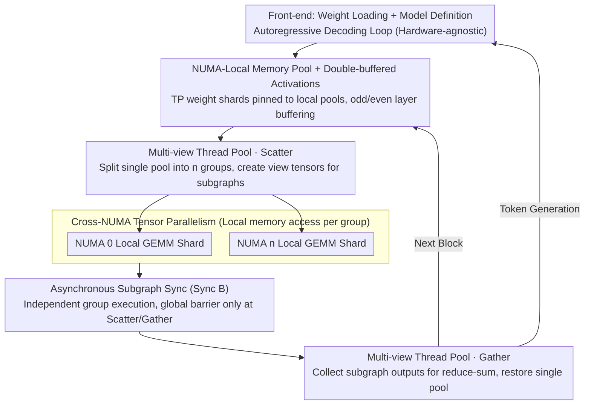

# ArcLight: A Lightweight LLM Inference Architecture for Many-Core CPUs

**Conference**: ACL 2026  
**arXiv**: [2603.07770](https://arxiv.org/abs/2603.07770)  
**Code**: https://github.com/OpenBMB/ArcLight  
**Area**: Model Compression / Inference Optimization / CPU Deployment  
**Keywords**: Many-Core CPU, NUMA-aware, Tensor Parallelism, llama.cpp, LLM Inference Framework

## TL;DR
ArcLight is a lightweight LLM inference framework written from scratch (approximately 10 C++ files), specifically designed for many-core CPUs with multiple NUMA nodes. By utilizing NUMA-local memory pools, multi-view thread pools, cross-NUMA tensor parallelism, and asynchronous subgraph synchronization, it breaks the "remote memory wall." On a 192-core ARM Kunpeng platform, it improves the decoding throughput of Qwen3-4B Q4_0 by up to 46% compared to llama.cpp.

## Background & Motivation

**Background**: Mainstream LLM inference frameworks follow two paths: GPU-based (vLLM / TensorRT / SGLang) and CPU-based (represented by llama.cpp). The CPU path is critical for edge deployments, web servers, and high-end network equipment, as it can directly reuse existing hardware.

**Limitations of Prior Work**: Web servers and network devices commonly use many-core CPUs (48-192 cores distributed across 2-4 NUMA nodes). Cross-NUMA memory access latency is approximately $4\times$ that of local access. Tests on a 192-core machine show local access at ~102 GB/s, while cross-node access drops to 22-26 GB/s. llama.cpp only exposes `--numa distribute` to evenly distribute threads but **does not explicitly bind tensors to NUMA nodes**. The OS allocates physical pages based on a first-touch strategy, leading to significant cross-node access. Consequently, performance scales from 6 to 48 cores but hits a "memory wall" when scaling to 192 cores.

**Key Challenge**: Traditional CPU frameworks are designed with "UMA + single thread pool + serial computation graph," failing to represent a "NUMA-aware" mode where multiple NUMA nodes execute different subgraphs in parallel using only local tensors. Modifying llama.cpp would require a "surgical" reconstruction, from low-level memory allocation to high-level model definitions.

**Goal**: Design a minimal, modular, and NUMA-aware CPU inference framework from scratch to solve the cross-node memory access bottleneck.

**Key Insight**: In Transformers, $W_q, W_k, W_v, W_{gate}, W_{up}$ are row-partitionable, while $W_o, W_{down}$ are column-partitionable, corresponding exactly to Megatron-style Tensor Parallelism (TP). By pinning each shard to the local memory of a specific NUMA node, subgraphs can execute entirely within a node, reducing cross-node communication to simple Gather/Scatter steps.

**Core Idea**: Port Megatron-LM tensor parallelism, common in multi-GPU setups, down to "CPU multi-NUMA nodes." Combined with NUMA-local memory pools, multi-view thread groups, and asynchronous subgraph synchronization, cross-node memory access is completely eliminated from the GEMM main loop.

## Method

### Overall Architecture
The framework consists of two layers. **Front-end**: Handles weight loading, model definition, and the autoregressive decoding loop (hardware-agnostic). **Back-end Inference Engine**: Contains 5 core modules—Tensor Library (header + data separation), Memory Manager (independent memory pools per NUMA node + double-buffered activations), Thread Manager (multi-view thread groups + global/local barriers), Forward Graph Builder (append-only static graph), and Graph Computation Scheduler (operator scheduling). The engine is ~10 C++ files and reuses kernels like GEMM and FlashAttention from llama.cpp. At runtime, for each transformer block: weights are pinned to NUMA nodes; a Scatter operator splits the thread pool into $n$ groups and creates view tensors; each group independently executes TP-sharded GEMMs within its node; groups merge and sum via Gather at the exit.

### Key Designs

**1. NUMA-local memory pool + Double-buffered activation: Pinning physical pages to local memory and halving peak activation memory.**

llama.cpp uses a unified UMA buffer, letting the OS determine page placement via first-touch, which often results in cross-node weight reads—where bandwidth is only ~1/4 of local bandwidth. ArcLight allocates independent memory pools for each node when NUMA is enabled. TP-sharded tensors are explicitly bound to the local pool of the corresponding node, making placement a framework decision rather than an OS guess. Additionally, activation buffers use double-buffering (alternating between even/odd layers), halving persistent memory usage, which is ideal for memory-constrained edge devices.

**2. Multi-view thread pool + Global/Local barriers: Enabling worker groups to either collaborate on a single GEMM or split into $n$ groups for subgraphs.**

Standard thread pools cannot express parallel subgraphs after TP partitioning. ArcLight introduces "thread groups" as a logical abstraction. Thread groups can be reorganized via an API during initialization or graph execution, supported by legacy intra-group barriers and global barriers across all groups. During TP execution, the Scatter operator splits the pool into $n$ groups and builds view tensors. The Gather operator merges outputs and restores the pool to a single group. Using a single physical pool avoids the overhead of switching between multiple pools while providing a unified foundation for dynamic parallelism.

**3. Cross-NUMA Tensor Parallelism + Asynchronous Subgraph Synchronization: Partitioning Transformer GEMM sequences into TP shards equal to node counts.**

Leveraging Megatron-style TP, weights like $W_q, W_k, W_v, W_{gate}, W_{up}$ are row-partitioned and $W_o, W_{down}$ are column-partitioned. For an MLP, $Y=\sigma(AX),\,Z=BY$ is split into $[Y_1,Y_2]=[\sigma(A_1 X),\sigma(A_2 X)]$ and $[Z_1,Z_2]=[B_1 Y_1,B_2 Y_2]$, with $Z=Z_1+Z_2$ reduced only at the Gather step. All TP tensors are pinned to respective NUMA nodes, ensuring GEMMs within Attention and MLP blocks only access local memory. Synchronization uses "Sync B" instead of the textbook "Sync A." While Sync A adds a barrier after every GEMM (stalling groups), Sync B allows each NUMA group to proceed independently, with global barriers only at Scatter entry and Gather exit, gaining ~5 tokens/s.

## Key Experimental Results

### Main Results (Qwen3-4B Q4_0, prompt=15 / decode=256, HUAWEI Kunpeng-920 ARM, 4 NUMA × 48 cores + 6×DDR4/node)

**Single NUMA Node (Intra-node scalability)**

| Threads | llama.cpp (tok/s) | ArcLight (tok/s) | Gain |
|---|---|---|---|
| 6 | ~12 | ~13 | +8% |
| 24 | ~28 | ~31 | +11% |
| 48 | ~32 | ~36 | +12% |

ArcLight is slightly faster due to enforced local allocation.

**Multiple NUMA Nodes (Core Scenario)**

| Configuration | llama.cpp | ArcLight (Sync A) | ArcLight (Sync B) | Relative to llama.cpp |
|---|---|---|---|---|
| 2 NUMA × 48c = 96 | ~38 tok/s | ~50 tok/s | ~55 tok/s | **+45%** |
| 4 NUMA × 48c = 192 | ~42 tok/s | ~57 tok/s | ~62 tok/s | **+46%** |

After partitioning the memory wall via TP, ArcLight continues to scale linearly while llama.cpp plateaus. Sync B adds an additional ~5 tok/s over Sync A.

### Cross-NUMA Memory Access Baseline (4 nodes, 48 ARM cores + 6×DDR4 per node)

| Core Location \ Memory Location | node 0 | node 1 | node 2 | node 3 |
|---|---|---|---|---|
| node 0 | **102** | 26 | 24 | 23 |
| node 1 | 26 | **103** | 23 | 22 |
| node 2 | 24 | 23 | **103** | 26 |
| node 3 | 23 | 22 | 26 | **101** |

Local access is ~4× faster than cross-node access (GB/s), confirming the "memory wall" as the bottleneck.

### Key Findings
- **Cross-NUMA TP is essential**: Single-node scalability hits the bandwidth limit at 48 cores. Scaling further requires TP to avoid the $4\times$ remote access penalty.
- **Sync B (Async subgraphs) is consistently superior**: A ~5 tok/s gain proves strict global synchronization wastes ~10% of thread time in multi-subgraph scenarios.
- **Ours has smaller gains in prefill than decode**: Prefill is compute-bound, whereas decode is memory-bound, aligning with the NUMA-local access optimization.
- **Lightweight code is an advantage**: ~10 C++ files vs the complex llama.cpp codebase lowers the barrier for researchers to add new models.

## Highlights & Insights
- **Mapping GPU TP to CPU NUMA is the primary insight**: While TP is usually for multi-GPU setups, this paper proves its value in single-machine multi-NUMA CPU environments.
- **Multi-view thread pool design**: Efficiently switches between "collaboration" and "grouping" without the overhead of multiple physical pools.
- **Sync B is a crucial engineering detail**: Textbook TP uses Sync A, but the high cost of thread synchronization on CPUs makes the "wait at the end" approach of Sync B necessary.
- **Decoupling framework from operator**: By reusing llama.cpp's kernels, ArcLight focuses on memory/thread/graph innovation rather than re-optimizing GEMM kernels.

## Limitations & Future Work
- Evaluation is limited to the ARM Kunpeng platform; x86 requires porting NEON (e.g., to AVX-512 VNNI).
- Scatter/Gather operators are preliminary; further optimization of operator-level parallelism is possible.
- Only Qwen3-4B was evaluated; scalability for larger models (70B+) remains unclear.
- Asynchronous execution may suffer from "straggler" nodes, though this was not discussed.

## Related Work & Insights
- **vs llama.cpp**: Inherits operators but rewrites memory, thread, and graph modules with cross-NUMA TP.
- **vs vLLM / SGLang / TensorRT**: GPU frameworks focus on KV cache fragmentation (PagedAttention), whereas ArcLight focuses on the NUMA memory wall.
- **vs Megatron-LM**: Inspiration for TP, but implemented without NCCL using local NUMA memory.
- **vs Quantization (OmniQuant / OneBit)**: These methods reduce memory volume, whereas ArcLight reduces memory latency; they are orthogonal and combinable.

## Rating
- Novelty: ⭐⭐⭐⭐ Porting TP to CPU NUMA is a clear工程 breakthrough; multi-view pools and Sync B are novel implementation details.
- Experimental Thoroughness: ⭐⭐⭐ Detailed tests on 192 cores, but narrow coverage in terms of models and hardware platforms.
- Writing Quality: ⭐⭐⭐⭐ High information density in architecture diagrams and clear communication of design logic.
- Value: ⭐⭐⭐⭐ Open-source, minimal code, and highly applicable to edge/web server deployment scenarios.

<!-- RELATED:START -->

## Related Papers

- [\[CVPR 2026\] Vision-Oriented Lightweight Neural Architecture Search with Budget-Adaptive Evaluation](../../CVPR2026/model_compression/vision-oriented_lightweight_neural_architecture_search_with_budget-adaptive_eval.md)
- [\[ACL 2026\] HeteroCache: A Dynamic Retrieval Approach to Heterogeneous KV Cache Compression for Long-Context LLM Inference](heterocache_a_dynamic_retrieval_approach_to_heterogeneous_kv_cache_compression_f.md)
- [\[ACL 2026\] WISCA: A Lightweight Model Transition Method to Improve LLM Training via Weight Scaling](wisca_a_lightweight_model_transition_method_to_improve_llm_training_via_weight_s.md)
- [\[ACL 2026\] Adaptive Layer Selection for Layer-Wise Token Pruning in LLM Inference](adaptive_layer_selection_for_layer-wise_token_pruning_in_llm_inference.md)
- [\[ACL 2026\] DASH-KV: Accelerating Long-Context LLM Inference via Asymmetric KV Cache Hashing](dash-kv_accelerating_long-context_llm_inference_via_asymmetric_kv_cache_hashing.md)

<!-- RELATED:END -->
