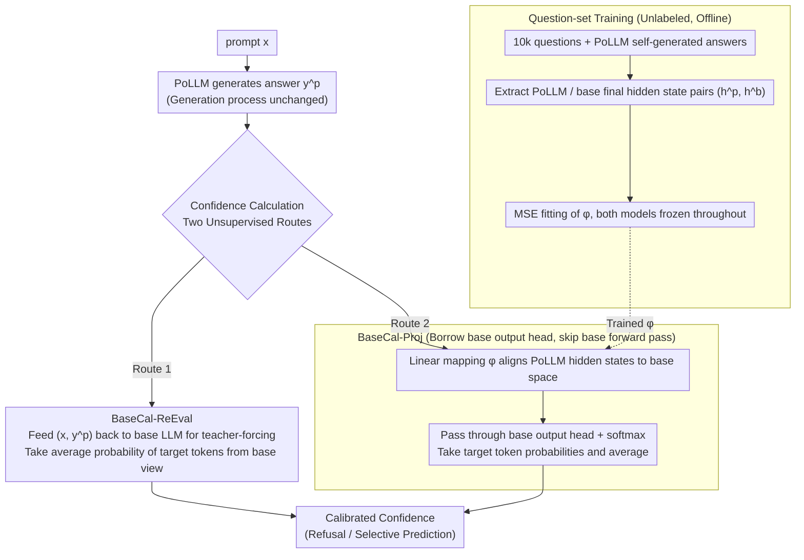

# BaseCal: Unsupervised Confidence Calibration via Base Model Signals

**Conference**: ACL 2026  
**arXiv**: [2601.03042](https://arxiv.org/abs/2601.03042)  
**Code**: https://github.com/Tan-Hexiang/BaseCal (Available)  
**Area**: Model Calibration / LLM Reliability  
**Keywords**: confidence calibration, post-trained LLM, base model, hidden state projection, unsupervised

## TL;DR
Observing that base LLMs remain well-calibrated on free-form QA while post-trained LLMs (PoLLMs) are severely overconfident, BaseCal proposes two unsupervised schemes—feeding PoLLM's answers into the base LLM to use token probabilities as confidence (BaseCal-ReEval), or using a linear projection layer to map PoLLM's final hidden states back to the base LLM space and passing them through the base output layer (BaseCal-Proj). This achieves an average 42.9% relative reduction in ECE compared to the best unsupervised baseline across 5 datasets $\times$ 3 model families.

## Background & Motivation
**Background**: Reliable confidence is a core component for mitigating LLM hallucinations—with calibrated confidence, models can refuse to answer or warn users. Calibration methods fall into two categories: supervised (temperature scaling, calibration-tuning) which are hard to scale due to reliance on human labels; and unsupervised (aggregating token probabilities, P(true), verbalized confidence, semantic entropy) which do not requires labels but rely on signals from the PoLLM itself.

**Limitations of Prior Work**: Post-training (SFT / RLHF / DPO / RLVR) systematically pushes models toward overconfidence—giving a confidence of 0.9 even for incorrect answers. The vanilla probability ECE of Llama3.1-8B-Instruct on SQuAD is as high as 0.5255. Three checkpoints of Olmo2 (SFT/DPO/Instruct) show that post-training consistently destroys calibration. All unsupervised methods taking signals from the PoLLM itself are contaminated by this "overconfidence paint."

**Key Challenge**: For unsupervised calibration, one must find an **external reference signal that does not depend on the PoLLM's own probabilities**, while avoiding new training labels or model modifications to maintain the unsupervised and plug-and-play engineering value.

**Goal**: (i) Find a naturally occurring reference signal that originates from the same source as the PoLLM without requiring labels; (ii) design a low-cost method to map this signal onto the PoLLM's answers without damaging generation quality.

**Key Insight**: The authors observe that since base LLMs are generally well-trained (with pretraining loss aligned with the true next-token distribution), they should be closer to the true probability distribution than fine-tuned PoLLMs. Calibration plots on TriviaQA, NQ, and Qwen / Llama / Olmo families verify this: base LLM reliability curves are close to the diagonal, while PoLLMs are generally below it (overconfident).

**Core Idea**: Use the base LLM (from which the PoLLM originated) as an "honest reference," mapping the PoLLM's generated answers' scores to the base LLM's probability space to restore calibration; use a linear projection to replace the base LLM forward pass to amortize inference costs.

## Method

### Overall Architecture
Let $\mathcal{M}_p$ be the PoLLM and $\mathcal{M}_b$ be the base LLM of the same family. $\mathcal{M}_p$ generates an answer $y^p=(y_1^p,\dots,y_T^p)$ for a prompt $x$ as usual. BaseCal does not change the generation process of $\mathcal{M}_p$, but only takes over the "confidence calculation" stage. Two routes: (1) **BaseCal-ReEval**: Feed $(x, y^p)$ into $\mathcal{M}_b$ for forced decoding, using the average token probability assigned by the base LLM to $y_t^p$ as confidence; (2) **BaseCal-Proj**: Train a linear mapping $\phi_\theta:\mathbb{R}^d\to\mathbb{R}^d$ to project the final hidden states of $\mathcal{M}_p$ into the final space of $\mathcal{M}_b$, then pass them through the base output layer $W_b^o$ to obtain an approximate base probability distribution, thereby avoiding the full base forward pass. Both schemes are plug-and-play, unsupervised (no ground-truth labels required), and do not modify model parameters.

### Key Designs

**1. BaseCal-ReEval: Re-evaluating PoLLM's answers on the base LLM**

All methods that take signals from the PoLLM's own probabilities are contaminated by "overconfidence paint." The most direct solution is to use a different, uncontaminated scorer. BaseCal-ReEval does not touch PoLLM generation; it only feeds the generated answer $y^p$ back into the base LLM for teacher-forcing. The confidence is the average probability of each target token from the base perspective: $c_b(x,y^p)=\frac{1}{T}\sum_{t=1}^T P_{\mathcal{M}_b}(y_t^p\mid x,y_{<t}^p)$. Since the base probability distribution is closer to the true token distribution, its overall probability for a wrong answer is naturally lower, and higher for a correct answer, resulting in an "inherently calibrated" confidence. The cost is an additional full forward pass of the base model during inference—which the next design aims to eliminate.

**2. BaseCal-Proj: "Borrowing" the base output head via a $d\times d$ linear mapping**

ReEval is simple and effective but doubles latency. The observation for BaseCal-Proj is that hidden states contain richer information than probabilities, and calibration information is orthogonally separable from the output layer. Thus, it is not necessary to run the full base model; one only needs to "move" the PoLLM's final hidden states into the base representation space. Specifically, for each $(x, y^p)$ in the training set, final hidden states $(h^p_{t-1}, h^b_{t-1})$ are extracted from $\mathcal{M}_p$ and $\mathcal{M}_b$ at each position. A linear mapping $\phi_\theta(h^p)=Wh^p+b$ is trained via MSE to fit $h^b$. During inference, only $\text{softmax}(W_b^o\,\phi_\theta(h^p_{t-1}))[y_t^p]$ is computed to get target token probabilities, effectively borrowing the base head while skipping all its transformer blocks. TSNE visualization shows that projected hidden states highly overlap with the base ones, indicating that this translation aligns the PoLLM states to the base space.

**3. Training using only "Question Sets": Supervision from base hidden states without answer labels**

If projection training required ground-truth answers or correctness labels, it would revert to supervised calibration and lose its plug-and-play value. BaseCal-Proj reformulates calibration as "representation space alignment"—the training set consists of 10k **questions** sampled from TriviaQA / NQ / SQuAD / WebQ with PoLLM-generated answers. The supervision signals are the base LLM's hidden states under the same input. Early stopping is triggered by the MSE on a 2k-question validation set, requiring no correctness labels throughout. This shift in formulation brings a key benefit: it aligns representations rather than accuracy distributions of specific datasets, resulting in almost no performance drop during OOD evaluation across datasets (see RQ2), whereas methods like temperature scaling that fit correctness overfit heavily when switching datasets.

### Loss & Training
By default, $\phi_\theta$ is a single-layer linear mapping. The loss is $\mathcal{L}_{\text{MSE}}=\frac{1}{T}\sum_t \|\phi_\theta(h^p_{t-1})-h^b_{t-1}\|_2^2$. MAE / Cosine / 3-layer MLP were also explored; MSE and MAE are similar and stable, while Cosine failed on TriviaQA (ECE 0.5+), suggesting that angular alignment alone is insufficient to restore calibration. $\mathcal{M}_p$ and $\mathcal{M}_b$ are frozen during training, with only $W$ and $b$ being updated.

## Key Experimental Results

### Main Results
ECE↓ for five datasets $\times$ three PoLLMs (selected):

| Method | Unsup. | TriviaQA (Llama) | NQ (Llama) | SQuAD (Llama) | TriviaQA (Qwen) | MMLU (Qwen) |
|--------|--------|------------------|------------|----------------|------------------|-------------|
| Temp. Scaling (supervised) | ✗ | 0.0226 | 0.0460 | 0.0911 | 0.0895 | 0.2261 |
| Vanilla (avg token prob) | ✓ | 0.1725 | 0.4532 | 0.5255 | 0.3406 | 0.2569 |
| P(true) | ✓ | 0.2476 | 0.4439 | 0.5532 | 0.2113 | 0.3204 |
| Verbalization | ✓ | 0.1769 | 0.2689 | 0.3603 | 0.2889 | 0.1972 |
| Semantic Entropy | ✓ | 0.2443 | 0.4927 | 0.4645 | 0.3583 | 0.2858 |
| DACA (multi-choice only) | ✓ | – | – | – | – | 0.0703 |
| **BaseCal-Proj** | ✓ | **0.0387** | 0.2488 | 0.3134 | 0.1393 | 0.0889 |
| **BaseCal-ReEval** | ✓ | **0.0309** | **0.2462** | **0.2959** | **0.1120** | **0.0393** |

BaseCal achieved the best results in 29 out of 30 (dataset $\times$ model $\times$ metric) settings. BaseCal-ReEval reduced ECE by 42.9% on average compared to the strongest unsupervised baseline, while BaseCal-Proj reduced it by 35.3% with almost no extra inference overhead. On TriviaQA / MMLU, BaseCal even matched supervised Temperature Scaling.

### Ablation Study

| Dimension | Configuration | TriviaQA ECE | Remarks |
|------|------|--------------|------|
| Projection Arch (Llama) | 1-layer Linear | **0.0387** | Default |
| Projection Arch (Llama) | 3-layer MLP+ReLU | 0.1526 | More complex performs worse |
| Loss Function (Llama) | MSE | **0.0387** | Default |
| Loss Function (Llama) | MAE | 0.0447 | Similar to MSE |
| Loss Function (Llama) | Cosine | 0.6125 | Angular alignment fails |
| Model Scale (Qwen, TriviaQA) | 7B vanilla→Proj→ReEval | 0.3406 → 0.1393 → 0.1120 | Sig. reduction across scales |
| Model Scale (Qwen, TriviaQA) | 14B | 0.2687 → 0.0778 → 0.0663 | |
| Model Scale (Qwen, TriviaQA) | 32B | 0.2662 → 0.0854 → 0.0542 | |
| Model Scale (Qwen, TriviaQA) | 72B | 0.2089 → 0.0502 → 0.0440 | Better base, greater gain |
| Post-train Stage (Olmo2, TriviaQA) | SFT / DPO / Instruct | 0.0582 / 0.0269 / 0.0314 | All three stages can be saved |

### Key Findings
- **Base LLMs remain calibrated on free-form QA**: Figure 2 shows that reliability bars for Qwen / Llama / Olmo base models stay close to the diagonal, while PoLLMs are consistently overconfident—this is the empirical foundation of the work.
- **Simple linear projection is sufficient**: 3-layer MLPs provide almost no benefit or perform worse, verifying that "calibration information is not destroyed by post-training, but merely undergoes a simple representation space shift."
- **Strong cross-dataset generalization**: For BaseCal-Proj, $\Delta\text{ECE}\approx +0.0005$ when swapping training and testing sets between SQuAD/NQ/TriviaQA/WebQ (almost no drop), while for Temperature Scaling $\Delta\text{ECE}\approx -0.0886$ (severe overfitting to accuracy distribution).
- **Larger models benefit more**: On 72B, BaseCal-Proj slashed ECE from 0.21 to 0.05; likely because larger base LLMs are better calibrated themselves, providing a stronger alignment target.
- **Downstream benefits**: Under selective classification (threshold 0.5–0.95), BaseCal-Proj achieves higher accuracy than vanilla at all cutoffs, indicating its high-confidence samples are indeed more reliable.
- **Failure modes**: Verbalization occasionally performs well on Olmo2-7B-NQ but collapses to 0.4718 on Qwen2.5-7B, showing that reliance on instruction-following for verbal reporting is unstable; BaseCal ranks top-2 in all 30 settings.

## Highlights & Insights
- **"Finding an honest reference from the same source" is a new paradigm**: Previous unsupervised calibration attempted to squeeze everything from the PoLLM itself; this work asks "who is the PoLLM's honest sibling" and uses the base LLM as an external reference. This idea can be extended to reward modeling, hallucination detection, and other trust-related problems.
- **Linear alignment of hidden states implies post-training does not destroy representations**: The fact that a single-layer linear mapping restores calibration and remains stable across datasets suggests post-training creates a relatively gentle geometric transformation of internal representations. This aligns with RLHF / DPO often using KL constraints and provides evidence for future "calibration-preserving head" designs.
- **BaseCal-Proj reduces inference cost to near zero**: It only adds a $d\times d$ matrix multiplication + one base output layer softmax, making it much faster than methods like semantic entropy or verbalization that require multiple samples or forward passes. It is ready for production.
- **Consistently effective across post-training strategies**: SFT, DPO, and RLVR can all be saved by the same technique, suggesting overconfidence is a general side effect of post-training rather than an RL-specific bug—a significant warning for future alignment method design.

## Limitations & Future Work
- Requires access to base LLM final hidden states and output heads (not applicable to closed-source APIs like OpenAI / Anthropic); more suitable for open-source or proprietary in-house models.
- Evaluation focuses on factual short-answer QA and MMLU; whether base models remain calibrated in long-form generation, complex multi-step reasoning, or code, and whether confidence can still be averaged, requires further verification.
- Explains "what" (base is more calibrated) but not "why"—whether it's the pretraining cross-entropy objective or if RLHF introduces collapse-inducing bias remains an open question.
- BaseCal-Proj training requires 10k questions; the data scale needs re-verification for small-data domains (e.g., medical or legal).
- Extensions: Using the base model as an "honest prior" during the RLHF training phase as a calibration regularizer (rather than just post-hoc projection) or extending to base $\to$ PoLLM alignment in multimodal settings.

## Related Work & Insights
- **vs DACA (Luo et al., 2025)**: DACA performs specific temperature rescaling at the probability layer and only works when base and PoLLM top-1 tokens match, limiting it to multiple-choice; BaseCal performs alignment at the hidden state layer, natively supporting free-form QA and outperforming DACA on MMLU (0.0393 vs 0.0703 on Qwen).
- **vs Temperature Scaling**: TS is a supervised post-hoc fit relying on correctness labels and severely overfits the training accuracy distribution; BaseCal is unsupervised and stable across sets.
- **vs Semantic Entropy / P(true) / Verbalization**: These take signals from the PoLLM itself and carry overconfidence bias; BaseCal introduces an honest external reference, structurally avoiding this contamination.
- **vs Calibration-aware Fine-tuning (Xiao 2025, Wang 2025)**: These modify PoLLM parameters to bake in calibration; BaseCal is entirely plug-and-play without changing a single PoLLM weight.
- **vs Hidden State Probing for Hallucination (Orgad 2025)**: Also uses final hidden states, but Orgad et al. use supervised probes for hallucination detection, while BaseCal uses unsupervised projection to restore probability calibration, targeting a more direct goal.

## Rating
- Novelty: ⭐⭐⭐⭐ The "base as PoLLM's honest sibling" idea + hidden state linear projection is a simple yet powerful combination.
- Experimental Thoroughness: ⭐⭐⭐⭐⭐ Comprehensive ablation across 5 datasets $\times$ 3 model families $\times$ 4 scales $\times$ 3 post-train stages + projection structure/loss/generalization.
- Writing Quality: ⭐⭐⭐⭐ Motivation flows smoothly from observation to method derivation; TSNE and calibration graphs are very intuitive.
- Value: ⭐⭐⭐⭐ Provides a non-intrusive, low-cost calibration solution for existing open-source PoLLMs with high engineering value.

<!-- RELATED:START -->

## Related Papers

- [\[ACL 2026\] CadLLM: Improving the Throughput of Diffusion-based LLMs via Training-Free Confidence-Aware Calibration](improving_the_throughput_of_diffusion-based_large_language_models_via_a_training.md)
- [\[NeurIPS 2025\] PPG-Distill: Efficient Photoplethysmography Signals Analysis via Foundation Model Distillation](../../NeurIPS2025/model_compression/ppg-distill_efficient_photoplethysmography_signals_analysis_via_foundation_model.md)
- [\[ICML 2026\] Multi-Adapter Representation Interventions via Energy Calibration](../../ICML2026/model_compression/multi-adapter_representation_interventions_via_energy_calibration.md)
- [\[ACL 2026\] VecCISC: Improving Confidence-Informed Self-Consistency with Reasoning Trace Clustering and Candidate Answer Selection](veccisc_improving_confidence-informed_self-consistency_with_reasoning_trace_clus.md)
- [\[ICML 2025\] ConfPO: Exploiting Policy Model Confidence for Critical Token Selection in Preference Optimization](../../ICML2025/model_compression/confpo_exploiting_policy_model_confidence_for_critical_token_selection_in_prefer.md)

<!-- RELATED:END -->
