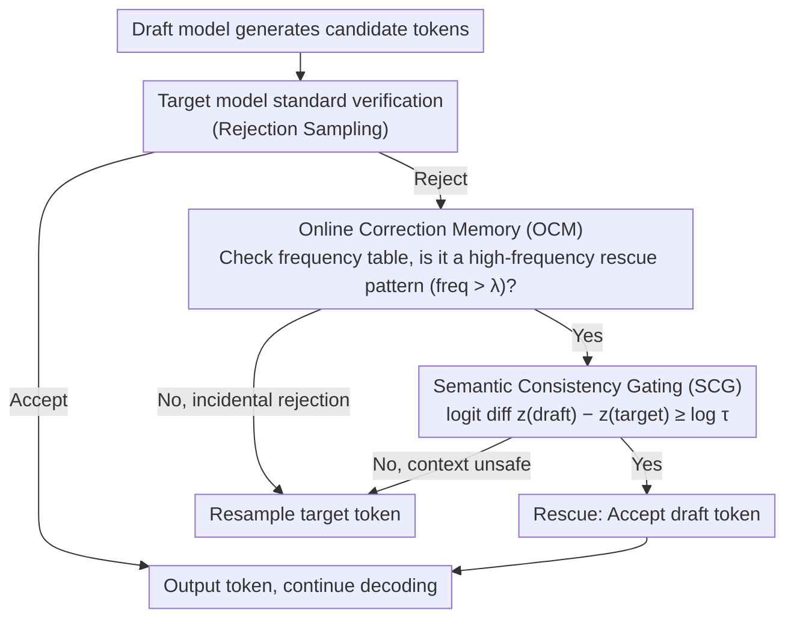

# Calibrated Speculative Decoding: Frequency-Guided Candidate Selection for Efficient Inference

**Conference**: ACL 2026  
**arXiv**: [2604.13634](https://arxiv.org/abs/2604.13634)  
**Code**: None  
**Area**: Model Compression  
**Keywords**: Speculative Decoding, False Rejections, Online Correction Memory, Semantic Consistency Gating, Training-free

## TL;DR
CSD proposes a training-free enhancement framework for speculative decoding. It utilizes Online Correction Memory (OCM) to record high-frequency rejection patterns for rescuing candidates, and employs Semantic Consistency Gating (SCG) to verify candidate reliability based on probability ratios. This approach improves speculative decoding throughput by up to 2.33× while simultaneously increasing accuracy on HumanEval and MATH500.

## Background & Motivation

**Background**: Speculative Decoding is a mainstream paradigm for LLM inference acceleration, where a lightweight draft model generates candidate tokens and a target model performs parallel verification. Standard verification uses rejection sampling to maintain the output distribution.

**Limitations of Prior Work**: Modern small models (e.g., Llama-3.2-1B) possess strong reasoning capabilities. However, standard verification relies on strict token-level exact matching, leading to numerous "False Rejections"—instances where the draft model generates tokens that are semantically correct but lexically different (e.g., `x` vs `*`), causing subsequent valid tokens to be discarded.

**Key Challenge**: As draft models become stronger and more capable, their lexical choices diverge more from the target model's preferences. This leads to more false rejections, making the exact-match criterion a bottleneck for efficiency gains.

**Goal**: To recover valid tokens from false rejections without training additional models, thereby breaking the upper bound of acceptance rates imposed by exact matching.

**Key Insight**: Statistical analysis of rejection patterns reveals two key observations: (1) The top 20% of high-frequency rejection patterns contribute to 69% of total rejections (long-tail distribution); (2) Probability ratios between the same token pair vary significantly across different contexts (strong context dependency).

**Core Idea**: "Frequency-Guided Candidate Selection + Probability-Guarded Acceptance"—using historical statistics to nominate rescue candidates and utilizing the target model's real-time confidence as a gatekeeper.

## Method

### Overall Architecture
CSD is a plug-and-play enhancement for standard speculative decoding. When a draft token is rejected, a rescue process is initiated: first, the Online Correction Memory (OCM) is queried to determine if the rejection pattern is high-frequency; second, the Semantic Consistency Gating (SCG) verifies if the draft token has sufficient target model confidence in the current context. Draft tokens are accepted instead of resampled only if both conditions are met.

### Key Designs

**1. Online Correction Memory (OCM): Maintaining a frequency table to identify frequently "mis-rejected" tokens for rescue.**

False rejections are not uniformly distributed. Statistics indicate that the top 20% of high-frequency rejection patterns account for 69% of total rejections, suggesting that capturing a few systematic differences can cover most recoverable cases. OCM maintains a memory table $\mathcal{T}$ mapping $(draft\_token, target\_token)$ to frequency. It operates in two phases: offline calibration using unlabeled corpora to initialize frequencies, followed by dynamic accumulation during inference. Once a pattern's frequency exceeds a threshold $\lambda$, it is marked as "rescuable." This calibration collects statistics without updating parameters, representing context-independent priors on benign preference differences.

**2. Semantic Consistency Gating (SCG): Logit-space comparison to ensure situational safety of substitutions.**

Frequency priors are context-independent, but a substitution like "a $\rightarrow$ the" may be benign in some contexts and semantic-altering in others. To prevent erroneous acceptance, SCG introduces target model real-time confidence for final adjudication. It compares the raw logit difference between the draft token and the target token: $z_i(\tilde{x}_i) - z_i(t^*) \geq \log \tau$ (with a default loose threshold $\tau=0.01$). This is equivalent to a probability ratio test but avoids softmax computation and remains invariant to sampling temperature. OCM determines "whether to consider a rescue," while SCG determines "safety in the current moment."

**3. Dual-phase Synergy: Frequency-based nomination and confidence-based verification.**

These two layers are not optional; they serve as mutual security. Ablations show that using OCM alone (ignoring context) leads to incorrect token acceptance, while using SCG alone (with loose gating) accepts non-systematic matches, both reducing accuracy. Combining "Frequency Filtering + Confidence Verification" increases acceptance rates while maintaining or even improving accuracy. This "nomination-verification" dual insurance allows OCM to narrow the scope and SCG to authorize tokens individually, avoiding risks associated with single-strategy relaxation.

### Loss & Training
CSD is entirely training-free. The calibration phase uses only 2000-8000 samples for statistical collection (approx. 1.5 hours per 1,000 samples). Dynamic updates of the OCM during inference incur zero additional computational overhead.

## Key Experimental Results

### Main Results

| Dataset | Metric | CSD | SpecDecode | Vanilla | Gain |
|--------|------|-----|------------|---------|------|
| MATH500 (Llama-3) | Speedup | 2.33× | 1.89× | 1.00× | +23.3% |
| HumanEval (Llama-3) | Speedup | 2.33× | 1.90× | 1.00× | +22.6% |
| MATH500 (Llama-3) | Accuracy | 48.0% | 45.4% | 46.0% | +2.0 pts |
| HumanEval (Llama-3) | Accuracy | 79.3% | 76.8% | 76.8% | +2.5 pts |
| Average (Llama-3) | Speedup | 2.02× | 1.75× | 1.00× | +15.4% |
| Average (Qwen-2.5) | Speedup | 1.86× | 1.66× | 1.00× | +12.0% |

### Ablation Study

| Configuration | MATH500 Acc | MATH500 AR | HumanEval Acc | Description |
|------|------------|------------|---------------|------|
| SpecDecode (baseline) | 45.4% | 63.6% | 76.8% | Standard Speculative Decoding |
| SD + OCM only | 37.8% | 83.1% | 70.7% | Increased acceptance but significantly lower accuracy |
| SD + SCG only | 43.6% | 88.7% | 70.7% | Accuracy degradation |
| CSD (OCM + SCG) | 48.0% | 79.6% | 79.3% | Synergy improves both speed and accuracy |

### Key Findings
- Recovered tokens fall into four categories: Mathematical formats (~45%), punctuation/spaces (~20%), lexical synonyms (~20%), and reasoning conjunctions (~15%). All are semantically neutral surface differences.
- The accuracy improvement on reasoning tasks suggests the draft model may help the target model escape local optima of greedy decoding.
- While advanced acceleration schemes (e.g., Lookahead, SWIFT) might yield negative acceleration on 70B models due to FLOPs bottlenecks, CSD's minimal overhead converts directly into throughput gains.

## Highlights & Insights
- **Dual-layer Architecture**: The design is elegant—OCM handles "whom to rescue" (frequency prior) and SCG handles "safety of the rescue" (real-time verification). The ablation results demonstrating their mutual necessity are compelling.
- **Accuracy Improvement**: The finding that speculative decoding can serve as a regularization tool rather than just an acceleration tool is insightful. Draft model paths may circumvent greedy traps of the target model.
- **Training-free and Orthogonal**: The framework requires no training and is orthogonal to standard speculative decoding, allowing it to be layered onto existing solutions.

## Limitations & Future Work
- Calibration requires domain-relevant unlabeled data; cross-domain generalization necessitates separate calibration.
- The memory table grows during inference; memory management strategies for long-term deployment are not discussed.
- Evaluated only under greedy decoding; performance under high-temperature sampling is unknown.
- For creative generation tasks requiring lexical diversity, recovering "similar tokens" might reduce output variety.

## Related Work & Insights
- **vs Standard SpecDecode**: Standard approaches ensure lossless output via strict matching; CSD achieves higher throughput and unexpected accuracy gains via relaxed matching.
- **vs Fly**: Fly uses a delay window for consistency checks, which can fail at sequence boundaries. CSD's token-wise independent verification is more flexible.
- **vs Lossy SD**: Static threshold relaxation lacks granularity (global $\tau=0.6$); CSD provides refined relaxation control through frequency filtering.

## Rating
- Novelty: ⭐⭐⭐⭐ Formalization of the false rejection problem and the dual-layer recovery mechanism are novel.
- Experimental Thoroughness: ⭐⭐⭐⭐⭐ Comprehensive evaluation across two model families, four benchmarks, detailed ablations, sensitivity analysis, and token type analysis.
- Writing Quality: ⭐⭐⭐⭐ Clear motivation, with the "Frequency-Guided Selection, Probability-Guarded Acceptance" theme consistently reinforced.

<!-- RELATED:START -->

## Related Papers

- [\[ACL 2026\] SSSD: Simply-Scalable Speculative Decoding](sssd_simply-scalable_speculative_decoding.md)
- [\[AAAI 2026\] Steering Pretrained Drafters during Speculative Decoding](../../AAAI2026/model_compression/steering_pretrained_drafters_during_speculative_decoding.md)
- [\[NeurIPS 2025\] CAS-Spec: Cascade Adaptive Self-Speculative Decoding for On-the-Fly Lossless Inference Acceleration of LLMs](../../NeurIPS2025/model_compression/casspec_cascade_adaptive_selfspeculative_decoding_for_onthef.md)
- [\[ICML 2025\] VocabTrim: Vocabulary Pruning for Efficient Speculative Decoding in LLMs](../../ICML2025/model_compression/vocabtrim_vocabulary_pruning_for_efficient_speculative_decoding_in_llms.md)
- [\[ICML 2026\] SPEED-Bench: A Unified and Diverse Benchmark for Speculative Decoding](../../ICML2026/model_compression/speed-bench_a_unified_and_diverse_benchmark_for_speculative_decoding.md)

<!-- RELATED:END -->
