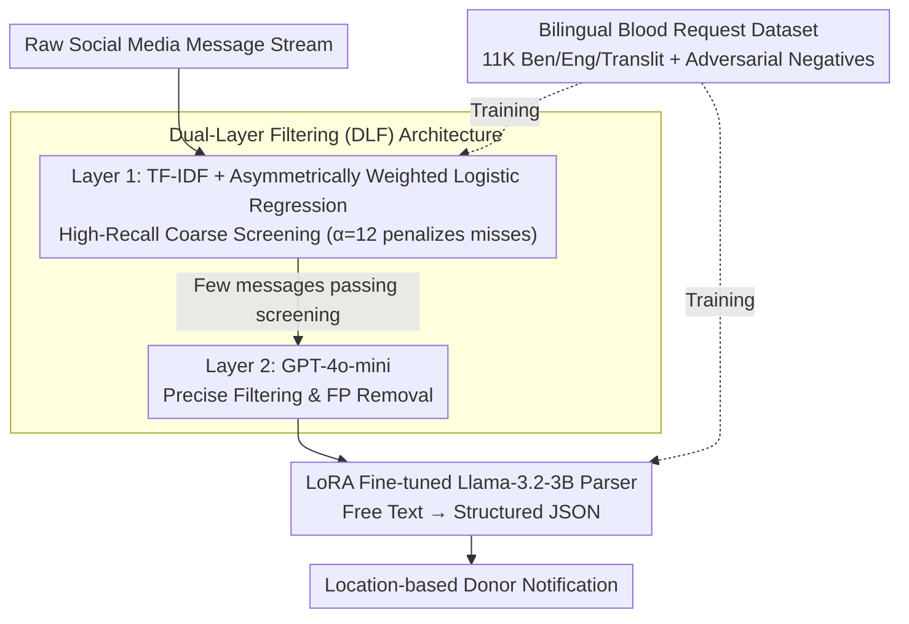

# CBRS: Cognitive Blood Request System with Bilingual Dataset and Dual-Layer Filtering

**Conference**: ACL 2026 Findings  
**arXiv**: [2604.16665](https://arxiv.org/abs/2604.16665)  
**Code**: [GitHub](https://github.com/aaniksahaa/CBRS)  
**Area**: Model Compression  
**Keywords**: Blood Donation Request, Bilingual Dataset, Dual-Layer Filtering, Low-Resource Languages, Information Extraction

## TL;DR
CBRS proposes a multi-platform framework that efficiently detects and parses blood donation requests from social media streams via a dual-layer filtering architecture (lightweight classifier + LLM). It constructs the first dataset containing 11K Bengali-English-Transliterated Bengali blood donation requests, where a LoRA-fine-tuned Llama-3.2-3B achieves a 92% zero-shot accuracy in parsing tasks.

## Background & Motivation

**Background**: Urgent blood donation requests on social media are frequently submersed in a sea of daily messages. Traditional app-based systems rely on manual input and are difficult to reach users in low-resource environments. Existing disaster information extraction research primarily focuses on English and high-resource languages.

**Limitations of Prior Work**: (1) The message volume is massive, but the proportion of blood requests is extremely low, requiring efficient filtering; (2) Pure LLM filtering is not scalable due to high inference costs, while pure lightweight models suffer from high miss rates; (3) Detection alone is insufficient; structured information (blood type, hospital, contact details, etc.) must be extracted from free-form text; (4) There is a lack of relevant datasets for the Bengali language.

**Key Challenge**: In blood request detection, the cost of a false negative is significantly higher than a false positive, yet pursuing high recall increases the burden on downstream processing.

**Goal**: To build a cost-effective, multilingual, multi-platform system for blood donation request detection and parsing.

**Key Insight**: Decouple the objectives of "high-recall filtering" and "high-precision verification + parsing" using a dual-layer architecture.

**Core Idea**: The first layer uses an asymmetrically weighted lightweight classifier to ensure high recall, while the second layer utilizes an LLM to simultaneously perform precise filtering and structured parsing, sharing a single API call.

## Method

### Overall Architecture
CBRS decouples "high-recall detection" and "precise parsing" into a serial pipeline. Raw social media messages first enter **Layer 1** (TF-IDF features + asymmetrically weighted logistic regression) for high-recall coarse screening, prioritizing inclusive detection over exclusion. The small volume of messages passing this stage proceeds to **Layer 2** (GPT-4o-mini) for precise filtering and removal of false positives. Subsequently, a LoRA-fine-tuned Llama-3.2-3B **Parser** converts the free text into a JSON format containing fields such as blood type, hospital, and contact information. Training for both the classifiers and the parser relies on the **11K Bilingual Blood Request Dataset** (including adversarial negative samples) constructed by the authors. Finally, the structured JSON is utilized by a geofencing-based donor notification system to alert nearby donors.

### Key Designs

**1. Dual-Layer Filtering Architecture (DLF): Broad Entry to Preserve Recall, Strict Exit for Precise Classification and Parsing**

Directly using LLMs to filter all social media messages is prohibitively expensive, yet pure lightweight models exhibit severe miss rates—and in blood requests, the cost of a false negative is much higher than a false positive. DLF decouples "high-recall filtering" and "high-precision verification": Layer 1 uses subword tokenization + TF-IDF features + asymmetrically weighted binary cross-entropy ($\alpha=12$ to heavily penalize misses) for coarse screening, intentionally maximizing recall. Layer 2 employs GPT-4o-mini to precisely classify the filtered messages and remove false positives. Crucially, "precise classification" and "structured parsing" in the second layer share the same API call, meaning the strict exit layer introduces no extra cost while the overall API volume is drastically reduced by Layer 1.

**2. 11K Bilingual Blood Request Dataset: Filling the Low-Resource Gap for Bengali and Hardening Classifiers with Adversarial Samples**

Low-resource languages like Bengali previously lacked specialized blood request corpora, particularly regarding dialectal variations and slang on social media. The authors collected 11K positive samples from 15 public Telegram and Facebook groups, covering Bengali, English, and transliterated Bengali. Negative samples were sourced from datasets like BengaliNMT and BengaliTLit. To prevent the classifier from relying on simple keyword matching (e.g., "blood" or "urgent"), DeepSeek-V3 was used to generate adversarial negative samples containing these keywords but without actual requests. These hard negatives forced the classifier to learn true semantics, significantly enhancing robustness.

**3. LoRA Fine-tuned Llama-3.2-3B Parser: Transforming Free Text to Structured JSON with a Small Model Outperforming Large Model Few-Shot**

Simply detecting a blood request is insufficient; downstream notification systems require structured fields. The authors fine-tuned Llama-3.2-3B using LoRA ($r=32, \alpha=16$, training only 0.81% of parameters) on 7.9K text-JSON pairs to output fields such as `blood_group`, `bags_needed`, `hospital_name`, and `contacts`. Consequently, this task-specific 3B model outperformed GPT-4o-mini’s few-shot performance in zero-shot tasks, with inference costs approximately 35 times lower. This confirms that fine-tuning small models for narrow tasks is superior to using general-purpose large models, which is particularly meaningful for cost-sensitive non-profit deployments.

### Loss & Training
The first layer utilizes asymmetrically weighted binary cross-entropy: $\mathcal{L} = -\alpha y \log P(y=1|\mathbf{z}) - (1-y)\log P(y=0|\mathbf{z})$, where $\alpha=12$. LoRA fine-tuning employs standard cross-entropy, 4-bit quantization, and a learning rate of $2 \times 10^{-4}$.

## Key Experimental Results

### Main Results

| Method | Accuracy | Precision | Recall | F1 |
|------|--------|--------|--------|-----|
| DLF (Layer 1) | 0.99 | 0.99 | 0.99 | 0.99 |
| TFIDF+LogReg | 0.98 | 0.98 | 0.98 | 0.98 |
| DistilBERT | 0.98 | 0.98 | 0.98 | 0.98 |
| W2V+LogReg | 0.83 | 0.80 | 0.87 | 0.81 |

| Parsing Model | Zero-shot Accuracy | Description |
|---------|------------|------|
| LoRA Llama-3.2-3B | 92% | Fine-tuned, Zero-shot |
| Base Llama-3.2-3B | ~50% | Native (+41.54% Improvement) |
| GPT-4o-mini (few-shot) | <92% | Few-shot still lags behind fine-tuned zero-shot |

### Ablation Study

| Configuration | Key Metrics | Description |
|------|---------|------|
| Layer 1 Only | High recall but more FPs | Asymmetric weighting ensures recall |
| Layer 1 + Layer 2 | 99% Accuracy | LLM filtering eliminates FPs |
| No Adv. Negatives | Lower Robustness | Adversarial samples enhance robustness |

### Key Findings
- The dual-layer architecture effectively balances efficiency and precision; the first layer filters irrelevant messages while the second eliminates false positives.
- The LoRA-fine-tuned 3B model outperforms the few-shot performance of larger models like GPT-4o-mini in parsing, with a 35x reduction in input tokens.
- Adversarial negative samples (non-request text containing keywords like "blood" or "urgent") significantly improve classifier robustness.
- DLF outperforms BERT-like models in inference speed.

## Highlights & Insights
- The **dual-layer "broad entry, strict exit" architecture** cleverly exploits the asymmetric costs of misses and false alarms—Layer 1 captures everything, while Layer 2 refines the output, with filtering and parsing sharing a single API call.
- Constructing the first blood request dataset for a low-resource language (Bengali + Transliteration) provides substantial social value.
- The success of the LoRA-fine-tuned small model over large model few-shot results reinforces the trend that "task-specific small models are superior to general large models."

## Limitations & Future Work
- The dataset is primarily sourced from social media groups in Bangladesh; generalization to other regions and languages has not been verified.
- The system depends on the GPT-4o-mini API, raising cost and privacy concerns.
- It only processes text messages and does not account for blood request information within images.
- Parsing fields are predefined; new information types (e.g., insurance info) would require re-defining the schema.

## Related Work & Insights
- **vs Mathur et al. (2020)**: They identified blood requests only on Twitter, lacking structured parsing and Bengali language support.
- **vs CrisisBench**: A general benchmark for disaster information extraction that does not include specific tasks for blood requests.
- **vs Direct LLM usage**: Not scalable; the DLF dual-layer architecture serves as a cost-optimization pattern applicable to other domains.

## Rating
- Novelty: ⭐⭐⭐ The dual-layer filtering architecture has engineering value, though technical novelty is moderate; the primary contribution lies in the dataset.
- Experimental Thoroughness: ⭐⭐⭐⭐ Extensive multi-model comparisons, human evaluations, and real-world deployment testing.
- Writing Quality: ⭐⭐⭐ Complete structure, though some formulas are unnecessary and could be more concise.

<!-- RELATED:START -->

## Related Papers

- [\[CVPR 2026\] DualReg: Dual-Space Filtering and Reinforcement for Rigid Registration](../../CVPR2026/model_compression/dualreg_dual-space_filtering_and_reinforcement_for_rigid_registration.md)
- [\[ICLR 2026\] Understanding Dataset Distillation via Spectral Filtering](../../ICLR2026/model_compression/understanding_dataset_distillation_via_spectral_filtering.md)
- [\[ACL 2026\] Cognitive-Uncertainty Guided Knowledge Distillation for Accurate Classification of Student Misconceptions](cognitive-uncertainty_guided_knowledge_distillation_for_accurate_classification_.md)
- [\[ACL 2026\] Adaptive Layer Selection for Layer-Wise Token Pruning in LLM Inference](adaptive_layer_selection_for_layer-wise_token_pruning_in_llm_inference.md)
- [\[ACL 2026\] TELL-TALE: Task Efficient LLMs with Task Aware Layer Elimination](tell-tale_task_efficient_llms_with_task_aware_layer_elimination.md)

<!-- RELATED:END -->
