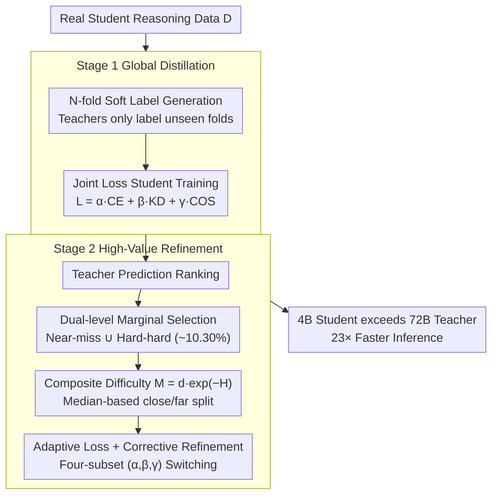

# Cognitive-Uncertainty Guided Knowledge Distillation for Accurate Classification of Student Misconceptions

**Conference**: ACL 2026 Findings  
**arXiv**: [2605.14752](https://arxiv.org/abs/2605.14752)  
**Code**: https://github.com/RoschildRui/acl2026_map (Available)  
**Area**: Model Compression / Knowledge Distillation / Education AI  
**Keywords**: Student Misconception Classification, Two-stage Distillation, Uncertainty-based Sample Selection, Difficulty-Adaptive Loss, Edge Deployment

## TL;DR
This paper proposes a two-stage knowledge distillation framework using "Dual-level Marginal Sample Selection" based on teacher cognitive uncertainty and a difficulty-adaptive loss. Utilizing only 10.30% of real samples for incremental training, the 4B student model achieves MAP@3 = 0.9585 (+17.8% Gain) on MAP-Charting. On a benchmark of 220 middle school algebra misconceptions, it reaches 84.38% accuracy, surpassing GPT-5 (67.73%) and the directly fine-tuned 72B teacher (81.25%), while being 23× faster during inference.

## Background & Motivation

**Background**: Instructional assessment is shifting from "binary scoring" (correct/incorrect) to "understanding student reasoning." Recent NLP efforts have utilized LLMs for fine-grained misconception classification (e.g., MisstepMath, MathEDU, Otero 2025). Common approaches involve synthesizing large training datasets with LLMs followed by direct fine-tuning.

**Limitations of Prior Work**: The authors identify three core challenges: (1) **Data Scarcity and Long-tail Distribution**: High-quality student reasoning data is hard to synthesize; LLM-generated texts are often too formal and fluent, creating a distribution gap with real-world student texts characterized by colloquialisms, skipped steps, and logical breaks. (2) **Label Noise and Blurred Boundaries**: Misconception categories are numerous and boundaries are ambiguous, leading to high annotation noise that traditional hard-label models fail to differentiate. (3) **Deployment Paradox**: Large models possess knowledge but ignore non-standard yet reasonable student logic due to pre-training bias, and face privacy and edge constraints; small models are deployable but prone to overfitting on noisy labels.

**Key Challenge**: Traditional paths rely on "generating more data," yet synthetic data deviates significantly from real distributions. Deploying small models risks overfitting to noise, while using large models as teachers risks distilling their inherent biases to students.

**Goal**: (1) Instead of relying on large-scale synthetic data, extract "high-value samples" from existing real data for incremental training; (2) Enable small student models to inherit inter-class relationships from soft labels while distinguishing ambiguous misconceptions; (3) Use two-stage distillation to resist the "diversity blind spots" of large models, allowing 4B students to identify non-standard student answers.

**Key Insight**: The authors categorize samples based on teacher outputs (e.g., "High-confidence Correct," "Low-confidence Correct," "Severely Wrong"). By using the teacher's cognitive uncertainty as a signal, they perform second-stage distillation only on highly informative "near-miss" and "hard-hard" samples, dynamically assigning weights to CE, KD, and COS losses based on sample types.

**Core Idea**: Stage 1 performs global distillation for foundational capability transfer. Stage 2 employs "dual-level marginal selection" to pick ~10% high-value samples for targeted training with difficulty-adaptive losses (switching $\alpha/\beta/\gamma$ weights). This ensures the small model not only learns to classify but also masters boundary discrimination.

## Method

### Overall Architecture
Two-stage distillation, as illustrated in Figure 2:

1. **Stage 1 (Global Distillation)**: Stratified $n=5$-fold cross-validation is used to train $n$ teachers $f_t^{(k)}$. Each fold trains on $\mathcal{D}\setminus\mathcal{D}_k$ and generates soft labels for $\mathcal{D}_k$ to avoid overfitting. $n$ student models are then trained using $\mathcal{L}=\alpha\mathcal{L}_{\text{CE}}+\beta\mathcal{L}_{\text{KD}}+\gamma\mathcal{L}_{\text{COS}}$ (default $(0.33, 0.33, 0.34)$), establishing baseline classification capabilities.
2. **Stage 2 (High-Value Sample Selection + Adaptive Refinement)**: Samples are categorized into Near-miss ($\mathcal{S}_{\text{NM}}$) and Hard-hard ($\mathcal{S}_{\text{HH}}$) based on Stage 1 teacher predictions. A composite difficulty metric $\mathcal{M}(x_i,y_i)=d(x_i,y_i)\cdot e^{-H(x_i)}$ is used to bisect each category into "close" and "far" subsets based on the median. Students are refined on these four subsets using specific $(\alpha, \beta, \gamma)$ combinations.
3. The final training data occupies $\approx 10.30\%$ of the original samples.

### Key Designs

**1. Dual-level Marginal Sample Selection: Letting ~10% of Data Carry the Learning Burden**

Samples already mastered contribute nothing to decision boundary refinement. Fine-grained classification is determined by "ambiguous boundaries" and "outliers." Thus, Stage 2 discards the full dataset and selects these ends using teacher uncertainty. The first level filters by rank: $\mathcal{S}_{\text{NM}}$ includes samples where the teacher is correct but low-confidence, or the top choice is wrong but the ground truth is ranked 2nd/3rd. $\mathcal{S}_{\text{HH}}$ includes samples where the ground truth is ranked $> 3$, exposing deep knowledge gaps.

The second level uses the composite difficulty metric to split each category:

$$\mathcal{M}(x_i,y_i)=d(x_i,y_i)\cdot e^{-H(x_i)}$$

where $d$ is the probability margin and $H$ is prediction entropy. The $e^{-H(x_i)}$ term is crucial: it amplifies difficulty when entropy is low (model is confidently wrong—needs correction) and decays when entropy is high (model is uncertain, sample may be inherently ambiguous).

**2. Difficulty-Adaptive Loss: Letting Different Signals Speak for Different Samples**

Traditional KD uses fixed weights, treating "ambiguous" and "noisy" samples identically. This work switches $(\alpha, \beta, \gamma)$ weights for $\mathcal{L}_{\text{total}}=\alpha\mathcal{L}_{\text{CE}}+\beta\mathcal{L}_{\text{KD}}+\gamma\mathcal{L}_{\text{COS}}$ across four subsets: $\mathcal{S}_{\text{NM}}^{\text{close}}\!\to\!(1,0,0)$, $\mathcal{S}_{\text{NM}}^{\text{far}}\!\to\!(1,1,1)$, $\mathcal{S}_{\text{HH}}^{\text{close}}\!\to\!(0,1,1)$, $\mathcal{S}_{\text{HH}}^{\text{far}}\!\to\!(1,1,1)$.

The most counter-intuitive design is $(1,0,0)$ for NM-close: when a sample is near-accurate but boundaries are tight, soft label "smoothness" becomes an enemy that blurs the boundary. Thus, KD and COS are disabled to enforce hard-label constraints. Conversely, for HH-close, soft labels $(0,1,1)$ are trusted to resist noise.

**3. N-fold Soft Label Generation + Adaptive Correction: 4B Student Outsprints 72B Teacher**

"Compression" and "outperformance" are usually contradictory. This framework allows the Qwen3-4B student to beat the Qwen2.5-72B teacher by: (1) Using StratifiedKFold to prevent confidence inflation in soft labels; (2) Increasing ground-truth supervision via adaptive loss in "far" subsets (listening to the truth when the teacher is confidently wrong); (3) Focusing incremental training on only the most valuable 10.30% of real samples.

### Loss & Training
- **Stage 1**: $\mathcal{L}_{\text{CE}}=-\log p_s(y_i|x_i)$ + $\mathcal{L}_{\text{KD}}=\tau^2\cdot\text{KL}(p_t\|p_s)$ ($\tau=1.0$) + $\mathcal{L}_{\text{COS}}=1-\cos(p_s,p_t)$ with $(\alpha,\beta, \gamma)=(0.33,0.33,0.34)$. AdamW lr=2×10⁻⁴ (student), 1×10⁻⁴ (teacher).
- **Stage 2**: Incremental lr=1×10⁻⁶, weight switching per Apendix A.
- **Base Models**: Students = Qwen-3-4B / Gemma-2-9B / Llama-3.1-8B; Teacher = Qwen-2.5-72B.

## Key Experimental Results

### Main Results (MAP-Charting + Algebra Misconception)

| Method | MAP-Charting MAP@3 | MAP@10 | Acc | F1@3 | Algebra Misc. MAP@3 | Acc |
|---|---|---|---|---|---|---|
| **Prompting baselines** | | | | | | |
| GPT-5 | 0.8137 | 0.8145 | 0.7225 | 0.4626 | 0.7409 | 0.6773 |
| Qwen-2.5-72B (prompt) | 0.7285 | 0.7293 | 0.6222 | 0.4328 | 0.6280 | 0.5320 |
| **Fine-tuned** | | | | | | |
| Qwen-2.5-72B (FT) | 0.9497 | 0.9501 | 0.9014 | 0.4993 | 0.8438 | 0.8125 |
| Qwen-3-4B (FT) | 0.9472 | 0.9475 | 0.8987 | 0.4992 | 0.7552 | 0.7188 |
| **Ours** | | | | | | |
| **Qwen-3-4B + Ours** | **0.9585** | **0.9587** | **0.9198** | **0.4996** | **0.8750** | **0.8438** |

Qwen-3-4B + Ours outperforms GPT-5 by 17.8% MAP@3 and surpasses the 72B teacher (FT) by 1.8% Accuracy.

### Ablation Study (Qwen-3-4B)

| Configuration | MAP-Charting MAP@3 / Acc | Algebra MAP@3 / Acc |
|---|---|---|
| **Full Method** | **0.9585 / 0.9198** | **0.8750 / 0.8438** |
| w/o Adaptive Loss | 0.9540 / 0.9123 | 0.8657 / 0.8321 |
| w/o Sample Selection | 0.9519 / 0.9085 | 0.8603 / 0.8269 |
| w/o Stage-2 Distillation | 0.9493 / 0.9024 | 0.7893 / 0.7577 |

Removing Stage 2 leads to a significant drop (8.6% Acc on Algebra), confirming high-value refinement is the core driver.

### Key Findings
- **Stage 2 is essential**: Its removal causes the largest performance drops across benchmarks.
- **Student > Teacher**: Qwen-3-4B + Ours achieves 1.8% higher accuracy than its 72B teacher while being 23× more efficient.
- **Robustness**: The optimal hyperparameter $(\alpha,\beta,\gamma)=(0.33,0.33,0.34)$ remains consistent across multiple student architectures.
- **Sample Efficiency**: Training on just 10.30% of samples in Stage 2 prevents long-term noise accumulation and is engineering-friendly for small-data scenarios.

## Highlights & Insights
- **Quality over Quantity**: In education scenarios with label noise, "picking the right samples" is more valuable than "generating more data." The Near-miss + Hard-hard strategy is a clean implementation of active learning principles.
- **KD Counter-intuition**: Disabling KD for NM-close samples to prevent boundary blurring provides a critical lesson: do not use soft labels blindly when boundaries are sharp.
- **Composite Metric**: $d\cdot e^{-H}$ elegantly captures both distance from ground truth and model confidence, serving as a powerful tool for KD or active learning.
- **Practical Recipe for EdAI**: The combination of 4B models, real data, and deployment-ready acceleration offers a production-ready solution for privacy-sensitive education sectors.

## Limitations & Future Work
- **Limitations**: (1) $K$-fold cross-partition is computationally expensive for Stage 1. (2) Effectiveness on "inherently poor" data is limited and might benefit from data repair. (3) The Algebra dataset (220 samples) is small; statistical significance requires further verification.
- **Future Work**: Exploring learnable loss weights for the four sample categories and integrating high-value sample selection with localized data synthesis.

## Related Work & Insights
- **vs RLAIF**: While self-rewarding models expand data with LLM feedback, they can amplify biases. Ours uses real samples to bypass the distribution gap.
- **vs Curriculum Learning**: Instead of just moving easy-to-hard, we combine uncertainty signals to identify information-rich regions for adaptive refinement.
- **vs Spot-Adaptive KD**: Rather than selecting which layer to distill, we dynamically select the loss focus (CE/KD/COS) at the sample level.

## Rating
- Novelty: ⭐⭐⭐⭐ The NM/HH dual selection and the counter-intuitive $(1,0,0)$ loss weight design are standout contributions.
- Experimental Thoroughness: ⭐⭐⭐⭐ Comprehensive testing across three student backbones and full ablations.
- Writing Quality: ⭐⭐⭐⭐ Logical flow from challenges to specific design components.
- Value: ⭐⭐⭐⭐ Provides a clear path for deploying high-accuracy, low-latency models in resource-constrained domains.

<!-- RELATED:START -->

## Related Papers

- [\[ICLR 2026\] Knowledge Distillation as Decontamination? Revisiting the "Data Laundering" Concern in Classification Tasks](../../ICLR2026/model_compression/knowledge_distillation_as_decontamination_revisiting_the_data_laundering_concern.md)
- [\[ACL 2026\] CBRS: Cognitive Blood Request System with Bilingual Dataset and Dual-Layer Filtering](cbrs_cognitive_blood_request_system_with_bilingual_dataset_and_dual-layer_filter.md)
- [\[NeurIPS 2025\] PKD: Preference-driven Knowledge Distillation for Few-shot Node Classification](../../NeurIPS2025/model_compression/preference-driven_knowledge_distillation_for_few-shot_node_classification.md)
- [\[AAAI 2026\] Pairing-free Group-level Knowledge Distillation for Robust Gastrointestinal Lesion Classification in White-Light Endoscopy](../../AAAI2026/model_compression/pairing-free_group-level_knowledge_distillation_for_robust_gastrointestinal_lesi.md)
- [\[ACL 2026\] Reason Only When Needed: Efficient Generative Reward Modeling via Model-Internal Uncertainty](reason_only_when_needed_efficient_generative_reward_modeling_via_model-internal_.md)

<!-- RELATED:END -->
