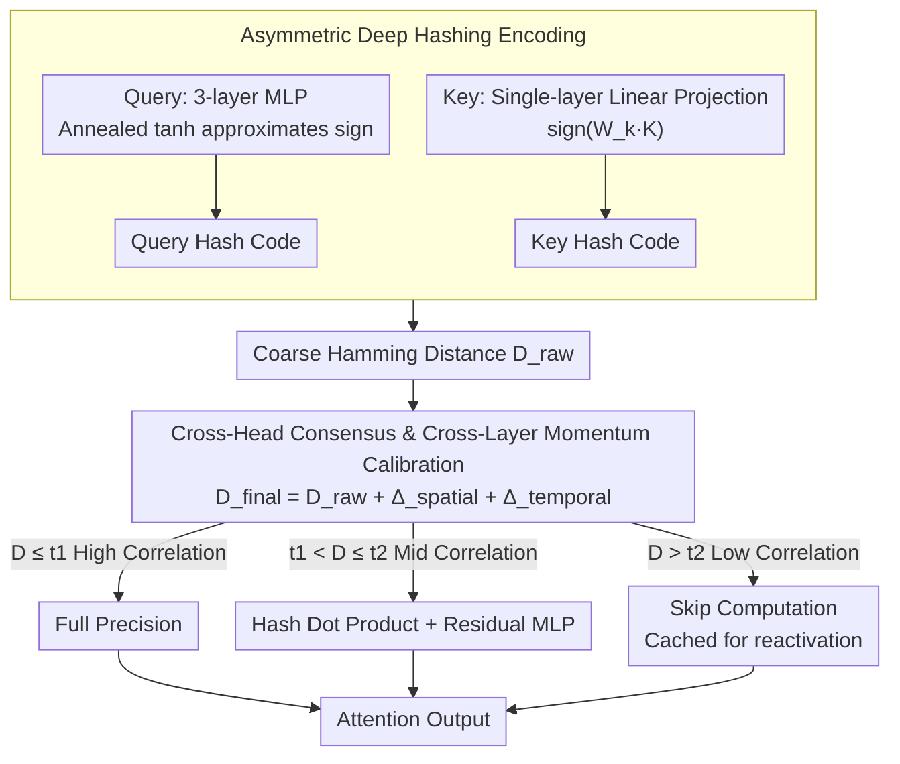

# DASH-KV: Accelerating Long-Context LLM Inference via Asymmetric KV Cache Hashing

**Conference**: ACL 2026 Findings  
**arXiv**: [2604.19351](https://arxiv.org/abs/2604.19351)  
**Code**: [https://github.com/Zhihan-Zh/DASH-KV](https://github.com/Zhihan-Zh/DASH-KV)  
**Area**: Model Compression  
**Keywords**: KV Cache, Deep Hashing, Asymmetric Encoding, Attention Acceleration, Long-Context Inference

## TL;DR

The DASH-KV framework reformulates the attention mechanism as an approximate nearest neighbor search problem. By utilizing asymmetric deep hashing, it replaces high-dimensional floating-point similarity calculations with efficient Hamming distance bitwise operations. Combined with a dynamic mixed-precision mechanism, it reduces long-context inference complexity from $O(N^2)$ to $O(N)$ while matching full-attention performance.

## Background & Motivation

**Background**: The quadratic complexity of the standard attention mechanism is the fundamental bottleneck for long-context LLM inference. Existing KV cache optimization methods include quantization, selective eviction, and structured sharing, but none change the underlying floating-point calculation paradigm.

**Limitations of Prior Work**: (1) Quantization methods suffer severe performance degradation at ultra-low bits (1-2 bits), and dequantization introduces additional overhead. (2) Selective eviction leads to irreversible information loss, harming long-range dependency tasks. (3) Structured sharing ignores the heterogeneous characteristics of different heads and layers. Crucially, these methods still operate within the floating-point framework and do not fundamentally address the calculation paradigm.

**Key Challenge**: Query-Key similarity computation requires billions of high-precision floating-point operations. Existing optimizations merely modify this floating-point framework. A completely new calculation paradigm is needed to replace floating-point similarity computation.

**Goal**: To transform attention computation from a floating-point paradigm to a binary bitwise paradigm to achieve fundamental acceleration.

**Key Insight**: Query-Key similarity matching in attention is highly analogous to relevance matching in information retrieval. Deep hashing has proven effective in large-scale retrieval—encoding high-dimensional vectors into compact binary codes and replacing dot products with Hamming distances.

**Core Idea**: Reformulate attention computation as an approximate nearest neighbor search. Use asymmetric deep hashing to encode Queries (via high-precision MLP) and Keys (via lightweight linear projection), utilizing cross-head consensus and cross-layer momentum to calibrate hashing distances, while retaining full-precision computation for critical tokens.

## Method

### Overall Architecture

DASH-KV consists of three core components: (1) Asymmetric Hashing—Queries are encoded via a 3-layer MLP and Keys via a linear projection, mapping them to binary hash codes. (2) Calibrated Hamming Distance Retrieval—Coarse hashing distances are corrected using cross-head consensus and cross-layer momentum. (3) Dynamic Mixed-Precision Attention—Keys are categorized into high correlation (full precision), medium correlation (hashing + residual compensation), and low correlation (skipped computation) based on calibrated distances.

### Key Designs

**1. Asymmetric Deep Hashing Encoding: Precision for Queries, Efficiency for Keys**

Queries and Keys play distinct roles in attention, yet prior methods treated them with identical encoding. This work adopts an asymmetric design. Queries are generated dynamically at each step and vary semantically, requiring precise encoding via a 3-layer MLP ($d\to256\to256\to l$). During training, a progressively annealed $\tanh(\beta \cdot v_q)$ simulates the sign function ($\beta$ increases from 1 to 10 to enable gradient flow while approaching binarization). Keys, once cached, are extensively reused; thus, the priority is encoding speed and storage, implemented via a single-layer linear projection $h_k = \text{sign}(W_k K)$. This asymmetric split allocates the precision budget to the dynamic side and the efficiency budget to the reusable side.

**2. Cross-Head Consensus and Cross-Layer Momentum Calibration: Using Structural Priors to Correct Coarse Hashing**

Hamming distance is a coarse-grained approximation of floating-point similarity. To mitigate misjudgments, the framework leverages multi-head and multi-layer structural priors. Cross-head consensus tracks how many attention heads select a specific Key; if it exceeds a threshold $T_{\text{vote}}$, it signifies multi-head agreement, and a spatial discount $\Delta_{\text{spatial}}$ is applied. Cross-layer momentum uses the attention distribution from the previous layer as a prior, applying a temporal discount $\Delta_{\text{temporal}}$ to Keys that receive sustained attention. 

The discounts are applied to the raw distance:

$$D_{\text{final}} = D_{\text{raw}} + \Delta_{\text{spatial}} + \Delta_{\text{temporal}}$$

The discount coefficients are learnable, allowing the model to determine the reliability of spatial consensus and temporal inertia.

**3. Dynamic Importance Mixed-Precision Attention: Instance-level Precision Allocation**

Not all tokens are equally important. Using hashing exclusively loses critical information, while universal full precision loses acceleration benefits. This work uses adaptive percentile thresholds to categorize Keys into three tiers. High correlation ($D \leq t_1$) Keys undergo full-precision computation. Medium correlation ($t_1 < D \leq t_2$) Keys use "Hashing + Residual Compensation"—obtaining a coarse estimate via hash dot products and using a lightweight MLP $\Delta(h_q, h_k; \phi)$ to compensate for residuals. Low correlation ($D > t_2$) Keys skip computation but are not discarded; they remain in the cache and can be "reactivated" in subsequent steps. Special positions (CLS, SEP, sinks, or adjacent tokens) are forced to full precision.

### Loss & Training

The primary loss is list-wise distillation $\mathcal{L}_{\text{distill}} = \text{KL}(P_{\text{student}} \| P_{\text{teacher}})$, combined with bit balance loss $\mathcal{L}_{\text{bal}}$ and quantization loss $\mathcal{L}_{\text{quant}}$ (auxiliary coefficients are 0.1). Asymmetric temperature scaling is employed to address the issue of over-smoothed hash dot product distributions.

## Key Experimental Results

### Main Results

| Method | Qwen2-7B LongBench Avg. | Complexity |
|------|------------------------|--------|
| Full Attention | Baseline | $O(N^2)$ |
| H2O (Eviction) | Below Baseline | Linear |
| SnapKV (Eviction) | Below Baseline | Linear |
| KIVI (Quantization) | Below Baseline | Near Linear |
| DASH-KV | **Matches Baseline** | **$O(N)$** |

### Ablation Study

| Configuration | Performance | Description |
|------|------|------|
| Hash Only (No Calibration) | Performance Drop | Inaccurate coarse distance |
| + Cross-Head Consensus | Gain | Voting reduces misjudgments |
| + Cross-Layer Momentum | Further Gain | Temporal prior is effective |
| + Mixed Precision | Optimal | Preserves critical token precision |

### Key Findings

- DASH-KV matches Full Attention performance on LongBench while achieving linear complexity.
- Eviction methods suffer from irreversible information loss, whereas DASH-KV discards no information.
- Asymmetric encoding outperforms symmetric encoding, validating the need for differentiated Q/K processing.
- A hash code length $l$ between 32-64 bits provides the best balance between performance and efficiency.

## Highlights & Insights

- **The "Attention = Retrieval" reformulation is inspiring**: Transforming attention from a computation problem into a retrieval problem introduces mature techniques from the IR field (Deep Hashing), opening a new optimization path.
- **Asymmetric design reflects deep understanding of Q/K roles**: Queries are transient and require precision, while Keys are reusable and require efficiency—a distinction often ignored by prior work.
- **Information retention philosophy**: Unlike eviction methods, low-correlation Keys are only skipped, not permanently deleted, preserving the possibility of reactivation in later steps.

## Limitations & Future Work

- Requires training a hash encoder (lightweight but still an added cost), so it is not plug-and-play.
- The two learnable parameters for consensus and momentum require tuning.
- Validation is limited to LongBench; other long-context benchmarks (e.g., RULER, ∞-Bench) were not tested.
- The residual compensation MLP design may require adjustments for different models.

## Related Work & Insights

- **vs H2O/SnapKV (Eviction)**: Eviction permanently loses information, while DASH-KV retains all Keys and only skips low-relevance computations, achieving a better balance.
- **vs KIVI/Atom (Quantization)**: Quantization still operates within the floating-point framework; DASH-KV fundamentally changes the calculation paradigm using bitwise operations.

## Rating

- Novelty: ⭐⭐⭐⭐⭐ (Introducing deep hashing to attention is pioneering; asymmetric design and triple-tier mixed precision are well-conceived)
- Experimental Thoroughness: ⭐⭐⭐⭐ (Tested on 3 models and LongBench with detailed ablation, though benchmark coverage is limited)
- Writing Quality: ⭐⭐⭐⭐ (Detailed and systematic, though slightly formula-heavy in descriptions)

<!-- RELATED:START -->

## Related Papers

- [\[ICML 2025\] RocketKV: Accelerating Long-Context LLM Inference via Two-Stage KV Cache Compression](../../ICML2025/model_compression/rocketkv_accelerating_long-context_llm_inference_via_two-stage_kv_cache_compress.md)
- [\[ACL 2026\] HeteroCache: A Dynamic Retrieval Approach to Heterogeneous KV Cache Compression for Long-Context LLM Inference](heterocache_a_dynamic_retrieval_approach_to_heterogeneous_kv_cache_compression_f.md)
- [\[ACL 2026\] FastKV: Decoupling of Context Reduction and KV Cache Compression for Prefill-Decoding Acceleration](fastkv_decoupling_of_context_reduction_and_kv_cache_compression_for_prefill-deco.md)
- [\[ACL 2026\] The Pitfalls of KV Cache Compression](the_pitfalls_of_kv_cache_compression.md)
- [\[NeurIPS 2025\] ChunkKV: Semantic-Preserving KV Cache Compression for Efficient Long-Context LLM Inference](../../NeurIPS2025/model_compression/chunkkv_semanticpreserving_kv_cache_compression_for_efficien.md)

<!-- RELATED:END -->
