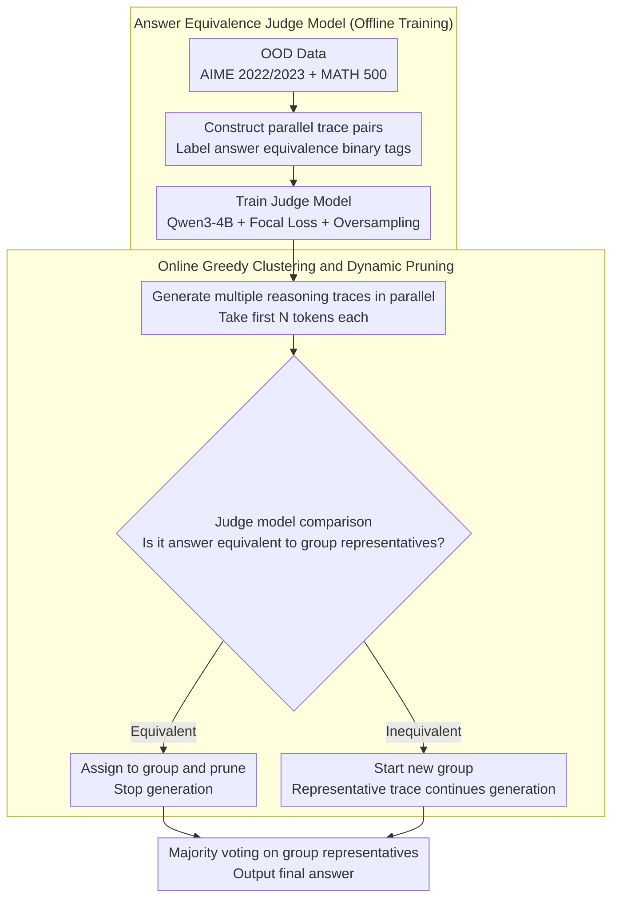

# DeepPrune: Parallel Scaling without Inter-Trace Redundancy

**Conference**: ACL 2026 Findings  
**arXiv**: [2510.08483](https://arxiv.org/abs/2510.08483)  
**Code**: [https://deepprune.github.io/](https://deepprune.github.io/)  
**Area**: Model Compression  
**Keywords**: Parallel Inference, CoT Pruning, Inference Redundancy, Answer Equivalence Prediction, Inference Efficiency

## TL;DR

This paper proposes DeepPrune, which trains a specialized judge model to predict answer equivalence from partial reasoning traces. By combining this with an online greedy clustering algorithm to dynamically prune redundant parallel CoT paths, it reduces token consumption by 65.73%-88.50% while maintaining competitive accuracy (within 3 percentage points).

## Background & Motivation

**Background**: Parallel scaling (e.g., best-of-n sampling) enhances LLM reasoning capabilities by generating multiple reasoning traces simultaneously, with total token consumption reaching 100M+. Existing efficient inference methods primarily focus on the "overthinking" issue in sequential expansion, with less research on the efficiency of parallel expansion.

**Limitations of Prior Work**: (1) Over 80% of parallel reasoning traces produce the same final answer, representing a massive waste of computation; (2) Confidence-based early stopping methods cannot reduce inter-trace redundancy and risk prematurely terminating correct reasoning; (3) Shallow semantic similarity (e.g., SentenceBERT) cannot predict final answer equivalence from early reasoning stages.

**Key Challenge**: The gains of parallel scaling come from answer diversity (where the correct answer might be among a few different candidates), but the vast majority (80%+) of parallel traces produce identical answers, resulting in extremely low diversity.

**Goal**: Actively prune redundant parallel reasoning traces while preserving answer diversity.

**Key Insight**: Train a specialized judge model to understand the deep semantics of the reasoning process and predict whether two traces will eventually reach the same answer from partial reasoning traces.

**Core Idea**: Early detection of answer equivalence $\rightarrow$ Retain diverse traces + Prune redundant traces $\rightarrow$ Efficient parallel scaling.

## Method

### Overall Architecture

DeepPrune consists of two stages. **Offline Training**: Construct a large number of "parallel trace pairs" and label them with binary tags indicating final answer equivalence. A judge model is trained using Focal Loss and oversampling (with Qwen3-4B as the backbone) to predict whether two trajectories will converge to the same answer based on their first $N$ tokens (achieving AUROC=0.7072 on OOD data). **Online Pruning**: During the parallel generation of multiple reasoning traces, the judge model dynamically clusters traces into "answer equivalence groups." A new trace is compared with the representative of each existing group; if judged equivalent, it is assigned to that group and terminated immediately (pruning redundancy). If judged inequivalent, a new group is started. Only one representative per group continues reasoning. Finally, majority voting is performed on the survivors of each group to obtain the final answer. This eliminates 80%+ of redundant computation while preserving answer diversity by keeping different candidate groups.

### Key Designs

**1. Answer Equivalence Judge Model: Predicting Convergence from Partial Reasoning**

The prerequisite for pruning redundant traces is "early judgment of whether two traces will yield the same final answer." However, shallow semantic similarity (SentenceBERT, AUROC=0.58, near random) and general LLMs (AUROC=0.66) fail because they only look at surface text without understanding the deep semantics of the reasoning process. This paper trains a specialized judge model using Qwen3-4B, taking the first $N$ tokens of two traces as input to output the probability of answer equivalence.

Trace pairs are specifically constructed using OOD data (AIME 2022/2023 and MATH 500) that strictly does not overlap with the evaluation sets (AIME 2024/2025). Focal Loss and oversampling are used to mitigate class imbalance (as equivalent pairs far outnumber inequivalent ones). The resulting model reaches an AUROC of 0.7072 on OOD data, significantly outperforming SentenceBERT (0.58) and general LLMs (0.66), enabling pre-judgment when only half the trace is generated.

Crucially, the model demonstrates cross-model generalization. In real deployment, training a judge model for every new reasoning model is impractical. This work verifies that the judge model can transfer to unseen reasoning models (DeepSeek-8B, Qwen3-32B, GPT-OSS-20B), forcing the model to learn "reasoning process homogeneity" independent of specific generation styles.

**2. Online Greedy Clustering and Dynamic Pruning: Convergence During Reasoning**

A judge model alone is insufficient; efficiency depends on how it is utilized. Instead of post-hoc pruning, this paper maintains "answer equivalence groups" during inference. As new segments of a trace are generated, the judge model compares them against representatives of existing groups. If judged equivalent, the trace is pruned (stopping generation) immediately; if not, it initiates a new group. Only one representative per group continues execution.

This online greedy approach ensures redundant trajectories are cut mid-way rather than generated to completion, saving significantly more tokens than post-hoc methods. Meanwhile, "one representative per group" ensures answer diversity is not compromised—rare branches containing the correct answer are not mis-pruned. After all traces are processed, majority voting is applied to the surviving representatives.

### Loss & Training

The judge model is trained for binary classification using Focal Loss, with oversampling of the minority class (inequivalent pairs) to balance the data and address the "majority equivalence" class imbalance.

## Key Experimental Results

### Main Results

**Comparison with standard Consensus Sampling (LLaDA Reasoning Model)**

| Method | Token Reduction Rate | Accuracy Delta |
|------|------------|----------|
| Standard Consensus Sampling | 0% | Baseline |
| Confidence Early Stopping | ~30% | Potential damage |
| **DeepPrune** | **65.73%-88.50%** | **≤3%** |

### Ablation Study

| Component | Effect |
|------|------|
| Judge Model AUROC | 0.7072 (OOD Generalization) |
| SentenceBERT Baseline | 0.58 (Near random) |
| General LLM Baseline | 0.66 (Sub-optimal) |

### Key Findings

- DeepPrune reduces tokens by 65-88% across three challenging benchmarks (AIME 2024, AIME 2025, GPQA).
- Accuracy loss is controlled within 3 percentage points.
- The judge model successfully generalizes to unseen reasoning models.
- Pruning preserves answer diversity—high-diversity traces are not mis-pruned.

## Highlights & Insights

- Quantitatively reveals that 80%+ of traces produce identical answers, identifying the core efficiency bottleneck in parallel reasoning.
- Trains a judge model based on "reasoning understanding" rather than "textual similarity," representing a significant improvement over shallow methods.
- The online pruning design allows acceleration to take effect immediately during the inference process.

## Limitations & Future Work

- The AUROC of the judge model (0.7072) still has room for improvement, which may lead to mis-pruning of a few valuable traces.
- The greedy strategy for online clustering may be sub-optimal.
- Dependency on specific judgment thresholds; different scenarios may require tuning.
- Validated only on mathematical reasoning tasks; effectiveness on other reasoning types remains to be confirmed.

## Related Work & Insights

- **vs Confidence Early Stopping**: Confidence methods cannot reduce redundancy between traces; DeepPrune directly addresses inter-trace redundancy.
- **vs Sequential Pruning**: Sequential methods reduce the length of a single trace, while DeepPrune reduces the number of parallel traces.

## Rating

- Novelty: ⭐⭐⭐⭐ Parallel reasoning redundancy analysis and the answer equivalence judge model are novel contributions.
- Experimental Thoroughness: ⭐⭐⭐⭐ Three benchmarks, multi-model verification, and OOD generalization tests.
- Writing Quality: ⭐⭐⭐⭐ Clear problem analysis and intuitive methodology.
- Value: ⭐⭐⭐⭐ Provides a practical tool for improving the efficiency of parallel scaling during inference.

<!-- RELATED:START -->

## Related Papers

- [\[ICLR 2026\] Parallel Token Prediction for Language Models](../../ICLR2026/model_compression/parallel_token_prediction_for_language_models.md)
- [\[ACL 2026\] VecCISC: Improving Confidence-Informed Self-Consistency with Reasoning Trace Clustering and Candidate Answer Selection](veccisc_improving_confidence-informed_self-consistency_with_reasoning_trace_clus.md)
- [\[ACL 2026\] Task-Stratified Knowledge Scaling Laws for Post-Training Quantized LLMs](task-stratified_knowledge_scaling_laws_for_post-training_quantized_large_languag.md)
- [\[ACL 2026\] Rethinking Table Pruning in TableQA: From Sequential Revisions to Gold Trajectory-Supervised Parallel Search](rethinking_table_pruning_in_tableqa_from_sequential_revisions_to_gold_trajectory.md)
- [\[ACL 2026\] WISCA: A Lightweight Model Transition Method to Improve LLM Training via Weight Scaling](wisca_a_lightweight_model_transition_method_to_improve_llm_training_via_weight_s.md)

<!-- RELATED:END -->
