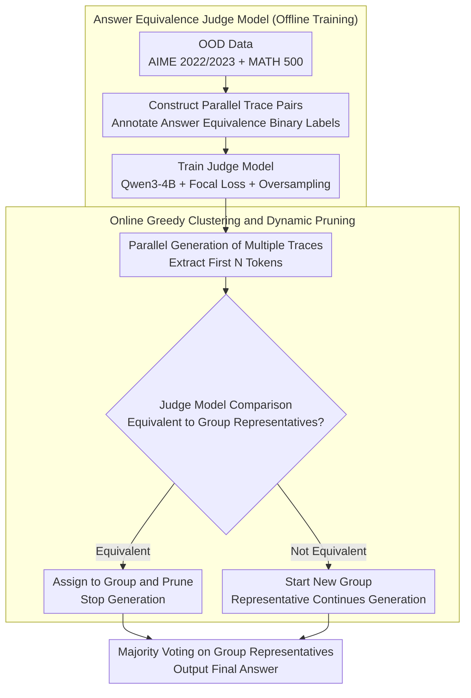

# DeepPrune: Parallel Scaling without Inter-Trace Redundancy

**Conference**: ACL 2026 Findings  
**arXiv**: [2510.08483](https://arxiv.org/abs/2510.08483)  
**Code**: [https://deepprune.github.io/](https://deepprune.github.io/)  
**Area**: Model Compression  
**Keywords**: Parallel Inference, CoT Pruning, Inference Redundancy, Answer Equivalence Prediction, Inference Efficiency

## TL;DR

This paper proposes DeepPrune, which reduces token consumption by 65.73%-88.50% while maintaining competitive accuracy (within 3 percentage points). It achieves this by training a specialized judge model to predict answer equivalence from partial reasoning traces and employing an online greedy clustering algorithm to dynamically prune redundant parallel CoT paths.

## Background & Motivation

**Background**: Parallel scaling (e.g., best-of-n sampling) enhances LLM reasoning capabilities by simultaneously generating multiple reasoning traces, where total token consumption can exceed 100M+. Existing efficient inference methods primarily focus on the overthinking issue in sequential scaling, with limited research on the efficiency of parallel scaling.

**Limitations of Prior Work**: (1) Over 80% of parallel reasoning traces yield the same final answer, representing a massive waste of computation; (2) Confidence-based early stopping methods cannot reduce inter-trace redundancy and risk prematurely terminating correct reasoning; (3) Shallow semantic similarity (e.g., SentenceBERT) fails to predict final answer equivalence from early reasoning stages.

**Key Challenge**: The benefit of parallel scaling stems from answer diversity (the possibility that a few distinct answers include the correct one), but the vast majority (80%+) of parallel traces yield identical answers, resulting in extremely low diversity.

**Goal**: Proactively prune redundant parallel reasoning traces while preserving answer diversity.

**Key Insight**: Train a specialized judge model to understand the deep semantics of the reasoning process, predicting whether two traces will eventually yield the same answer based on partial traces.

**Core Idea**: Early detection of answer equivalence $\rightarrow$ Preserve diverse traces + Prune redundant traces $\rightarrow$ Efficient parallel scaling.

## Method

### Overall Architecture

DeepPrune consists of two stages. **Offline training phase**: A large number of "parallel trace pairs" are constructed and annotated with binary labels indicating whether their final answers are equivalent. A judge model is trained using Focal Loss and oversampling to predict whether two traces will result in the same answer based on their first $N$ tokens (achieving an AUROC of 0.7072 on OOD data). **Online pruning phase**: During the parallel generation of multiple reasoning traces, the judge model dynamically clusters traces into "answer equivalent groups." A new trace is compared against the representative of each existing group; if judged equivalent, it is assigned to that group and its generation is immediately stopped (pruning the redundancy); if judged non-equivalent, a new group is initiated. Only one representative from each group continues reasoning. Finally, majority voting is performed on the survivors of each group to produce the final answer. This eliminates 80%+ of redundant computation while preserving answer diversity by keeping different candidate answers in separate groups.

### Key Designs

**1. Answer Equivalence Judge Model: Predicting convergence from partial reasoning**

The prerequisite for pruning redundant traces is the ability to judge whether two traces will yield the same final answer at an early stage. However, shallow semantic similarity (SentenceBERT, AUROC=0.58, near random) and general LLMs (AUROC=0.66) fail this task as they focus on surface-level text rather than the deep semantics of reasoning. To address this, a specialized judge model is trained using Qwen3-4B as a backbone. The input consists of the first $N$ tokens of two traces, and the output is the probability of answer equivalence.

Training is performed on OOD data (AIME 2022/2023 and MATH 500) that strictly does not overlap with the evaluation sets (AIME 2024/2025). Focal Loss and oversampling are used to mitigate class imbalance (equivalent pairs are much more frequent than non-equivalent ones). The resulting model achieves an AUROC of 0.7072 on OOD data, significantly outperforming SentenceBERT (0.58) and general LLM (0.66) baselines, enabling it to predict answer collisions when traces are only half-completed.

Crucially, the model demonstrates cross-model generalization. In real-world deployment, it is impractical to retrain a judge model for every new reasoning model. By validating the model in a setting where training and evaluation sets are completely isolated, the study confirms it can generalize to unseen reasoning models (DeepSeek-8B, Qwen3-32B, GPT-OSS-20B). This forces the model to learn whether "reasoning processes are homogeneous" rather than memorizing model-specific styles, which is essential for practical utility.

**2. Online Greedy Clustering and Dynamic Pruning: Convergence during inference**

Having a judge model is insufficient; the key is how it is utilized to save computation. Instead of post-inference pruning, DeepPrune maintains a set of "answer equivalent groups" during inference. Whenever a new segment is generated for a trace, the judge model compares it against the representatives of existing groups. If equivalent, the trace is pruned (generation stops). If not, a new group is created. Only one representative per group continues generation.

The advantage of this online greedy approach is that redundant traces are truncated mid-way rather than being generated to completion, thereby saving significantly more tokens than post-pruning. Meanwhile, the "one representative per group" rule ensures that answer diversity is preserved—rare branches containing the correct answer are not erroneously pruned. After all traces are processed, majority voting is applied to the surviving representatives. While greediness does not guarantee a global optimum, it effectively balances efficiency and diversity in practice.

### Loss & Training

The judge model is trained on this binary classification task using Focal Loss, with oversampling applied to the minority class (non-equivalent pairs). Together, these techniques mitigate the class imbalance caused by the fact that equivalent pairs constitute the vast majority of the data.

## Key Experimental Results

### Main Results

**Comparison with standard consensus sampling (LLaDA reasoning model)**

| Method | Token Reduction Rate | Accuracy Difference |
|------|------------|----------|
| Standard Consensus Sampling | 0% | Baseline |
| Confidence Early Stopping | ~30% | Potential Loss |
| **DeepPrune** | **65.73%-88.50%** | **≤3%** |

### Ablation Study

| Component | Performance |
|------|------|
| Judge Model AUROC | 0.7072 (OOD Generalization) |
| SentenceBERT Baseline | 0.58 (Near random) |
| General LLM Baseline | 0.66 (Suboptimal) |

### Key Findings

- DeepPrune reduces tokens by 65-88% across three challenging benchmarks (AIME 2024, AIME 2025, GPQA).
- Accuracy loss is controlled within 3 percentage points.
- The judge model successfully generalizes to unseen reasoning models.
- Pruning preserves answer diversity—high-diversity traces are not erroneously pruned.

## Highlights & Insights

- Quantitatively reveals a core efficiency problem in parallel scaling: 80%+ of traces produce the same answer.
- Training a judge model based on "reasoning understanding" rather than "text similarity" represents a significant improvement over shallow methods.
- The online pruning design allows acceleration to take effect immediately during the inference process.

## Limitations & Future Work

- The AUROC of the judge model (0.7072) still has room for improvement, which may lead to the erroneous pruning of a few valuable traces.
- The greedy strategy used in online clustering may be suboptimal.
- It relies on specific judgment thresholds, which might require adjustment for different scenarios.
- Validated only on mathematical reasoning tasks; effectiveness on other reasoning types remains to be confirmed.

## Related Work & Insights

- **vs. Confidence Early Stopping**: Confidence methods cannot reduce redundancy between traces, whereas DeepPrune directly addresses inter-trace redundancy.
- **vs. Sequential Pruning**: Sequential methods reduce the length of a single trace, while DeepPrune reduces the number of parallel traces.

## Rating

- Novelty: ⭐⭐⭐⭐ Parallel reasoning redundancy analysis and the answer equivalence judge model are novel contributions.
- Experimental Thoroughness: ⭐⭐⭐⭐ Three benchmarks, multi-model validation, and OOD generalization tests.
- Writing Quality: ⭐⭐⭐⭐ Clear problem analysis and intuitive methodology.
- Value: ⭐⭐⭐⭐ Provides a practical tool for improving the efficiency of inference-time parallel scaling.

<!-- RELATED:START -->

## Related Papers

- [\[ICLR 2026\] Parallel Token Prediction for Language Models](../../ICLR2026/model_compression/parallel_token_prediction_for_language_models.md)
- [\[ACL 2026\] Task-Stratified Knowledge Scaling Laws for Post-Training Quantized LLMs](task-stratified_knowledge_scaling_laws_for_post-training_quantized_large_languag.md)
- [\[ACL 2026\] VecCISC: Improving Confidence-Informed Self-Consistency with Reasoning Trace Clustering and Candidate Answer Selection](veccisc_improving_confidence-informed_self-consistency_with_reasoning_trace_clus.md)
- [\[ACL 2026\] WISCA: A Lightweight Model Transition Method to Improve LLM Training via Weight Scaling](wisca_a_lightweight_model_transition_method_to_improve_llm_training_via_weight_s.md)
- [\[ACL 2026\] Rethinking Table Pruning in TableQA: From Sequential Revisions to Gold Trajectory-Supervised Parallel Search](rethinking_table_pruning_in_tableqa_from_sequential_revisions_to_gold_trajectory.md)

<!-- RELATED:END -->
